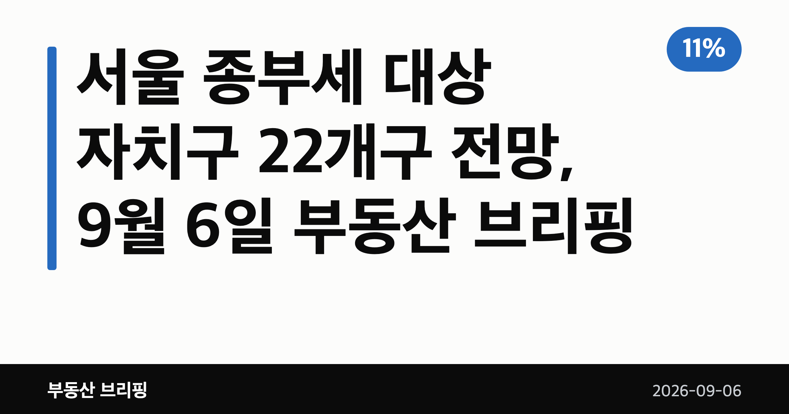
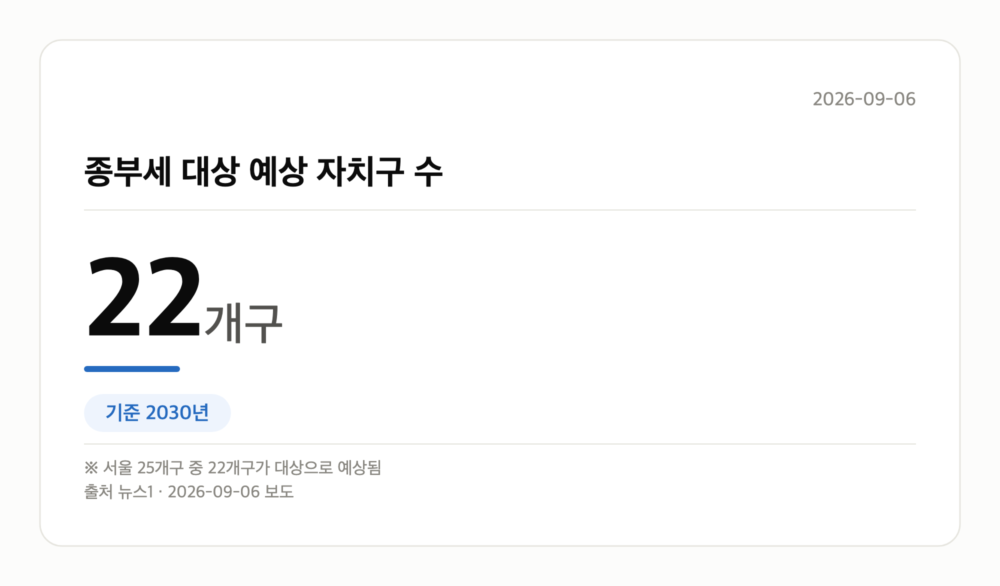
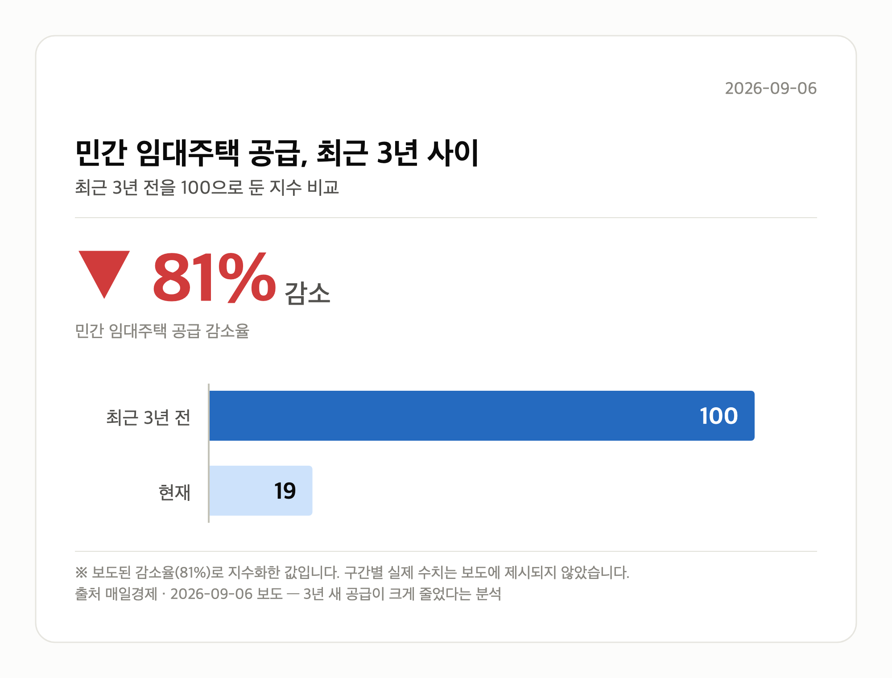

*이 글은 2026년 9월 6일 기준으로 정리한 내용입니다.*
**3줄 요약**

- 집값 연 11% 상승 가정 시 2030년 전망 분석
- 서울 25개구 중 22개구 종부세권, 3개구만 제외
- 가정 전제인 만큼 실제 집값 흐름을 함께 봐야

**이 글의 순서**

1. 서울 종부세 대상 자치구는 어디인가
2. 서울 종부세 대상 자치구 확산이 뜻하는 것
3. 그 밖의 오늘 소식
4. 오늘의 체크포인트
**낯선 말 풀이**

- **공시가격** — 정부가 매년 정하는 집값. 세금과 건강보험료를 매기는 기준이 된다
- **종합부동산세** — 가진 집들의 공시가격 합이 기준을 넘으면 재산세와 별도로 더 내는 세금
- **임대사업자** — 집을 세놓는 것을 사업으로 등록한 사람이나 법인
**오늘의 숫자**

| **11%** | **149㎡ 이하** | **4조원** |
|:---:|:---:|:---:|
| 가정 집값 상승률 <small>연간</small> | 건설임대 종부세 합산배제 요건-전용면적 <small>건설 임대사업자 종부세 합산배제 신청 요건</small> | 롯데건설 올해 도시정비사업 누적 수주액 <small>2026년(올해)</small> |
집값이 매년 11%씩 오른다는 가정 아래, 2030년에는 서울 종부세 대상 자치구가 22곳까지 늘어날 수 있다는 분석이 나왔습니다. 종부세(주택 공시가격 합계가 기준을 넘으면 내는 종합부동산세)는 그동안 강남권 고가주택 이야기로 여겨졌는데요.

이 전망대로라면 비강남권까지 넓어진다는 뜻입니다. 다만 어디까지나 '가정'에 기댄 숫자라는 점을 먼저 말씀드립니다.

## 서울 종부세 대상 자치구는 어디인가

뉴스1 등 보도에 따르면 서울 25개구 가운데 22개구가 과세 대상에 들어가고, 강북구·금천구·도봉구 3개구만 빠지는 것으로 나타났습니다.

전제는 서울 집값이 해마다 11%씩 오른다는 가정입니다. 이 전제가 달라지면 결과도 함께 달라집니다.

| 구분 | 수치 | 시점 |
| --- | --- | --- |
| 가정 집값 상승률 | 연 11% | 매년 |
| 종부세 대상 예상 자치구 | 22개구 | 2030년 |
| 제외 예상 자치구 | 3개구(강북·금천·도봉) | 2030년 |

## 서울 종부세 대상 자치구 확산이 뜻하는 것

지금까지 종부세는 고가주택 보유자의 부담으로 인식돼 왔습니다. 과세 대상이 서울 전역으로 넓어지면 비강남권 주택을 가진 분들도 부담 대상이 될 수 있다는 의미입니다.

다만 매일경제 보도로 나온 이 분석은 연 11% 상승이라는 가정을 깔고 있습니다. 정부의 종부세 개편안이 실제로 어떻게 적용되는지는 기사 본문이 확인되지 않아 아직 불분명합니다.

[이미지: 서울 아파트 단지가 밀집한 도심 전경 사진]

그래서 지금은 서울 종부세 대상 자치구 전망 자체보다, 내 아파트 공시가격이 어떤 속도로 움직이는지를 확인하는 편이 현실적입니다.

## 그 밖의 오늘 소식

- 정부, 법인형 임대사업자 종부세 합산배제 완화 검토 중
- 건설임대는 전용 149㎡·공시지가 12억원 이하 요건 적용
- 업계: 종부세 부과 시 임대수익률 5%에서 1~2%로 하락
- 민간 임대주택 공급, 최근 3년 새 81% 감소(매일경제)
- 롯데건설, 도곡우성 재건축 수주로 올해 정비사업 4조원 돌파
- 민간 임대 공급 촉진 정책 패키지 연내 발표 예고

## 오늘의 체크포인트

1. 서울 종부세 대상 자치구 22개구 전망은 연 11% 상승 가정치입니다.
2. 제외 예상 지역은 강북구·금천구·도봉구 3곳으로 언급됐습니다.
3. 임대 공급 81% 감소가 겹치며 연내 정책 패키지가 관전 포인트입니다.

**그래서 나는?**

- 서울 1주택자라면, 내 아파트 공시가격 변동부터 확인해 보세요
- 전세 계약을 앞뒀다면, 연내 발표될 임대 정책 패키지를 지켜보세요
- 재건축 조합원이라면, 시공사 선정 후 사업 일정을 살펴보세요
**여러분이 살고 계신 자치구는 이번 전망에서 어느 쪽에 들어가 있었나요?**

---

### 참고한 기사

1. **"집값 매년 11% 오르면 2030년 서울 22개구 종부세권"**
   - [metroseoul.co.kr](https://news.google.com/rss/articles/CBMiYEFVX3lxTFAyS2p2VXZrUWg2NzQ5M3A5OUNvMU5oX3VRZTh4OFg3dkFSLUJOQnpRakp4ZjloZkstdFZ6dHNKVG1MQ2k0aUVmbUJyTDNmT0pVVmREQXpwUUdOOU1sSXNUUA?oc=5)
   - [천지일보](https://news.google.com/rss/articles/CBMiakFVX3lxTE16Z0x2WFEzRDVLUFBwaHlROWk3QnZnMzZCX3l5aVhLZnRUUjRQMnk3dGdrQXFJRjhjR0xPQzVoR2RDX0VrMjVldVlneDVURVA5Mk9rUm1IbVVnc0UtRmo0Qm5VS3JrWlhXbGc?oc=5)
   - [신아일보](https://news.google.com/rss/articles/CBMicEFVX3lxTE9RbTlPcE9ENGhaeVZZQ3EyXzFNRXZ4Y0Nua1FWU2pwTS12c1pjdTB0S0x1YXRsSFVEd0gwMjBpWFJ5RXlhOEZsbDJXTUhBMXBBRzFRdnYxSjZETG1lWkdRVU8zRHA0WG16UVdaaVdCZGk?oc=5)
   - [뉴스1](https://news.google.com/rss/articles/CBMiW0FVX3lxTE9DTTdEa09UTXQyX2NBUkt3MlQ3SDdVMEFMQ2R5ZFNJVVBnYlN5Yy1IMl8yX0x6c3dUVkdHbXBpdTZVRjR1a0RNVDRWS2lRUFBJY3lCLTlBSVRFY2_SAWBBVV95cUxQM3NwSTBrUFFha3hRTW00bFY0eG0tcG1QVzVKay12ajNHaExoSEplSnkyWndfMGRWQlBibzA0RzZZVHJ4cC1GdUZSbkZ0Q0pHS0VIZlJvMkpIY3YtUnZJWVE?oc=5)
2. **전월세난 다급해진 정부…기업형 임대사업자 종부세부담 줄인다**
   - [매일경제·부동산](https://www.mk.co.kr/news/realestate/12145604)
   - [매일경제·부동산](https://www.mk.co.kr/news/realestate/12145565)
3. **롯데건설, 도곡우성 재건축 수주…정비사업 수주액 4조원 돌파**
   - [네이트](https://news.google.com/rss/articles/CBMiU0FVX3lxTE1uTUlFRkh6bm9sdW5UbkFndUU3NFJiSDZZbGc2ekJ0NlEtejlxLVE3RE4tMXdESG14bGVCVnlkeUpvQTU2LUlNUU00TXZNZkZqY2lB?oc=5)
   - [한국면세뉴스](https://news.google.com/rss/articles/CBMiakFVX3lxTE5IM1o3eUd6WXlQSEpILWswTUdtME9qczF2VlZRVHIwNWN5MV9CTXVMcmRpWTlJMGtmQm1oeTJ2aER3Q0lnWm9mT196TjFGQ3p5X1RSenhIanFyZ1JRMVFnUHkwQ0pJU3VGOHc?oc=5)
   - [파이낸셜신문](https://news.google.com/rss/articles/CBMia0FVX3lxTE02aGJwSU5Td0ZzVG1kWWNCTzByWDhGcERqYlVKY21fZjF4LW80OXlFN1MwN192bnRKaGFfQksyaGFrdlhZMkRfUko0Z0N0eXlIb1c5Y3F3ZEw2NDNIbTUzVEJueTZFMURRN2lj?oc=5)
   - [녹색경제신문](https://news.google.com/rss/articles/CBMiaEFVX3lxTFBWMVZKa1hIQWt6VTJocW9wUnI2ZUowdTRTUHN3N2RHSXlqN2hrbmxsN2w0RzlybWVBZlcxdHJ2dU9aS18zZVhqMnliV3RsWXBlSk05eEZxYVY0ZENWVjBuZlM1d1hnelJZ?oc=5)
4. **“강남 부자들만 내는 줄 알았는데”…종부세, 서울 22개구로 번지나**
   - [매일경제·부동산](https://www.mk.co.kr/news/realestate/12145209)
5. **임대주택 공급 3년새 81% 뚝 …'기업형 임대' 늘려 전월세난 대응**
   - [매일경제·부동산](https://www.mk.co.kr/news/realestate/12145496)

---

*본 글은 공개된 언론 보도를 정리한 것이며, 투자 판단의 책임은 이용자 본인에게 있습니다.*
