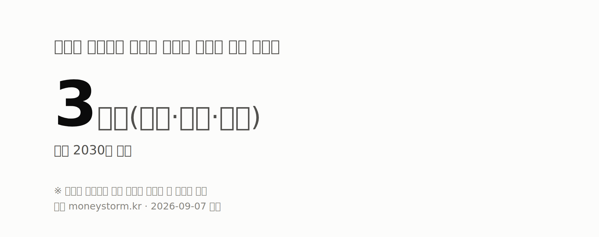
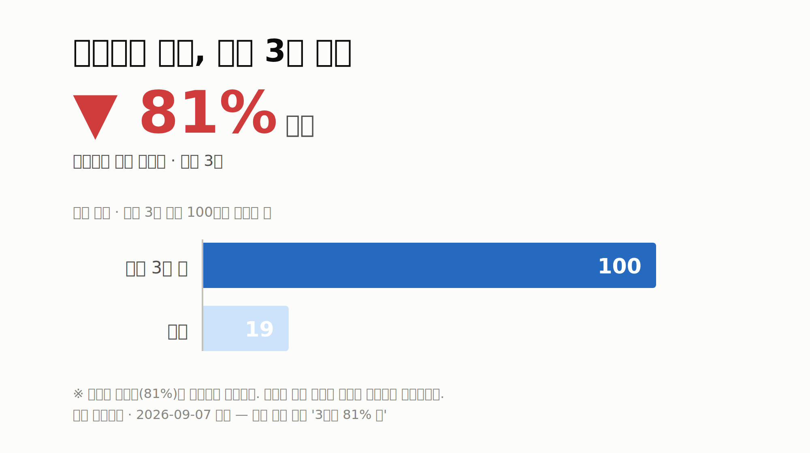
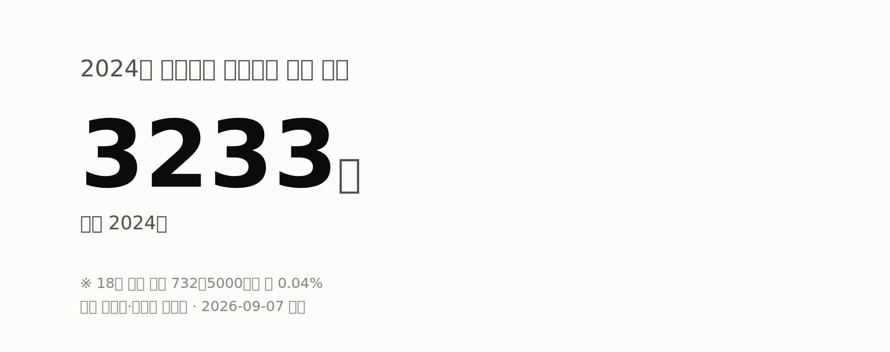

**오늘의 숫자**

| **4조원 돌파** | **3개구(강북·금천·도봉)** | **179명** |
|:---:|:---:|:---:|
| 롯데건설 올해 도시정비 누적 수주액 <small>2026년 누적</small> | 종부세 대상에서 제외될 것으로 언급된 서울 자치구 <small>2030년 가정</small> | 2024년 부동산 임대소득 신고 0~5세 아동 <small>2024년</small> |
2026년 9월 7일 부동산 브리핑입니다. 오늘은 **세금과 공급**, 두 축으로 정리됩니다.

서울 집값 상승세가 지금처럼 이어지면 2030년에는 종부세 과세 대상이 강남권을 넘어 서울 대부분 자치구로 확대될 수 있다는 분석이 나왔습니다.

동시에 임대주택 공급은 3년 새 81% 줄었고, 정부는 법인형·기업형 임대사업자의 종부세 부담을 덜어주는 방안을 검토 중인 것으로 전해졌습니다.

[이미지: 서울 도심 아파트 단지 전경 사진]

## 종부세 대상 확대 전망, 2030년 서울 대부분 자치구

먼저 종부세부터 보겠습니다. 종합부동산세(종부세)는 일정 기준을 넘는 주택을 보유했을 때 재산세와 별도로 내는 보유세입니다.

한 매체는 서울 집값 상승률이 지금 추세대로 유지될 경우, 4년 뒤인 2030년에는 관악·노원·중랑구 거주자도 종부세를 낼 수 있다고 보도했습니다.

다른 보도에서는 2030년 기준으로 강북·금천·도봉구를 제외한 서울 자치구가 과세 대상에 들어갈 수 있다는 분석이 제시됐습니다.

여기에 정부의 종부세 개편안까지 적용하면 과세 대상이 강남권을 넘어 비강남권 전역으로 확대될 수 있다는 전망도 함께 나왔습니다.

| 항목 | 내용 | 전제 |
| --- | --- | --- |
| 확대 예상 시점 | 2030년 (보도 시점 기준 4년 뒤) | 현 집값 상승률 유지 가정 |
| 제외 언급 자치구 | 3개구(강북·금천·도봉) | 2030년 가정 |

중요한 건 전제입니다. 이 수치는 확정된 과세 결과가 아니라 **집값 상승률이 그대로 유지된다는 가정** 위에서 나온 추정치입니다.

또한 매체마다 열거하는 자치구 범위가 달라 동일한 시나리오인지 확인되지 않았고, 한국경제 기사 본문에서는 계산 주체와 산출 방식이 드러나지 않았습니다.

실제 부과 여부는 앞으로의 공시가격과 세제 개편 내용에 따라 달라질 수 있으니, 여러분도 '확정'이 아니라 '시나리오'로 받아들이시는 게 안전합니다.

다만 종부세를 '강남 고가주택 세금'으로만 생각해 오신 서울 중저가 지역 1주택자라면, 보유세 부담을 미리 계산해 볼 필요는 생겼습니다.

- 출처: [한국경제](https://www.hankyung.com/article/2026090671157) / [매일경제](https://www.mk.co.kr/news/realestate/12145209)

## 임대주택 공급 3년새 81% 감소, 기업형 임대로 전환 검토

두 번째는 공급입니다. 임대주택 공급이 최근 3년 새 81% 감소했다는 보도가 나왔습니다.

정부는 법인형 임대사업자를 대상으로 **종부세 합산배제** 완화를 검토 중인 것으로 전해졌습니다. 합산배제란 특정 요건을 갖춘 임대주택을 종부세 계산 대상에서 빼주는 제도를 말합니다.

방향은 개인 다주택자 중심이던 민간임대 공급 구조를 기업·공공 중심으로 바꾸는 쪽입니다. 20년 이상 장기 임대를 하는 기업에 세제 혜택을 주는 방안이 거론됐습니다.

리츠(REITs), 즉 여러 투자자의 자금을 모아 부동산에 투자하고 임대수익을 나누는 회사형 상품을 활용한 기업형 임대 운영 주체 육성도 함께 언급됐습니다.

다만 업계에서는 종부세 완화만으로는 사업성 확보가 어렵고 택지·금융 지원이 함께 가야 한다는 의견이 나온다고 전해졌습니다.

또 '3년새 81% 감소'의 정확한 기준 연도와 통계 출처가 기사 본문에서 확인되지 않았고, 합산배제 완화도 확정 정책이 아닌 검토 단계이며 시행 시점은 제시되지 않았습니다.

전월세를 준비 중인 분들 입장에서는, 이 흐름이 실제 매물량 증가로 이어지는지 지켜보는 게 핵심이겠습니다.

- 출처: [매일경제](https://www.mk.co.kr/news/realestate/12145496)

## 미성년자 부동산 임대소득 3233명, 총 555억원

세 번째는 국세청 자료입니다. 문진석 더불어민주당 의원(국회 재정경제기획위원회)이 국세청에서 받은 '연도별 미성년자 부동산 임대소득 현황'이 공개됐습니다.

| 구분 | 2024년 수치 |
| --- | --- |
| 18세 이하 신고 인원 | 3,233명 (18세 이하 인구 732만5천명의 약 0.04%) |
| 신고 임대소득 총액 | 555억8,400만원 (1인당 평균 1,720만원) |
| 0~5세 신고 인원 | 179명 (2023년 217명에서 감소) |
| 연령별(0~5세) | 0~1세 9명, 2세 15명, 3세 33명, 4세 51명, 5세 71명 |
| 0~1세 1인당 평균 | 1,470만원 (2세 1,230만·3세 1,840만·5세 1,500만원) |
| 최근 5년 1인당 평균 | 1,720만~1,850만원 |

0~5세 인구 158만2천명(행정안전부 주민등록인구통계) 기준으로 보면 신고 비중은 0.01% 수준입니다.

기사에서도 미성년자가 부동산을 보유하고 임대소득을 얻는 것 자체는 불법이 아니라고 명시했습니다. 다만 변칙적 상속·증여 여부는 살펴야 한다는 지적이 제기됐습니다.

상속·증여를 통한 취득이라는 서술은 '추정'이어서 실제 편법 증여 규모는 확인되지 않았습니다. 자녀 명의 취득을 고려하는 가구라면 자금출처 소명 부담을 미리 챙겨 두시는 게 좋겠습니다.

- 출처: [매일경제](https://www.mk.co.kr/news/economy/12145651)

## 롯데건설 도곡우성 재건축 수주, 도시정비 4조원 돌파

마지막은 정비사업입니다. 롯데건설이 서울 강남 도곡우성 재건축 사업을 수주했다고 다수 매체가 9월 6일 보도했습니다.

이번 수주로 롯데건설의 올해 도시정비사업 누적 수주액은 4조원을 넘어섰고, 매체들은 이를 '4조 클럽' 입성이라고 표현했습니다.

강남권 재건축 시공사 선정은 인근 정비사업 단지의 시공사 경쟁 구도를 가늠하는 참고 지표가 됩니다.

다만 현재 확인된 것은 수주 사실과 누적 수주액뿐입니다. 공사비 규모, 세대수, 계약 체결 시점 등 세부 조건은 별도 확인이 필요합니다.

- 출처: [비즈트리뷴·이데일리 등 보도](https://news.google.com/rss/articles/CBMib0FVX3lxTE03M3BHOGVXc2Q0RldUY0hNTlRnLWc4QjNGVm5WeWFieFpMbmQzcG1aX1Jwd1plZHFoVmpyX3NtbWdzU3F2YXhlRS1DbWtnQVNka2F2ZEVwcVNPOFhkVE9xTXAxZW9UTXBacWVxZW1zQQ?oc=5)

## 오늘 시장 온도와 내일 볼 것

오늘 자료에는 매매가격지수 같은 시세 통계가 포함되지 않았습니다.

대신 '집값 상승률이 유지되면 2030년 서울 대부분 자치구가 종부세 대상'이라는 전망과 '임대주택 공급 3년새 81% 감소'라는 수치가 부각됐습니다.

매매 쪽은 세부담 확대 우려, 임대 쪽은 공급 위축 우려가 동시에 드러난 하루였습니다.

내일 이후 지켜볼 지점은 세 가지입니다.

- 법인형·기업형 임대사업자 종부세 합산배제 완화 검토 결과와 구체적 실행 시점
- 2026년 세제개편안의 종부세 개편 내용과 후속 논의(구윤철 부총리, 30억 이하 보유세 완화·40억 이상 응능부담 언급)
- 문진석 의원이 요구한 국세청의 미성년자 변칙 상속·증여 점검 후속 대응

## 오늘의 체크포인트

1. 종부세 대상 확대는 '2030년, 상승률 유지 가정'에 기반한 전망이며 확정된 과세 결과가 아닙니다.
2. 임대주택 공급 81% 감소 속에 정부는 기업형 임대 육성과 종부세 합산배제 완화를 '검토' 중이며, 시행 시점은 제시되지 않았습니다.
3. 2024년 미성년자 임대소득 신고는 3,233명·555억8,400만원으로, 보유 자체는 불법이 아니지만 변칙 증여 점검 요구가 커지고 있습니다.

오늘 브리핑은 여기까지입니다. 숫자와 출처를 함께 보시고, 각자 상황에 맞춰 판단하시길 바랍니다.

---

### 참고한 기사

1. **롯데건설, 도곡우성 품었다… 도시정비 수주 4조원 돌파**
   - [비즈트리뷴](https://news.google.com/rss/articles/CBMib0FVX3lxTE03M3BHOGVXc2Q0RldUY0hNTlRnLWc4QjNGVm5WeWFieFpMbmQzcG1aX1Jwd1plZHFoVmpyX3NtbWdzU3F2YXhlRS1DbWtnQVNka2F2ZEVwcVNPOFhkVE9xTXAxZW9UTXBacWVxZW1zQQ?oc=5)
   - [핀포인트뉴스](https://news.google.com/rss/articles/CBMid0FVX3lxTE1hOFJmZmljelBtdzRxN0pjMzM5ZjdiQjRZT3d6b002bVc3Y1ZEbUlkSTF5WEd3amtGbTBfVTJQd3RtSDdCYjY5WndhRzJZTHNUVTYtYl85LVRlYkxaUVdDSUxOMWxqRXZoUWQtSXhUcTY3QUhZd3Vn0gF3QVVfeXFMTWE4UmZmaWN6UG13NHE3SmMzMzlmN2JCNFlPd3pvTTZtVzdjVkRtSWRJMXlYR3dqa0ZtMF9VMlB3dG1IN0JiNjlad2FHMllMc1RVNi1iXzktVGViTFpRV0NJTE4xbGpFdmhRZC1JeFRxNjdBSFl3dWc?oc=5)
   - [투어코리아](https://news.google.com/rss/articles/CBMibkFVX3lxTE0yLVpJeHVudmF0QndNd3JPZmYzR1Z3U0Q4Q3lIbVp1emlwWU9tNTR0Mkc1ZlZCb0lralIzNllpS1RZd082QWQtSnNVcEs0aUFWeXhxT0ROR1dKT2NCeGZZY2NWbzZza2M1dFF0Nm9R?oc=5)
   - [서울타임즈뉴스](https://news.google.com/rss/articles/CBMia0FVX3lxTE1YT0t2ajMzcXAtQlh1WWg5X0xDR0xhZ3lGWFM4d0xfT1FnbkRTY1dDSjB1LTZlekFiTTMzb0VMbTd6WHJWSjJjRzNJUEZwcE9GaWZ0cjBUczE4SGdHQTZGSkR6ZEtxOVhGbU5j?oc=5)
2. **4년 뒤에는 관악·노원·중랑구 살아도 종부세?…"집값 상승률 유지시"**
   - [데일리안](https://news.google.com/rss/articles/CBMijAJBVV95cUxNVmVJU1Vqdk54VzJrZ08zV0pGR2NoTERTV2FEbUVLT05TS3hZckptU09vWG5BNDRZaURnTDNsUnh3eVREOHFQVno3cVFuZjRmN2lSU0E2WkJDRnhqQkk4OTQyNEFCbFBnRmRwNWhxWjJad2V6Y3dfd1VBY2FQQnk4akpOLWljVmp2aWpRNnBGMVp1MG9HT2RWZnNScGxadUVnaU9GRTg2dnZweVU1U19QQVpXaHQtX1FiV1hQQXNlSHZreEJnT3hVVWQ1bWZvQm1IRVV3Y01kbndjdEk3dmZ1aDdzdDlCQ2IzdUJoaEx3bDZvdUh5dHo3M29DWXNBMWZjSG1URU9Qd014Mmdv?oc=5)
   - [moneystorm.kr](https://news.google.com/rss/articles/CBMiakFVX3lxTE52VG5FVWdFSjhrTVdQTXNheTltXzNYeGxqckdESHVweTJOMHhHY1YwQ2U1dEdZU2E4Sl9FY2Jka3JvdFpKZWYyMGhmVmZrdHk3MU5EeHJRRElrTEt1WERBMWFRcTU0cUJ4d2c?oc=5)
   - [한국경제·부동산](https://www.hankyung.com/article/2026090671157)
3. **“기저귀 떼기도 전 월세 꼬박꼬박”...미취학 아동 179명, 부동산 임대소득 올렸다**
   - [imaeil.com](https://news.google.com/rss/articles/CBMiYkFVX3lxTE83UE5tdFhTZ0luMmJYcUhhMUdKWldyOHctcEphcVFNR1d4NDUyMnFYc2NuVkZTSHI4UlhBV3I4REkxTm5Rc3FKYkRGSzRSNWdKVEFxRE1tYzdoWlBrMXdGd3J3?oc=5)
   - [매일경제·부동산](https://www.mk.co.kr/news/economy/12145651)
   - [네이트](https://news.google.com/rss/articles/CBMiU0FVX3lxTE9MeVpQXzlkVUVDSmFscFdSUUdKRVpmV2tPWUxEQ251U0pZYk1wRzdjdEpkb0lhRVZaZ0pxNzZQaVFKLTdGVVZSa1BVSjNYRE5HeC1B?oc=5)
   - [ebn.co.kr](https://news.google.com/rss/articles/CBMiaEFVX3lxTE1YVDVHRGZ5Z3RmVUJhTjZsZlZZYlFvUWxWZFl4N0pTTHpycXRfWTBqQklMZmsyb21GTEdONjAwdjE1b1RyVlNpNWNWMGk2ZFZ0OFNtRGo4NlJRWWpjVUVPd2E1ZHFNV1FG?oc=5)
4. **임대주택 공급 3년새 81% 뚝 …'기업형 임대' 늘려 전월세난 대응**
   - [매일경제·부동산](https://www.mk.co.kr/news/realestate/12145496)
5. **“강남 부자들만 내는 줄 알았는데”…종부세, 서울 22개구로 번지나**
   - [매일경제·부동산](https://www.mk.co.kr/news/realestate/12145209)

---

*본 글은 공개된 언론 보도를 정리한 것이며, 투자 판단의 책임은 이용자 본인에게 있습니다.*
