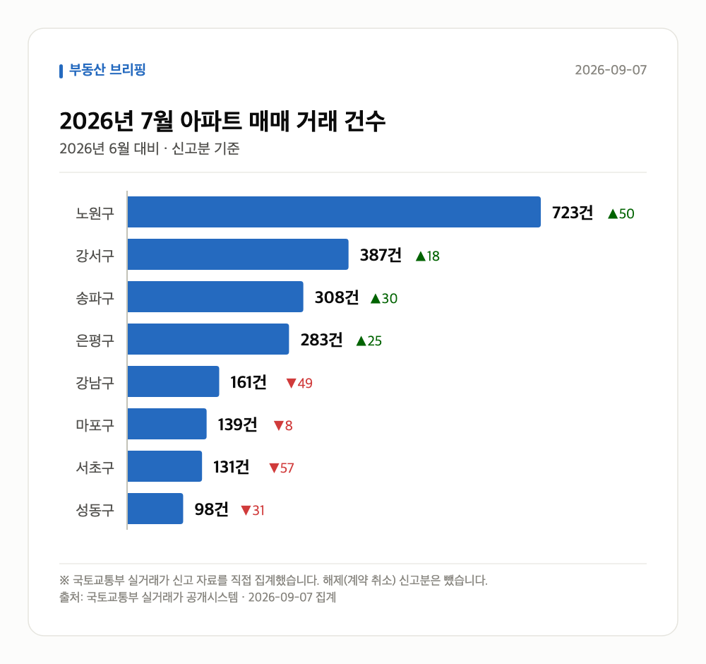
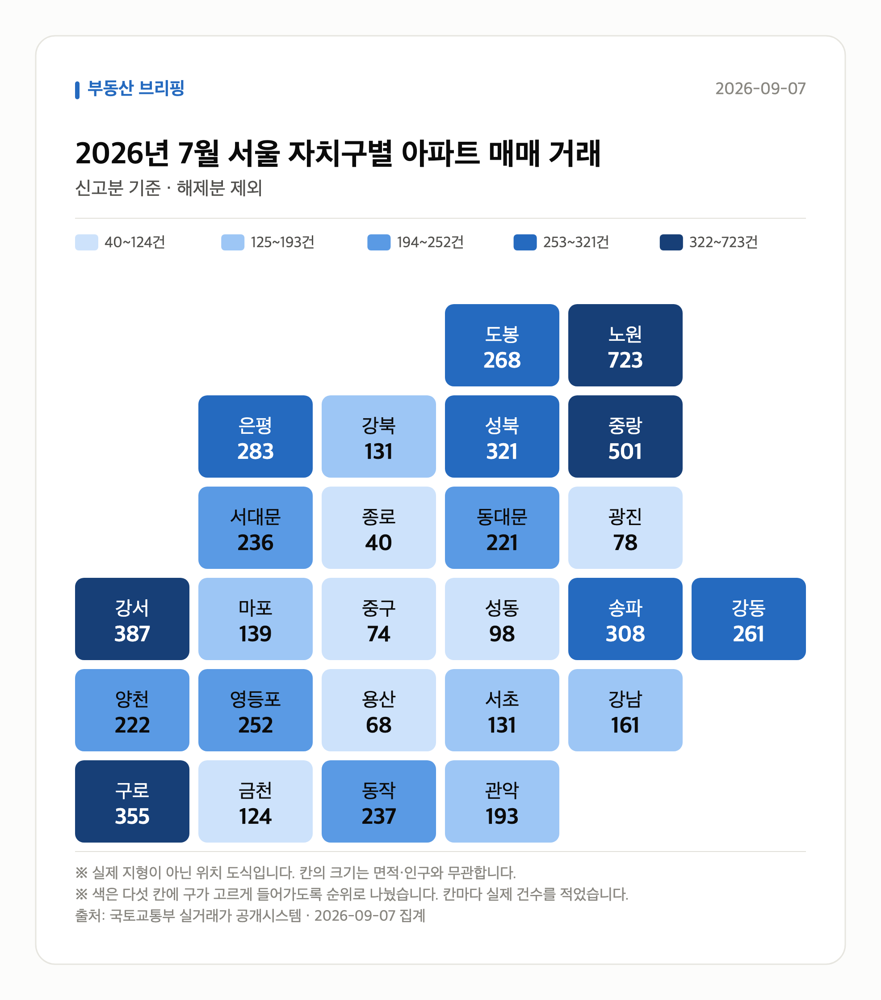
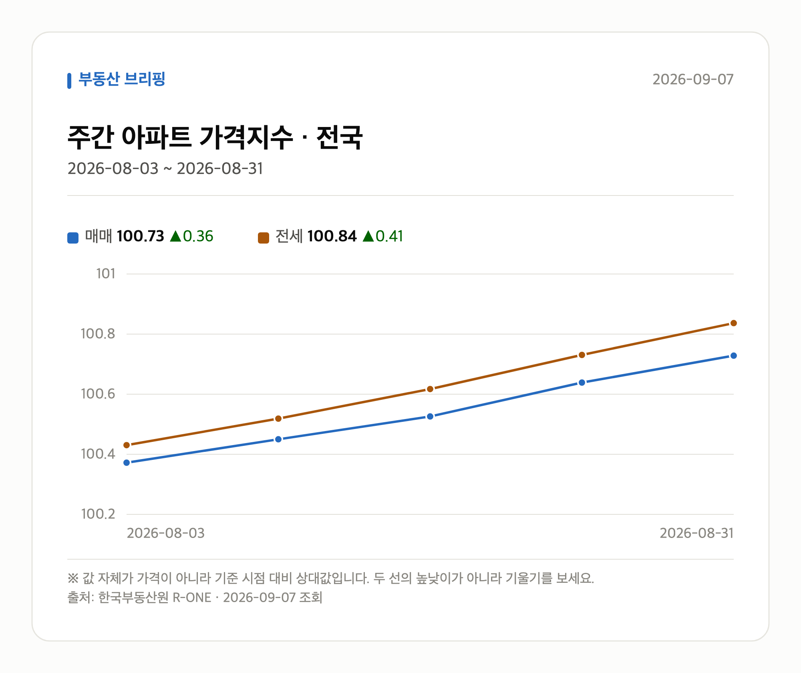

# 실거래가로 본 2026년 7월

정부가 받은 **아파트 매매 신고 자료**를 그대로 집계한 것입니다. 기사에 실린 수치가 아니라
국토교통부 실거래가 자료를 직접 받아 셌습니다. 계약 후 30일 안에 신고하므로,
**신고가 다 들어온 마지막 달**을 봅니다. 이번 달과 지난달은 아직 자료가 차는 중이라 넣지 않았습니다.

**2026년 7월 전체 2230건** · 2026년 6월 2252건 (-22건)

| 지역 | 거래 건수 | 전달 대비 | 평균 거래가 | 가장 비싼 거래 |
| --- | ---: | ---: | ---: | --- |
| 노원구 | 723건 | +50 | 7.0억 | 동진신안 15.0억 (134.74㎡) |
| 강서구 | 387건 | +18 | 9.8억 | 마곡엠밸리7단지 21.5억 (114.93㎡) |
| 송파구 | 308건 | +30 | 22.6억 | 아시아선수촌아파트 65.0억 (178.32㎡) |
| 은평구 | 283건 | +25 | 9.1억 | DMCSKVIEW 20.5억 (112.87㎡) |
| 강남구 | 161건 | -49 | 32.9억 | 신현대12차 112.5억 (182.95㎡) |
| 마포구 | 139건 | -8 | 14.4억 | 마포래미안푸르지오2단지 30.8억 (114.28㎡) |
| 서초구 | 131건 | -57 | 23.9억 | 래미안원베일리 90.0억 (116.95㎡) |
| 성동구 | 98건 | -31 | 18.5억 | 한남하이츠 48.0억 (177.12㎡) |

## 서울 전체 지도

표에 올린 곳 말고 **스물다섯 개 구 전부**를 한 번씩 세어 칠했습니다.
색은 순위로 다섯 칸에 나눈 것이라, 짙다고 두 배가 아닙니다. 칸 안의 숫자를 보세요.

## 어떤 크기가 팔렸나

평균 거래가 하나만 보면 **값이 오른 것**과 **비싼 것만 팔린 것**을 구별할 수 없습니다.
전용면적으로 갈라 보면 갈립니다. 85㎡ 가 국민주택규모입니다.

| 면적대 | 전용면적 | 거래 건수 | 비중 | 2026년 6월 비중 | 평균 거래가 |
| --- | --- | ---: | ---: | ---: | ---: |
| 소형 | 60㎡ 이하 | 1060건 | 47.5% | 44.7% (+2.8%p) | 8.9억 |
| 중형 | 60~85㎡ | 848건 | 38.0% | 38.7% (-0.7%p) | 15.0억 |
| 중대형 | 85~135㎡ | 243건 | 10.9% | 12.1% (-1.2%p) | 21.5억 |
| 대형 | 135㎡ 초과 | 79건 | 3.5% | 4.5% (-1.0%p) | 40.7억 |

## 눈에 띄는 거래

지난 6개월 거래와 견줘 값이 크게 움직인 것만 골랐습니다.
같은 단지·같은 면적끼리만 비교했고, 지난 거래가 2건 미만이면 뺐습니다.

| 구분 | 지역 | 단지 | 면적 | 이번 | 이전 | 차이 |
| --- | --- | --- | ---: | ---: | ---: | ---: |
| 신고가 | 성동구 | 벽산 | 84.8㎡ | 10.8억 | 8.6억 | +25.6% |
| 신고가 | 송파구 | 우방1 | 84.9㎡ | 13.0억 | 10.7억 | +21.5% |
| 신고가 | 서초구 | 래미안서초유니빌 | 49.74㎡ | 7.2억 | 6.0억 | +20.4% |
| 신고가 | 노원구 | 상계주공13(고층) | 41.3㎡ | 4.2억 | 3.5억 | +20.0% |
| 신고가 | 강남구 | 역삼센트럴아파트 | 48.77㎡ | 8.3억 | 7.0억 | +18.6% |

## 전세가율 (실제 거래로 계산)

같은 단지·같은 면적에서 그달 **전세 보증금 ÷ 매매가**입니다.
월세가 붙은 계약과 갱신 계약은 뺐습니다. 갱신은 종전 보증금을 따라가 시세보다 낮습니다.
지수가 아니라 실제 거래라 단지마다 편차가 큽니다. 가운뎃값을 먼저 보세요.

| 지역 | 중앙값 | 견준 단지 수 | 가장 높은 곳 |
| --- | ---: | ---: | --- |
| 노원구 | 54.8% | 128곳 | 삼익아파트 81.9% (6.7억 / 전세 5.5억) |
| 강서구 | 49.6% | 71곳 | 마곡루나플라체 85.7% (2.8억 / 전세 2.4억) |
| 송파구 | 39.9% | 75곳 | 석촌호수효성해링턴타워 92.3% (2.6억 / 전세 2.4억) |
| 은평구 | 55.6% | 45곳 | 대경홈타운 78.3% (1.2억 / 전세 0.9억) |
| 강남구 | 38.8% | 44곳 | 파크힐 80.0% (8.5억 / 전세 6.8억) |
| 마포구 | 42.7% | 39곳 | 솔리스타 92.0% (1.6억 / 전세 1.5억) |
| 서초구 | 40.6% | 33곳 | 서초동삼성쉐르빌2 90.5% (2.9억 / 전세 2.6억) |
| 성동구 | 40.2% | 31곳 | 신성미소지움 51.4% (14.6억 / 전세 7.5억) |

## 전세와 월세의 비율

전세가율에서 뺀 월세 계약도 그 자체로 자료입니다. **비중**은 갱신까지 전부 셌고,
**보증금·월세 가운뎃값**은 신규 계약만 봤습니다 — 갱신은 종전 조건을 따라가 시세가 아닙니다.

| 지역 | 전월세 계약 | 월세 낀 계약 | 신규 전세 보증금 | 신규 월세 (보증금 / 월) |
| --- | ---: | ---: | ---: | --- |
| 노원구 | 1302건 | 607건 (46.6%) | 3.3억 | 4000만원 / 80만원 |
| 강서구 | 1255건 | 517건 (41.2%) | 4.8억 | 7272만원 / 72만원 |
| 송파구 | 1384건 | 629건 (45.4%) | 7.75억 | 2.02억 / 150만원 |
| 은평구 | 765건 | 333건 (43.5%) | 4.5억 | 1.02억 / 50만원 |
| 강남구 | 1357건 | 726건 (53.5%) | 9.0억 | 2.0억 / 170만원 |
| 마포구 | 746건 | 361건 (48.4%) | 6.9억 | 1.0억 / 137만원 |
| 서초구 | 1066건 | 494건 (46.3%) | 8.81억 | 3.0억 / 150만원 |
| 성동구 | 601건 | 257건 (42.8%) | 7.2억 | 1.4억 / 194만원 |

## 한국부동산원 주간 가격지수 (전국)

| 기준일 | 매매 | 전세 |
| --- | ---: | ---: |
| 2026-08-03 | 100.37 | 100.43 |
| 2026-08-10 | 100.45 | 100.52 |
| 2026-08-17 | 100.53 | 100.62 |
| 2026-08-24 | 100.64 | 100.73 |
| 2026-08-31 | 100.73 | 100.84 |

---

*출처: 국토교통부 실거래가 공개시스템(공공데이터포털), 한국부동산원 R-ONE.
평균은 그 달 신고분의 단순 평균이며 면적·층을 보정하지 않았습니다.
해제(계약 취소)로 신고된 건은 뺐습니다.*
