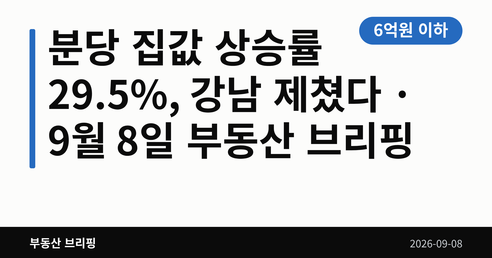
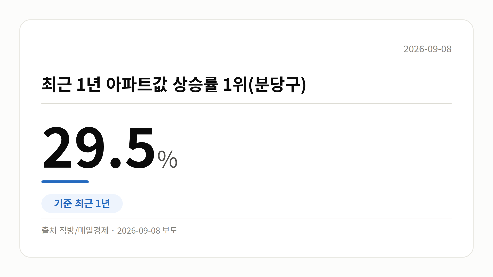
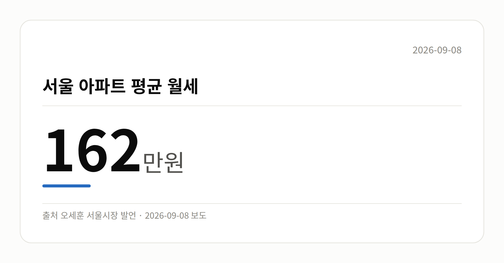
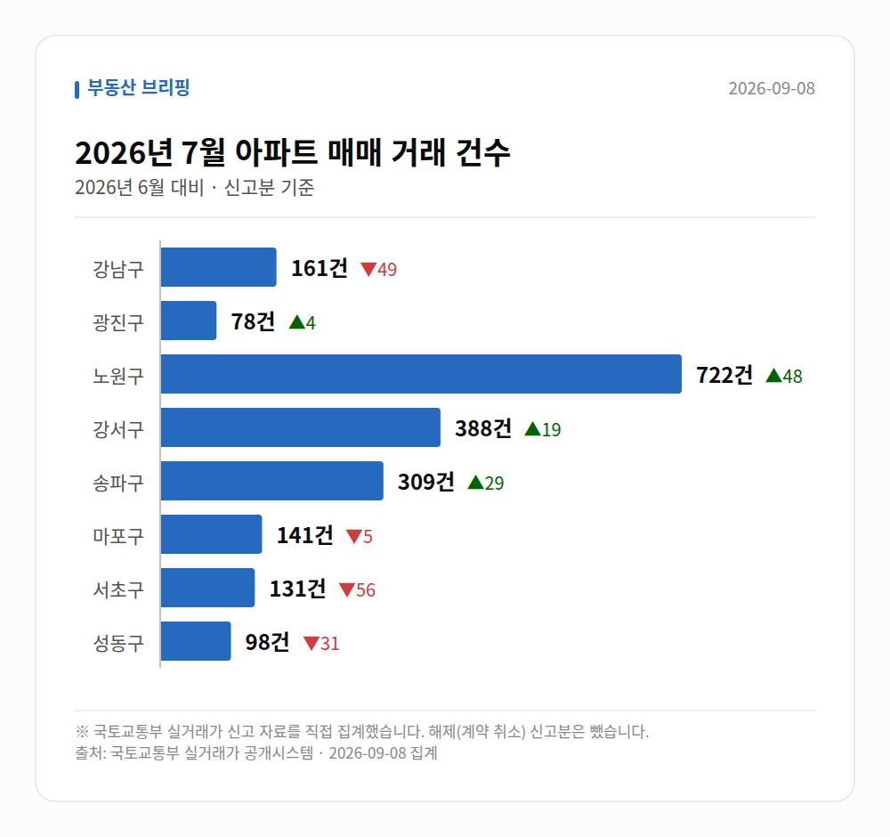

*이 글은 2026년 9월 8일 기준으로 정리한 내용입니다. 실거래 수치는 2026년 7월 신고분입니다.*
**3줄 요약**

- 최근 1년 분당 집값 상승률 29.5%로 전국 1위
- 광명 28.4%, 동작 25.3%로 비강남권이 상승 주도
- 서울 아파트 평균 월세는 162만원, 임대료도 압력

**이 글의 순서**

1. 분당 집값 상승률 29.5%, 무슨 일이 있었나
2. 숫자로 보는 분당 집값 상승률과 비강남권 확산
3. 그 밖의 오늘 소식
4. 오늘의 체크포인트
**낯선 말 풀이**

- **재건축** — 오래된 아파트를 헐고 새로 짓는 것
**오늘의 숫자**

| **6억원 이하** | **29.5%** | **162만원** |
|:---:|:---:|:---:|
| 서울 정책대출(주금공) 대상 아파트 가격 기준 <small>해당 가격대 서울 아파트가 실종됐다는 보도</small> | 최근 1년 아파트값 상승률 1위(분당구) <small>최근 1년</small> | 서울 아파트 평균 월세 |
최근 1년간 전국에서 아파트값이 가장 많이 오른 곳은 강남이 아니었습니다. 직방 집계 기준 **분당 집값 상승률은 29.5%**로 전국 1위였습니다.

금액으로는 1년 새 4억 3천만원이 올랐다는 보도(헤럴드경제)도 나왔습니다. 오늘은 이 수치를 중심으로 차분히 짚어 보겠습니다.

[이미지: 분당 신도시 아파트 단지 전경 사진]

## 분당 집값 상승률 29.5%, 무슨 일이 있었나

직방이 최근 1년간 전국 아파트 매매시세를 집계한 결과, 성남시 분당구가 29.5%로 가장 높은 상승률을 기록했습니다.

분당구는 재건축·리모델링(기존 건물 뼈대를 남기고 고쳐 짓는 방식) 기대감이 반영되면서 지난 1년간 상승세가 뚜렷하게 이어졌다는 설명입니다.

한 가지 참고할 점이 있습니다. 서울경제는 제목에서 '1년 새 30% 급등'이라고 표현했는데, 다른 매체가 인용한 정확한 수치는 29.5%입니다. 반올림·강조 표현의 차이로 보입니다.

## 숫자로 보는 분당 집값 상승률과 비강남권 확산

분당 뒤를 이은 지역도 눈여겨볼 만합니다. 서울에서는 강남권보다 비강남권 상승률이 더 높게 나타났습니다.

| 지역 | 최근 1년 상승률 |
| --- | --- |
| 성남시 분당구 | 29.5% |
| 경기 광명시 | 28.4% |
| 서울 동작구 | 25.3% |

(자료: 직방)

헤럴드경제는 강남을 제친 서울 지역으로 동작·광진을 꼽았습니다. 상승 축이 강남 한 곳이 아니라 수도권 여러 곳으로 퍼지고 있다는 뜻으로 읽힙니다.

다만 상위 10곳이 모두 수도권이라는 보도는 확인되지만, 10개 지역의 구체적인 명단은 공개된 자료에 담겨 있지 않습니다.

## 그 밖의 오늘 소식

- 오세훈 서울시장, 서울 아파트 평균 월세 162만원 언급
- 시장은 전월세 대란으로 서울이 '주거 지옥'이 됐다고 표현
- 서울에서 정책대출(공공기관이 지원하는 저리 주택담보대출) 대상 6억원 이하 아파트 실종 보도
- 집값은 뛰는데 기준은 그대로여서 청년 내집마련이 막혔다는 지적
- 은마아파트 재건축 사업관리, 한미글로벌·희림 컨소시엄 선정
- 조합은 3개 업체를 평가해 최종 선정, 공사비 절감 방안 검토 예정

## 오늘의 체크포인트

첫째, 분당 집값 상승률 29.5%는 직방 집계 기준이며 매체별 표기가 조금씩 다릅니다.

둘째, 서울 평균 월세 162만원은 산정 기간과 표본이 함께 공개되지 않았다는 점을 감안해 보셔야 합니다.

셋째, 은마아파트는 사업시행인가 이후 공사비 검증과 도급계약 협상이 다음 관전 포인트로 꼽힙니다.

**그래서 나는?**

- 수도권 매수를 준비 중이라면, 강남 외 지역 시세부터 다시 확인해 보세요
- 전월세 계약을 앞뒀다면, 월세 전환 부담을 미리 계산해 둘 필요가 있습니다
- 정책대출을 알아보는 중이라면, 서울 6억원 이하 매물 여부를 먼저 확인해 보세요

**직접 센 숫자 — 2026년 7월 아파트 실거래**

서울 8개 구 신고 매매 **2028건** (2026년 6월 2069건, -41건)

거래가 많은 곳: 강남구 161건(-49) · 광진구 78건(+4) · 노원구 722건(+48)

강남구 전세가율 가운뎃값 **38.8%** (같은 단지·같은 면적 44곳)

서울 25개 구 가운데 거래가 가장 크게 움직인 곳: 중랑구 +140.9%(208→501건, 묵동에 66.3% 몰림) · 동작구 +55.6%(153→238건)

이번 달 신고가

- 광진구 세림리오빌 84.98㎡ — 12.5억 (이전 최고 8.5억, +47.1%)
- 성동구 벽산 84.8㎡ — 10.8억 (이전 최고 8.6억, +25.6%)

*국토교통부 실거래가 신고 자료를 직접 집계했습니다. 해제 신고분은 뺐습니다.*

**오늘 나온 정부 발표 원문**

- [소방청, 추석 맞아 '고향집에 주택용소방시설 설치하기' 전국 홍보(캠페인) 전개](https://www.korea.kr/briefing/pressReleaseView.do?newsId=156780583) (소방청 2026-09-08)
  - 첨부 [(9. 8 (화) 조간 보도자료) 소방청 추석 맞아 ‘고향집에 주택용 소](https://www.korea.kr/common/download.do?fileId=198547622&tblKey=GMN)
- [수도권 주택수요에 대비한 유휴부지, 5,000억원 규모로 미리 확보한다](https://www.korea.kr/briefing/pressReleaseView.do?newsId=156780581) (국토교통부 2026-09-08)
- [8월중 전세사기피해자등 658건 추가 결정](https://www.korea.kr/briefing/pressReleaseView.do?newsId=156780467) (국토교통부 2026-09-07)
**여러분이 눈여겨보던 동네는 지난 1년 사이 얼마나 달라졌나요?**

---

### 참고한 기사

1. **[주금공 대출 유명무실] '집값 급등' 서울 정책대출 대상 6억 이하 아파트 실종**
   - [글로벌이코노믹](https://news.google.com/rss/articles/CBMihAFBVV95cUxNX3RzZG9sMFBPUVpCeHBlaDNTcWwzZTlMUHB0QUxoVjlqSHRYQjVlS0RZWXZJMjJ4alV4RnhBNkNDcWl1dFQ1SE9QRk9vRHNfZm4wbEpGWkVvQ1BBcHpFNHhZTTRVMkplR0FaOWtYNkFhOURrZTJVYzhBUUt3YlhkWGdRQ0g?oc=5)
   - [글로벌이코노믹](https://news.google.com/rss/articles/CBMihAFBVV95cUxNb1Fkc1RSOUN0eTJnQTBiTkFPRko0bGJKQTZhQ1lvUXZDZldZQ1VLbkJKSmZNMVJZbDh4RWdCUVppd0xQNE1ZS080dVJqUGVnbVlmVi12S3c1RDYxVGRPM0xjMW82ODh2dmlhUTRHQ3M5WUxMcUN1ZTRBTzNTTzBEblRGUjc?oc=5)
2. **1년간 집값 상승률 1위 '분당'**
   - [매일경제·부동산](https://www.mk.co.kr/news/realestate/12146371)
   - [머니투데이](https://news.google.com/rss/articles/CBMib0FVX3lxTFBITXh4Ukh6UUJybG5HNy1INWc5dGdfb1Y2MnpEZ2U2dExPcl9MYmhabkNmWGJvX1BVTlpUMGZma1VTWnIwclcxOFh1QmI1WGVJdXJVVG1ld1hSRWtrMDQxb2lncTZQMnUzSGZLRnd1WdIBb0FVX3lxTFBITXh4Ukh6UUJybG5HNy1INWc5dGdfb1Y2MnpEZ2U2dExPcl9MYmhabkNmWGJvX1BVTlpUMGZma1VTWnIwclcxOFh1QmI1WGVJdXJVVG1ld1hSRWtrMDQxb2lncTZQMnUzSGZLRnd1WQ?oc=5)
   - [조선비즈·부동산](https://biz.chosun.com/real_estate/real_estate_general/2026/09/07/SGKIPWQAYVC25FSFSXDO55ICGY)
   - [헤럴드경제](https://news.google.com/rss/articles/CBMiVkFVX3lxTE5qQXlFVWZGRHdWalV5RDAzWjJtYmMtOGZ3aE12RVRvdXV5eFZXSWowM3djd3ZFSVlKZDZTTkRqMFNIXzJxdEFwV1cxVmFsUEZhejNJUHhB?oc=5)
3. **"전세는 없고 월세는 162만 원"…오세훈 "서울이 주거 지옥"**
   - [KBC광주방송](https://news.google.com/rss/articles/CBMiYEFVX3lxTE9Hb2tmcm8tQXFqM1R1cWZHQk1ia1kyS1ljemxVVU5SUzBrSFE2SlFqNW5IbTRDUWVxcnVrZXVrakpfWU9GZGxoemxkVHZsN3dZMEI0bHhheUtHRkhFZUo4RA?oc=5)
   - [서울이코노미뉴스](https://news.google.com/rss/articles/CBMibkFVX3lxTE9pM3V2aURYc01obUljaWl1VVVXNVpkMnJIUy1sMnp2TzRkNWxXX04yQzdfckZDaU5HTnZmLVFKREp5ZEQtSVAxODhha2NLVzU3X2F5ZExOVi1GMnUyUm5QcnJ2TTZmV0szaGpsS193?oc=5)
   - [시사저널](https://news.google.com/rss/articles/CBMib0FVX3lxTE5yRmcyWjRadkExd2NZLXpPQU1ZbkZZVHRVaHRFeWJ3dUd4WjdvUkJtYzZpTFVDVUt6QUpFWkxzdGhiX1N4U1NIZ3VPOHAwYlR2d1YtdjdQanREc3g2Qnkyc0RMNkRucW95SFROY2Q3MNIBc0FVX3lxTE1XaGRHMXAzRERwVEhodlVKSExHN2JfQV9UQVNsMGdPOExPVExVM0lZMjVkWmpyWmhiN3VwczRPWkFQdERlQ2hUbXFOaGdYMGtxX0E4UWJ6OUxuSmIwNkJzZExkSldoeUZMcnc0al9MSjZydWs?oc=5)
   - [경기일보](https://news.google.com/rss/articles/CBMiW0FVX3lxTE5qeUt2QXROZWJZd1A1aGpjelRHd3BkRHdsd2UwT1V6VXFycmN2N0xvNk9nVTMxdjRxWkI4VGlzMURiZFlRbmEwRkttRjR0QWdjNjNkdVV0VEJsczQ?oc=5)
4. **한미글로벌·희림 컨소시엄 … 은마 재건축사업 관리 맡는다**
   - [thedailyeconomy.kr](https://news.google.com/rss/articles/CBMicEFVX3lxTE9xbVdudG14SmtJWGxWRkpVVjdXSlpoUHByTkdiYmhuWkFWMEtnUTFXeExDdTRNcGtJYWRTX2FYQlpxQldXT0RRUVk3cHJGcll2VUJRVThSVnFwZFJUSGU2eU9kR2M3YzhNb1VPVGUwTmw?oc=5)
   - [매일경제·부동산](https://www.mk.co.kr/news/realestate/12146372)
   - [한국경제·부동산](https://www.hankyung.com/article/2026090793331)
   - [한국경제·부동산](https://www.hankyung.com/article/202609078698i)
5. **“강남이 아니었다”…1년 만에 집값 29.5% 뛰며 전국 1위 찍은 ‘이곳’**
   - [한국가요예술방송원](https://news.google.com/rss/articles/CBMiY0FVX3lxTE5LVklxMUNaYV9kT1NKLS11UFR2N0tCOEpNdVRpRzR6MGJTUm1sWlQxME9HSDJCV0d1WUpJSmdFVnA3aER4cDlBY2dWcU9idEE0aHBfUzVockRhU1NWZ3NMbl9nOA?oc=5)
   - [ebn.co.kr](https://news.google.com/rss/articles/CBMiaEFVX3lxTFA4YlM1d0U5UnU4UFhST3UxUDZfb1ZOUlh1a1UxSTBtRjVKeGRZTWlTaXhRSnY0Q01iX0JFeFRQa2M2LTdZUFdkV3hKNG5vQ244Nk00QkFQV09TdEdKVlptbGhweDNmTjBp?oc=5)
   - [위키트리](https://news.google.com/rss/articles/CBMiVkFVX3lxTE10TDNMZFR4VEZwWFNScWxsUEJOZ09vZndraFdyOGpWamwwdUNTUTdZM19LeWJtLUNKVzNRbEtrNlZiV3htaFlIQl9jMTdrUWJoUmljbGF3?oc=5)
   - [서울경제](https://news.google.com/rss/articles/CBMiUkFVX3lxTE0zSmJJVnM3RmkxdFBrSzJ6ZElPNnpzbkp5UTRzUlIzbklvaFlQdVFkTFN1TG1PVFl4b01NUE85QXBBNngxY3BhVkg3M3BSLXhCWXfSAVNBVV95cUxORGdGcVJ4aDhlRENIWTM1MGR5a09meUd5U3hGTHU5My0tMzBtTUFLbE8tMzRua2hSWlExM2Q2eGMxUHFWaDk2RG42NEdIMHBfU0M1UQ?oc=5)

---

*본 글은 공개된 언론 보도를 정리한 것이며, 투자 판단의 책임은 이용자 본인에게 있습니다.*
