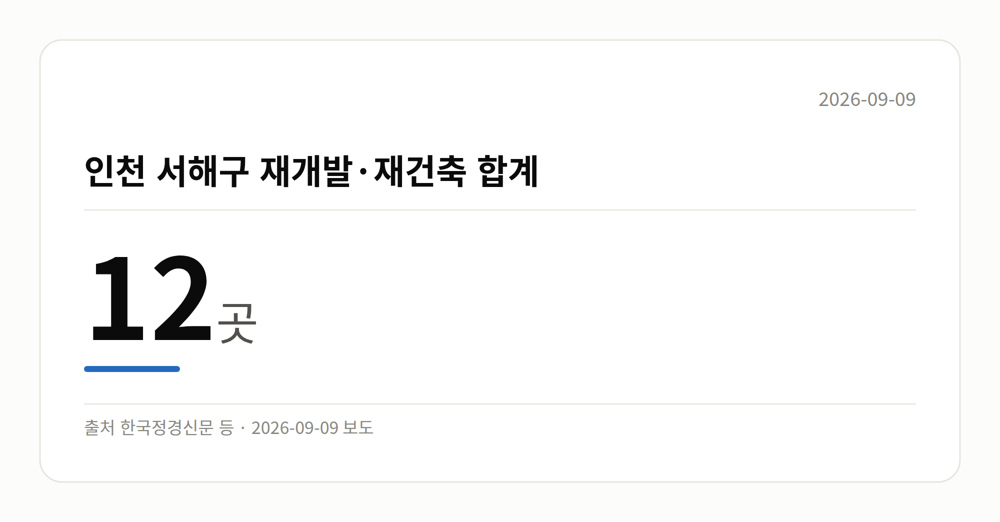

*이 글은 2026년 9월 9일 기준으로 정리한 내용입니다.*
**3줄 요약**

- 인천 서해구가 원도심 정비사업 집중 지원을 발표했습니다
- 재개발 6곳·재건축 6곳, 모두 12곳이 대상입니다
- 재개발 6곳의 연내 정비구역 지정 여부를 보면 됩니다
인천 서해구 재개발 6곳을 포함해 정비사업 12곳이 집중 지원 대상에 올랐습니다. 같은 날 부동산원과 국토교통부도 잇따라 정비사업 현장 점검에 나섰습니다.

오늘은 가격 지표보다 정책 행보가 두드러진 하루였습니다.

[이미지: 노후 주택이 빼곡히 들어선 원도심 골목 풍경]

## 인천 서해구 재개발, 오늘 발표된 내용

인천 서해구는 원도심 재개발 6곳, 재건축 6곳 등 총 12곳의 정비사업(낡은 주택가를 헐고 새로 정비하는 사업)을 집중 지원하겠다고 밝혔습니다.

이 가운데 재개발 6곳은 연내 정비구역 지정(정비사업을 할 수 있는 구역으로 지자체가 공식 지정하는 절차)을 목표로 추진 중이라고 합니다.

여기에 재개발·재건축 원스톱 행정 지원 체계를 가동하고, 도시재생사업과 주차 등 생활환경 개선사업도 함께 본격화한다고 덧붙였습니다.

## 숫자로 본 인천 서해구 재개발·재건축

| 구분 | 곳 수 | 비고 |
|---|---|---|
| 재개발 | 6곳 | 연내 정비구역 지정 목표 |
| 재건축 | 6곳 | - |
| 합계 | 12곳 | - |

출처: 쓰담미디어, 위키트리, 한국정경신문 등

## 인천 서해구 재개발, 지금 어디까지 왔나

앞서 본 12곳 가운데 재개발은 아직 정비구역 지정을 목표로 하는 초기 단계입니다. 착공이나 입주까지는 상당한 시간이 걸릴 것으로 보입니다.

개별 사업장 이름과 세부 진행 단계는 공개되지 않았습니다. 또 '서해구'는 자료 원문 표기를 그대로 옮긴 것이라 실제 행정구역명은 한 번 확인해 보시는 편이 좋겠습니다.

노후주택에 살고 계신다면, 내 집이 이 대상에 포함되는지와 현재 단계가 어디인지를 구청 고시로 확인하는 것이 순서입니다.

## 그 밖의 오늘 소식

- 이헌욱 부동산원장, 점검회의 열고 정비사업 병목 해소 강조
- 김이탁 국토차관, 서울 거여새마을 공공재개발 현장 방문
- 국토차관, 조기 착공 적극 지원과 속도 제고 언급
- 오늘은 시장 온도를 볼 가격·거래 수치가 확인되지 않았습니다

[이미지: 정부 관계자들이 재개발 현장을 둘러보는 모습]

## 오늘의 체크포인트

- 인천 서해구 재개발 6곳의 연내 정비구역 지정 여부
- 서울 거여새마을 등 공공재개발의 조기 착공 진행 상황
- 발언과 현장 방문 단계인 만큼, 구체적 실행계획 공개 여부

**그래서 나는?**

- 원도심 노후주택 거주자라면, 내 집이 12곳에 드는지 확인해 보세요
- 정비사업 조합원이라면, 지금 단계가 어디인지부터 점검할 때입니다
- 실수요자라면, 착공까지 시간이 걸린다는 점을 감안하셔야 합니다
**여러분이 사시는 동네도 이번 정비사업 지원 대상에 들어 있는지 확인해 보셨나요?**

---

### 참고한 기사

1. **이헌욱 부동산원 원장 "정비사업 병목 해소 집중"**
   - [news.nate.com](https://news.google.com/rss/articles/CBMiU0FVX3lxTE9RRHI0emt3UFdNbmZHN211U0xESVpMcGdSY0x4QzJZYzB4RTRxaXhvUFlhYmVzMXJrQXFLN19RRk85TzFHYlFVel9tTVhMam95TU1v?oc=5)
   - [gukjenews.com](https://news.google.com/rss/articles/CBMibkFVX3lxTE5VX3QxQWUzTV8zQW12UlRPT1NFZWJFaklTRFZGOE8tT2hBMzFFYUx5WHJpZjBqRHRkNUNya0N0dTk2Y1htZ2U1NHRTSW5lRTJYYkF3b2d3TE5vV0tweGpGZWgwLVZ1STc1QVNsYmFn?oc=5)
   - [한국경제](https://news.google.com/rss/articles/CBMiWkFVX3lxTE9hWGxZNE1yT0ZTeGJrVnM1TXpGM2o2dWdzZ2xEc1pDX1V0WDh4T3Nwd2s1ZGw2LXJ1SGNlSGVuMjNNUHlTSDVuWWdEbjdubHk1aVJPdWg2emY3QQ?oc=5)
   - [비즈니스포스트](https://news.google.com/rss/articles/CBMic0FVX3lxTE0zNnNkT3FyMHFWYUV3QkJIMW5aa1NvdE9Xd2t5c3ltSVN1dGZoaVVNVzlVbXlETmZUX3kwRVNqT2loczVobGRmbVR4bGtOSVNqdkZSaTY5RXIxcjdNYzJlbktXODI0My1JZUhpN0M4SWx5NFk?oc=5)
2. **김이탁 국토교통부 제1차관, 서울 도심 공공재개발 현장 방문, 국민 체감 가능한 속도제고 강조**
   - [nuriilbo.com](https://news.google.com/rss/articles/CBMiXEFVX3lxTE1uTXZ1bzNESmVzRmxodHBVbXpFRXBxbWlaNnpZVHVsSTdibDJBYTItbjJobWh5eDhqSEJ1YWsycml4bENBWHFqeU5YSVo3V3l3UlZ4RjVVM3ZOWHdQ?oc=5)
   - [조선비즈·부동산](https://biz.chosun.com/real_estate/real_estate_general/2026/09/08/UASY73PUAZG7DC2KWOOUZV4X2I)
   - [Chosunbiz](https://news.google.com/rss/articles/CBMirAFBVV95cUxOczNsS1RCSF9GX3V0NTBDbnRzUWQxQllkdWY5MW9veVUxNWM0cXlDQjl6LXc3eWJnUjRWNVN2U3hPUndmanozY3NRazIxM3J2M0pFcDlSdXZ6Qi15RHlheGdYV1lsQkNFQ1NIbFNZV3hfT3N0RFpSVWM3eGpBdmVKemNxcVVJbmZEVlR5VDBaRTZzT2hIN2E4aHktMmpuaF9DNXJrbTk0RUhuajhF0gGsAUFVX3lxTE5zM2xLVEJIX0ZfdXQ1MENudHNRZDFCWWR1Zjkxb295VTE1YzRxeUNCOXotdzd5YmdSNFY1U3ZTeE9Sd2ZqejNjc1FrMjEzcnYzSkVwOVJ1dnpCLXlEeWF4Z1hXWWxCQ0VDU0hsU1lXeF9Pc3REWlJVYzd4akF2ZUp6Y3FxVUluZkRWVHlUMFpFNnNPaEg3YThoeS0yam5oX0M1cmttOTRFSG5qOEU?oc=5)
   - [한국주택경제신문](https://news.google.com/rss/articles/CBMiaEFVX3lxTFBwYm4wSmU4dDQ0N2VrVVJsYTBCMXc1bndMdjlMYXNNVURnRW5EWm9uT1V6dVlGWmtFQUh2dUduYXY0bGVCVEpVWVJoQ19zQkFicjE2R3R0dFQ2b2RWcGpKbHJ0RW1INnFx?oc=5)
3. **서해구 재개발 6곳 ‘연내 정비구역 지정’…재건축 6곳도 속도 낸다**
   - [쓰담미디어](https://news.google.com/rss/articles/CBMiZ0FVX3lxTE9neTNQekpQZGkzcjFiQnhLai1DUU5NaWZ1NGJ1ZFNJeUQ0dkFUU2NFZzBTMXljVk9hUXU2RGRLR2JUZTZIUVZfakItcFZIcmVWbWpvX0xVVzh6V1YyMGZKdU9xNFhycU0?oc=5)
   - [v.daum.net](https://news.google.com/rss/articles/CBMiS0FVX3lxTE1ZMTBnM3dFbGN4S1h5X2FvLXdpaTBleDI4WHoyWHRpQWNfMHFpNWd5UUZvbkJTb2c0ejI5ODZfVG9STWlWOXg5Nms1aw?oc=5)
   - [gukjenews.com](https://news.google.com/rss/articles/CBMibkFVX3lxTE5BZEl1R3I4QWJGY3lId3ZUc0FhNnNsVE9teW82MktWZUpuS24xaThWOEVpbjVlS2thWVY1OThLMnZ2VVNaVU5McW04bG5EZEh5QVNUWkhabWpvOVBuUTZhOEp0V1NuVmdVeWthTzNn?oc=5)
   - [한국NGO신문](https://news.google.com/rss/articles/CBMiaEFVX3lxTE50MkNvZHBIMmtTY0JXM2lxUjJ5RTFKSENpS281V2FXaVhwazNiX1MyOUNsQnZGb2NZeXdJbk13Um4zWDdYZVBwQmtaQ2RRRHJWazRLNUtYcXdzQ1hOVkpnUWFvT09Hb1lK?oc=5)
4. **인천 서해구, 재개발·재건축 12곳 집중 지원… 원도심 재생 속도**
   - [한국정경신문](https://news.google.com/rss/articles/CBMiUkFVX3lxTE05bGdmY21NQTdfNjRnNl91QlJIUzZWclNSdkpiOGhtMEhUbGNuRDlFTUNRLTR2dEVHUnVCYmsyRU5XQm5oWkhsSkMxNjB6N3FsNlE?oc=5)
   - [뉴시스](https://news.google.com/rss/articles/CBMieEFVX3lxTE5aSS1uSnVQOTlQNUFmV3hhMHotN0VKNWxuZEZyaWI0WE1rTkdpV3Z4RTBXYU1WbUlESEFQQUdxNTJNM2F5Mjg1eEpaWGlxaC1xamlzSkxfMHBuY1NFNmpuQnBCOVBfczBZMmRKa09qNHlqaHk2QVZDUNIBeEFVX3lxTE5aSS1uSnVQOTlQNUFmV3hhMHotN0VKNWxuZEZyaWI0WE1rTkdpV3Z4RTBXYU1WbUlESEFQQUdxNTJNM2F5Mjg1eEpaWGlxaC1xamlzSkxfMHBuY1NFNmpuQnBCOVBfczBZMmRKa09qNHlqaHk2QVZDUA?oc=5)
   - [매일일보](https://news.google.com/rss/articles/CBMiZEFVX3lxTE5QaDlPSXNXY1BqeG1wLUxBM0xHd0I2Z2VlT0h0NmkxempBVUxaVlhuNlQwNkJ2U0daUnltMmwyb0lUNGplMEI4UFZZcUwydlljZXBEVVdURlNYTVgxRzZaVGVlNTfSAWhBVV95cUxNV2xlalRBUzFYYWlpcDlwLW0zel9nRXhrVTMyTEk2QmZfVzZxVHVPOHVoa2xUeVVPWGJ4MXJYVkpQLUYxYWJ2OGdNTmJlaEVET1JqbVpFYlhVSW1iNl9kdzVsYUVaakZjQw?oc=5)
   - [글로벌경제신문](https://news.google.com/rss/articles/CBMicEFVX3lxTE1XWXlhSGhEOWw3Vl9rMkF2ZDUwMkpzd2Q1X2RTZG5GWTV2QVZDaTBCa2JONER3R0tUQTI0bDVTb0llcVZTYjNFRTdXN2RJbVJWWC1NRVBmTXl0cEpYS1o1MEc1WWc0VU03cTRnZ1FvNVXSAXBBVV95cUxNV1l5YUhoRDlsN1ZfazJBdmQ1MDJKc3dkNV9kU2RuRlk1dkFWQ2kwQmtiTjREd0dLVEEyNGw1U29JZXFWU2IzRUU3VzdkSW1SVlgtTUVQZk15dHBKWEtaNTBHNVlnNFVNN3E0Z2dRbzVV?oc=5)
5. **인천 서해구, 원도심 주거·생활환경 개선 속도 낸다**
   - [일간투데이](https://news.google.com/rss/articles/CBMia0FVX3lxTE5fMkcyZGVuVWNaRTMxSkl1V2YzaWVNOE4zVVR4RUdxWW51dGR3WWY2T0c4RUh1ZnFjVE1MNmtSYU90T2s1UHYwQnEwYzZ3TGhBZHAtcFJaMGt4RHE2bDh3QTVZMFhpTEhEYzdR?oc=5)
   - [stnsports.co.kr](https://news.google.com/rss/articles/CBMib0FVX3lxTFBWc1JvSkYzNkZQR1FxYmg5ZHZQNGJQM1JXR3VpbGNJQ3gxSV8tNFJRd1IwaHFDTDI4emY4T1U0Z0dqc3BTaTJqZHN5MHNRWDZkbTVZVE1BZnh2a2hKQXNsdnMySlBzbWdLOWM1Xzh4VQ?oc=5)
   - [포커스인천](https://news.google.com/rss/articles/CBMib0FVX3lxTFBSYUFvWFViY05JU3VXc3BneVVoMnJMNmpGdjlTbV92NHBjOC16M0xSVU4ySXN4a3JVZ1NXNW0xMU5MUlZVVzF5b1F0Tzh1czVyWktHRTJCVkRtVlF3ZGR0NUpvVUxsanI1MTQ1WU93UdIBckFVX3lxTE5RMEpvZDdud1pGLW53NTIwc3JoVVphek43M3picEZHV0JGM2tWTGN2TVEwbzVMOVRrOFNldElqR0lrSnhZWWJHNWxEU1NaYVIyNUUtVkhsT3gtbDdSbUIyeXpKUnlYdmF0VmlzUHhYUlNQQQ?oc=5)
   - [인천일보](https://news.google.com/rss/articles/CBMiakFVX3lxTE5TT2ktOVhTYkV6RTdTMUpHTERDZE5rN1RuYkp5TGg2MGRHanFqNGU5RVlqRWJaU21qZzdVQ0cyTmJOYlE2T2FTdGVQWnpfRU9pNnpNVWRlRDR4SktzS1dHVTFPYWJma1FKcEE?oc=5)

---

*본 글은 공개된 언론 보도를 정리한 것이며, 투자 판단의 책임은 이용자 본인에게 있습니다.*
