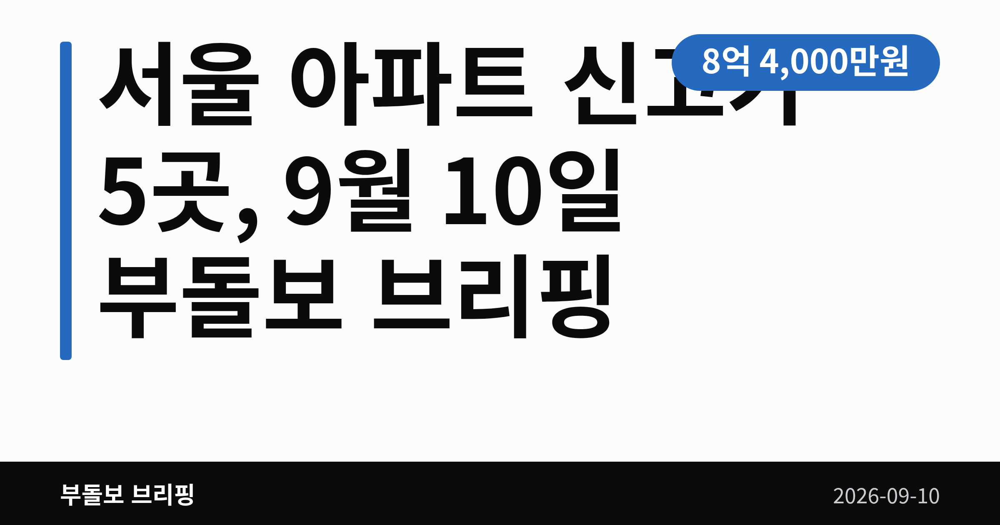
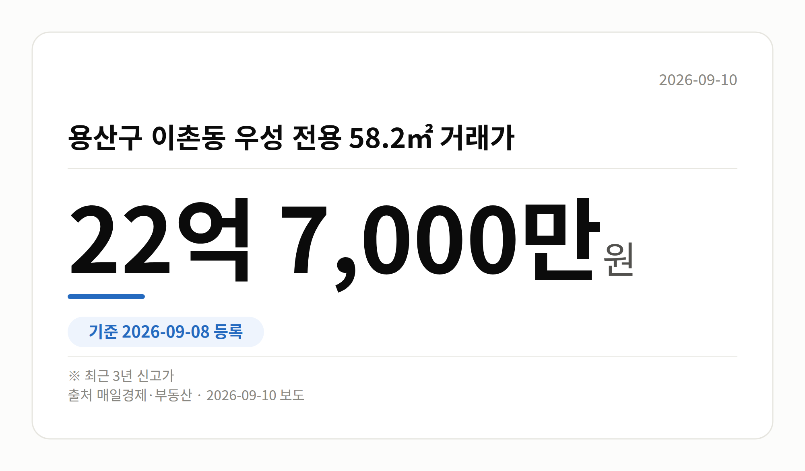
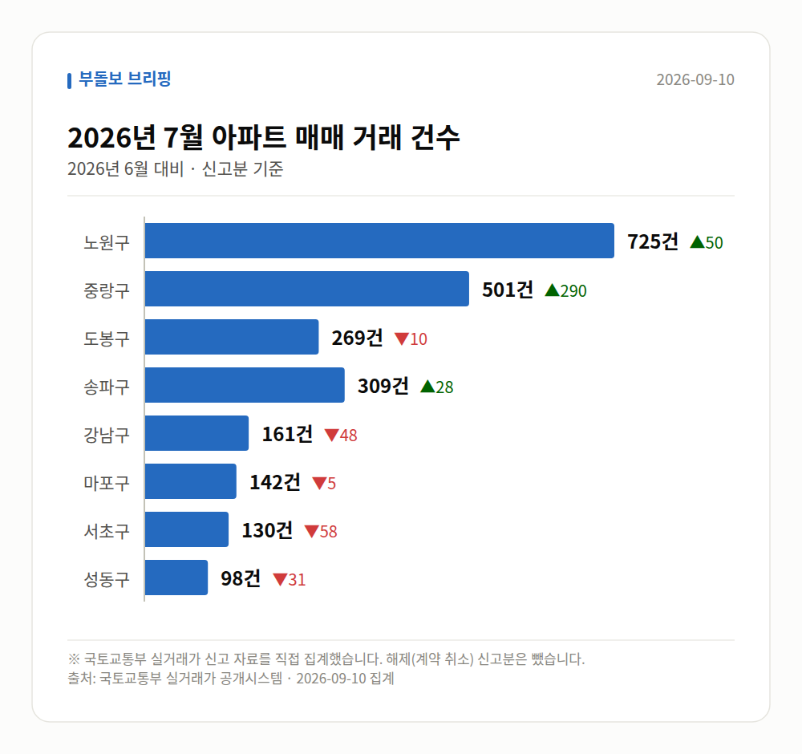

*이 글은 2026년 9월 10일 기준으로 정리한 내용입니다. 실거래 수치는 2026년 7월 신고분입니다.*
**3줄 요약**

- 서울 5개 단지에서 최근 3년 신고가 거래 확인
- 용산 이촌 우성 22억 7,000만원, 노원 한양 8억 4,000만원
- 개별 사례인 만큼 같은 단지 최근 거래부터 확인
서울 아파트 신고가가 하루 등록분에서만 5개 단지에서 확인됐습니다. 9월 8일 국토교통부 실거래가 시스템에 새로 올라온 거래 가운데 노원·중랑·도봉·영등포·용산의 단지들이 최근 3년 최고가를 기록했습니다.

다만 이는 개별 단지·면적의 사례이며, 서울 전체 시세 흐름을 뜻하지는 않습니다.

[이미지: 서울 도심 아파트 단지가 늘어선 전경 사진]

## 서울 아파트 신고가, 어느 단지에서 나왔나

여기서 신고가는 해당 단지의 그 면적 기준으로 최근 3년 사이 가장 높은 값에 등록된 거래를 말합니다. 매일경제 부동산 집계 기준으로 다음 다섯 건이 확인됐습니다.

| 자치구 | 단지·전용면적 | 거래가 |
| --- | --- | --- |
| 노원구 | 상계동 한양 86.62㎡ | 8억 4,000만 원 |
| 중랑구 | 신내동 새한 84.4㎡ | 7억 1,000만 원 |
| 도봉구 | 창동 동아그린 59.96㎡ | 8억 5,000만 원 |
| 영등포구 | 당산푸르지오 84.98㎡ | 18억 1,000만 원 |
| 용산구 | 이촌동 우성 58.2㎡ | 22억 7,000만 원 |

가격대는 7억 원대부터 22억 원대까지 넓게 흩어져 있습니다. 특정 가격대에 몰렸다기보다, 자치구마다 제각각 나온 기록이라고 보는 편이 정확합니다.

## 노원구·도봉구까지 번진 서울 아파트 신고가, 어떻게 읽을까

눈에 띄는 점은 강 남북을 가리지 않고 다섯 개 자치구에 흩어져 있다는 것입니다. 국지적으로 열기가 남아 있다는 신호로 읽을 수는 있습니다.

다만 브리핑에서도 계약일 등 세부 정보는 요약 수준으로만 확인된다고 밝히고 있습니다. 한 건의 거래가 그 단지의 평균 시세를 정하지는 않습니다.

그래서 서울 아파트 신고가 소식을 볼 때는 같은 단지·같은 면적의 최근 거래 여러 건을 함께 놓고 보시는 편이 좋습니다. 등록일과 계약일이 다를 수 있다는 점도 함께 기억해 두세요.

[이미지: 스마트폰으로 아파트 실거래가를 조회하는 손 사진]

## 그 밖의 오늘 소식

- 부동산원, 재개발·재건축 초기 사업성 컨설팅 확대 재추진
- 정비사업 주민 의사결정 지원사업도 올해 참여 대상 모집
- 이헌욱 부동산원장 "주택공급, 이제는 실행의 시간"
- 목동윤슬자이 최고 청약 경쟁률 32대 1, 매일일보는 33대 1 보도
- 같은 단지 평균 경쟁률은 5.8대 1(Nate News 보도)
- 분양가는 최저 28억 원, 최고 68억 원으로 매체별 엇갈림

## 오늘의 체크포인트

1. 서울 아파트 신고가는 5개 구에서 각각 나온 개별 사례입니다.
2. 정비사업(재개발·재건축) 초기 컨설팅 지원은 규모·대상이 아직 확인되지 않았습니다.
3. 목동윤슬자이 경쟁률과 분양가는 매체마다 달라 추가 확인이 필요합니다.

**그래서 나는?**

- 매수를 준비 중이라면, 호가보다 실거래 등록분을 먼저 보세요
- 해당 5개 구 거주자라면, 내 단지 면적별 시세를 따로 확인해 보세요
- 청약 대기자라면, 매체별 경쟁률·분양가 차이를 확인할 필요가 있습니다

**직접 센 숫자 — 2026년 7월 아파트 실거래**

서울 8개 구 신고 매매 **2335건** (2026년 6월 2119건, +216건)

거래가 많은 곳: 노원구 725건(+50) · 중랑구 501건(+290) · 도봉구 269건(-10)

노원구 전세가율 가운뎃값 **54.8%** (같은 단지·같은 면적 128곳)

서울 25개 구 가운데 거래가 가장 크게 움직인 곳: 중랑구 +137.4%(211→501건, 묵동에 66.3% 몰림) · 동작구 +55.6%(153→238건)

이번 달 신고가

- 성동구 벽산 84.8㎡ — 10.8억 (이전 최고 8.6억, +25.6%)
- 송파구 우방1 84.9㎡ — 13.0억 (이전 최고 10.7억, +21.5%)

*국토교통부 실거래가 신고 자료를 직접 집계했습니다. 해제 신고분은 뺐습니다.*
**여러분이 지켜보는 단지에서는 최근 어떤 가격에 거래가 등록되고 있나요?**

---

### 참고한 기사

1. **한국부동산원, 재개발․재건축 주택공급 물꼬를 튼다**
   - [한국건설신문](https://news.google.com/rss/articles/CBMia0FVX3lxTFBQVTM5SnkyVVJJcFRZREZCQTBvbDlncDgwRngtdHBFOHh4dUkwMnlpekxWb3NtUFJLdnQwVUk2UzUyYWlYY3JOU2VVY242VnZlZDVOV1lCbW1sREVRdE1EdUF6Q0E4a3Y0XzUw?oc=5)
   - [cenews.kr](https://news.google.com/rss/articles/CBMiZkFVX3lxTE01Y0xRNGw2eU9OUEoyUlZyQWg2Um9IdVVLcWRRM3VfWmN5R3hFeUotaHQtNW8tZ3d2TGRqMUM2dWV6WUFkdl9Balh5VWNwU2wzUHhsN3FNLTdTbHRIUC1IVXVnM3p4QQ?oc=5)
   - [한국건설신문](https://news.google.com/rss/articles/CBMia0FVX3lxTFBVdXE2SVRxcFY0SmFFZFJMSG1vOC1zQUx0TUZRS1RJT1R3ZFlwQldKZ1E1M2tHN0lBbm93WEhMOUI1b3ktWUxaOE96emtuVUJ6V2xOVTlnbWtxUXVPQXlVZmlaYktRX3JXb0xZ?oc=5)
   - [스마트비즈](https://news.google.com/rss/articles/CBMibEFVX3lxTE5JZkZHanZaN0FrRmFzVHI2RUpxcGhDQ3ZZTVpoYUh1SFNyajl0ckpwSW8xOWR0bzNCVmIwejBGTnNxR1ozYzdDeElaY0Z2N3c2VHhObGtwd2RoMmg1V0hfOWMySlVXOXNaWGtvbg?oc=5)
2. **부동산원·국토부, 정비사업 사업성 검토 공공지원 강화**
   - [주간한국](https://news.google.com/rss/articles/CBMidEFVX3lxTE9BNnBjX3FMOWJibFdVV2ZhMFdiOUZ0Q3VjQWktQ01LbF9zcmFFcjhFU3NXdTRBTkJwV0RoOHNPVjVOLXBrOERkS2Z5enFnWEFzbmlnNHVzTGFhendjQVNQcC12SmsxSElndmk0dkZMMnRwWU9M0gF0QVVfeXFMT0E2cGNfcUw5YmJsV1VXZmEwV2I5RnRDdWNBaS1DTUtsX3NyYUVyOEVTc1d1NEFOQnBXRGg4c09WNU4tcGs4RGRLZnl6cWdYQXNuaWc0dXNMYWF6d2NBU1BwLXZKazFISWd2aTR2RkwydHBZT0w?oc=5)
   - [kbsm.net](https://news.google.com/rss/articles/CBMiWEFVX3lxTE15SGhSbnEyQ293YU1LdjZKR3ZyUVVzWVU4Y0s1QXpZRnp2bjdvV0tfVzE5VWtzRHNkQjY1THVhYWc4MjFreF9sMnVBdHhHM01JWWo3ZTJkMnA?oc=5)
   - [뉴시스](https://news.google.com/rss/articles/CBMieEFVX3lxTE1xa1hwcDUxRklMZE1vTHdYbmo3OXY5Vll2czFrZ2lYUkpqcVlTSzBUdUphX2ctOUlUQjljRlUxczZhTWpfX1gwLVpZTVZrRUFIN3MzamM3UURTb1d5VXJHOGlYekdQU0ZDVnBITDMtVy1PVzNrRnluT9IBeEFVX3lxTE1xa1hwcDUxRklMZE1vTHdYbmo3OXY5Vll2czFrZ2lYUkpqcVlTSzBUdUphX2ctOUlUQjljRlUxczZhTWpfX1gwLVpZTVZrRUFIN3MzamM3UURTb1d5VXJHOGlYekdQU0ZDVnBITDMtVy1PVzNrRnluTw?oc=5)
3. **노원구 상계동 한양 전용 86.62㎡ 8억 4,000만 원 거래…최근 3년 신고가**
   - [매일경제·부동산](https://www.mk.co.kr/news/realestate/12148379)
   - [매일경제·부동산](https://www.mk.co.kr/news/realestate/12148377)
   - [매일경제·부동산](https://www.mk.co.kr/news/realestate/12148078)
   - [매일경제·부동산](https://www.mk.co.kr/news/realestate/12148072)
4. **‘목동윤슬자이’, 청약 경쟁률 최고 32대 1**
   - [조선비즈·부동산](https://biz.chosun.com/real_estate/real_estate_general/2026/09/09/P6XIL224QVHENAGSHTJBI56GUY)
   - [Chosunbiz](https://news.google.com/rss/articles/CBMirAFBVV95cUxOc3lzTFhpanU1WHFYOFh1dXNlajdDWm5Rd0lUeEx5ZnpGYXZmbDAxNndZZTlFWnhKWVpBZnhVLWVueUNDMlp6bWFEdG0wdmJXQUNjLXRFemdydGJad0duTW5aYUhVUVV2RnJ2dUYxelZaVXc2dE5GUm1KSkc1bV9ObVlfZTBSZFI5czFObWJYdEVsZFF1UElGVFhpSXBpcm5rWV9HS2MzcFhub3ot0gGsAUFVX3lxTE5zeXNMWGlqdTVYcVg4WHV1c2VqN0NablF3SVR4THlmekZhdmZsMDE2d1llOUVaeEpZWkFmeFUtZW55Q0MyWnptYUR0bTB2YldBQ2MtdEV6Z3J0Ylp3R25NblphSFVRVXZGcnZ1RjF6VlpVdzZ0TkZSbUpKRzVtX05tWV9lMFJkUjlzMU5tYlh0RWxkUXVQSUZUWGlJcGlybmtZX0dLYzNwWG5vei0?oc=5)
   - [mt.co.kr](https://news.google.com/rss/articles/CBMiakFVX3lxTE1NSk9fYzhpV2J5R3QxMWNLLTFzd3VhZ3hMVFRnMkVmS2FwLXBPcUt6cFROZGpIWVc3LWZ4enk2OWlBLUJlZG1uWWdfQURZQ1BFZWxwLTZBVVF3UURsZGpyb3YycUdzcjdVdFHSAW9BVV95cUxPcGxUU3BhanlnUXhsRjNndWFtUmJJTmZMUmhyTU90OGZXS3hZbnhJYlBlZDdWeEJLSEVSZUpHVjRUQmdyRlhRMFNSUmpTMEQwdTBnbld3WjNrNkFSbjkzeVExMHJKRUVnRTNaUV8xcXM?oc=5)
   - [Nate News](https://news.google.com/rss/articles/CBMiU0FVX3lxTE9mTkp4dFYxLXFScWE4NUhBOHpvZVlKR2JHT2VJNFc2S1dEOU1xTjFSMEIxS29EMjRnbExRSlZuZ1l2UXpDR0lmVkJyU00xckJjdW1J?oc=5)
5. **한국부동산원, 올해도 정비사업 주민 의사결정 지원 사업 추진**
   - [한국주택경제신문](https://news.google.com/rss/articles/CBMiaEFVX3lxTFBRd2tYdXZmMkdJQ01FemJ4Qko1YmdXek9KRXZnWEVmY2ZSb0s0dGp0aTlXUHp3RUU0RllBa216dzRGUFBtaGlvUlFCcmE5RTBwOFpWOF9tQVZvY1FoaHdaVHA1YnpSNktk?oc=5)
   - [Nate News](https://news.google.com/rss/articles/CBMieEFVX3lxTE1KakJXUWZxeU5qNzY2MjIwdXBIRjVaY19WWGZob0dWRTJZNFZLWkdTUVBkNnJHeXQ2aVFZWXFHZjdYb2VyLUVQSG9jUDdvNjYzeTAxdnkxN3FjUFZiaU9YRXRWSGc1aFRWSTlkS1JoeU1uM0NHdEFrYw?oc=5)
   - [뉴스핌](https://news.google.com/rss/articles/CBMiXEFVX3lxTE44Z2U3amV1N2V6cHFfVGl6OFdaLTlqelZfYS1BNG1TN1ZwblYwNWNKWjItcDBFTVVPc2JJeDdMV1ViNGpfaUpKR3hieVl3d3BuN1liNWEwQ3EtQTJM?oc=5)
   - [news.kbs.co.kr](https://news.google.com/rss/articles/CBMiW0FVX3lxTE5Za1B3a3VYODVWNTFPQkRRVk96OC11UDNoSVN2TWFZbWRUcFIxaWQ3Sm1Gb1IzaUNHcjJTS0hZMXAtd2YycDFha1g5WU9Bb3B6V1ZncFBXT3hRMzg?oc=5)

---

*본 글은 공개된 언론 보도를 정리한 것이며, 투자 판단의 책임은 이용자 본인에게 있습니다.*
