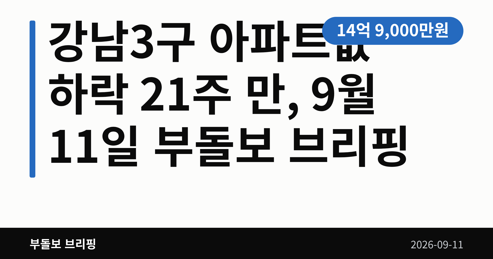
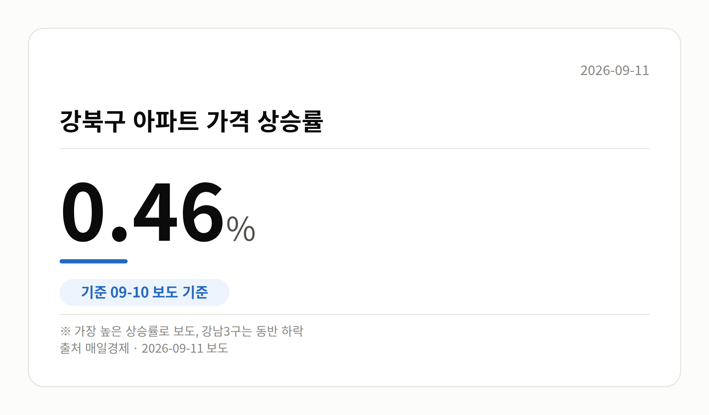
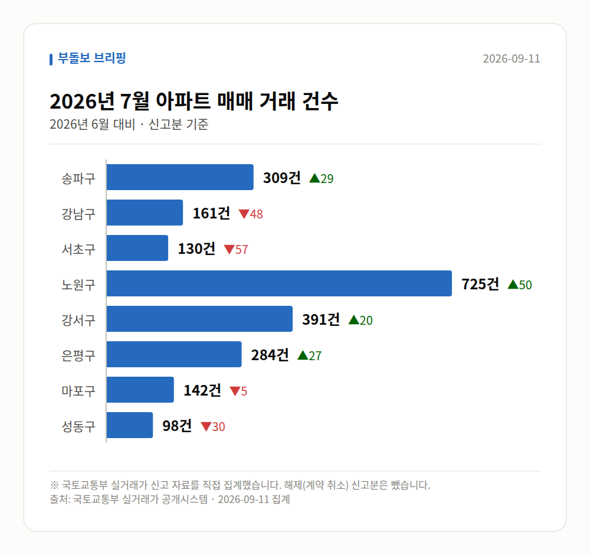

*이 글은 2026년 9월 11일 기준으로 정리한 내용입니다. 실거래 수치는 2026년 7월 신고분입니다.*
**3줄 요약**

- 강남·서초·송파 아파트값이 일제히 하락 전환했습니다
- 21주 만의 동반 하락, 강북구는 0.46%로 가장 많이 올랐습니다
- 세제 개편안이 어떻게 확정되는지가 다음 변수로 거론됩니다
강남3구 아파트값 하락이 확인됐습니다. 강남3구, 즉 강남·서초·송파구가 한꺼번에 내린 건 21주 만인데요. 그런데 서울 전체는 여전히 오르고 있습니다.

[이미지: 강남 일대 고층 아파트 단지 전경 사진]

## 강남3구 아파트값 하락, 송파구까지 꺾였다

9월 10일 여러 매체가 강남3구 아파트 매매가격이 모두 내렸다고 보도했습니다. 강남·서초에 이어 송파구마저 하락세로 돌아서면서 세 곳이 나란히 약세가 됐습니다.

매일경제는 세 구가 모두 약세로 바뀐 것이 5개월 만이라고 전했습니다. 앞의 주 단위 표현과 기준이 같은지는 기사만으로 확인되지 않습니다.

구별 하락률은 이번 자료에 나오지 않았습니다. 얼마나 내렸는지보다 세 곳이 '동시에' 꺾였다는 점이 이번 뉴스의 핵심입니다.

## 강남만 약세인 이유, 세제 개편안과 양도소득세

이번 강남3구 아파트값 하락의 배경으로 매일경제는 세제 개편안을 꼽았습니다. 고가 주택과 비거주 1주택자(집 한 채를 가졌지만 그 집에 살지 않는 사람)를 겨냥한 안이라는 설명입니다.

특히 양도소득세(집을 팔 때 남긴 차익에 매기는 세금) 인상 부담이 고가 주택 매수 심리를 위축시켰다는 풀이입니다. 데일리굿뉴스도 세제 개편 불확실성을 배경으로 들었습니다.

다만 이는 언론의 해석입니다. 세제 개편안의 구체 내용과 확정 여부, 시행 시점은 아직 기사에서 확인되지 않습니다.

## 서울 전체는 여전히 상승, 강북구가 가장 강했다

같은 날 서울 전체 그림은 달랐습니다. 오름폭은 줄었지만 방향은 여전히 위쪽입니다.

| 구분 | 흐름 | 출처 |
|---|---|---|
| 강남3구 | 일제히 하락 | 여러 매체 |
| 서울 전체 | 83주 연속 상승, 상승폭 축소 | 매일경제 등 |
| 강북구 | 0.46%, 가장 높은 상승률 | 매일경제 |

상승을 이끈 곳은 노도강(노원·도봉·강북구) 등 외곽의 중저가 아파트입니다. 매일경제는 중저가 주택 매수 수요가 여전히 강하다고 전했습니다.

서울 상승세의 중심이 외곽으로 옮겨 간 모양새입니다. 매일경제는 이 흐름이 이어지면 자산 양극화 우려가 제기될 수 있다고 짚었습니다.

## 그 밖의 오늘 소식

- 서울 5개 단지, 최근 3년 신고가(이전보다 높은 값) 기록
- 송파 방이금고어울림 전용 84.3㎡, 14억 9,000만 원 거래
- 서울 전셋값은 상승했다는 보도(오피니언뉴스)
- 노도강 시장에 '불장'이라는 표현 등장(조선비즈 등)

[이미지: 공인중개사 사무소 창에 붙은 매물 안내문]

## 오늘의 체크포인트

- 강남3구 아파트값 하락은 세 구가 동시에 꺾였다는 점이 핵심
- 서울 전체는 오름세 유지, 외곽 중저가가 상승 주도
- 세제 개편안 확정 내용과 시점이 다음 변수로 거론

**그래서 나는?**

- 강남권 매수·매도를 고민 중이라면, 세제 개편안 확정 내용부터 확인해 보세요
- 외곽에서 내 집 마련을 준비한다면, 가격 부담이 커지는 흐름일 수 있습니다
- 관심 단지가 있다면, 구 평균과 별도로 그 단지 실거래를 따로 보세요

**직접 센 숫자 — 2026년 7월 아파트 실거래**

서울 8개 구 신고 매매 **2240건** (2026년 6월 2254건, -14건)

거래가 많은 곳: 송파구 309건(+29) · 강남구 161건(-48) · 서초구 130건(-57)

송파구 전세가율 가운뎃값 **40.0%** (같은 단지·같은 면적 76곳)

서울 25개 구 가운데 거래가 가장 크게 움직인 곳: 중랑구 +137.4%(211→501건, 묵동에 66.3% 몰림) · 동작구 +55.6%(153→238건)

2026년 8월 계약 신고가

- 강서구 마곡서광(치현마을) 84.93㎡ — 7.6억 (이전 최고 6.0억, +26.7%, 8월 30일 계약)
- 노원구 상계주공13(고층) 45.55㎡ — 4.7억 (이전 최고 3.9억, +19.2%, 8월 29일 계약)

*국토교통부 실거래가 신고 자료를 직접 집계했습니다. 해제 신고분은 뺐습니다.*

**오늘 나온 정부 발표 원문**

- [[설명] 3기 신도시 LH 공공분양주택의 중도금 대출은 차질없이 제공될 예정입니다.](https://www.korea.kr/briefing/pressReleaseView.do?newsId=156781243) (국토교통부 2026-09-10)
  - 첨부 [260910(설명) 3기 신도시 LH 공공분양주택의 중도금 대출은 차질없](https://www.korea.kr/common/download.do?fileId=198550553&tblKey=GMN) · [260910(설명) 3기 신도시 LH 공공분양주택의 중도금 대출은 차질없](https://www.korea.kr/common/download.do?fileId=198550554&tblKey=GMN)
- [[설명] 정부는 근거 없는 공사비 인상을 막고, 분쟁이 발생한 정비사업 현장을 직접 찾아가 해결하고 있습니다.](https://www.korea.kr/briefing/pressReleaseView.do?newsId=156781214) (국토교통부 2026-09-10)
- [[설명] 국토부는 1기 신도시 정비사업의 원활한 추진을 적극 지원하고 있습니다.](https://www.korea.kr/briefing/pressReleaseView.do?newsId=156781136) (국토교통부 2026-09-10)
**여러분이 눈여겨보는 동네는 요즘 강남 쪽 흐름에 가까운가요, 외곽 쪽 흐름에 가까운가요?**

---

### 참고한 기사

1. **동대문구 답십리동 동답한신 전용 35.45㎡ 5억 1,700만원 최근 3년 신고가**
   - [매일경제·부동산](https://www.mk.co.kr/news/realestate/12149004)
   - [매일경제·부동산](https://www.mk.co.kr/news/realestate/12149033)
   - [매일경제·부동산](https://www.mk.co.kr/news/realestate/12149032)
   - [매일경제·부동산](https://www.mk.co.kr/news/realestate/12149019)
2. **강남3구 아파트 하락, 노도강은 강세 지속**
   - [네이버 프리미엄콘텐츠](https://news.google.com/rss/articles/CBMigAFBVV95cUxOTzQtOXRRcVFMQ0RIdTNlTHpPb0wzTmJXSEtGUWZJWjJQT0ZMSlN5QTZ4anA0bnNPYzlzcTg0X2ZfRnU1NW1JT2Nsa3M3bjktVVRncHFEVVBoWWNxdHdHcHFoRHR0RzBpaHFlaUdFRmxtai05WnplREF5NjdQbmdWOA?oc=5)
   - [화이트페이퍼](https://news.google.com/rss/articles/CBMic0FVX3lxTE9oaVRTOWRsdV82T2hPZWxJMmZOQWFadmw2WWdnVXlpdVYzamRQTl9PSFFBUXNjeEpCWVNhbTVoZjEtajZyNFVDb1B2cFlxQlNSWEQ2d3RUaHZhYnpVSGluZFR3Nnc4TnY3VDhUY0swb0Vtb1XSAXNBVV95cUxPaGlUUzlkbHVfNk9oT2VsSTJmTkFhWnZsNllnZ1V5aXVWM2pkUE5fT0hRQVFzY3hKQllTYW01aGYxLWo2cjRVQ29QdnBZcUJTUlhENnd0VGh2YWJ6VUhpbmRUdzZ3OE52N1Q4VGNLMG9FbW9V?oc=5)
   - [조선비즈·부동산](https://biz.chosun.com/real_estate/real_estate_general/2026/09/10/EFRD4MEMARAMXETRMD75TK7T3M)
   - [데일리굿뉴스](https://news.google.com/rss/articles/CBMicEFVX3lxTFB2ck5nTzBVVzlEOFJkWnI1TDNWeXVWWUo3ekc2eGgwR1JXOUVGaURyUDBTMEJ0YV93TkNoM2Vqc28yTXQ4d1R5NHdvc3VzVm5JZkdJa0lDNjNubDJsMGpTWkVpdi1GOW41bTAxdXFMMDTSAXBBVV95cUxQdnJOZ08wVVc5RDhSZFpyNUwzVnl1VllKN3pHNnhoMEdSVzlFRmlEclAwUzBCdGFfd05DaDNlanNvMk10OHdUeTR3b3N1c1ZuSWZHSWtJQzYzbmwybDBqU1pFaXYtRjluNW0wMXVxTDA0?oc=5)
3. **강남·서초·송파 일제히 약세...서울 아파트값 상승폭 축소**
   - [ppss.kr](https://news.google.com/rss/articles/CBMiZEFVX3lxTFB2aVRtU2g1OVpqdWNXNFF6ZnlVa01Pb3ZvUHZoQ21LcmxZTTVXajJsVUdPb09qOGY3T1NvMGNGNWx2Vm1sQnQyTGoweU9tQlpLblJvbk9CYmppTFJwcWZFM3lQWlI?oc=5)
   - [karnews.or.kr](https://news.google.com/rss/articles/CBMia0FVX3lxTE9pNDVyeVgyX2EwdFk4SmpQREEtWnpsOUxudjV2aDlaZ2dVOTVwNXZaa1hKZWthem9lWk5lSnphTzhVNEd2Y1RCOUt4S29CYWlZYTJnQ0MtQUxPYlJGYUhrTDYzOTBra3RaSk4w?oc=5)
   - [중앙일보](https://news.google.com/rss/articles/CBMiVkFVX3lxTE5SRmZfRHRBVjBCblM0NVZNSS04NDFyRWo4Yld0N0JCOXA5eG45dVN1dUp5bE9FX1pHUEhTdVllbGtkNzJ4cmRvSHdmSVkyU1RjV2lKN093?oc=5)
   - [오피니언뉴스](https://news.google.com/rss/articles/CBMicEFVX3lxTFBHSUl3RF9Fd0pFLW9VNDhUN2tRSm1EUmx2N1JyMXVQbWF1c3Bwc0xuaTBZRXM1Sl9yN1ItQlhmc3lrNzBNWFZEaTNjZ0JVUXRuQng2UVJZZ1pCZzJjZm00ekZmTTdfMVhpUFAzY0FDSEQ?oc=5)
4. **송파도 꺾였다… 강남3구 집값 동반 하락할 때 노도강은 ‘불장’ - 조선비즈**
   - [biz.chosun.com](https://news.google.com/rss/articles/CBMirAFBVV95cUxPRVQ2WE1YVzRQOEdtbVVidEl5UlVLdEsxanlxN0JwN0ZHUzlOVjM3VTN2NDkxbjAzcVZCTGR2c1Q0UjcxWHEtYVhFblpDTWFiV0tNV09jeU03bXYybzg2NktTZWxwLTc1dThXLXBNVTNzVGN4YTh5MVZ2YU9yUkk0cTNJQUdYdGpRU1Zhcm8wUjhMZm9KUTc2T0l5T2tpZzNiNURRbTJPMnFEWl9o0gGsAUFVX3lxTE9FVDZYTVhXNFA4R21tVWJ0SXlSVUt0SzFqeXE3QnA3RkdTOU5WMzdVM3Y0OTFuMDNxVkJMZHZzVDRSNzFYcS1hWEVuWkNNYWJXS01XT2N5TTdtdjJvODY2S1NlbHAtNzV1OFctcE1VM3NUY3hhOHkxVnZhT3JSSTRxM0lBR1h0alFTVmFybzBSOExmb0pRNzZPSXlPa2lnM2I1RFFtMk8ycURaX2g?oc=5)
   - [매일경제·부동산](https://www.mk.co.kr/news/realestate/12149606)
   - [서울파이낸스](https://news.google.com/rss/articles/CBMiakFVX3lxTFBWTloxTVJFYTNGdXJNR3pXWDFObVppTXM3SVp3U3ViamU3TFBiYlZhNFZaUWdKUjloNDhXdjRMdnM0SG5tY01XTFNjN3pydHRzMUFyT3lwYTVpVlU5blRwbjFhd2sxVGdxOVE?oc=5)
   - [v.daum.net](https://news.google.com/rss/articles/CBMiT0FVX3lxTE56Q004SmxQNEdBU0J2czIwUy11emJqMW5uUU5IR0p4VDNvSUc4YjR6T2k2V0pBTmpxb25rc2ZwVnZYanBnTEFRUWU5TDlXWHM?oc=5)
5. **서울 집값 상승세 소폭 둔화…'강남 3구' 일제히 하락 전환**
   - [청년일보](https://news.google.com/rss/articles/CBMiZ0FVX3lxTFBGMEJDMk1ULXVmZmxVV09hc2ctV3lST0RXcC05WE5WZXRETWdfaGtQZVhIQlQ3M3dyZngxMTlBZUdBT19USEItN051a0ZXUmI1YThud1V2aVJKUElEX2VTTm1XVnlzd2M?oc=5)
   - [v.daum.net](https://news.google.com/rss/articles/CBMiVEFVX3lxTE5fQmFic25VQmxMeG5aTDBhZUs0WkNxbzZSVW1aR0NGR1g3MU1JeDJ4R3BBbjhQYXl5R052cmFsazJMOFUtWFZsWjRGR01yWE9RdlNsYg?oc=5)
   - [에너지경제신문](https://news.google.com/rss/articles/CBMiYkFVX3lxTE9Jckg2UWRiRHpYY1RqV2FmR092eWhzMEhZblJnd1JXVkFsUU5NWHA0WC1kVmtUVjd2UkhUVldYX2FsN2R4Wm5MTEtCS0Z2U0V2cVhqeVBucXBBV3ZYYzdvZUxB?oc=5)
   - [v.daum.net](https://news.google.com/rss/articles/CBMiVEFVX3lxTE52a1Q5OTZEekNNTllGRExHTzVKZDVNY2tjX1o2ZnJGZFFfU3g2QTl2RGlMb1E5SWJoam9sc1dfcjczZUJUSDB0YmZ2dUl1enRqMVZGeQ?oc=5)

---

*본 글은 공개된 언론 보도를 정리한 것이며, 투자 판단의 책임은 이용자 본인에게 있습니다.*
