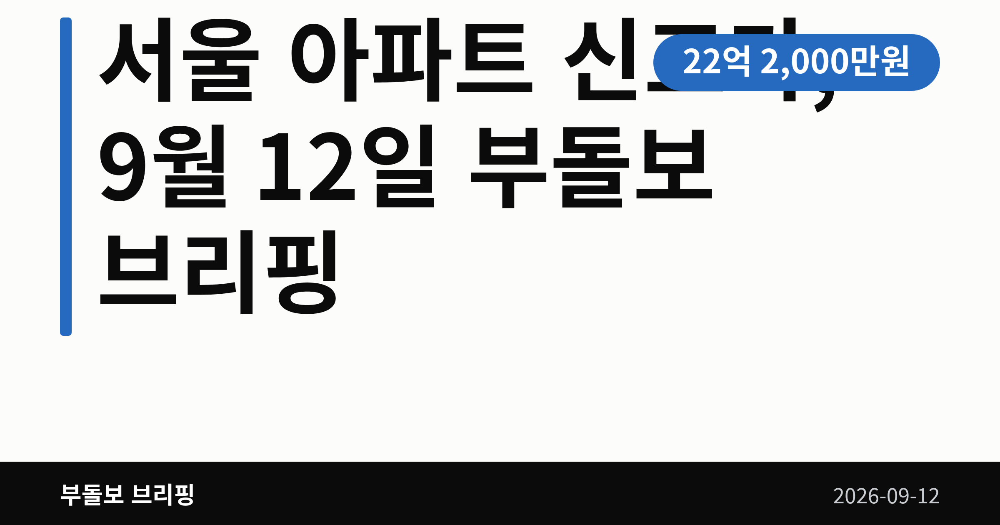
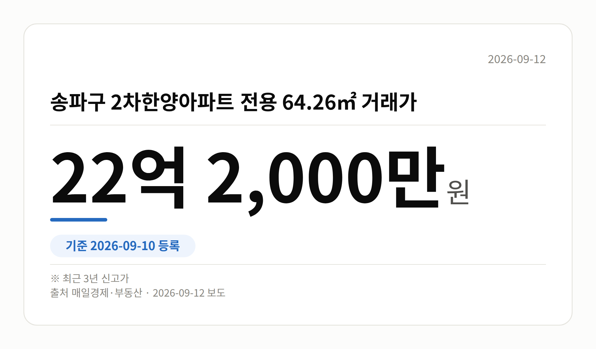
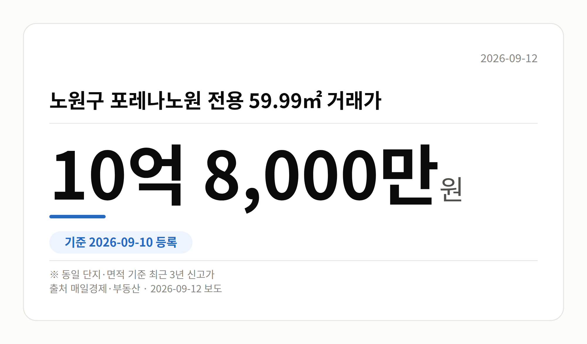

*이 글은 2026년 9월 12일 기준으로 정리한 내용입니다.*
**3줄 요약**

- 9월 10일 등록 거래에서 서울 12개 단지가 최근 3년 신고가
- 송파 2차한양 64.26㎡ 22억 2,000만 원, 노원 포레나 10억 8,000만 원
- 개별 단지 사례라 서울 전체 시세로 보긴 어렵습니다
9월 10일 국토부 실거래가 시스템에 새로 등록된 거래에서 **서울 아파트 신고가**가 잇따라 확인됐습니다. 송파·동작·구로·노원·도봉·중랑·금천 등 여러 자치구의 12개 단지가 최근 3년 내 가장 높은 값에 손바뀜했습니다.

다만 이건 개별 단지의 개별 거래 기록입니다. 서울 전체가 오른다는 통계는 오늘 자료에 없습니다.

## 서울 아파트 신고가, 어느 단지에서 나왔나

가장 높은 금액은 송파구 2차한양아파트였습니다. 전용 64.26㎡가 22억 2,000만 원에 거래되며 최근 3년 신고가를 기록했습니다.

동작구 상도두산위브 전용 84.99㎡는 17억 2,000만 원이었습니다. 도심권만이 아니라 서남·동북권 중저가 단지에서도 같은 흐름이 나타났습니다.

| 단지(자치구) | 전용면적 | 거래가 |
| --- | --- | --- |
| 2차한양(송파) | 64.26㎡ | 22억 2,000만 원 |
| 상도두산위브(동작) | 84.99㎡ | 17억 2,000만 원 |
| 개봉동 한마을(구로) | 84.57㎡ | 11억 7,000만 원 |
| 금천롯데캐슬골드파크3차(금천) | 59.97㎡ | 11억 2,000만 원 |
| 포레나노원(노원) | 59.99㎡ | 10억 8,000만 원 |
| 가산동 두산(금천) | 84.9㎡ | 8억 8,000만 원 |
| 상봉동 엘지,쌍용(중랑) | 68.12㎡ | 8억 2,400만 원 |
| 쌍문동 한양2(도봉) | 84.9㎡ | 6억 5,000만 원 |

이 밖에 구로구 한일유앤아이 전용 84.962㎡ 8억 2,000만 원, 노원구 불암현대 전용 59.4㎡ 5억 6,500만 원, 한신1차 전용 53.96㎡ 5억 2,000만 원, 상계주공13단지 전용 45.55㎡ 4억 6,500만 원도 같은 날 신고가 목록에 올랐습니다.

## 이 서울 아파트 신고가를 어떻게 읽어야 할까

특정 구에 몰리지 않고 일곱 개 자치구에 흩어져 있다는 점이 눈에 띕니다. 국지적으로 매수심리가 살아 있다는 신호로 읽힙니다.

그런데 신고가(같은 단지·같은 면적에서 최근 3년 중 가장 높은 값)는 단 한 건만 있어도 성립합니다. 매매가격지수나 거래량 같은 전체 통계가 함께 있어야 방향을 말할 수 있습니다.

오늘 브리핑에는 그 통계가 없습니다. 거래일과 층수 같은 세부 정보도 확인되지 않았습니다. 그래서 **서울 아파트 신고가** 사례는 참고 자료로 두고, 관심 단지의 거래 건수를 직접 세어 보시는 편이 안전합니다.

[이미지: 서울 외곽 아파트 단지 전경 사진]

## 그 밖의 오늘 소식

- 2026 부동산개발 포럼에서 '정비사업 대전환기'를 주제로 논의가 열렸습니다.
- 포럼에선 실거주 유도 세제의 전세시장 부담을 지적하는 발언이 나왔습니다.
- 고동진 의원이 공동주택 리모델링 공사기간 재산세 면제를 추진합니다.
- 조선비즈는 입주 절벽을 앞둔 서울에서 분양권 신고가가 나온다고 전했습니다.

## 오늘의 체크포인트

1. 9월 10일 등록 거래에서 서울 12개 단지가 최근 3년 신고가를 기록했습니다.
2. 최고가는 송파 22억 2,000만 원, 노원·금천에서도 10억 원대 거래가 나왔습니다.
3. 전체 시세 통계가 없는 만큼, 단지별 거래 누적을 직접 확인하는 게 먼저입니다.

**그래서 나는?**

- 무주택 실수요자라면, 관심 단지의 같은 면적 과거 거래부터 확인해 보세요
- 1주택자라면, 내 단지 신고가가 일회성인지 반복 거래인지 살펴볼 때입니다
- 노후 아파트 소유자라면, 리모델링 세제 논의 진행 상황을 지켜볼 만합니다
**여러분이 눈여겨보는 단지는 최근 1년 사이 거래가 몇 건이나 쌓였나요?**

---

### 참고한 기사

1. **송파구 2차한양아파트 전용 64.26㎡ 22억 2,000만 원 최근 3년 신고가**
   - [매일경제·부동산](https://www.mk.co.kr/news/realestate/12150162)
   - [매일경제·부동산](https://www.mk.co.kr/news/realestate/12150161)
   - [매일경제·부동산](https://www.mk.co.kr/news/realestate/12150157)
   - [매일경제·부동산](https://www.mk.co.kr/news/realestate/12150152)
2. **[2026 부동산개발 포럼] 정비사업 대전환기…상품성·세제·분쟁이 판 가른다 : 네이버 블로그**
   - [Naver Blog](https://news.google.com/rss/articles/CBMijwFBVV95cUxOV3RhMzlwMVd5alY0a28weU1uXzNVbkIyREc3OG5lOVk2SjA3ZzVGNmxXWEFEOUdDS2lGM2NwakRXQUJzMlV5YVNwX29vOUNDUW1DYlV6NzdGejV3eEpQRXUzLVdEc0tHLTdtTlQ3Z2ZsZUlRRFNwUzRfQnJqTnRqeUZiMklNMFZQYkNZR0dmZw?oc=5)
   - [Naver Blog](https://news.google.com/rss/articles/CBMijwFBVV95cUxPNHg0djkwSTFYbF9CejctNHZRTUwyV3JpZHEwaU5DN3dyNDBCaU5TRTladWZTdXVCaTdQbHFOcU1ZcllCOGVVaER1QmdsRVNBaW0zVHJKRHhlb0Iwck5kQzlnc2FSQlNTZUxKYlJfWnpEWmExczdnb09YMll2eHlwUS00cmtmWVNSV2JPZjE1WQ?oc=5)
   - [Naver Blog](https://news.google.com/rss/articles/CBMijwFBVV95cUxQN1I0MS1WZVpzS1EyMG91ckxmTHJ5UlBHZnBlTUx6TjN5NWwxZ28yWGJzaktOTi1BMkt5UGVGb1QwVkhYRUs2N2pENEx2NDhtbmoyMUExbXl2WjVPMjI5LXgxeXNMOGpBaVJOeldqRlFUaVlHMVRiOEN1QW9yZU5OaW14WUthdWx3QS1SSnB3dw?oc=5)
   - [Naver Blog](https://news.google.com/rss/articles/CBMijwFBVV95cUxPU1o5eTRZVUhhcjA4bFJqMlRubmxrd2VwWjQwMVkwSWFTR3l6SzBRa3c1RENFWUJxSVRyT2x6UTUtNVNiVE1wRXp4LU5kbzBGNk5JeUpiaWxUenlaQlVzU0E2NWdmOVR6bVYzMkpYWkRpQndqSThzR1kyYktMRDQwRl8teDVjMW5uNEJSQzM5WQ?oc=5)
3. **금천구 금천롯데캐슬골드파크3차 59.97㎡ 11억 2,000만원 거래…최근 3년 신고가**
   - [매일경제·부동산](https://www.mk.co.kr/news/realestate/12150159)
   - [매일경제·부동산](https://www.mk.co.kr/news/realestate/12150158)
   - [매일경제·부동산](https://www.mk.co.kr/news/realestate/12150156)
   - [매일경제·부동산](https://www.mk.co.kr/news/realestate/12150155)
4. **고동진 국회의원, 공동주택 리모델링 세제 개선 추진**
   - [강남내일신문](https://news.google.com/rss/articles/CBMiakFVX3lxTE1YMFZGaEZxeVF5Y1g1RDJwcjhOMFBaX0ZDLWRHclRBaEdZTmxFb2swSDNiUHdraS16YTRBUXVLSmdnZEF3dXZyU0t3bHRSaERSUnV5NjNselBLZ3M5SzE1R2d6U1ZKcWI5WkE?oc=5)
   - [기계설비신문](https://news.google.com/rss/articles/CBMibEFVX3lxTE5mWUhRaG03ZEM5Wnh6V2lBcGhuT1M4a3NBTG9jSkl3MlZLeFJiampNTFhjdk5UdGpjWWItRy15MGRFLXREMTVQcW1xb2RYZGxtWTdqaUZOb19RMzdvOG5XMUxJS0FqeVc2YV83SA?oc=5)
   - [파이낸셜리뷰](https://news.google.com/rss/articles/CBMidEFVX3lxTE1pcjl4WGs5R012UlNTSEo1LTdxcU03Tl9SaGhudXpNRENqUE5MOF9LbFZHbzhpT2NEZDg0N3l6eExqdFNtVl85SmQzakotbUw1ckJGdElDMGRoYmplb2tDQXQ3N05aZWpyRG9fRjNaaTVrTWFD?oc=5)
5. **‘입주 절벽’ 앞둔 서울… 새 아파트 분양권 곳곳서 신고가**
   - [조선비즈·부동산](https://biz.chosun.com/real_estate/real_estate_general/2026/09/12/IGE26OGL25CSFNDACD66AHJEM4)

---

*본 글은 공개된 언론 보도를 정리한 것이며, 투자 판단의 책임은 이용자 본인에게 있습니다.*
