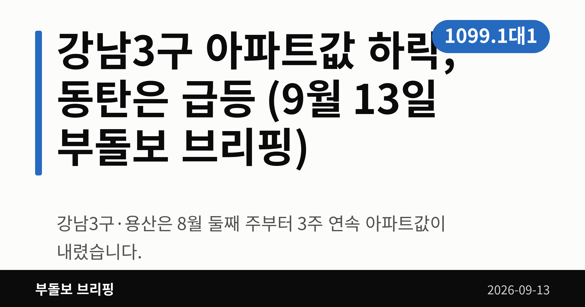
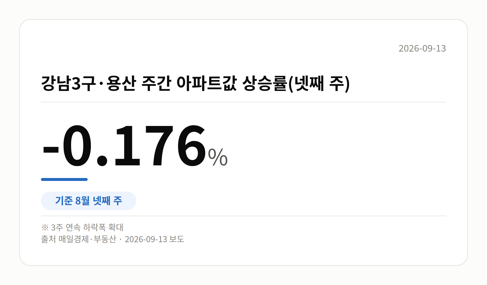
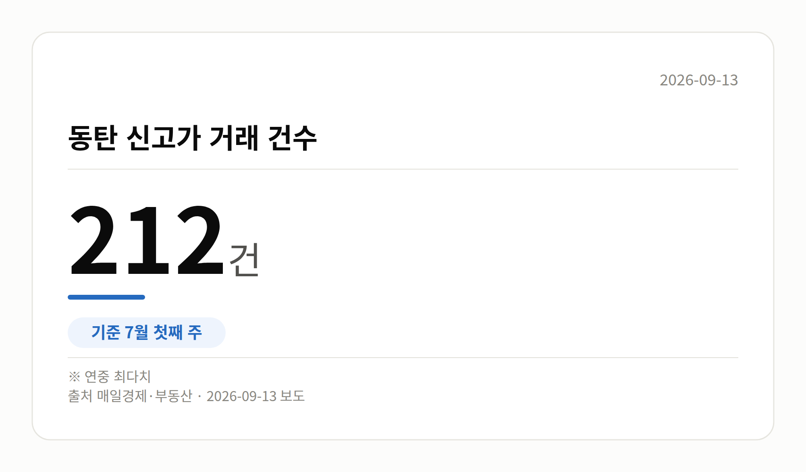
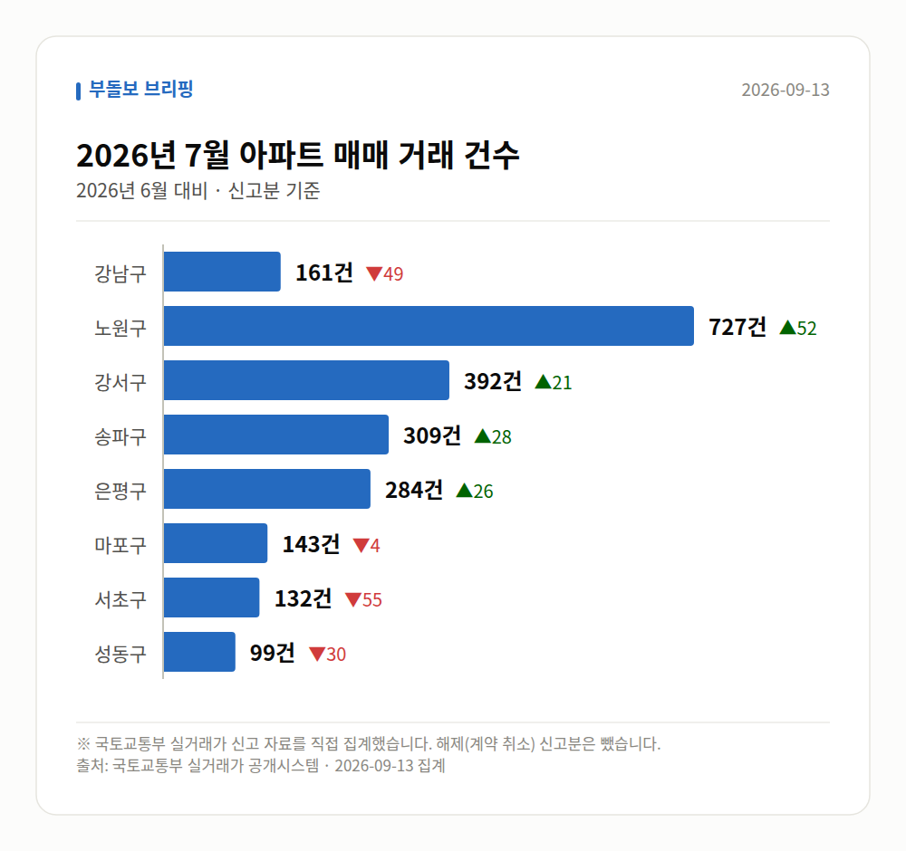

*이 글은 2026년 9월 13일 기준으로 정리한 내용입니다. 실거래 수치는 2026년 7월 신고분입니다.*
**3줄 요약**

- 강남3구·용산은 8월 둘째 주부터 3주 연속 아파트값이 내렸습니다.
- 8월 넷째 주 -0.176%, 같은 기간 경기 규제지역은 0.51%였습니다.
- 동탄은 6월 둘째 주 2.22% 급등, 지역별 온도차부터 보면 됩니다.
강남3구 아파트값 하락이 3주 연속 이어졌습니다. 반대로 화성 동탄은 주간 상승률이 연중 최고치를 찍었습니다. 같은 수도권인데 방향이 정반대입니다.

오늘은 이 온도차 하나만 자세히 보겠습니다.

## 강남3구 아파트값 하락은 어느 정도인가

강남3구(강남·서초·송파)와 용산의 주간 아파트값 상승률은 8월 둘째 주에 마이너스로 돌아섰습니다. 이후 3주 연속으로 하락폭이 커졌습니다.

| 구분 | 8월 2주 | 8월 3주 | 8월 4주 |
|---|---|---|---|
| 강남3구·용산 | -0.001% | -0.013% | -0.176% |

같은 8월 넷째 주에 서울 외곽은 0.485%, 경기 규제지역은 0.51% 올랐습니다. 강남3구 아파트값 하락과는 확연히 다른 흐름입니다.

## 동탄은 왜 반대로 움직였나

화성 동탄은 6월 둘째 주 주간 상승률 2.22%로 연중 최고치를 기록했습니다. 7월 첫째 주에는 신고가 거래가 212건으로 연중 가장 많았습니다.

배경으로는 반도체 기업의 성과급 지급과 사내대출 확대 기대가 함께 언급됐습니다. GTX-A 동탄역 인근 '동탄역 롯데캐슬' 전용 84㎡는 6월에 22억2500만원으로 신고가를 새로 썼습니다.

특정 산업의 자금이 들어오는 지역은 규제 강도와 별개로 수요가 몰릴 수 있다는 점을 보여주는 사례입니다.

## 한국은행은 시장을 어떻게 봤나

한국은행이 9월 10일 내놓은 통화신용정책보고서를 보면, 수도권 주택매매가격 상승률은 6월 0.68%에서 7월 0.72%로 오름폭이 조금 커졌습니다. 예금취급기관 가계대출은 6월 한 달간 7조4000억원 늘었습니다.

박종우 부총재보는 정부의 거시건전성 관리 의지가 바뀐 것은 아니며, 실수요자 문제에 대한 미시적 조정이라고 설명했습니다.

한국은행은 9월 3일 발표된 부동산 세제개편안이 초고가 주택 거래를 위축시킬 수 있다고 봤지만, 국회 입법 과정에 따라 달라질 수 있다고 덧붙였습니다. 아직 확정된 내용은 아니라는 뜻입니다.

[이미지: 아파트 단지가 늘어선 수도권 주거지 전경]

## 그 밖의 오늘 소식

- 올해 1~8월 1순위 청약경쟁률 상위 15곳 중 12곳이 역세권입니다.
- 전국 1위는 서초동 '아크로 드 서초', 1099.1대 1이었습니다.
- 힐스테이트 송파더그리드(1393실) 청약이 9월 14일 접수됩니다.
- 이 오피스텔은 청약통장·주택 보유와 무관하게 전국 신청이 가능합니다.
- 다음 주 의정부·천안 등 전국 1만1521가구가 분양에 나섭니다.

## 오늘의 체크포인트

1. 강남3구 아파트값 하락은 8월 넷째 주 -0.176%까지 확대됐습니다.
2. 동탄은 성과급 기대 속에 상승률·신고가 건수 모두 연중 최고 수준이었습니다.
3. 9월 14일 송파 오피스텔 청약과 세제개편안 국회 논의를 함께 보시면 됩니다.

어려운 말 하나만 풀고 마칩니다. DSR은 내 연소득에서 모든 대출 원리금이 차지하는 비율로, 대출 한도를 정하는 기준입니다.

**그래서 나는?**

- 무주택 실수요자라면, 관심 지역의 주간 상승률 방향부터 확인해 보세요.
- 강남3구 1주택자라면, 세제개편안 국회 논의 일정을 함께 지켜볼 수 있습니다.
- 오피스텔 청약을 볼 분이라면, LTV보다 DSR 한도부터 계산해 보세요.

**직접 센 숫자 — 2026년 7월 아파트 실거래**

서울 8개 구 신고 매매 **2247건** (2026년 6월 2258건, -11건)

거래가 많은 곳: 강남구 161건(-49) · 노원구 727건(+52) · 강서구 392건(+21)

강남구 전세가율 가운뎃값 **38.8%** (같은 단지·같은 면적 44곳)

서울 25개 구 가운데 거래가 가장 크게 움직인 곳: 중랑구 +137.4%(211→501건, 묵동에 66.3% 몰림) · 동작구 +55.6%(153→238건)

2026년 8월 계약 신고가

- 강서구 마곡서광(치현마을) 84.93㎡ — 7.6억 (이전 최고 6.0억, +26.7%, 8월 30일 계약)
- 노원구 상계주공13(고층) 45.55㎡ — 4.7억 (이전 최고 3.9억, +19.2%, 8월 29일 계약)

*국토교통부 실거래가 신고 자료를 직접 집계했습니다. 해제 신고분은 뺐습니다.*
**여러분이 보고 계신 동네는 지금 어느 쪽 흐름에 더 가까운가요?**

---

### 참고한 기사

1. **이사철 전세절벽에 서울 아파트값 최장 상승각, 국토부-서울시 정책 엇박자 해소 길 찾을까**
   - [비즈니스포스트](https://news.google.com/rss/articles/CBMic0FVX3lxTE1xUWtVU0lRTzhWeXFiczNSWjNaVVlXdmJEMGhQZl9CYTg0YzJZdGlwdDI3Ujhqa29rbS1xM0R1Ql9NODM4ME9XbDkwY1M1R0hCVXFXUEU0S1FCMHk2dFoxWmdWLWt4WWFfLUk2X3VLMjUyeWc?oc=5)
2. **“대출·세금 복잡해도 역세권은 못 참지”…청약 경쟁률 수백 대 1 아파트의 비결**
   - [매일경제·부동산](https://www.mk.co.kr/news/realestate/12151052)
3. **“청약통장·주택 보유 상관없이 청약”…‘힐스테이트 송파더그리드’ 공급**
   - [핀포인트뉴스](https://news.google.com/rss/articles/CBMic0FVX3lxTE5ySWRmRENMU2hqYy16VW92b04tNVdhdFhuQlhGaFVBWkRmNmZuMUI5OWM3ZzQ0dzliNUp5TWhSOEhWNkhSS3BjdWdvTDFXdGdwQzJIcU56cHlnX2NmOTM1bzJnQ3FWMS1HLVQ3ZEJxU0hFdlXSAXdBVV95cUxNU1BqMzdndEZSV3hfcGpXMzRmaFE3SGh3NVNfcnJRdFBCR3dtN2p0OWxQNmp5SUdWaC1GWDE2bS1MTDlyTlFZWWFvMWlxTEhiWXZyT3hZaFZqNE1ReFhIYUlZbGJWRkE5bDZ6T2hHV1ZWOXhoLVdZaw?oc=5)
   - [매일경제·부동산](https://www.mk.co.kr/news/realestate/12150795)
4. **대출규제도 ‘대규모 성과급’은 막지 못했다…강남 연일 하락에도 동탄 급등**
   - [매일경제·부동산](https://www.mk.co.kr/news/realestate/12151100)
5. **의정부·천안 등 전국 1만1천521가구 분양 쏟아진다**
   - [SBS Biz](https://news.google.com/rss/articles/CBMiU0FVX3lxTFBtbm4yRXFrMDVPQm84dXl6WDBUOG1TX3YyRGpicVAyY2ZpOHp0MGpkRVRSQklqdm1LQV9oZldiVGpVMmpCVXNtaWFONlZoZldhbmFZ0gFYQVVfeXFMTjFKVGJwWHc0YnpxLUJiZi1iQTU2bE1FZG5qczhMaGVxTXV0TG5LYUo1bmNaTWdtWGx0UjV1TVZoaWxxVTFlMGRJbkdfeW9uYUp1WldyVXVKdQ?oc=5)
   - [ebn.co.kr](https://news.google.com/rss/articles/CBMiaEFVX3lxTFBZTGlZS21aWmFUR2huNElXQmJWZndta01ZbXBsekR0U2ZnUUwxTndQUGs1N0Z6dkNOSkZiRTRLQlBZTDd5bXZzVXdyNlZzdnZFdWJBdzg4SjNJNFd3ZG5oSVNGVzM5YTlj?oc=5)

---

*본 글은 공개된 언론 보도를 정리한 것이며, 투자 판단의 책임은 이용자 본인에게 있습니다.*
