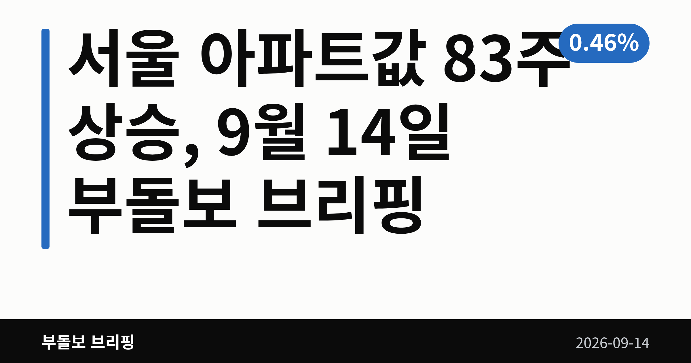
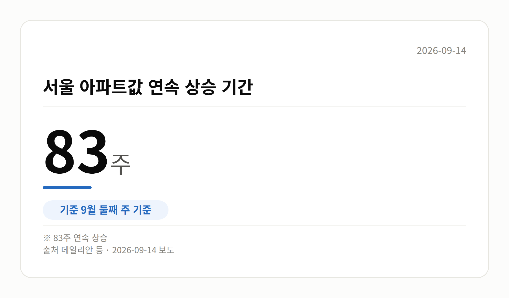
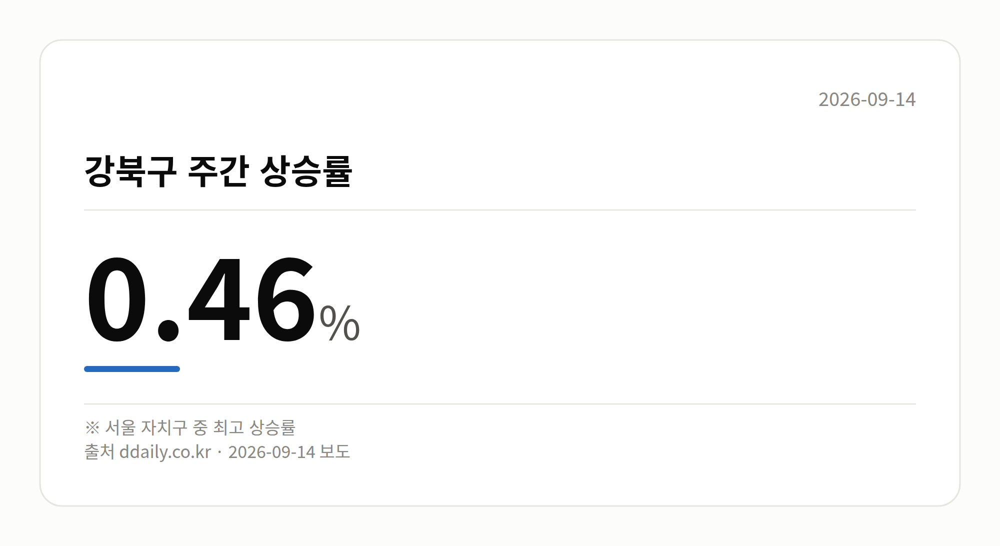
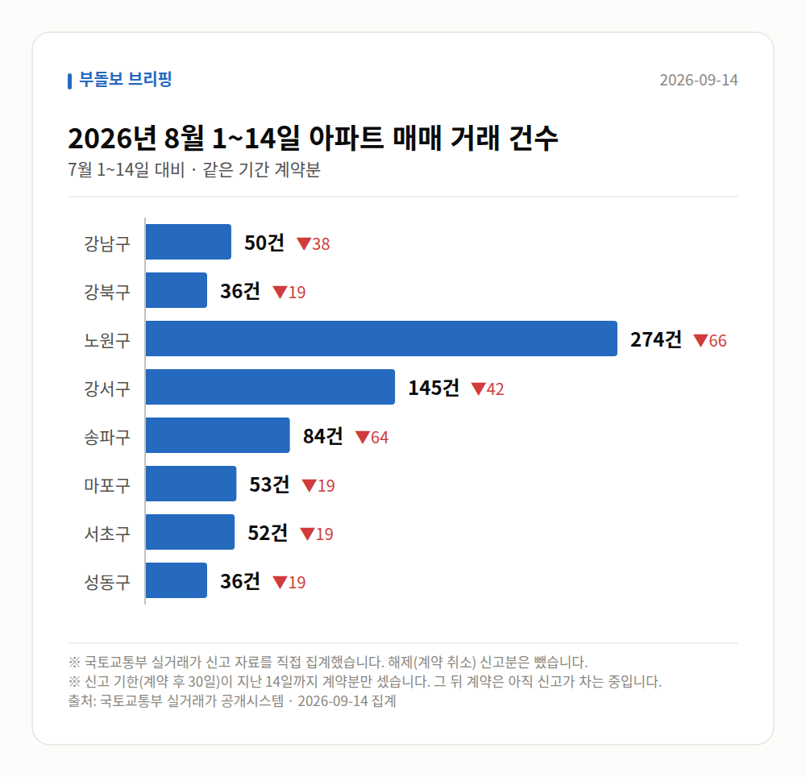

*이 글은 2026년 9월 14일 기준으로 정리한 내용입니다. 실거래 거래 건수는 2026년 8월 1~14일 계약분(신고 기한이 지난 것), 전세가율 등은 2026년 7월 신고분입니다.*
**3줄 요약**

- 서울 아파트값이 83주 연속 올라 최장 기록에 근접했습니다
- 강북구 0.46%로 자치구 1위, 강남3구는 하락 보도됐습니다
- 다음 주 부동산원 주간 동향에서 85주 경신 여부를 보세요
서울 아파트값 83주 상승, 문재인 정부 때 세운 최장 기록 85주까지 2주 남았습니다.

이번 주 상승률 1위는 강남이 아니라 강북구였습니다. 오름세가 중저가 지역으로 번지고 있다는 신호입니다.

## 서울 아파트값 83주 상승, 이번 주는 강북구가 1위

9월 둘째 주 기준으로 서울 아파트값은 83주째 올랐습니다. 자치구 가운데 강북구가 0.46%로 가장 높은 상승률을 기록했습니다.

강북구 미아동은 '10억원 시대'에 들어섰다고 보도됐습니다. 반면 강남3구는 하락한 것으로 전해졌습니다.

| 항목 | 수치 | 출처 |
|---|---|---|
| 서울 아파트값 연속 상승 | 83주 | 데일리안 등 |
| 문재인 정부 최장 기록 | 85주 | 여러 매체 |
| 강북구 주간 상승률 | 0.46% | ddaily.co.kr |

서울 전체가 한 방향으로 움직이는 게 아니라는 뜻입니다. 그동안 상대적으로 가격이 낮았던 지역으로 오름세가 옮겨가는 모습입니다.

## 83주와 86주, 숫자가 서로 다릅니다

오세훈 서울시장은 서울 아파트값이 86주 연속 올라 문재인 정부 최장 기록을 이미 넘어섰다고 밝혔습니다. 상승률도 노무현·문재인 정부를 넘어섰다고 언급했습니다.

언론 통계는 83주, 시장 발언은 86주입니다. 어떤 산정 기준을 따른 것인지 자료상 확인되지 않으니, 숫자를 볼 때 출처를 함께 보시는 편이 안전합니다.

오 시장은 공급·대출·세금 등 부동산 정책을 전면 재검토해야 한다며 "피해는 평범한 시민들이 받고 있다"고 했습니다.

## 서울 아파트값 83주 상승의 배경으로 지목된 것

입주 절벽(새 아파트 입주 물량이 크게 줄어드는 시기)과 전세난이 겹치며 매매가를 밀어올렸다는 진단이 나옵니다.

YTN은 '정책 수단 한계'라는 진단을 제목으로 실었습니다. 다만 본문 내용이 제공되지 않아 구체적인 근거까지는 확인되지 않았습니다.

서울 대체지로 꼽히던 인천도 사정이 다르지 않습니다. 인천 아파트 분양가는 1년 새 1억1000만원 올라 3.3㎡당 2000만원을 넘어섰습니다.

[이미지: 인천 신축 아파트 단지 전경 사진]

## 그 밖의 오늘 소식

- 강남3구 아파트값은 하락한 것으로 보도됐습니다.
- 매일경제는 '집살 돈은 넘쳐난다'는 제목으로 전했습니다.
- 산경투데이는 중저가 지역으로 오름세가 번졌다고 보도했습니다.
- 서울 전월세 매물 부족이 인천행 수요의 배경으로 꼽혔습니다.

## 오늘의 체크포인트

1. 서울 아파트값 83주 상승, 최장 기록 85주까지 2주 남았습니다.
2. 강북구가 0.46%로 자치구 1위, 강남3구는 하락 보도됐습니다.
3. 다음 주 한국부동산원 주간 동향에서 기록 경신 여부를 보시면 됩니다.

**그래서 나는?**

- 무주택 실수요자라면, 강북 등 중저가 지역 가격대부터 다시 확인해 보세요
- 전세 계약을 앞뒀다면, 입주 물량 감소가 재계약 조건에 영향을 줄 수 있습니다
- 인천 청약을 보고 계셨다면, 1년 새 오른 분양가 기준을 먼저 확인해 보세요

**직접 센 숫자 — 2026년 8월 1~14일 아파트 실거래**

서울 8개 구 계약 매매 **730건** (7월 1~14일 1016건, -286건)

거래가 많은 곳: 강남구 50건(-38) · 강북구 36건(-19) · 노원구 274건(-66)

신고 기한(계약 후 30일)이 지난 14일까지 계약분끼리 견줬습니다.

강남구 전세가율 가운뎃값 **38.8%** (같은 단지·같은 면적 44곳)

서울 25개 구 가운데 거래가 가장 크게 움직인 곳: 중랑구 -81.1%(376→71건, 7월 1~14일엔 묵동에 79.0% 몰렸음) · 영등포구 -48.8%(125→64건)

2026년 8월 계약 신고가

- 강서구 마곡서광(치현마을) 84.93㎡ — 7.6억 (이전 최고 6.0억, +26.7%, 8월 30일 계약)
- 강북구 대우 84.93㎡ — 7.5억 (이전 최고 6.2억, +21.8%, 8월 26일 계약)

*국토교통부 실거래가 신고 자료를 직접 집계했습니다. 해제 신고분은 뺐습니다.*
**여러분이 보고 계신 동네는 이번 상승세 안에 있나요, 밖에 있나요?**

---

### 참고한 기사

1. **서울 집값 83주째 상승…文정부 ‘85주 최장 기록’ 턱밑**
   - [데일리안](https://news.google.com/rss/articles/CBMigwJBVV95cUxOdG5JcWpyWUZWLU9IcGc0Rkl5SnZrOWl3Q1hCckVRUnlDSjB0T2FaLUx6X2VZN3UwYmtJZngtd1V1NFRwdUpnOXpJUTZ0Ukh1anNhMTBTUFpoWUp5MUFVdjNQU093dUpYYkZfeDAwVnUwQUN6VkhFYk9EM28xVHdweFB4TmNjb0t5UHNYNDYtNVNEV0pKeHVjZThmZnk5Qlhpb1hvUnk5NWU2NnRMM1ZqUHdjRWZHeC1oMEhMcE9ORW04Y3Jia2JHbVZuMkpOVi1Sb2RGeGxZd1JKV052Y1ZKNERrZVltUDQ1d0t5c2RzWUJ5NFZTT1pQRmhTcHF3NjR5eTRF?oc=5)
   - [한겨레](https://news.google.com/rss/articles/CBMiaEFVX3lxTE9LTnM0aGlkbFZ1Z1FQWFNiamEtcjJIaV9ua0ZSeEtIT1oxdlM3d0stYVZrT0M2S1hFNEgyekM0X1gtaWNmaU0xc2V0MFJHSnVvNmhyZkl4WEJETXJqTHVXV1pveW0tYlRR?oc=5)
   - [v.daum.net](https://news.google.com/rss/articles/CBMiT0FVX3lxTE5sN01CTjVaRXRtSVhSRXN6UjRMNGlXZDVvWUNoTnNiUEdEb0xramFVNWU3Yzg0WGpPZjUzbFVXeU5DMmw1c2k5TS1hWjl3cU0?oc=5)
   - [v.daum.net](https://news.google.com/rss/articles/CBMiVEFVX3lxTE94ZzlDY3B1cWttcEZ6T0djeWZIMV83R09RYmxMYnl5VVNUVWIzQlNMNlA2aVdCY1VqZDJLbWVqeGVhYlh6T2dfY2hlTk51a0plbkhMdw?oc=5)
2. **입주 절벽에 전세난 덮쳤다…'83주 연속 상승' 서울 아파트값, 역대 최장 기록 깬다**
   - [파이낸셜포스트](https://news.google.com/rss/articles/CBMidEFVX3lxTE5UcDhMMWlwbEVwUDFNUjdzbXVjNTNValZ2cXczZU15QTVObDR1OE1nZnRROXRxQjFpMUlHRUNmRU9MU2o4RXEtVkVVNjhUWUZNcVJYYTdEZktXb1FoS0s2aHJDbjliaFlhMlpWT3o3YkJBVmpa?oc=5)
   - [자유일보](https://news.google.com/rss/articles/CBMib0FVX3lxTE00cGZkNFh3Tmk2bmt5bEtlaEw4Ynk3OHZNOGxOZ29OUTRQTTdfSmhBV2o4c0NQMzlpandnMlJrQWktUUo3T0thdExjU25Bc3l5eHBJT3k0ajVOdXpLZTZNaWVtUlhuNXc4NzZIbHR1aw?oc=5)
   - [비즈니스포스트](https://news.google.com/rss/articles/CBMic0FVX3lxTE05ckZtd1JuME5oZEZhSWVUMFo3cl9UcVNxTnBfempzcTdWX19yRHhBVWJUTXBXTTNBcFNPT0hZdHEtbE8wMDUwMUd0cVVvRW1xalFsS1RvNkRzRTc3TkJ4WnRkSGtjeHFjUlNCTnQyQVdqRDQ?oc=5)
   - [dt.co.kr](https://news.google.com/rss/articles/CBMiTkFVX3lxTE5seG1lOHl6cWhfdU1fQXU2ZldkV3l3VDJ3ZmQ3WEphT3FDa3M4cXJSTjhmRWs1X0FDUU0tSGhqZnVjYkdmRFZjMTRKMEJqUQ?oc=5)
3. **"서울 집값 못 버텨 인천 갔더니"…분양가 1년 새 1억1000만원 뛰었다**
   - [네이트](https://news.google.com/rss/articles/CBMiU0FVX3lxTE1rdEVud3R3NUY1eHZKSlhDdzhOWE5ndWN2Y0RNWm41aFpObWtuUWlNZlJLcHF1cGRueDBkZnRHMmoxZ2wxY3dDb19fTnAta0k0bWxz?oc=5)
   - [매일경제·부동산](https://www.mk.co.kr/news/realestate/12151248)
4. **오세훈 “서울 집값 86주 연속 상승…부동산 정책 전면 재검토해야”**
   - [전국매일신문](https://news.google.com/rss/articles/CBMibkFVX3lxTE9ZenpqTnk0UVRuYzJYeWpiemR0VExHb2VHYVJBSmhkbjFmbDhiTHdBYVliT3BhN0dRcF81OWhMX0NwNlIzYzNiOFVvVk8zdHJXdUdhcHQzaDkzNThlNTkwakJnWVdxaUloZWxJYzRB?oc=5)
   - [펜앤마이크](https://news.google.com/rss/articles/CBMia0FVX3lxTE9XV2tqMUYtUWlrTVlubmlqejR5N1JqdUgzVnRranZvM3NRQ2Naeko0T0x3NEduc2NhRTdPNzNPblA5WWh3QWMwQWQ5dXlpNUk4SXh6aTFqbEZUQld2UkVmRWRVdmZtQVBWeUhz0gFvQVVfeXFMTWVhSFd1VFZuclJ5LUwtanZwbHpsN2RqUk5UQ0xHcnQxbUhvN0hyUEIwbGw1M2RWX2pMNjFxbzBWcHV4VXpfcTNIODhTSG9pTmNha3BmUTV2bElfV2VBc093MmRacWFyNlh5Z2xZZWhR?oc=5)
   - [v.daum.net](https://news.google.com/rss/articles/CBMiVEFVX3lxTE9NQUlqOGtsT2tjcUI0a0RqbGRFRkstQ0FXLWZWelZzVjhKN0Ezc3hvazMxdVJweFIyR1VxRUFrMjBEWnhacDdjTm5IcnpiNjA5SEhwSA?oc=5)
   - [v.daum.net](https://news.google.com/rss/articles/CBMiRkFVX3lxTE9WOE8tSVk5TTNacXZBaVZrYW9qT2VtSlZDVWJGTTNoR2Nwd0ZQVUxnZ0hIZVpCa09ZVkpQMnFYRjVZT2JXQ1E?oc=5)
5. **서울 아파트 역대 최장 상승 눈앞...정책 수단 한계**
   - [YTN](https://news.google.com/rss/articles/CBMidkFVX3lxTE43anN2OVZzOHZMSWRLc084UWZFa05LRzVhSWlTTHl5QW9vLWhGNDByeVBnOVFINFZFUW0yaXBvVkFJZzlvdHlnZ0JNMWpLczQ0NnBncWpjRkxEOUtGMnY1VTFoSlZ0aGNodUY2VjBJc3FnUlpoS1E?oc=5)
   - [진일보](https://news.google.com/rss/articles/CBMib0FVX3lxTE9WZTNIczZLb1d0YU9OMkRZV1ROWFVUUzdqaV92VGQta29NNUx6TG9BYTlHSmhscTNWXzRlX0szYVNjRUp0R3FrTkxBOTNNT2tOcDI2aVExcElTbVNmYU8tdE13ZjRMQzlCdVFMemFEYw?oc=5)
   - [연합뉴스](https://news.google.com/rss/articles/CBMiYEFVX3lxTE5RcTI1YmRHeXFHS0NZU3hucXBNTnlQSWxPRmlfRWlUYjNZQkFaX2ZqTVV0a1VSb2NLNkl5T1h6ZUZXM0JGR2FZeWdzUU03c2U3VDVVWXZyNjB2LVI0Tm8zbtIBYEFVX3lxTE5RcTI1YmRHeXFHS0NZU3hucXBNTnlQSWxPRmlfRWlUYjNZQkFaX2ZqTVV0a1VSb2NLNkl5T1h6ZUZXM0JGR2FZeWdzUU03c2U3VDVVWXZyNjB2LVI0Tm8zbg?oc=5)
   - [천지일보](https://news.google.com/rss/articles/CBMiakFVX3lxTE05ZzFVVXk2RVVPTDRCV1JRbmZLM1lmWTBoUy12VGo4NlYxU1QxSXpJalY4RDdYYk14OEl2SExFMV9TbmtmZ2ZFcmNLSXRWRVBYOS1wSl81MVZIVG5rTHQ4TkpPbFBxV29FVEE?oc=5)

---

*본 글은 공개된 언론 보도를 정리한 것이며, 투자 판단의 책임은 이용자 본인에게 있습니다.*
