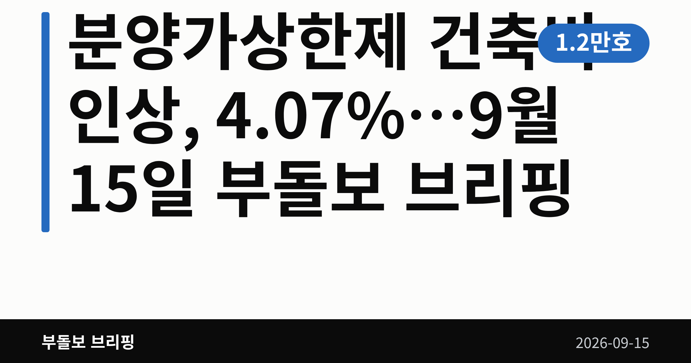
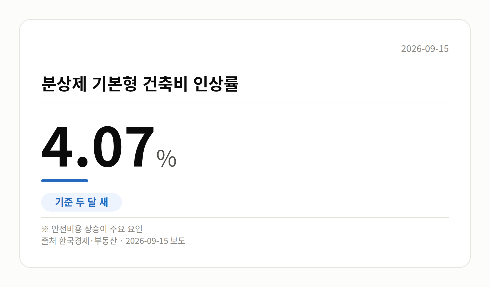
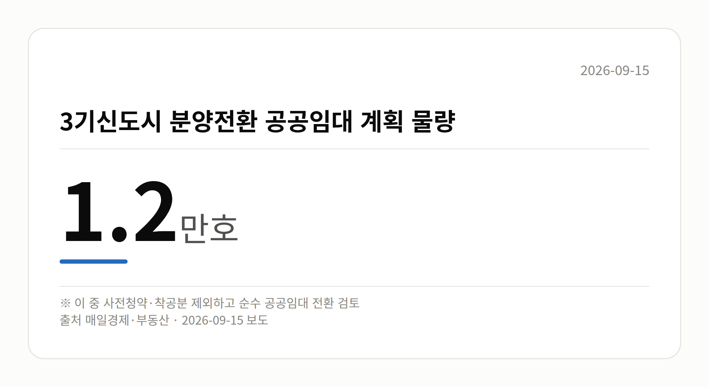

*이 글은 2026년 9월 15일 기준으로 정리한 내용입니다. 실거래 거래 건수는 2026년 8월 1~15일 계약분(신고 기한이 지난 것), 전세가율 등은 2026년 7월 신고분입니다.*
**3줄 요약**

- 분양가상한제 건축비 인상이 두 달 새 4.07%로 확정 수순입니다.
- 강남·서초·송파·용산과 3기 신도시 공공분양에 적용됩니다.
- 청약 대기자라면 분양가 산정 항목부터 확인해 보세요.
오늘 부동산 소식의 중심은 **분양가상한제 건축비 인상**입니다. 두 달 새 4.07% 오르는 것으로 나타났습니다.

적용 대상은 강남·서초·송파·용산 등 서울 핵심 지역과 3기 신도시 공공분양입니다. 청약을 준비 중이시라면 눈여겨보실 대목입니다.

## 분양가상한제 건축비 인상, 숫자로 보면

분양가상한제는 아파트 분양가를 땅값과 건축비를 더한 금액 아래로 제한하는 제도입니다. 그 건축비의 기준이 되는 값이 '기본형 건축비'입니다.

이번에 발표된 수치는 아래와 같습니다.

| 항목 | 내용 |
| --- | --- |
| 인상률 | 4.07% (두 달 새) |
| 배경 | 재해방지 등 안전비용 증가 |
| 적용 | 강남·서초·송파·용산, 3기 신도시 공공분양 |

출처는 한국경제·매일경제 부동산 보도입니다. 다만 한국경제 기사는 본문 요약이 제공되지 않아, 이 상승률 외 세부 내용은 확인되지 않았습니다.

## 분양가상한제 건축비 인상이 청약자에게 뜻하는 것

건축비 기준이 오르면 분양가상한제가 적용되는 민간·공공 아파트의 분양가도 함께 영향을 받을 수 있습니다.

즉 앞서 본 인상 폭만큼 곧바로 분양가가 오른다고 단정할 수는 없지만, 실수요자의 자금 부담이 커질 가능성은 열려 있습니다.

여러분이 해당 지역 청약을 준비하고 계신다면, 관심 단지의 모집공고에서 건축비 산정 기준이 언제 것으로 적용됐는지부터 확인해 보시는 편이 좋겠습니다.

[이미지: 아파트 건설 현장과 타워크레인 모습]

## 3기 신도시 분양전환 임대는 어떻게 되나

홍지선 국토교통부 장관 후보자는 인사청문회에서, 3기 신도시 분양전환 공공임대 계획 물량 1.2만호 가운데 일부를 순수 공공임대주택으로 돌리는 방안을 검토하겠다고 밝혔습니다.

분양전환 공공임대는 일정 기간 임대로 살다가 분양을 받을 수 있는 유형입니다. 순수 공공임대로 바뀌면 그 기회는 줄어들 수 있습니다.

다만 사전청약·착공 물량은 제외하는 방향으로 검토 중이며, 전환 대상의 정확한 규모와 지역별 계획은 아직 공개되지 않았습니다.

## 그 밖의 오늘 소식

- 홍 후보자, 고가·비거주 주택 세제개편 방향에 공감 표명
- 홍 후보자, 실수요자 우선공급·재건축 규제완화 필요성 언급
- 성북·동대문, 광명·수지 등 서울과 가격 격차 좁히는 '키 맞추기'
- 직방 분석, 광명은 서울 평균보다 비싸진 것으로 나타나
- 중랑구 신내6대주 49.77㎡, 7억 1,000만원 최근 3년 신고가
- 종로구 창신쌍용2 64.66㎡, 8억9000만원 최근 3년 신고가
- 중랑구 신내동 동성3 59.4㎡, 6억5000만원 최근 3년 신고가

## 오늘의 체크포인트

1. 분양가상한제 건축비 인상률은 두 달 새 4.07%, 안전비용 증가가 배경입니다.
2. 3기 신도시 분양전환 임대 1.2만호 중 일부는 순수 공공임대 전환이 검토됩니다.
3. 중랑·종로 신고가와 수도권 키 맞추기로 상승 압력 신호가 감지된다는 해석이 나옵니다.

**그래서 나는?**

- 청약 대기자라면, 분양가 산정 기준 변경 시점부터 확인해 보세요.
- 3기 신도시 임대 입주 예정자라면, 분양전환 여부 공고를 살펴보세요.
- 중랑·종로 매수 희망자라면, 인근 실거래가를 함께 비교해 보세요.

**직접 센 숫자 — 2026년 8월 1~15일 아파트 실거래**

서울 8개 구 계약 매매 **550건** (7월 1~15일 1134건, -584건)

거래가 많은 곳: 성북구 100건(-64) · 동대문구 86건(-32) · 중랑구 78건(-307)

신고 기한(계약 후 30일)이 지난 15일까지 계약분끼리 견줬습니다.

중랑구 전세가율 가운뎃값 **62.0%** (같은 단지·같은 면적 35곳)

서울 25개 구 가운데 거래가 가장 크게 움직인 곳: 중랑구 -79.7%(385→78건, 7월 1~15일엔 묵동에 77.4% 몰렸음) · 영등포구 -49.2%(132→67건)

2026년 8~9월 계약 신고가

- 중랑구 극동늘푸른 84.08㎡ — 8.2억 (이전 최고 4.8억, +71.9%, 8월 15일 계약)
- 중랑구 엘지,쌍용아파트 84.67㎡ — 9.3억 (이전 최고 7.5억, +23.6%, 9월 2일 계약)

*국토교통부 실거래가 신고 자료를 직접 집계했습니다. 해제 신고분은 뺐습니다.*

**오늘 나온 정부 발표 원문**

- [분양가상한제 기본형건축비 9월 정기고시](https://www.korea.kr/briefing/pressReleaseView.do?newsId=156781511) (국토교통부 2026-09-14)
  - 첨부 [260915(조간) 분양가상한제 기본형건축비 9월 정기고시(주택정책과).](https://www.korea.kr/common/download.do?fileId=198551799&tblKey=GMN) · [260915(조간) 분양가상한제 기본형건축비 9월 정기고시(주택정책과).](https://www.korea.kr/common/download.do?fileId=198551800&tblKey=GMN)
**여러분이 관심을 두고 계신 단지는 분양가상한제 적용 지역인가요, 아닌가요?**

---

### 참고한 기사

1. **홍지선 "부동산 세제 개편 방향 공감...재건축 규제 완화는 필요"**
   - [news.jtbc.co.kr](https://news.google.com/rss/articles/CBMiVEFVX3lxTE9wcE9MM0N0SzM1YV9MZ1lIcERpQm5nVVJvaXhKcDBDRGxkUVpKNG5qOUZkMlFDMHJOUDFWY0ZNMmQ3T1E4VHJ3WE5TMzRSM0tEVUM0Yg?oc=5)
   - [서울파이낸스](https://news.google.com/rss/articles/CBMiakFVX3lxTE9DelFGQ182Zy1ZbjBQYVM2UGx3bkZGRlV6NnJUc2hFTTFkOVkyTnFkZ285dXAtalpscHVSVkhLNUFpVlZHUTc5aEE2anQ1VWJmdjY4VzZpWF8xc05TTUhIa0ZYU01KUU9PY3c?oc=5)
   - [v.daum.net](https://news.google.com/rss/articles/CBMiVEFVX3lxTE05Wkw0TnFOUHN6a0FkbTgwMnBQRm5PU3JxOVFQUzdydXVhYlFvWV92UHVsbHNBZ3BqMDBpTndwLWx6OUJQTHdWbWVqcFdCaUxSd01FeQ?oc=5)
   - [더팩트](https://news.google.com/rss/articles/CBMiWkFVX3lxTE4yYUNlV0VKbVlQcFBpbkcxOFYtRjBoUXc2WDlJUVdqRlhwTnZ4LTVKTjZnVURaZk1SU1BWb0REY1h1S0dzTXdxYnRMUmU2aEpvaUwwTERKb012Z9IBVEFVX3lxTE9PVzUyMnY4SE4xckRPVDlHVkE0LVl2WUtOOWl6MFhUMDFrM0x6OGdYemhiQ3lXYUpJT1gxOVNtLVRHcmNYREREeS1sZXNoVmlPc1pOTw?oc=5)
2. **3기신도시 분양전환 임대 확 줄인다**
   - [매일경제·부동산](https://www.mk.co.kr/news/realestate/12152316)
   - [매일경제·부동산](https://www.mk.co.kr/news/realestate/12152093)
3. **재해방지 안전비용 늘자 … 분상제 건축비도 '껑충'**
   - [매일경제·부동산](https://www.mk.co.kr/news/realestate/12152317)
   - [한국경제·부동산](https://www.hankyung.com/article/202609142759i)
4. **성북·동대문부터 광명·수지까지…수도권 집값 '키 맞추기' 본격화**
   - [데일리안](https://news.google.com/rss/articles/CBMirgJBVV95cUxQVUpfbmhjTThBS2FNa0JiU3RSTm5ZY21PTVRZU2N1M3gwbEpWZTZCTVVibGtoNGVlcDhKWFBTUWtwNUZBeGRmanhacWFMLXU3NUlGM21JdEJzTmtpMk9waTZnVUd6NmlFcU9hSjVxTGh6bFhOTmVyQ3dxQ2NsakFuVFM2NXdqVVRQck1Oelg0UFRHRXlsVzgwRGt2emYyelhhd3dIcC1ZRjRQeEh0cUs1d25WRnBCZFFUajUwTklGQzlrZ2JWdVlyUzRrYldfSkNwZWE5aFBTZmhSNnJkS1dMTE9YY09oNXNjbzcyek1YY2VrWGVMY0VoM2UzWG0zcTFSMXE0NXJtTVNYTWFIMTFySWdqYnRnNE96cWR2bFN6TnU5cDZMOGVRZE9keWdUZw?oc=5)
   - [metroseoul.co.kr](https://news.google.com/rss/articles/CBMiYEFVX3lxTE41WHRWZk9jVjZVeWZhckJrbDliVjZrQ2t3S2d0X0c4M2NwREt6Yy1pNGJIUWFjZGttZHlzSVlHZDhjTmJ3cmUycWg5LUxMUWJXYlZLa3BGNV9wc3dkOTFONA?oc=5)
   - [매일경제·부동산](https://www.mk.co.kr/news/realestate/12151827)
   - [뉴시스](https://news.google.com/rss/articles/CBMieEFVX3lxTE1rNEhjcExhR1NkZjVsMmVpMEQ1ZDZnVE01cGloRktVSXRxLUFHeVVUcERBUENvaFJMYWlPYlNJZHVlMkxXYTFlSE5FLUVNNnJkNFJXVnNsMWtRZFlzTE5TMVJEZFJKRGFlYkJhNXVxN3F2TlNfVGNOdtIBeEFVX3lxTE1rNEhjcExhR1NkZjVsMmVpMEQ1ZDZnVE01cGloRktVSXRxLUFHeVVUcERBUENvaFJMYWlPYlNJZHVlMkxXYTFlSE5FLUVNNnJkNFJXVnNsMWtRZFlzTE5TMVJEZFJKRGFlYkJhNXVxN3F2TlNfVGNOdg?oc=5)
5. **중랑구 신내6대주 49.77㎡ 7억 1,000만 원 거래…최근 3년 신고가**
   - [매일경제·부동산](https://www.mk.co.kr/news/realestate/12152422)
   - [매일경제·부동산](https://www.mk.co.kr/news/realestate/12152419)
   - [매일경제·부동산](https://www.mk.co.kr/news/realestate/12152421)

---

*본 글은 공개된 언론 보도를 정리한 것이며, 투자 판단의 책임은 이용자 본인에게 있습니다.*
