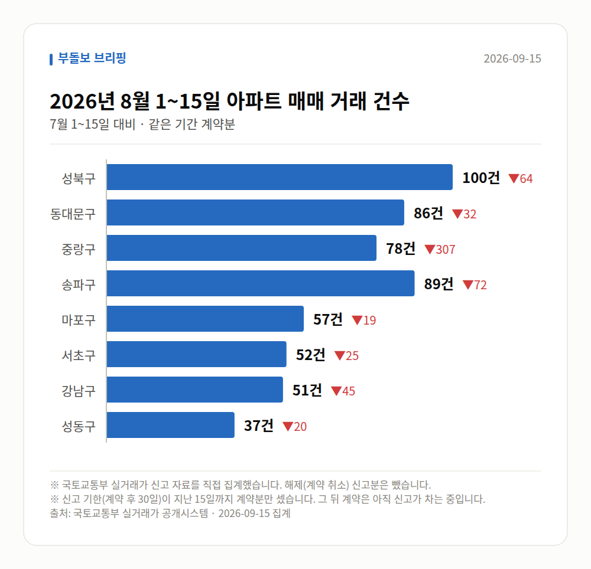
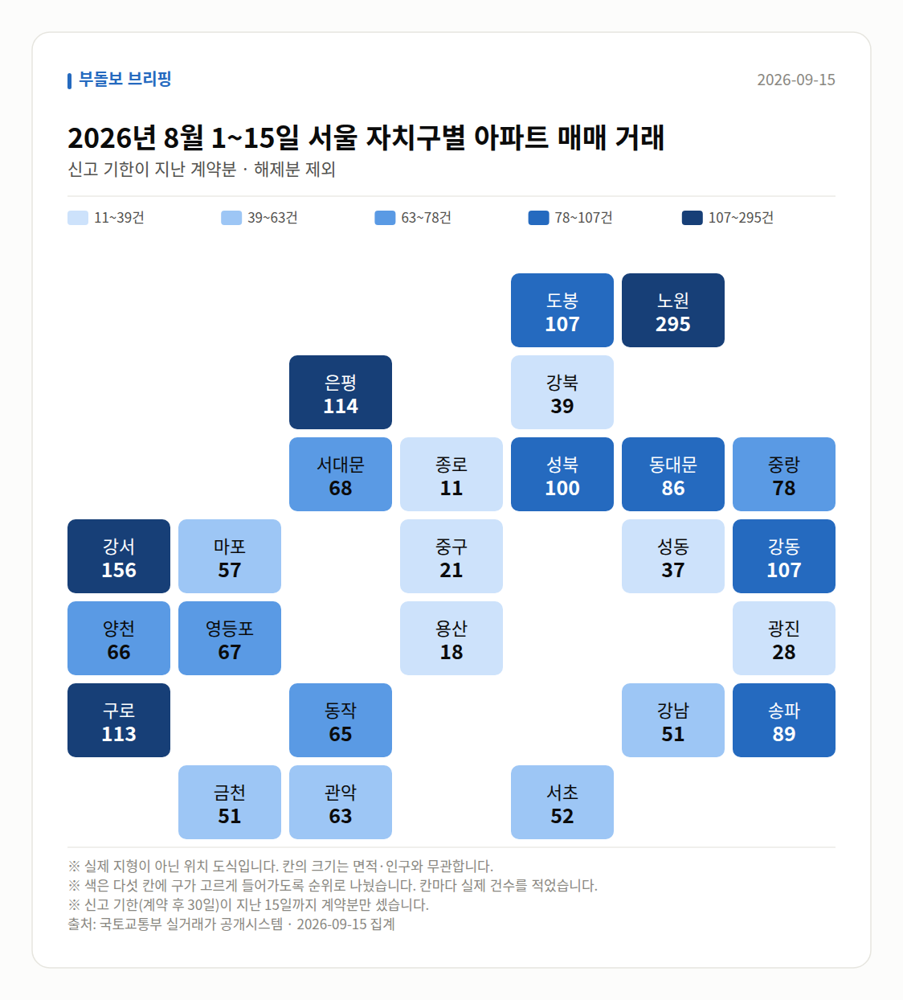
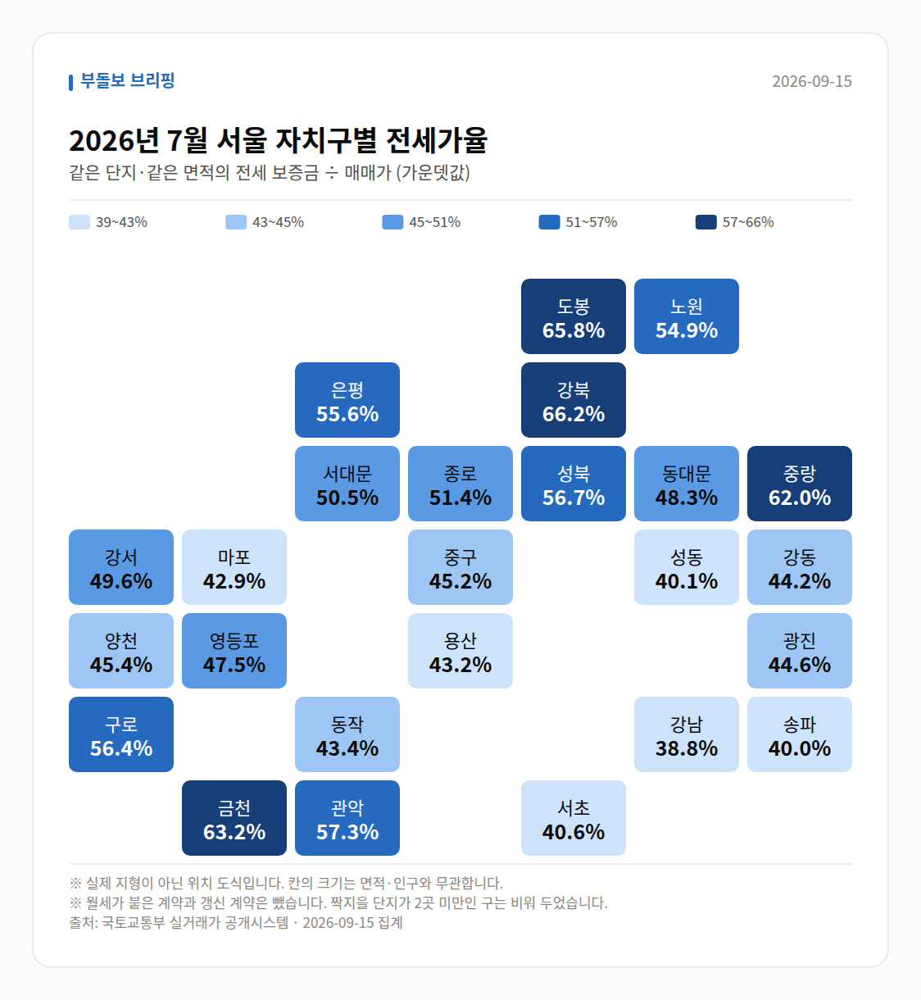
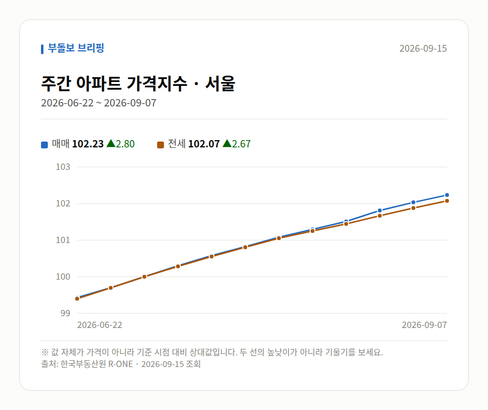
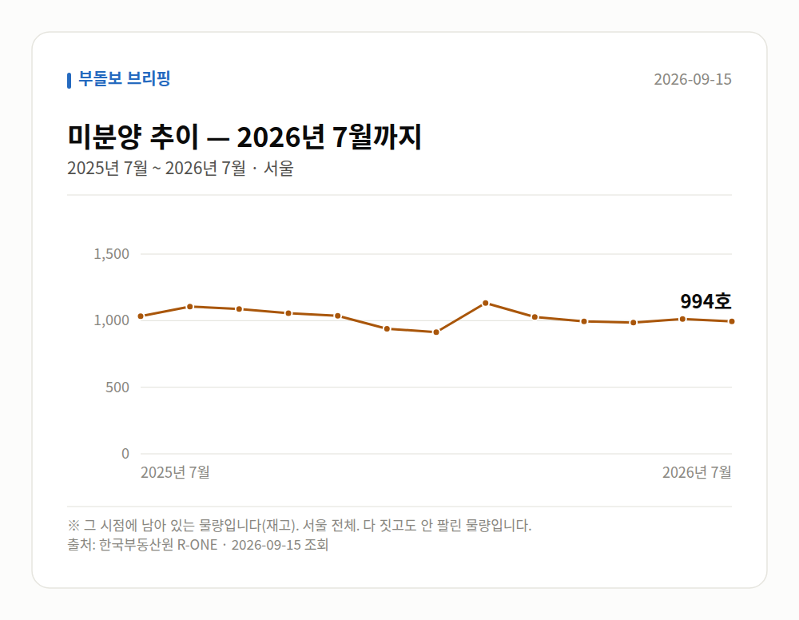

# 실거래가로 본 2026년 8월 1~15일

정부가 받은 **아파트 매매 신고 자료**를 그대로 집계한 것입니다. 기사에 실린 수치가 아니라
국토교통부 실거래가 자료를 직접 받아 셌습니다. 계약 후 30일 안에 신고하므로,
**거래 건수는 신고 기한이 지난 날짜까지만** 셉니다 — 2026년 8월 1~15일 계약분을 7월 1~15일과 견줬습니다.
달 전체를 세면 아직 신고가 차는 중이라 거래가 급감한 것처럼 보여서입니다.
전세가율·월세·면적대는 표본이 작아지지 않게 **신고가 다 들어온 2026년 7월** 을 봅니다.
단, 아래 **눈에 띄는 거래(신고가)** 는 한 건씩 보는 것이라 **2026년 8~9월 계약분**까지 봅니다.

**2026년 8월 1~15일 전체 550건** · 7월 1~15일 1134건 (-584건)

| 지역 | 거래 건수 | 7월 1~15일 대비 | 평균 거래가 | 가장 비싼 거래 |
| --- | ---: | ---: | ---: | --- |
| 성북구 | 100건 | -64 | 10.1억 | 래미안길음센터피스 19.1억 (84.95㎡) |
| 동대문구 | 86건 | -32 | 11.2억 | 래미안크레시티 19.4억 (121.93㎡) |
| 중랑구 | 78건 | -307 | 7.0억 | 사가정센트럴아이파크 18.0억 (114.85㎡) |
| 송파구 | 89건 | -72 | 22.9억 | 주공아파트 5단지 45.8억 (82.61㎡) |
| 마포구 | 57건 | -19 | 14.5억 | 마포래미안푸르지오2단지 26.1억 (84.39㎡) |
| 서초구 | 52건 | -25 | 27.0억 | 래미안퍼스티지 91.0억 (222.76㎡) |
| 강남구 | 51건 | -45 | 29.4억 | 현대1차(12,13,21,22,31,32,33동) 80.0억 (161.18㎡) |
| 성동구 | 37건 | -20 | 19.5억 | 갤러리아포레 92.0억 (217.86㎡) |

## 서울 전체 지도

표에 올린 곳 말고 **스물다섯 개 구 전부**를 한 번씩 세어 칠했습니다.
색은 순위로 다섯 칸에 나눈 것이라, 짙다고 두 배가 아닙니다. 칸 안의 숫자를 보세요.

## 전세가율 지도

같은 도식에 전세가율을 칠했습니다. 짝지을 단지가 2곳 미만인 구는 비워 두었습니다.

## 거래가 크게 움직인 구

스물다섯 개 구를 다 세어 놓고 **7월 1~15일과 20% 이상 벌어진 곳**만 골랐습니다.
거래가 원래 적은 구는 몇 건만 움직여도 비율이 튀므로 40건 미만인 곳은 뺐습니다.

| 지역 | 2026년 8월 1~15일 | 7월 1~15일 | 차이 | 어디서 |
| --- | ---: | ---: | ---: | --- |
| 중랑구 | 78건 | 385건 | -79.7% | 7월 1~15일엔 묵동 298건 (77.4%) |
| 영등포구 | 67건 | 132건 | -49.2% | 고르게 퍼짐 |
| 양천구 | 66건 | 125건 | -47.2% | 7월 1~15일엔 신정동 57건 (45.6%) |
| 강남구 | 51건 | 96건 | -46.9% | 고르게 퍼짐 |

'어디서' 칸에 동네 이름이 있으면 구 전체가 아니라 **그 동네 한 곳이 움직인 것**입니다.
큰 단지 하나가 한꺼번에 신고되면 이렇게 보입니다.

## 어떤 크기가 팔렸나

평균 거래가 하나만 보면 **값이 오른 것**과 **비싼 것만 팔린 것**을 구별할 수 없습니다.
전용면적으로 갈라 보면 갈립니다. 85㎡ 가 국민주택규모입니다.

| 면적대 | 전용면적 | 거래 건수 | 비중 | 2026년 6월 비중 | 평균 거래가 |
| --- | --- | ---: | ---: | ---: | ---: |
| 소형 | 60㎡ 이하 | 928건 | 49.2% | 37.2% (+12.0%p) | 8.5억 |
| 중형 | 60~85㎡ | 669건 | 35.4% | 42.8% (-7.4%p) | 17.3억 |
| 중대형 | 85~135㎡ | 225건 | 11.9% | 14.6% (-2.7%p) | 22.2억 |
| 대형 | 135㎡ 초과 | 66건 | 3.5% | 5.5% (-2.0%p) | 45.8억 |

## 눈에 띄는 거래

**2026년 8~9월 계약분**(2026-09-15까지 신고된 것)을
그 앞 6개월 거래와 견줘 값이 크게 움직인 것만 골랐습니다.
같은 단지·같은 면적끼리만 비교했고, 지난 거래가 2건 미만이면 뺐습니다.
신고 기한(계약 후 30일)이 안 지난 거래도 들어 있어, 늦게 신고되는 거래가 더 붙을 수 있습니다.

| 구분 | 지역 | 단지 | 면적 | 계약일 | 이번 | 이전 | 차이 |
| --- | --- | --- | ---: | --- | ---: | ---: | ---: |
| 신고가 | 중랑구 | 극동늘푸른 | 84.08㎡ | 2026-08-15 | 8.2억 | 4.8억 | +71.9% |
| 신고가 | 중랑구 | 엘지,쌍용아파트 | 84.67㎡ | 2026-09-02 | 9.3억 | 7.5억 | +23.6% |
| 신고가 | 성북구 | 정릉우성아파트 101~105동 | 46.65㎡ | 2026-08-21 | 6.0억 | 5.0억 | +20.0% |
| 신고가 | 중랑구 | 신내11대명 | 39.76㎡ | 2026-08-15 | 5.0억 | 4.2억 | +18.3% |
| 신고가 | 마포구 | 중동계룡아파트 | 84.6㎡ | 2026-08-08 | 11.8억 | 10.0억 | +17.5% |

## 전세가율 (실제 거래로 계산)

같은 단지·같은 면적에서 그달 **전세 보증금 ÷ 매매가**입니다.
월세가 붙은 계약과 갱신 계약은 뺐습니다. 갱신은 종전 보증금을 따라가 시세보다 낮습니다.
지수가 아니라 실제 거래라 단지마다 편차가 큽니다. 가운뎃값을 먼저 보세요.

| 지역 | 중앙값 | 견준 단지 수 | 가장 높은 곳 |
| --- | ---: | ---: | --- |
| 중랑구 | 62.0% | 35곳 | 면목한신 80.0% (3.0억 / 전세 2.4억) |
| 성북구 | 56.7% | 55곳 | 대우 75.7% (3.7억 / 전세 2.8억) |
| 동대문구 | 48.3% | 38곳 | 이문휘경지웰에스테이트 88.5% (1.7억 / 전세 1.5억) |
| 송파구 | 40.0% | 76곳 | 석촌호수효성해링턴타워 92.3% (2.6억 / 전세 2.4억) |
| 강남구 | 38.8% | 44곳 | 파크힐 80.0% (8.5억 / 전세 6.8억) |
| 마포구 | 42.9% | 40곳 | 솔리스타 92.0% (1.6억 / 전세 1.5억) |
| 서초구 | 40.6% | 33곳 | 서초동삼성쉐르빌2 90.5% (2.9억 / 전세 2.6억) |
| 성동구 | 40.1% | 32곳 | 신성미소지움 51.4% (14.6억 / 전세 7.5억) |

## 전세와 월세의 비율

전세가율에서 뺀 월세 계약도 그 자체로 자료입니다. **비중**은 갱신까지 전부 셌고,
**보증금·월세 가운뎃값**은 신규 계약만 봤습니다 — 갱신은 종전 조건을 따라가 시세가 아닙니다.

| 지역 | 전월세 계약 | 월세 낀 계약 | 신규 전세 보증금 | 신규 월세 (보증금 / 월) |
| --- | ---: | ---: | ---: | --- |
| 중랑구 | 642건 | 443건 (69.0%) | 4.5억 | 9350만원 / 42만원 |
| 성북구 | 558건 | 241건 (43.2%) | 6.5억 | 1.13억 / 77만원 |
| 동대문구 | 764건 | 427건 (55.9%) | 4.8억 | 8800만원 / 54만원 |
| 송파구 | 1407건 | 642건 (45.6%) | 7.75억 | 2.02억 / 150만원 |
| 강남구 | 1373건 | 733건 (53.4%) | 9.0억 | 2.0억 / 169만원 |
| 마포구 | 759건 | 366건 (48.2%) | 6.9억 | 1.0억 / 136만원 |
| 서초구 | 1098건 | 520건 (47.4%) | 8.81억 | 3.0억 / 150만원 |
| 성동구 | 616건 | 266건 (43.2%) | 7.2억 | 1.4억 / 194만원 |

## 한국부동산원 주간 가격지수 (서울)

| 기준일 | 매매 | 전세 |
| --- | ---: | ---: |
| 2026-06-22 | 99.43 | 99.40 |
| 2026-06-29 | 99.70 | 99.70 |
| 2026-07-06 | 100.00 | 100.00 |
| 2026-07-13 | 100.30 | 100.28 |
| 2026-07-20 | 100.58 | 100.55 |
| 2026-07-27 | 100.82 | 100.80 |
| 2026-08-03 | 101.08 | 101.05 |
| 2026-08-10 | 101.29 | 101.25 |
| 2026-08-17 | 101.51 | 101.44 |
| 2026-08-24 | 101.81 | 101.67 |
| 2026-08-31 | 102.03 | 101.88 |
| 2026-09-07 | 102.23 | 102.07 |

## 공급 쪽 숫자 (앞으로 나올 물량)

여기까지의 숫자는 전부 **팔린 것**이었습니다. 이 절은 반대쪽입니다.
미분양은 다 짓고도 안 팔린 재고이고, 인허가·착공은 **1~2년 뒤 공급**을 말합니다.

| 항목 | 시점 | 값 | 전달 대비 | 성질 |
| --- | --- | ---: | ---: | --- |
| 미분양 | 2026년 7월 | 994호 | -19 | 재고 |
| 주택 인허가 | 2026년 7월 | 8,008호 | +6,378 | 그 달치(누계에서 되돌림) |
| 아파트 착공 | 2026년 7월 | 6,067호 | +3,930 | 그 달 실적 |

- **미분양** — 서울 전체. 다 짓고도 안 팔린 물량입니다.
- **주택 인허가** — 서울 합계(가구수 기준). 원자료가 연초부터의 누계라 그 달치로 되돌렸습니다.
- **아파트 착공** — 서울 민간분양.

발표가 두세 달 늦습니다. 거래·가격 수치와 시점이 다르니 견줄 때 주의하세요.

---

*출처: 국토교통부 실거래가 공개시스템(공공데이터포털), 한국부동산원 R-ONE.
평균은 그 달 신고분의 단순 평균이며 면적·층을 보정하지 않았습니다.
해제(계약 취소)로 신고된 건은 뺐습니다.*
