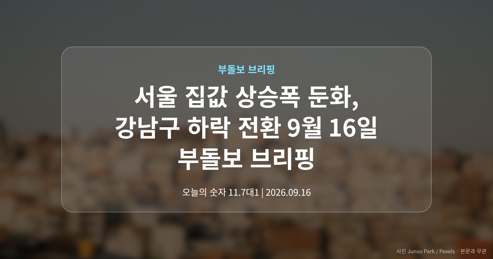
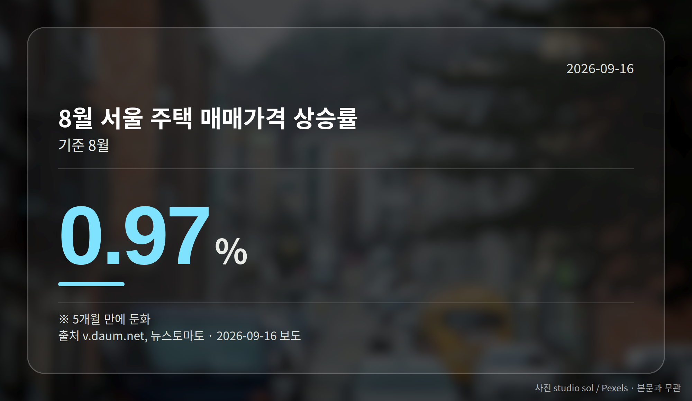
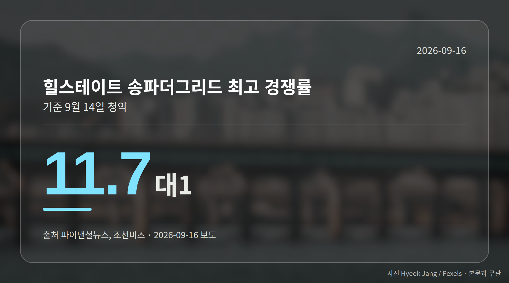
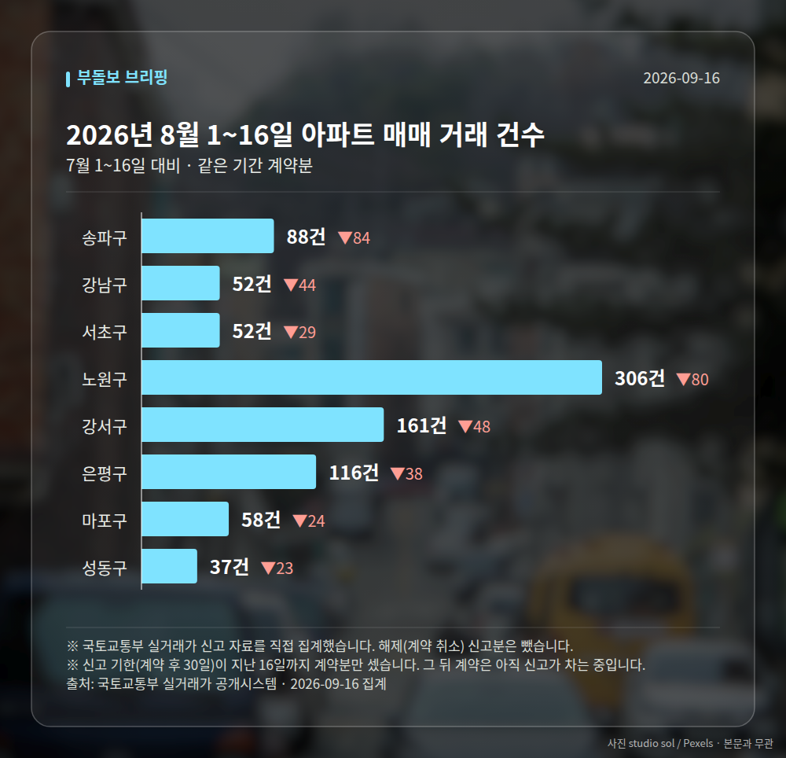

*이 글은 2026년 9월 16일 기준으로 정리한 내용입니다. 실거래 거래 건수는 2026년 8월 1~16일 계약분(신고 기한이 지난 것), 전세가율 등은 2026년 7월 신고분입니다.*
**3줄 요약**

- 8월 서울 주택 매매가격, 5개월 만에 상승폭이 줄었습니다
- 상승률 0.97%, 강남구는 0.18% 하락으로 방향을 바꿨습니다
- 세제개편 이후 강남과 외곽의 온도차를 함께 보셔야 합니다
8월 서울 집값 상승폭 둔화가 통계로 확인됐습니다. 서울 주택 매매가격은 0.97% 올랐지만, 상승폭이 커지던 흐름은 5개월 만에 꺾였습니다.

특히 그동안 오름세를 이끌던 강남구와 서초구가 하락으로 방향을 바꿨습니다. 오늘은 이 한 가지를 중심으로 정리해 드리겠습니다.

## 서울 집값 상승폭 둔화, 숫자는 이렇습니다

8월 서울 주택 매매가격(아파트·연립·단독을 모두 합친 가격)은 한 달 전보다 0.97% 올랐습니다. 여전히 오르긴 했지만, 상승폭 자체가 5개월 만에 줄었다는 점이 이번 발표의 핵심입니다.

같은 기간 강남구는 0.18% 내렸습니다. 서울 중위 주택 매매가격(가격순으로 줄 세웠을 때 한가운데 있는 값)은 8억원대에 들어선 것으로 보도됐습니다.

| 항목 | 수치 | 시점 |
| --- | --- | --- |
| 서울 주택 매매가격 상승률 | 0.97% | 8월 |
| 강남구 매매가 변동률 | -0.18% | 8월 |
| 서울 중위 주택 매매가격 | 8억원대 | 8월 |

## 강남은 내리고 외곽은 오른 이유

보도에 따르면 세제개편안 발표 이후 세 부담을 걱정하는 분위기가 강남권을 중심으로 번졌습니다. 이 과정에서 매수심리가 눌리며 하락 조짐이 나타났다는 설명입니다.

반면 서울 외곽지역은 매매가가 올랐습니다. 같은 서울 안에서도 지역별 온도차가 뚜렷해진 셈입니다.

다만 서초구가 얼마나 내렸는지에 대한 구체적인 수치는 공개된 자료에 나와 있지 않습니다. 앞서 본 강남구 수치만 확인된 상태라는 점을 감안해 주세요.

[이미지: 강남구 아파트 단지와 한강 전경]

## 서울 집값 상승폭 둔화, 무엇을 보면 될까요

한 달 치 통계만으로 흐름이 완전히 바뀌었다고 말하기는 이릅니다. 다음 달 발표에서 강남권 하락이 이어지는지, 외곽 상승세는 유지되는지를 함께 보는 편이 안전합니다.

정책 쪽도 변수입니다. 홍지선 국토부 장관 후보자의 인사청문회가 임박했고, 집값과 공급대책이 검증 대상이 될 것으로 보도됐습니다. 후보자의 '전세 효용이 낮다'는 취지의 발언을 두고 서민 주거사다리 논란도 제기된 상태입니다.

## 그 밖의 오늘 소식

- 대구 아파트 매매가 34개월째 하락, 하락폭은 축소
- 대구 전세가격은 3개월 연속 상승
- 힐스테이트 송파더그리드 최고 경쟁률 11.7대1

**그래서 나는?**

- 강남권 1주택자라면, 세 부담 변화가 호가에 어떻게 반영되는지 보세요
- 서울 외곽 실수요자라면, 상승 지역과 내 예산 구간을 다시 맞춰 보세요
- 대구 전세 세입자라면, 3개월 연속 상승한 전세 시세부터 확인해 보세요

**직접 센 숫자 — 2026년 8월 1~16일 아파트 실거래**

서울 8개 구 계약 매매 **870건** (7월 1~16일 1240건, -370건)

거래가 많은 곳: 송파구 88건(-84) · 강남구 52건(-44) · 서초구 52건(-29)

신고 기한(계약 후 30일)이 지난 16일까지 계약분끼리 견줬습니다.

송파구 전세가율 가운뎃값 **40.0%** (같은 단지·같은 면적 76곳)

서울 25개 구 가운데 거래가 가장 크게 움직인 곳: 중랑구 -79.5%(396→81건, 7월 1~16일엔 묵동에 75.8% 몰렸음) · 영등포구 -51.1%(139→68건)

2026년 8월 계약 신고가

- 강서구 마곡서광(치현마을) 84.93㎡ — 7.6억 (이전 최고 6.0억, +26.7%, 8월 30일 계약)
- 마포구 한화오벨리스크 79.9㎡ — 15.5억 (이전 최고 13.0억, +19.2%, 8월 29일 계약)

*국토교통부 실거래가 신고 자료를 직접 집계했습니다. 해제 신고분은 뺐습니다.*
**여러분이 지켜보는 동네는 지금 강남 쪽 흐름에 가깝나요, 아니면 외곽 쪽 흐름에 가깝나요?**

---

### 참고한 기사

1. **홍지선 국토장관 후보자 청문회…집값·공급대책 검증대 오른다**
   - [아이뉴스24](https://news.google.com/rss/articles/CBMiS0FVX3lxTE4zaldyd0hEWVlFb0RRcGgzMGNtQWdWWDEwMS1sQTFaNDlOel9ZLTJEQzYwQWx5ZWhBYjVSRGxQQUd5Q2dMVERnWjN3cw?oc=5)
   - [에너지경제신문](https://news.google.com/rss/articles/CBMiW0FVX3lxTE9yZ1R5cmJhdFdwbGdHekVwN2RURHNBNm5vYVp1N1puczFIcWwtb21mSEQ4M1kxNG1GekVJYzA2T3cwTEN0c2hZd1A3TXh0ZndMSi1YSE5qNFByQms?oc=5)
2. **송파 오피스텔에 3955건 몰렸다…'힐스테이트 송파더그리드' 최고 11.7대 1**
   - [파이낸셜뉴스](https://news.google.com/rss/articles/CBMiWkFVX3lxTFAtbDI2V1BHRVhIRFZQajJ0U2pkaHFxVUdWT0pNUjBkdWdtbzNHbS1Uc2VfWGpDdFpHRFdwOTFIMFJvOTViaUhiN2dXdHlsSmZUMXIzSXpUUVlLQQ?oc=5)
   - [조선비즈·부동산](https://biz.chosun.com/real_estate/real_estate_general/2026/09/15/5NAPNEWUA5GLRIJLBQOTOU5AGE)
3. **서울 집값 상승폭 5개월 만에 축소…강남·서초 하락 전환**
   - [천지일보](https://news.google.com/rss/articles/CBMiakFVX3lxTE9wVlBmelZsTHdSZEU1LXJVLVNvTGFsVVFweUk4VUYxbmtWQlltbUVJMkNIMTFJWHMtcWhDeUI1a2lVTDB3YXMtZ25UWldWa011NHRBNURIQ2pXRjlrYUhSSTY5WVc3TkJLbGc?oc=5)
   - [뉴시스](https://news.google.com/rss/articles/CBMiZkFVX3lxTE5WM0tRUGQyRXd2R2ZmczBNazJUSlFKZ2dMMzAxeWpnOWMwRDVBaXpYSFpEOWtaUWxkLVdvdEdLV1dfRkI5RldlczRYaHRxRHYtOUtrekFNbnU3Y0ZKbnlVbGkycG1KZw?oc=5)
4. **대구 아파트 값 34개월째 하락…전세는 3개월 연속 올라**
   - [뉴스1](https://news.google.com/rss/articles/CBMiX0FVX3lxTFBSNktyaFR0WlZnZEU4RlZkUVVlRUhpOWN4UFEyZ0hMNGlNWTZNclZUVVRYdC0xckdPU1dXOFBVRFZaUTFqYXN6NnRDWk1uLTlJVWQxQzk2ZWJMdkpQYzM00gFkQVVfeXFMUHNVZDdnMWhDQ3pWZHFnSXBWd0FrY2NSQTRWcEVVZkpfbVZIeVZHcDNHS1FhMGphTTdiVDFRVEh6SHRwZm85R0VjMEFkOE9zYklaNktYTXNZNHRpdV8tc0FTV3dDUg?oc=5)
   - [노컷뉴스](https://news.google.com/rss/articles/CBMiUkFVX3lxTFA2dzZnWExmbHZyS2V3cmxZZ3V5TzdvUHJZTk1FM3EwQU9BaGtJZjVEYmNnSl9QajNxU2N0OHFsMGpMdHpIQ0JHMkZ6OEY3NEFHUFE?oc=5)
5. **8월 서울 주택매매가격 상승률 5개월 만에 주춤, 강남↓외곽↑**
   - [뉴스토마토](https://news.google.com/rss/articles/CBMiYEFVX3lxTFBpbzAzOGxWN3llY1JGZFB4Vm1STHVOYmpkVi1lbk1POWE1S0g0Ykt5bGotd1ZEOWJDQWNEYXJvOE0tb1hwTUpaaEhZUkVXZ3lJOW1rZ2ZfdWh5WHdidHNUMw?oc=5)
   - [딜라이트닷넷](https://news.google.com/rss/articles/CBMibkFVX3lxTE1uTEVyZmEyaFUzdXNLbHFmS3RGQmI2X2Jzd0dSOEQwUElGTmxaQ2Z5MW5GYldEbTV0REFvSkcwNGVndEJOTE40cnZRdXRCYlVnQXVqeGZOX1V5bWZWUV9sdFZiYU1mWl8wZXV6VnlB0gFyQVVfeXFMTmt2Q1pPWWJwcl9NRV9ncW1NOGpEZXlodktjakVMLWdkY0R6bzgxb3JUVjVsNmFyRURuVUwzMXNCVUVqM0hSQkdrQi1rdi0wVkp2VFR2ems2S2NZeW81NV9nZjFnVlFpcFlLN3BtdDVvN2hR?oc=5)

---

*본 글은 공개된 언론 보도를 정리한 것이며, 투자 판단의 책임은 이용자 본인에게 있습니다.*
