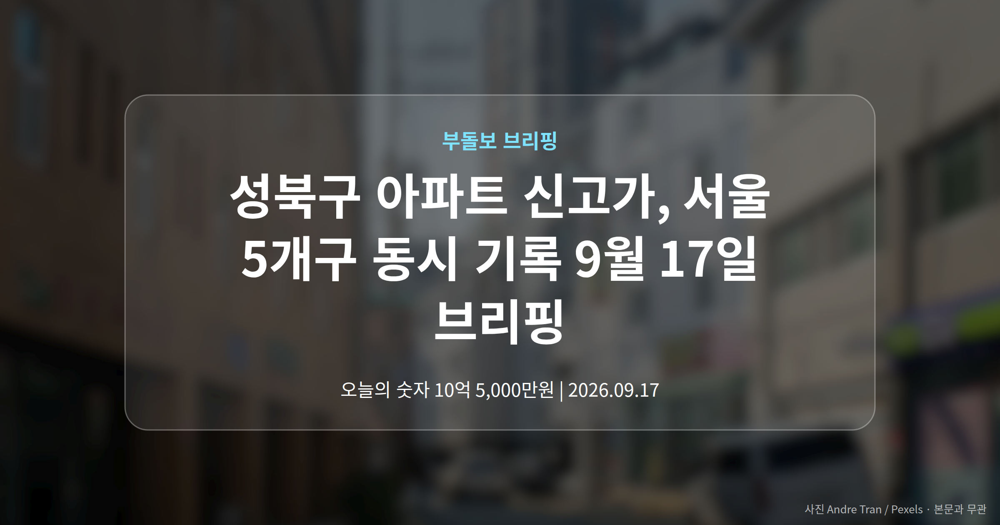
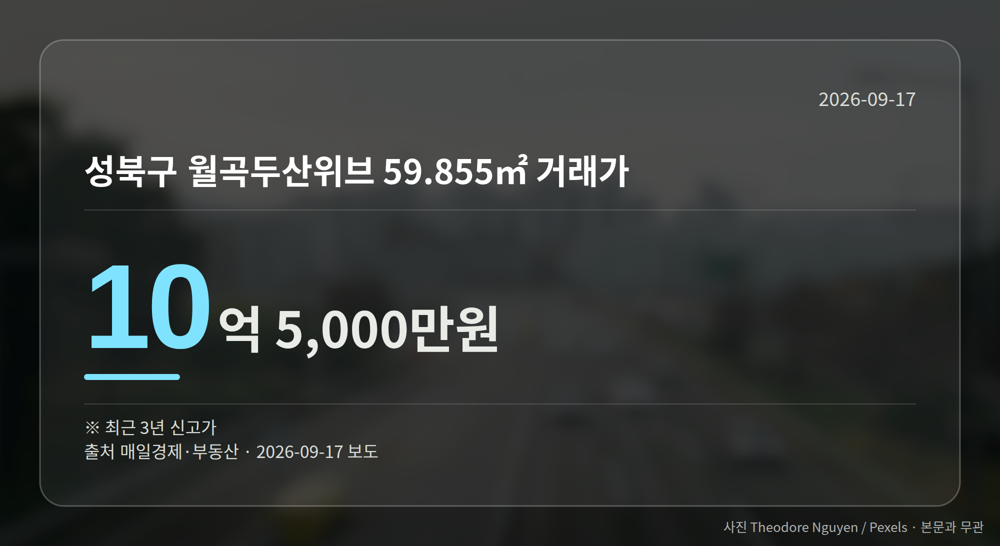
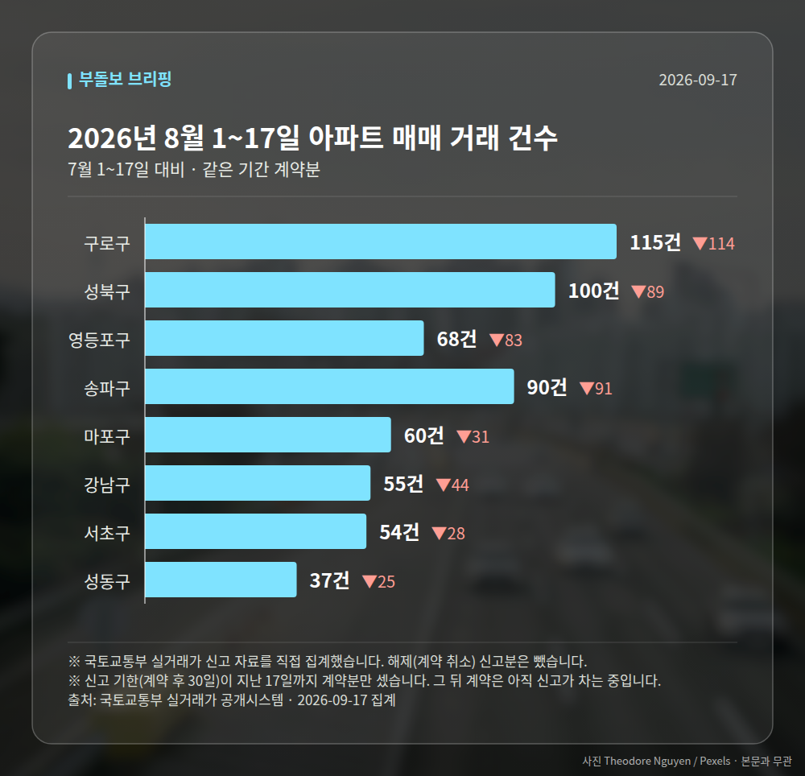

*이 글은 2026년 9월 17일 기준으로 정리한 내용입니다. 실거래 거래 건수는 2026년 8월 1~17일 계약분(신고 기한이 지난 것), 전세가율 등은 2026년 7월 신고분입니다.*
**3줄 요약**

- 서울 5개 자치구에서 최근 3년 신고가 거래가 동시에 확인
- 성북 월곡두산위브 10억5000만원, 압구정 신현대11차 97억3000만원
- 지방은 대구 18억·부산 29억 신고가와 미분양 4.8만가구 공존
오늘 서울 부동산 소식의 핵심은 '동시다발'입니다. 성북구 아파트 신고가를 비롯해 영등포·구로·마포·양천구까지, 서로 떨어진 다섯 개 자치구에서 최근 3년 내 신고가 거래가 나란히 확인됐습니다.

초고가 단지인 강남구 압구정동에서는 97억3000만원 거래도 기록됐습니다. 중저가부터 초고가까지 폭이 넓다는 점이 오늘의 특징입니다.

[이미지: 해질 무렵 서울 아파트 단지 전경 사진]

## 성북구 아파트 신고가, 어디서 얼마에 거래됐나

성북구에서는 두 건입니다. 월곡두산위브 전용 59.855㎡가 10억5000만원, 정릉힐스테이트3차 59.98㎡가 8억1500만원에 거래됐습니다.

두 건 모두 신고가(그 단지에서 지금까지 나온 거래가 가운데 가장 높은 값)로, 여기서는 최근 3년을 기준으로 한 수치입니다.

## 서울 5개 자치구 신고가 한눈에 보기

같은 날 확인된 여섯 건을 표로 모았습니다. 모두 최근 3년 신고가입니다.

| 단지(전용면적) | 거래가 |
| --- | --- |
| 성북 월곡두산위브 59.855㎡ | 10억 5,000만원 |
| 성북 정릉힐스테이트3차 59.98㎡ | 8억 1,500만원 |
| 영등포 당산현대5차 84.69㎡ | 19억 4,300만원 |
| 구로 하버라인3단지 59.86㎡ | 7억 7,000만원 |
| 마포 성산1차 풍림 59.85㎡ | 8억 3,000만원 |
| 양천 학마을1단지 49.99㎡ | 7억 1,500만원 |

눈에 띄는 건 면적대입니다. 여섯 건 가운데 다섯 건이 전용 60㎡ 이하, 이른바 소형 구간에서 나왔습니다.

당산현대5차만 84㎡대로, 앞서 본 다른 단지들과는 가격 수준 자체가 다릅니다.

## 성북구 아파트 신고가, 어떻게 읽어야 할까

중저가·중소형 단지를 중심으로 매수세가 유지되고 있다는 신호로는 읽을 수 있습니다. 서울 곳곳에서 같은 날 확인됐다는 점도 그렇습니다.

다만 한계도 분명합니다. 오늘 확인된 자료에는 거래일자와 층수, 거래 배경이 담겨 있지 않았습니다.

같은 단지라도 층과 향에 따라 값 차이가 크기 때문에, 성북구 아파트 신고가 역시 시장 전체의 방향으로 넓히기보다 개별 단지 사례로 두고 보시는 편이 안전합니다.

[이미지: 스마트폰으로 대출 한도를 조회하는 손 사진]

## 그 밖의 오늘 소식

- 강남구 압구정동 신현대11차, 97억3000만원에 거래
- 카카오뱅크, 분양잔금대출(입주 때 치르는 잔금 대출) 모바일 출시
- 지방은 대구 18억·부산 29억 신고가, 미분양은 4.8만가구

**그래서 나는?**

- 서울 중소형 매수 준비 중이라면, 관심 단지 최근 실거래부터 확인해 보세요
- 1주택자라면, 내 단지가 아닌 인근 단지 사례일 수 있음을 함께 보세요
- 지방 분양 계약자라면, 미분양 4.8만가구라는 수치를 같이 챙겨 보세요

**직접 센 숫자 — 2026년 8월 1~17일 아파트 실거래**

서울 8개 구 계약 매매 **579건** (7월 1~17일 1084건, -505건)

거래가 많은 곳: 구로구 115건(-114) · 성북구 100건(-89) · 영등포구 68건(-83)

신고 기한(계약 후 30일)이 지난 17일까지 계약분끼리 견줬습니다.

구로구 전세가율 가운뎃값 **56.4%** (같은 단지·같은 면적 59곳)

서울 25개 구 가운데 거래가 가장 크게 움직인 곳: 중랑구 -79.3%(405→84건, 7월 1~17일엔 묵동에 74.6% 몰렸음) · 영등포구 -55.0%(151→68건)

2026년 8월 계약 신고가

- 구로구 영화 143.09㎡ — 10.8억 (이전 최고 8.3억, +30.1%, 8월 14일 계약)
- 성북구 정릉우성아파트 101~105동 46.65㎡ — 6.0억 (이전 최고 5.0억, +20.0%, 8월 21일 계약)

*국토교통부 실거래가 신고 자료를 직접 집계했습니다. 해제 신고분은 뺐습니다.*
**여러분이 지켜보는 단지는 올해 들어 실거래가가 어느 쪽으로 움직이고 있나요?**

---

### 참고한 기사

1. **성북구 월곡두산위브 59.855㎡, 10억5000만원에 거래…최근 3년 신고가**
   - [매일경제·부동산](https://www.mk.co.kr/news/realestate/12155010)
2. **영끌 논란 洪 "전세살이 힘들어 샀다"**
   - [매일경제·부동산](https://www.mk.co.kr/news/realestate/12154533)
3. **카카오뱅크, 신축 아파트 '분양잔금대출' 출시**
   - [현대경제신문](https://news.google.com/rss/articles/CBMia0FVX3lxTE44SS1RRHBwSDh6UDY3TXZ3eEVIdllPTGVQWjQ4ZFRxakxxVW5id1NWNmZEME5nQThRaGEwNEV3UXdnWHNxLW9xOTF0alo4TjVRcERMbV8zVGdaV2xDS0VzcDd0T3R4amo5VzN30gFrQVVfeXFMTjhJLVFEcHBIOHpQNjdNdnd4RUh2WU9MZVBaNDhkVHFqTHFVbmJ3U1Y2ZkQwTmdBOFFoYTA0RXdRd2dYc3Etb3E5MXRqWjhONVFwRExtXzNUZ1pXbENLRXNwN3RPdHhqajlXM3c?oc=5)
   - [PRESS9](https://news.google.com/rss/articles/CBMiZEFVX3lxTFBPVDJpQXdhNWFyU185OXNFZnZfX1doZ3AzUGZlTDJKeFoxZG5jb1E1UHg0RTNvRV9nWUtqSWFQdGZNbnFsX19vWklMcHZwS1ZUYmowYUVPaUtQMUlmUVozVjRXOEU?oc=5)
4. **강남구 압구정동 신현대11차 97억 3,000만 원 거래**
   - [매일경제·부동산](https://www.mk.co.kr/news/realestate/12155002)
5. **대구 18억·부산 29억 신고가 뒤엔 ‘미분양 4.8만가구’…지방 집값 ‘두얼굴’ [부동산360]**
   - [v.daum.net](https://news.google.com/rss/articles/CBMiVEFVX3lxTE1nYkNuZ2NHdVcxandfak5hYWlQeFV3R014SFZMS3YyVlZnaGxZZnpwdGhTY04yMDZEbElzY3hoVERRZEFlZDYyUW5HbnhTejgtalJqbA?oc=5)

---

*본 글은 공개된 언론 보도를 정리한 것이며, 투자 판단의 책임은 이용자 본인에게 있습니다.*
