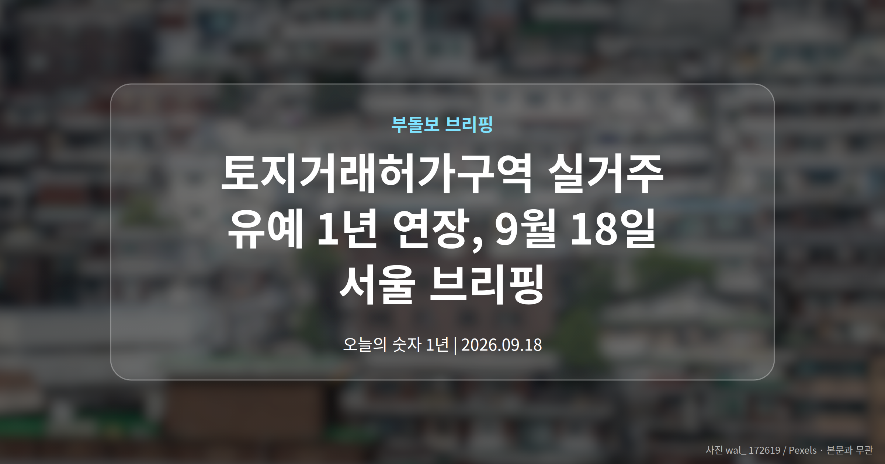
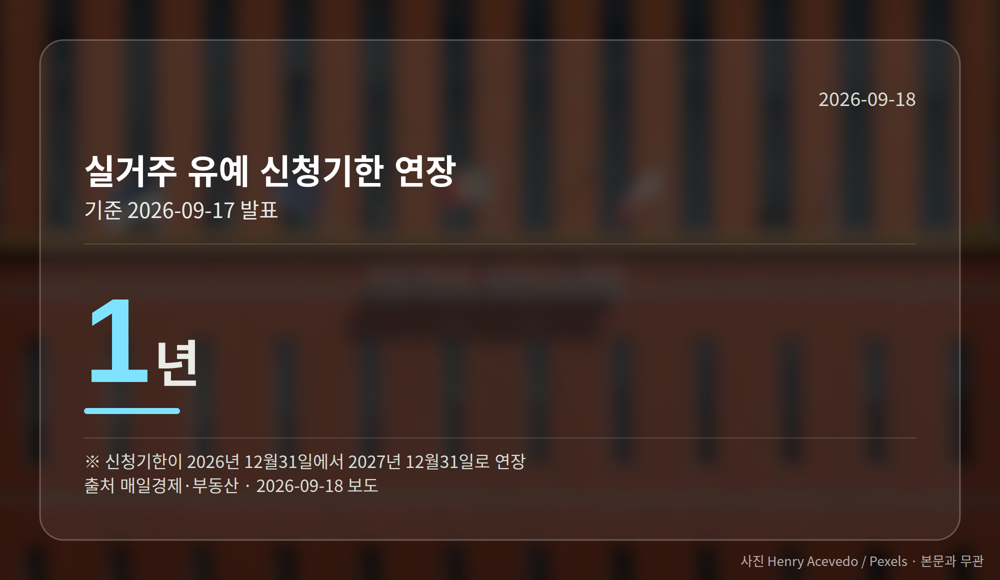
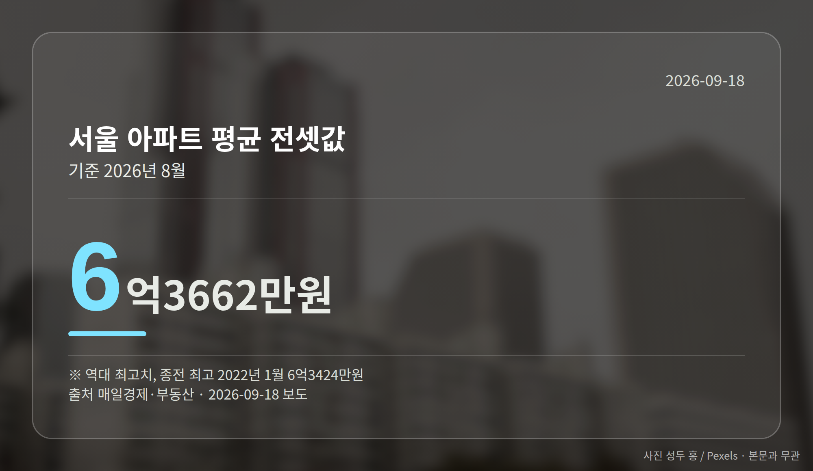
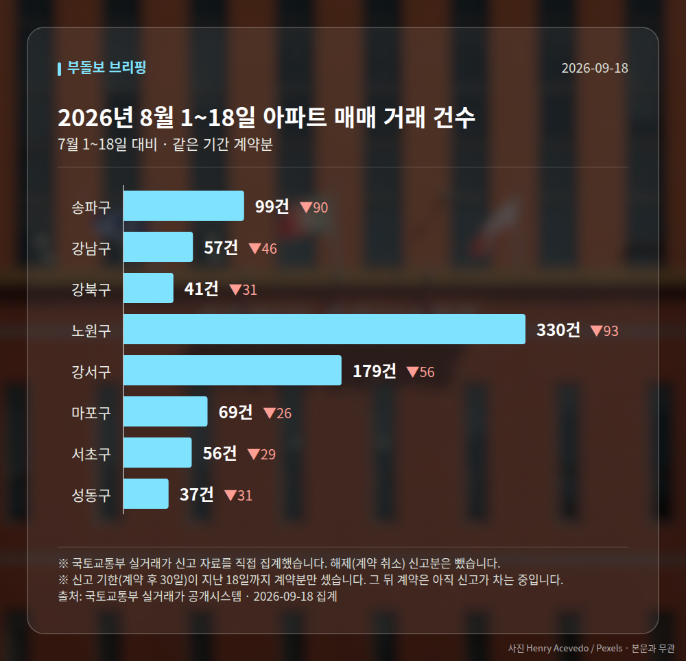

*이 글은 2026년 9월 18일 기준으로 정리한 내용입니다. 실거래 거래 건수는 2026년 8월 1~18일 계약분(신고 기한이 지난 것), 전세가율 등은 2026년 7월 신고분입니다.*
**3줄 요약**

- 국토부, 토지거래허가구역 실거주 유예 기한 1년 연장 발표
- 신청기한 2027년 말까지, 갱신계약 2년 더해 최장 2029년 말 입주
- 10월 1일 시행 이후 토허구역 매물·거래가 실제로 움직이는지 확인
오늘 부동산 소식의 중심은 토지거래허가구역 실거주 유예입니다. 국토교통부가 9월 17일, 유예 신청 기한을 1년 더 늘리고 인정 범위도 넓힌다고 밝혔습니다.

확대된 조치는 10월 1일부터 시행됩니다. 같은 날 나온 통계에서는 서울 아파트 매매가격과 전셋값이 나란히 84주 연속 올랐습니다.

## 토지거래허가구역 실거주 유예, 무엇이 달라졌나

토지거래허가구역은 집을 살 때 관할 구청의 허가를 받아야 하고, 원칙적으로 매수자가 직접 들어가 살아야 하는 지역입니다. 세입자가 있는 집을 샀을 때 입주 시점을 미뤄 주는 것이 실거주 유예입니다.

이번에 신청 기한이 올해 12월 31일에서 2027년 12월 31일로 1년 밀렸습니다. 인정 범위도 기존 임대차 계약의 남은 기간을 넘어, 1회에 한해 최대 2년의 갱신계약 기간까지 더해집니다.

| 항목 | 내용 |
| --- | --- |
| 신청 기한 | 2027년 12월 31일까지 (1년 연장) |
| 갱신계약 추가 인정 | 1회, 최대 2년 |
| 최장 입주 유예 | 2029년 말 |
| 시행 | 10월 1일, 그날 임대 중인 주택 |
| 무주택 유지 기준일 | 2026년 5월 12일 |
| 취득등기 | 허가 후 4개월 이내 |

예를 들어 2027년 말에 유예를 신청하면서 2년짜리 갱신계약을 맺으면, 매수자는 표에 적힌 시점까지 입주를 미룰 수 있습니다. 한 매체는 같은 조치를 '최대 3년 3개월'로 표현하기도 했습니다.

반면 조건은 그대로입니다. 기준일부터 계속 무주택이어야 하고, 입주한 뒤에는 2년간 실제로 거주해야 합니다. 등기 기한 요건도 유지됩니다.

## 왜 지금 토지거래허가구역 실거주 유예를 또 연장했나

배경에는 전세시장이 있습니다. 서울 아파트 전셋값은 9월 둘째 주 0.17% 올라 84주 연속 상승했고, 이 기간 누적 상승률은 11.76%입니다.

8월 서울 아파트 평균 전셋값은 6억3662만원으로 역대 최고였습니다. 종전 최고치는 2022년 1월의 6억3424만원이었습니다.

세입자가 있는 집을 사기 어려워지면 그만큼 전세 매물도 줄어듭니다. 이번 조치는 그 고리를 느슨하게 해 보려는 시도로 읽힙니다.

다만 유예 연장이 두 차례 이어지면서 정책 신뢰성 논란도 함께 제기됐습니다. 시장이 이를 규제 완화 신호로 받아들여 매물 잠김이 풀릴지는 시행 이후를 지켜봐야 합니다. 이번 발표는 지난 15일 더불어민주당이 제도 보완을 제안한 지 이틀 만에 나왔습니다.

[이미지: 서울 도심 아파트 단지 전경 사진]

## 그 밖의 오늘 소식

- 서울 아파트 매매가 0.16% 상승, 84주 연속 오름세
- 강남3구 하락 전환, 서울 상승폭은 3주째 축소
- 대전 아파트 매매가 0.03% 상승, 상승폭은 축소

**그래서 나는?**

- 무주택 실수요자라면, 5월 12일 이후 무주택 유지 여부부터 확인해 보세요
- 토허구역 매도를 앞뒀다면, 세입자 갱신계약 시점이 변수가 될 수 있습니다
- 전세 계약을 앞뒀다면, 8월 평균 전셋값 흐름을 먼저 살펴보시면 좋습니다

**직접 센 숫자 — 2026년 8월 1~18일 아파트 실거래**

서울 8개 구 계약 매매 **868건** (7월 1~18일 1270건, -402건)

거래가 많은 곳: 송파구 99건(-90) · 강남구 57건(-46) · 강북구 41건(-31)

신고 기한(계약 후 30일)이 지난 18일까지 계약분끼리 견줬습니다.

송파구 전세가율 가운뎃값 **40.0%** (같은 단지·같은 면적 76곳)

서울 25개 구 가운데 거래가 가장 크게 움직인 곳: 중랑구 -78.4%(412→89건, 7월 1~18일엔 묵동에 73.8% 몰렸음) · 영등포구 -54.7%(159→72건)

2026년 8~9월 계약 신고가

- 강서구 마곡서광(치현마을) 84.93㎡ — 7.6억 (이전 최고 6.0억, +26.7%, 8월 30일 계약)
- 노원구 상계주공12(고층) 41.3㎡ — 5.8억 (이전 최고 4.8억, +21.9%, 9월 9일 계약)

*국토교통부 실거래가 신고 자료를 직접 집계했습니다. 해제 신고분은 뺐습니다.*
**여러분이 지켜보는 지역은 매매와 전세 중 어느 쪽 움직임이 더 신경 쓰이시나요?**

---

### 참고한 기사

1. **‘토허제 실거주 유예’ 1년 또 연장**
   - [국민일보](https://news.google.com/rss/articles/CBMibEFVX3lxTFBXQnJiNFdNMTRrelY1S2NxcGpzVVg2dlVFbmNlY2dFd01hSmNWdVJWWENGQnpTM21ZSm9lOFBQRjlOOVpjUjVYNDYxdy1saDY5MHNJWXBHclZyYWlyYUhzU2lGSFNlenk4MVpictIBbEFVX3lxTFBXQnJiNFdNMTRrelY1S2NxcGpzVVg2dlVFbmNlY2dFd01hSmNWdVJWWENGQnpTM21ZSm9lOFBQRjlOOVpjUjVYNDYxdy1saDY5MHNJWXBHclZyYWlyYUhzU2lGSFNlenk4MVpicg?oc=5)
   - [더나은미래](https://news.google.com/rss/articles/CBMiUkFVX3lxTFBzckh2V293a0JXQVBZUERfMXE1dDZ4amNWV01hYTVKS2RSR3FBcVUtY2luNmgzeGI3d3ZDVXQzREFuRmNfRUFvTUtjaV82VWNaQlE?oc=5)
2. **토지거래허가구역 내 실거주 유예, 내년 12월 31일까지 연장..유예 인정 범위도 갱신계약까지 확대**
   - [데일리경제](https://news.google.com/rss/articles/CBMibEFVX3lxTE5vZWZ4UDRMLWNyQ0Z1YWw0R3hSeWRiWUt6V2p3MmU5LTM2Y2dBVnBEU1BiTWFfR0pjb2NJT2NUdDhzLVFvRE5QV3FiRDlBYkRWeXloTjl0U2dFSGV0eGVaSVM2b0pCTHF1YURZNw?oc=5)
   - [부동산신문](https://news.google.com/rss/articles/CBMiaEFVX3lxTE1kTkNZd19jNVFEblRRNmpCaVBkTUJNcmFYeEs0SFBHYzJnWllydEhDRGFLYXhtaU1IMldtd3l6ckFYeTlwM2pZNVVOSkh6ZHNObWFVV281Mlpwc3N6b2s5QmJlb24xTm5i?oc=5)
3. **세낀 서울집 매수자, 최장 2029년까지 실거주 안해도 된다**
   - [매일경제·부동산](https://www.mk.co.kr/news/realestate/12155820)
   - [한국경제·부동산](https://www.hankyung.com/article/2026091721571)
4. **서울 아파트값 상승폭 0.16%로 축소…강남 3구 일제 하락**
   - [코리아리포트](https://news.google.com/rss/articles/CBMicEFVX3lxTFBUU3hoU0RhOUJjNVQ5VGdYS2RjdGFzaVVpeFRjRmgybXhjLXRLUnQ1bURWS2ZRS3RfcjlDdERCRmRacVVnanc5TmRTR01yTW1NUC1iaFljX0Q3cnhVajFqRTEwMWRDbVozUzZ4ZG56X3Y?oc=5)
   - [뉴스토마토](https://news.google.com/rss/articles/CBMiYEFVX3lxTFBZZWZTX216UUptc1NBZDhPamwwZXNMc3V2X1JxMHdkcVdvTUlnN0NZRXhGZkF4QWk3WmNCQmJpVEtfTU10ZThXQ2xoYW0zU2hBZ25XdmdLTHNuREFCdWJudA?oc=5)
5. **서울 아파트값 84주 연속 상승… '역대 최장 기록' 경신 눈앞**
   - [서울뉴스통신](https://news.google.com/rss/articles/CBMia0FVX3lxTFA4NDdXUktwb2k3VnJSUFlQcGM0T2d5amRwcmI3aDVtVEM0eXhzbVFvUG5oVGFDd0ZrcFozbno5Q09UUFA4ZGZmUTJET3V4bHJ2VFk0Wnc1MFZpR0JUZlZsNWlpQzZwMFBISEk0?oc=5)
   - [Chosunbiz](https://news.google.com/rss/articles/CBMimAFBVV95cUxPQVAzbUt6NG5MOEpEOF9aTXptRzdVNlZkQ0VHdWxET3BlMmVTOHhrWnlvc050dUxIZ0RaUUNUdXNTY01kbk12UXkxSXc0ZFlMdDF5Yl9FQnE2UXlpXzZfVVNQdzZNbjVERkFFX1hUZndMSWNGSTVLaXdOeXN4S0cwRkRBekNLc3I1VDVybVZNTFhlWkpMUTctMtIBrAFBVV95cUxPU01GLUlJamMta2w3Uy1qNzdoWFlZUnNqOWZwSV9pTENBalZYUFZ1dmt4aWpRbmdkWjg1QUowb2ZEQUtUOXMwUV9EUWdaV3d2OXlhbDJ2NHpxTG9lenlHcFlNOWd3TFhNVFdNMENyYjFNSUJoYjJkRENrZFFUSi0zLUxXa2dwakFUc1Z1cjVJTUMxSFEzdTlZbWpLb3NpX0ppa0hhU3JPYkd6cWlO?oc=5)

---

*본 글은 공개된 언론 보도를 정리한 것이며, 투자 판단의 책임은 이용자 본인에게 있습니다.*
