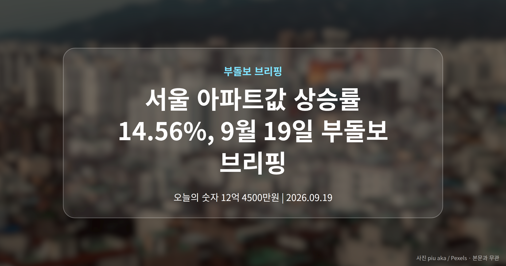
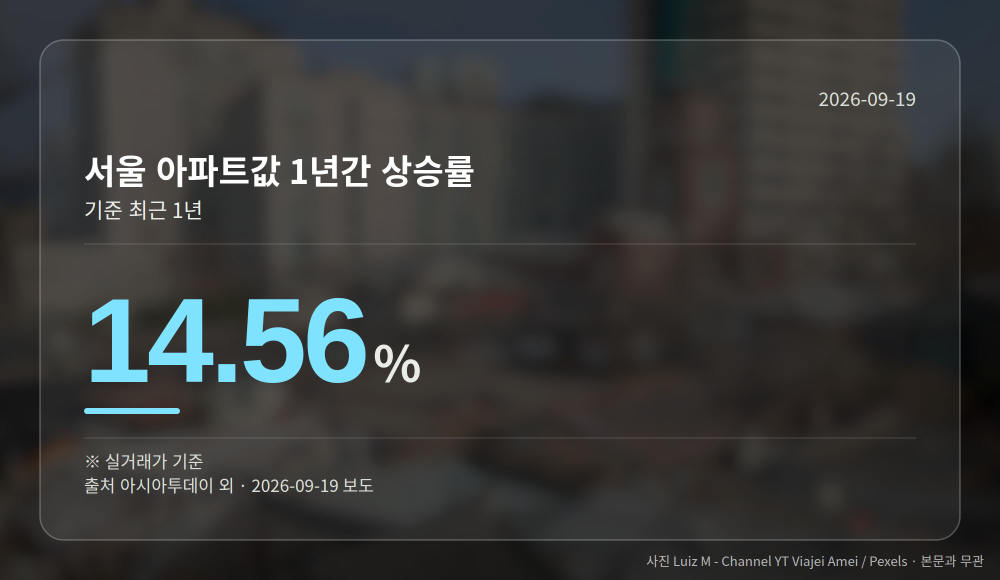
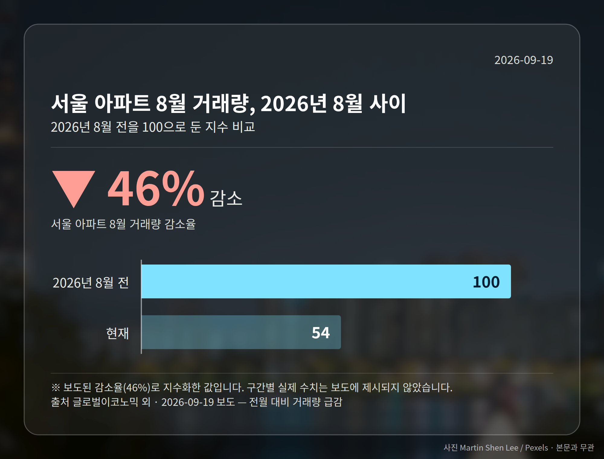
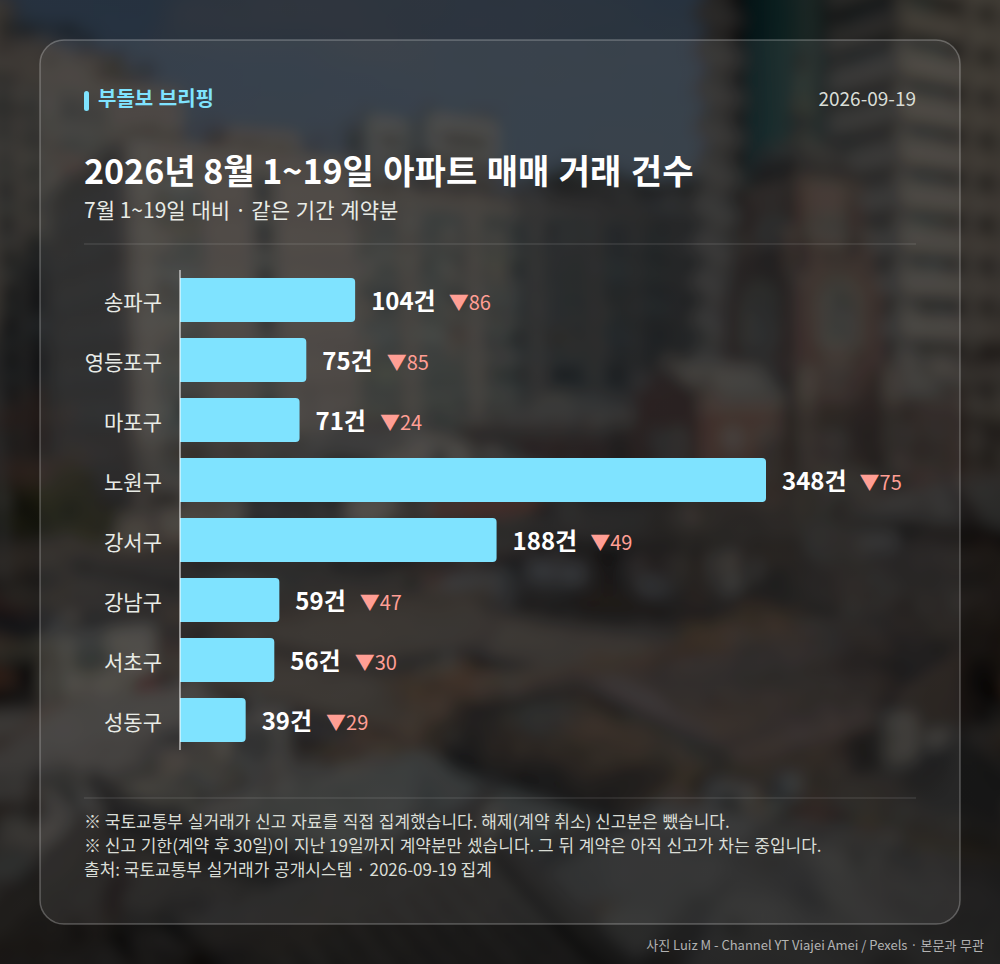

*이 글은 2026년 9월 19일 기준으로 정리한 내용입니다. 실거래 거래 건수는 2026년 8월 1~19일 계약분(신고 기한이 지난 것), 전세가율 등은 2026년 7월 신고분입니다.*
**3줄 요약**

- 서울 아파트값이 1년 새 두 자릿수로 올랐습니다
- 1년 14.56%, 7월 1.93% 상승 · 8월 거래량은 46% 감소
- 가격과 거래량이 엇갈리는 구간, 방향은 거래량에서 봅니다
서울 아파트값 상승률이 최근 1년간 14.56%로 조사됐습니다. 그런데 같은 시기 8월 거래량은 46% 줄었습니다. 가격은 오르는데 사고파는 사람은 줄어든, 엇갈린 국면입니다.

오늘은 이 한 가지 흐름만 숫자로 차분히 짚어 보겠습니다.

## 서울 아파트값 상승률 14.56%, 어떤 숫자인가

조사 결과 서울 아파트값은 1년 새 14.56% 올랐습니다. 7월 한 달만 떼어 봐도 1.93% 상승했습니다.

같은 사안을 매일경제는 1년 상승률을 15%로 반올림해 표기하며 '동남권·초소형'이 상승을 주도했다고 전했습니다. 두 수치는 표기 차이로 보이지만, 정확한 조사기관명과 조사 방식은 제공된 자료에 나오지 않습니다.

| 항목 | 수치 | 기간 |
| --- | --- | --- |
| 아파트값 상승률 | 14.56% | 최근 1년 |
| 아파트값 상승률 | 1.93% | 2026년 7월 |
| 거래량 감소율 | 46% | 2026년 8월 |

## 가격은 오르는데 거래는 왜 줄었나

8월 서울 아파트 거래량은 전월 대비 46% 급감했습니다. 앞서 본 상승률과는 방향이 반대입니다.

가격이 오른 상태에서 거래가 줄면, 파는 쪽은 호가를 낮추지 않고 사는 쪽은 기다리는 관망 구간일 수 있습니다. 다만 이 흐름이 상승 지속인지 조정 신호인지는 해석이 엇갈릴 수 있어, 단정하기 이릅니다.

## 서울 아파트값 상승률과 신고가 릴레이는 같은 이야기일까

9월 17일 실거래가 시스템에는 서울 6개 단지의 최근 3년 내 신고가가 신규 등록됐습니다. 송파구 풍납동 송파현대힐스테이트 전용 84.99㎡가 16억 5,000만 원, 영등포구 경남아너스빌 전용 59.9㎡가 14억 원입니다.

마포구 중동 현대 전용 84.94㎡는 12억 4,500만 원, 노원구 월계동 현대 전용 59.95㎡는 9억 8,500만 원에 거래됐습니다. 종로구 창신쌍용2는 9억 9,000만 원, 강북구 두산위브트레지움은 9억 3,250만 원이었습니다.

강남권만이 아니라 도심권과 중저가 지역까지 신고가가 확인된 점은 눈여겨볼 만합니다. 다만 모두 단일 매체 보도이고 단지별 1건 거래 기준이라, 지역 전체 시세를 대표하지는 않습니다.

[이미지: 서울 아파트 단지 전경]

## 그 밖의 오늘 소식

- 이재명 대통령, 재건축·재개발 공급 신속화와 매주 직접 점검 언급
- 이 대통령, 집값 상승 원인으로 이전 정부·서울시 공급 축소 지목
- 국토부, 숙박시설을 주택으로 속인 불법광고 1만여 건 적발

**그래서 나는?**

- 무주택 실수요자라면, 관심 단지의 최근 실거래 건수부터 확인해 보세요
- 1주택자라면, 내 단지 신고가가 1건인지 여러 건인지 살펴볼 만합니다
- 전월세 매물을 찾는다면, 건축물대장으로 주택 여부를 꼭 확인하세요

**직접 센 숫자 — 2026년 8월 1~19일 아파트 실거래**

서울 8개 구 계약 매매 **940건** (7월 1~19일 1365건, -425건)

거래가 많은 곳: 송파구 104건(-86) · 영등포구 75건(-85) · 마포구 71건(-24)

신고 기한(계약 후 30일)이 지난 19일까지 계약분끼리 견줬습니다.

송파구 전세가율 가운뎃값 **40.0%** (같은 단지·같은 면적 76곳)

서울 25개 구 가운데 거래가 가장 크게 움직인 곳: 중랑구 -76.6%(414→97건, 7월 1~19일엔 묵동에 73.4% 몰렸음) · 영등포구 -53.1%(160→75건)

2026년 8~9월 계약 신고가

- 강서구 마곡서광(치현마을) 84.93㎡ — 7.6억 (이전 최고 6.0억, +26.7%, 8월 30일 계약)
- 노원구 상계주공12(고층) 41.3㎡ — 5.8억 (이전 최고 4.8억, +21.9%, 9월 9일 계약)

*국토교통부 실거래가 신고 자료를 직접 집계했습니다. 해제 신고분은 뺐습니다.*
**여러분이 보고 계신 단지는 호가와 실제 거래 중 어느 쪽이 먼저 움직이고 있나요?**

---

### 참고한 기사

1. **마포구 중동 현대아파트 84.94㎡ 12억 4500만원 최근 3년 신고가 [MAI부동산]**
   - [매일경제·부동산](https://www.mk.co.kr/news/realestate/12156079)
2. **李 대통령 “부동산 공급 최대한 신속히…집값 안정 반드시 이뤄낼 것”**
   - [더나은미래](https://news.google.com/rss/articles/CBMiUkFVX3lxTE96N0pVYXVVTVVPQjQ4ZkZYQTI5WXNTcllEUjNMR2JhN1pIVi1ybGNveGdseDg1MFV2cTVMN1dZTVhmakJlV3V5T2FSZ191clB1anc?oc=5)
   - [아시아타임즈](https://news.google.com/rss/articles/CBMiXkFVX3lxTE05YngwWllnLXNsOENTS2J0UmVjWldqakh0TUdRUFU0QmpkalBoTzJhRk9fa1k4dFpONzRCb29vVkprNjl6M1hZYnZ6RmNIU0JiWEVrZ01WRGZ5aEU1bUE?oc=5)
3. **전월세난 틈타 숙박시설 주택으로 속여…부동산 불법광고 1만건 적발**
   - [진일보](https://news.google.com/rss/articles/CBMib0FVX3lxTE5KVk9JN0tXc2VVRjc2UkY3X29DYlVZeFpYeG11cE41TzVrQ2c2STZHaHBrRU1VRFNfM2RyUTJILXF0bUtGc294UWh4cjB3UUpVeWZ2VFk4WHpYaVlmZEpxd3AxeFRzSmc3ZnJVRkVybw?oc=5)
   - [시사저널](https://news.google.com/rss/articles/CBMib0FVX3lxTFBPRi04LU5pWDdaUjJRUko0b2NVZnFkVDBLQ2EteGUxM0tEZEtYaW03YUtSdWJXSDBKSzFCVmo3aTQ3T1hPRkpLbVBPUEtNY05VNDN0SmdvODRiVmRDdUdTSlFyTHZFcHhkWXhMN1BuUdIBc0FVX3lxTE9UWk5tUW5DdlQxUDJNLWFfTWdJVGdIZ1pMRGxXMnNUcTJYbFJkSXJGSWhvSmh3a3FrRVo0VXJ6cTFZaVgxWjhJQmRsWW4yUjMyaHZGTVQwMWZLeXBwdU9vX3FQNE42X1lwekhmLWNwMF9uMlU?oc=5)
4. **서울 아파트값 1년 새 14.56% 상승…7월도 1.93% 올라**
   - [아시아투데이](https://news.google.com/rss/articles/CBMibkFVX3lxTE5zclVqUGN0Q1FUVmZxOURwQ185b0N0ZDl2LWUxb3hRWWtNQ280MEJMZmxMN3pzam5DT0pvNHhnbVNwb2M1ZjRNSV9yc2otMDc3OWJiT0RFVlNLcWc1cUdzZVlodldvQ1R5VDRuTDJ3?oc=5)
   - [매일경제](https://news.google.com/rss/articles/CBMiRkFVX3lxTFBFOWlUUm0xc09vYnVkeVAtRFBMd0N1OUNWenBDR21QeVFvNTBScDA0Y2d6NXl3RmFuWHB6Y1c3MjB0YUtOa3c?oc=5)
5. **이 대통령 “집값 상승, 윤석열·오세훈 당선 후 공급 축소 때문”**
   - [매일경제·부동산](https://www.mk.co.kr/news/realestate/12156375)

---

*본 글은 공개된 언론 보도를 정리한 것이며, 투자 판단의 책임은 이용자 본인에게 있습니다.*
