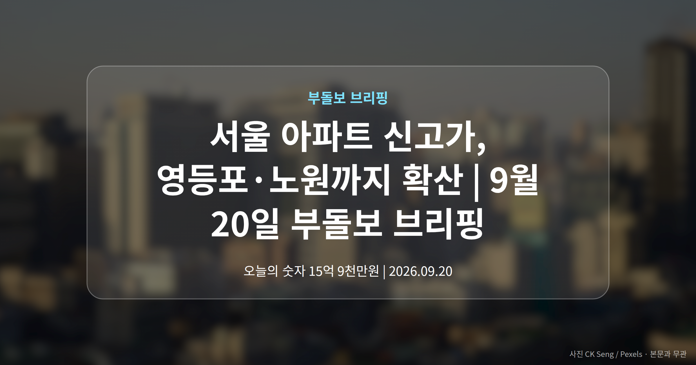
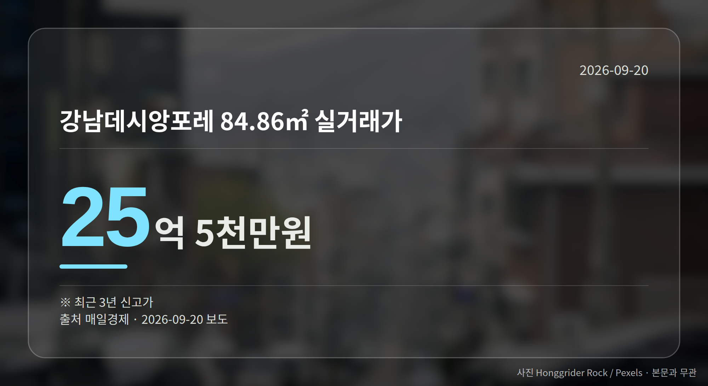

*이 글은 2026년 9월 20일 기준으로 정리한 내용입니다.*
**3줄 요약**

- 서울 6개 단지에서 최근 3년 신고가 거래 확인
- 강남 25억5천만원, 노원 5억8천만원까지 분포
- 강남권 밖 확산 여부, 단지별 시세부터 확인
오늘 서울 아파트 신고가 소식이 한꺼번에 나왔습니다. 강남뿐 아니라 영등포·서대문·구로·노원까지 6개 단지에서 최근 3년 신고가 거래가 확인됐습니다.

가격대는 5억원대부터 25억원대까지 넓게 퍼져 있습니다. 특정 지역만의 이야기로 보기는 어려운 흐름입니다.

[이미지: 서울 시내 아파트 단지가 늘어선 전경]

## 서울 아파트 신고가, 어느 단지에서 나왔나

매일경제 보도로 확인된 6개 단지의 거래 내역입니다. 여기서 신고가란 해당 면적에서 지금까지 기록된 가격 중 가장 높은 거래를 뜻하고, 오늘 사례는 모두 '최근 3년' 기준입니다.

| 단지 (면적) | 실거래가 |
| --- | --- |
| 강남구 강남데시앙포레 84.86㎡ | 25억 5천만원 |
| 서대문구 DMC래미안e편한세상 84.94㎡ | 16억 3900만원 |
| 영등포구 영등포푸르지오 59.912㎡ | 15억 9천만원 |
| 구로구 구로동 우방 84.9㎡ | 7억 4천만원 |
| 노원구 중계3벽산 59.88㎡ | 7억 3500만원 |
| 노원구 상계주공12단지 41.3㎡ | 5억 8천만원 |

표에서 보시듯 대형 면적 위주도 아니고, 한 권역에 몰린 것도 아닙니다.

## 서울 아파트 신고가가 말해주는 것과, 말해주지 않는 것

의미는 분명합니다. 강남권 밖에서도 같은 날 신고가가 확인됐다는 점에서, 매수세가 한 지역에 국한돼 있다고 보기는 어렵습니다.

다만 한계도 뚜렷합니다. 각 기사는 가격과 신고가 여부만 전하는 단신이라, 계약일이나 거래 배경, 이후 전망은 담겨 있지 않습니다.

그래서 해당 단지 소유자나 매수를 생각하시는 분이라면, 이 숫자 하나로 판단하기보다 같은 단지의 다른 거래들이 어떻게 이어지는지 함께 보시는 편이 안전합니다.

[이미지: 스마트폰으로 아파트 실거래가를 확인하는 모습]

## 그 밖의 오늘 소식

- 오세훈 시장, 대통령 지지율 하락 원인으로 전세난 지목
- 집값 상승 지속 시 종부세(공시가격 합이 기준을 넘으면 내는 보유세) 대상 비강남권 확산 전망 제기
- 신규 택지·국공유지·재개발 총동원한 수도권 공급 방침 보도

뒤의 두 건은 제목만 확인되고 본문 내용이 없어, 대상 지역이나 공급 물량은 아직 알 수 없습니다. 오세훈 시장 발언도 한쪽 입장만 나온 상태로, 정부 측 반응은 확인되지 않았습니다.

확정된 사실과 아직 확인되지 않은 이야기를 나눠서 보시는 게 오늘은 특히 필요해 보입니다.

**그래서 나는?**

- 매수를 준비 중이라면, 관심 단지 실거래 신고일부터 확인해 보세요
- 1주택자라면, 종부세 기준 변화 논의를 지켜볼 필요가 있습니다
- 전세 계약을 앞뒀다면, 전세 물량 관련 정책 논쟁을 챙겨보세요
**여러분이 보고 계신 단지는 지금 어느 가격대에서 거래가 이뤄지고 있나요?**

---

### 참고한 기사

1. **영등포구 영등포푸르지오 59.912㎡ 15억 9천만원… 최근 3년 신고가 [MAI부동산]**
   - [매일경제·부동산](https://www.mk.co.kr/news/realestate/12157074)
2. **오세훈 "李대통령 지지율 하락 원인은 부동산… 전세난 책임져야"**
   - [한국일보](https://news.google.com/rss/articles/CBMibkFVX3lxTFBBYzBlLXdXZm5RR3BsVVFHNU9BdkUxVUVVZFR1aWNBVld6VVl0c0xSamRCNldBdzBKcDJ4UkpvWFduRTlRVWNyOUExMi1mTk9YZXFWY2U3d0NyRlcxcnNfZndWUE9VWnBXMDczMi1n0gFzQVVfeXFMTTJ6eEV6RVRoeWFUaHZoOXdDZ2VXeENVRlEyd0hYSWJXbzZWcmo3ZGg3QVhHZENUTVJsM1djRnFiX3VkMTQ2ODFWUlgybmxCcUhrbnR1YXRtdHJDWHk4bmdkSGtkSUVYME5SNkZ5clJOT2Z3WQ?oc=5)
   - [데일리안](https://news.google.com/rss/articles/CBMimAJBVV95cUxQQy1rNHJsMHJDV2NXU0xVTl94cmNhYnVzOFgwN2M4RGNXMXhJMFRXQWFvbUtDbGgxNWgya1paLUJfaVZfWW9uWjg0cnZQYU5VSTVITUViWGdvb0VWVzlreWNldGY2VE5sWGRlWTNoWkRMTTNubEZicGtiRkhRVnktQklSX3VwZS1VSGMxaWtTTC0xS3VfQXNTYkJISzBnS0I2MG83bU9fd29uRjJTek1oWW8wU2EyX1U0UWpNc3FHZm1EcjRnUHpZX00zYXM4clFDUm91a1I1S3FDamdjS1YwRFBTR1FzUHRKYUpVd3BabFRiVDB4Z1d5YWJxTGNITnJjbmZtOU5NbnB5c1Z3c1dnUEVSaVIyN2U3?oc=5)
3. **집값 상승세 안 꺾이면...종부세 비강남권 확산 [김경민의 부동산NOW]**
   - [v.daum.net](https://news.google.com/rss/articles/CBMiRkFVX3lxTE5zOTNCZGdnWGl5dFVIMnJRZm52RlRFNnRkdGxqOEtQaFVOWjh6c1JDUzNyTHFlZXN0cWxaampZYXZROW1icUE?oc=5)
4. **수도권 집값 잡는다…신규 택지·국공유지·재개발 총동원**
   - [cbci.co.kr](https://news.google.com/rss/articles/CBMiaEFVX3lxTFAxZUYxcEEwc1pBdl82Qk9vbFJmTE5ndG8zNUNieEZaSGdTTi1fVzBmZVpSUl8wQ0dVRV8td0Jld3MtOHpUOEppczVxekdoZ2drTlBjamJicG9QXzRRQWhJbTJqZV9WMWpo?oc=5)
5. **세종대 부동산AI융합학과, 도심 공공주택 복합사업 전문가 특강**
   - [핀포인트뉴스](https://news.google.com/rss/articles/CBMic0FVX3lxTE5Demk2QTFhZlRMalZaY1Azb0xQZ0F3QXk1UTJma2hGM3NGNFdCWElhS2tXZFJxVmZEQmVCYk9CSm84QnZxcDBQdE1qNloyWXZHY1dkQ3Y0OFlnZHQ4Ymhld09RcEctb2hnRXFKYjdUSl8yMlHSAXdBVV95cUxNQ2RLR1pPdnU2X1ltcVJLWmp0SkFZUUFiUE1weThGMzVWNUtWQVJnNW9jb0ozYzMzSS0tWFRvaVFLcTRrV09MaV9ITlNOQjVObEFvOXVyX3l5Ry1vUW5sUXVKUWRyamlDZVNSYjFxNGFNT3ZqSzJwaw?oc=5)
   - [이뉴스투데이](https://news.google.com/rss/articles/CBMicEFVX3lxTE5Hbi1nSTNhRWNTX0N1bXpxQjQ1NGRtNUt1ZFgxUTBSUnRBaGlCSnZrbFdRdmdxV0tPMXo0RURxel90U2o3dlBpM3NtbEJZUGhkQ1ZLcmFhbGNpZFc1c2Flc0ZpbUgzNnlCYlQ5R2FMclrSAXRBVV95cUxOcjRjWjRLZ0VlLXVsTmloVVBjcE1HM2ZKeTFXenRIU2luSEdsbkdsLW9mVXc4WHJDOUxCUktTX2xzSXBLS3lnYmFiMXk2aUczdFFhbkNfUlZ1Z2NTY3JocFdGVnYyckhNSC1KcVVtSlprREFlbQ?oc=5)

---

*본 글은 공개된 언론 보도를 정리한 것이며, 투자 판단의 책임은 이용자 본인에게 있습니다.*
