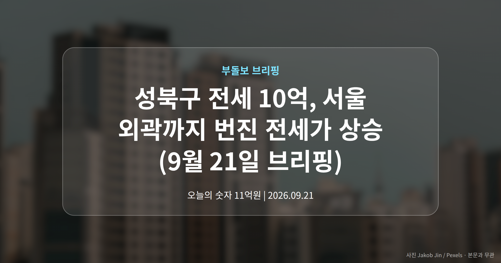
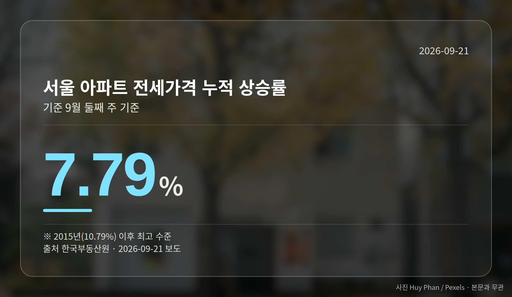
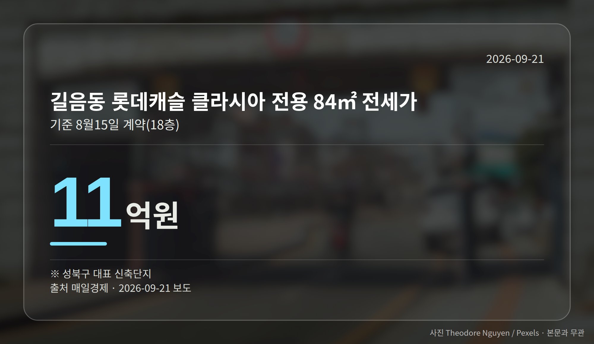

*이 글은 2026년 9월 21일 기준으로 정리한 내용입니다.*
**3줄 요약**

- 성북·강북·노원 국민평형 전세가 10억원대에 올라섰습니다
- 서울 전세 누적 상승률 7.79%, 작년 같은 기간의 4배 수준
- 재계약 앞뒀다면 자치구별 상승률부터 확인해 보세요
성북구 전세 10억 시대가 현실이 됐습니다. 그동안 마포·용산·성동에 국한됐던 국민평형(전용 84㎡) 전세 10억원대가 성북·강북·노원까지 번졌습니다.

서울 아파트 전세가격 누적 상승률은 9월 둘째 주 기준 7.79%로, 2015년 이후 최고 수준입니다(한국부동산원 집계).

## 성북구 전세 10억, 어디서 나온 숫자인가

성북구 길음동 롯데캐슬 클라시아 전용 84㎡는 지난달 15일 18층 기준 11억원에 전세 계약됐습니다.

인근 래미안 길음 센터피스 전용 84㎡도 7월 11층이 10억5000만원에 계약됐고, 현재 23층 매물 호가가 같은 금액입니다.

이는 성동구 옥수동 e편한세상 옥수파크힐스 전용 84㎡가 8월 3일 10억5000만원(3층)에 계약된 것과 맞먹는 수준입니다.

주변 지역도 비슷합니다. 동대문구 청량리역 한양수자인 그라시엘은 지난해 11월 8억원대 초반이던 신규 계약가가 지난달 30일 53층 기준 10억원으로 올라섰습니다.

강북구 미아동 한화포레나미아 전용 84㎡ 전세 호가는 12억원으로, 6월 26일 거래가 9억5000만원보다 높습니다. 노원구 중계동 건영3차(1995년 준공)는 9월 11일 9억1000만원에 계약됐습니다.

## 자치구별 전세가격 상승률은 어떻게 갈렸나

한국부동산원 기준 올해 누적 상승률을 보면, 서울 평균을 웃돈 곳은 성북·노원·동대문구였습니다.

| 지역 | 2026년 누적 전세가격 상승률 |
| --- | --- |
| 성북구 | 12.84% |
| 노원구 | 12.25% |
| 동대문구 | 8.43% |
| 서울 평균 | 7.79% |
| 동남권(강남3구·강동구) | 6.03% |

강남3구와 강동구가 포함된 동남권이 오히려 평균을 밑돌았다는 점이 눈에 띕니다. 참고로 성북구는 매매가격 누적 상승률도 14.01%로 서울 자치구 중 1위였습니다.

## 성북구 전세 10억이 뜻하는 것

앞서 본 서울 평균 상승률은 지난해 같은 기간(1.16%)의 4배를 넘고, 지난해 연간 상승률(3.77%)의 2배를 이미 넘어섰습니다. 2015년 연간 10.79% 이후 가장 높은 수준입니다.

매일경제는 신축 입주 물량 부족과 대출 규제로 고가 지역 대신 중저가 지역에 거래가 몰린 점을 배경으로 짚었습니다. 성북구 전세 10억이라는 숫자는 전세 부담이 서울 전역으로 번질 수 있다는 신호로 읽힙니다.

다만 전문가들의 토지거래허가제(일정 지역에서 집을 살 때 구청 허가를 받아야 하는 제도)·세제 관련 진단은 '안정이 쉽지 않다'는 요약 수준으로만 전해졌습니다.

[이미지: 서울 외곽 아파트 단지와 도심 전경 사진]

## 그 밖의 오늘 소식

- 현대건설, 도시정비 수주 10조1180억원으로 2년 연속 10조 돌파
- 호반건설, 누적 1조1526억원으로 첫 '1조 클럽' 가입
- 국토부, 청년·고령자·양육가구 특화주택 공모 11월까지 접수

**그래서 나는?**

- 전세 재계약을 앞뒀다면, 내 자치구 상승률부터 확인해 보세요
- 서울 외곽 전세 실수요자라면, 보증금 차액 마련 시점을 미리 점검할 수 있습니다
- 정비사업 조합원이라면, 브랜드 외에 사업비 조달 조건도 함께 보세요
**여러분이 지금 살고 계신 동네의 국민평형 전세 시세는 1년 전과 얼마나 달라졌나요?**

---

### 참고한 기사

1. **“마용성 가격표 잘못 붙였나” 싶었는데…길음동 국평 전세가 11억**
   - [매일경제·부동산](https://www.mk.co.kr/news/realestate/12157703)
2. **정비사업 휩쓴 현대건설… 2년 연속 수주 10조 돌파**
   - [매일경제·부동산](https://www.mk.co.kr/news/realestate/12157498)
   - [뉴스락](https://news.google.com/rss/articles/CBMibEFVX3lxTE5vTjg3VFdPRzNKc3FlaHJCYWdVaE5YOXM0dElPRnF2UjNYYVkzbTNHUHk0dWZCLWpWUVp1dG9FdW9PemM1M0p5TFI2UjJRaTlodU1WRUVFY1p3NFJuTzUzOXRCZ2ptRk41VDhQZw?oc=5)
3. **호반건설, 도시정비 수주 1조 달성**
   - [국토일보](https://news.google.com/rss/articles/CBMiY0FVX3lxTE9FTk9yOGlyU1VqclRIMUNFYk01ZlBObjZVWGkwdkZFWDdIb3M0T1d2R0NKZXB3WTl4bHlnOUZSSXd1RnpFZHF1R0pHRmg1N1lybHVNb280VXloNG9JNzV3M0toZw?oc=5)
   - [핀포인트뉴스](https://news.google.com/rss/articles/CBMid0FVX3lxTE9CUVpDZnV5WG1PVmozTVpPSUNlOUp1VF8xZFNVeXdKSEtTdEdnZmZqVE9nOU91SWFnTk5oZlgyR2pUT3k5Ym1WUU42Y3E1TU8ySjhnOVRPZU1jbHFyMWxaS0J5bDBoMjhMYVlMb05pbFNMenV3OUVF0gF3QVVfeXFMT0JRWkNmdXlYbU9WajNNWk9JQ2U5SnVUXzFkU1V5d0pIS1N0R2dmZmpUT2c5T3VJYWdOTmhmWDJHalRPeTlibVZRTjZjcTVNTzJKOGc5VE9lTWNscXIxbFpLQnlsMGgyOExhWUxvTmlsU0x6dXc5RUU?oc=5)
4. **청년·고령자·양육가구 등 수요자 맞춤형 특화주택 공모**
   - [대구뉴스](https://news.google.com/rss/articles/CBMiaEFVX3lxTE1UZHlWaURORlEzbzF1OGQ4RXE1YUJHVzJwZTlPLWFaRzB2eFpISkZlRTRtb0VZU3h5NWJHT3dHYndKdnkwZi1WbDFEQWJHam01Q1FhdVF6M1p5aGE5aFRrX2F3dHkwUnA5?oc=5)
   - [조선비즈·부동산](https://biz.chosun.com/real_estate/real_estate_general/2026/09/20/4NYHVZGUQRBBXHTW4CLUWVEHG4)
5. **성북 길음동도 국평 전세 11억 …'한강벨트 가격' 뺨치네**
   - [매일경제·부동산](https://www.mk.co.kr/news/realestate/12157497)

---

*본 글은 공개된 언론 보도를 정리한 것이며, 투자 판단의 책임은 이용자 본인에게 있습니다.*
