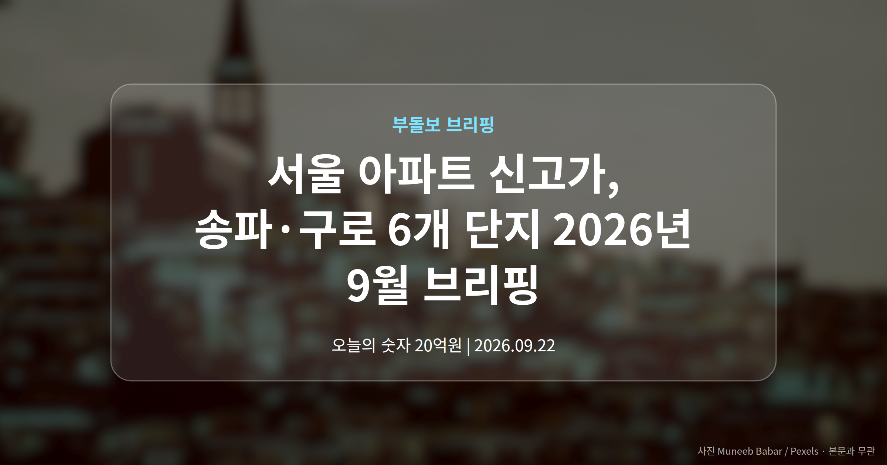
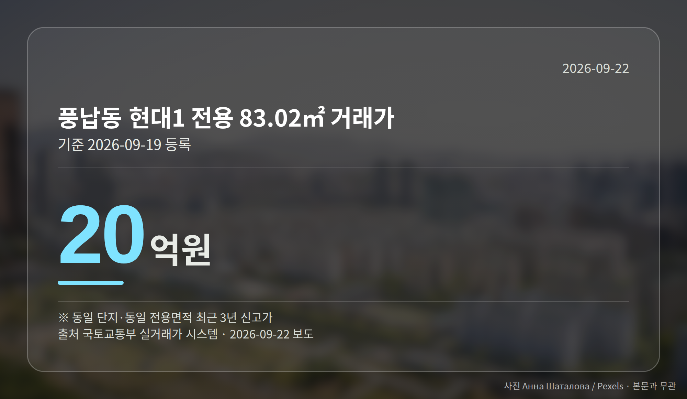
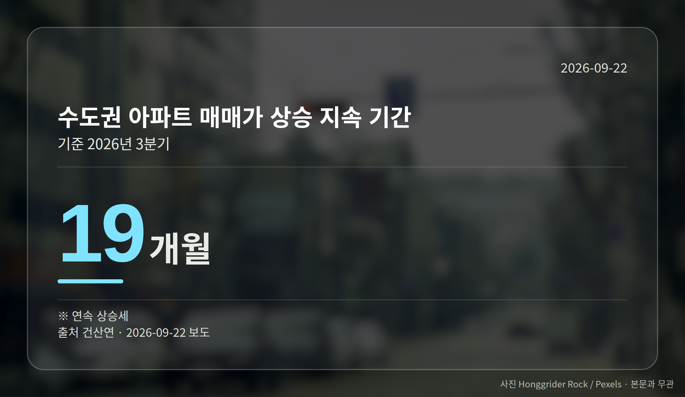
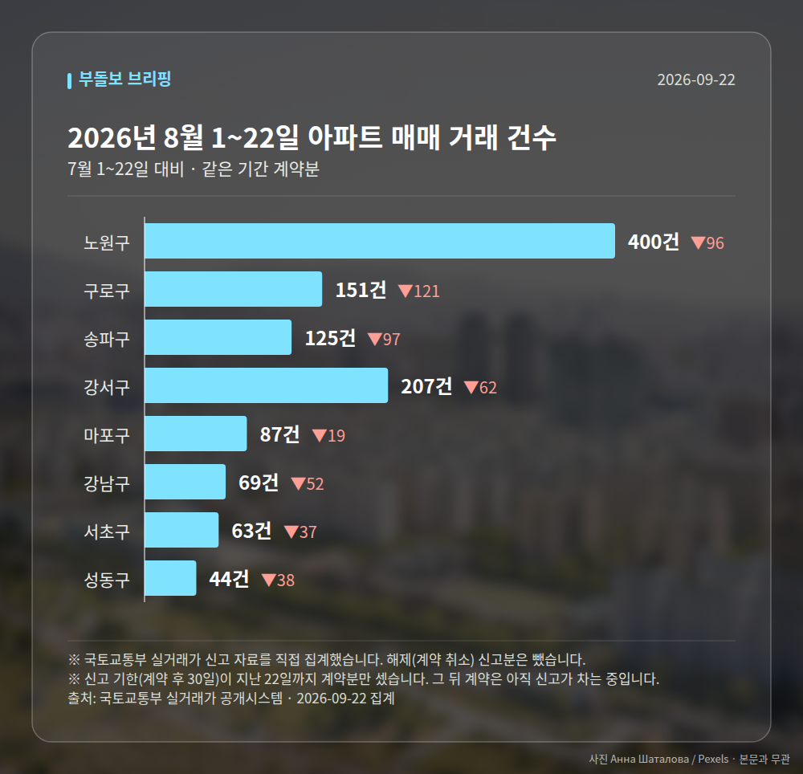

*이 글은 2026년 9월 22일 기준으로 정리한 내용입니다. 실거래 거래 건수는 2026년 8월 1~22일 계약분(신고 기한이 지난 것), 전세가율 등은 2026년 7월 신고분입니다.*
**3줄 요약**

- 9월 19일 서울 6개 단지 최근 3년 신고가 거래 등록
- 송파 풍납동 현대1 20억원, 구로 개봉동 한진 7억 2천만원
- 수도권 매매가는 19개월째 상승, 거래량·인허가는 감소
9월 19일 국토교통부 실거래가 시스템에 서울 아파트 신고가 거래가 잇따라 등록됐습니다. 송파구부터 구로구까지 6개 단지가 최근 3년 기준 가장 높은 값에 거래된 것으로 기록됐습니다.

여기서 신고가는 같은 단지, 같은 전용면적(현관 안쪽 실제로 쓰는 공간)에서 이전보다 높은 가격에 거래됐다는 뜻입니다.

## 서울 아파트 신고가, 어느 단지에서 나왔나

가장 높은 금액은 송파구 풍납동 현대1 전용 83.02㎡의 20억원이었습니다. 같은 단지, 같은 면적 기준으로 최근 3년 중 가장 높은 값입니다.

| 단지(전용면적) | 거래가 |
|---|---|
| 송파 풍납동 현대1(83.02㎡) | 20억원 |
| 송파 석촌동 잠실한솔(59.86㎡) | 19억 2,000만원 |
| 동작 사당동 사당자이(84.49㎡) | 14억원 |
| 양천 신월동 신월시영(50.67㎡) | 8억 2,000만원 |
| 구로 고척동 센츄리(84.56㎡) | 7억 3,000만원 |
| 구로 개봉동 한진(59.95㎡) | 7억 2,000만원 |

여섯 건 모두 같은 날 실거래가 시스템에 등록된 거래입니다.

## 강남권만의 흐름은 아니었습니다

눈에 띄는 대목은 지역 분포입니다. 이번 서울 아파트 신고가 6건 가운데 송파구가 두 곳, 나머지는 동작·양천·구로구에 흩어져 있습니다.

브리핑은 이를 두고 신고가 갱신이 특정 지역에 국한되지 않고 서울 전반으로 번지는 흐름으로 봤습니다. 매수·매도 양쪽 모두 호가를 정할 때 이런 기록을 참고할 가능성이 있습니다.

다만 각 기사는 등록 사실만 전할 뿐 거래 배경이나 시장 해석은 담고 있지 않습니다. 개별 거래 몇 건을 시장 전체의 방향으로 읽기에는 조심스러운 이유입니다.

[이미지: 서울 한강 인근 아파트 단지 전경 사진]

## 서울 아파트 신고가를 수도권 흐름과 함께 보면

건설산업연구원(건산연) 3분기 조사에서 수도권 아파트 매매가는 19개월 연속 상승했습니다. 전월세 계약 가운데 월세가 차지하는 비중도 67.6%로 나타났습니다.

반면 거래량은 줄었고 인허가 같은 공급 지표도 주춤했습니다. 값은 오르는데 실제 손바뀜은 많지 않은, 이른바 '거래 없는 상승'일 가능성이 제기되는 대목입니다.

## 그 밖의 오늘 소식

- 고양 대곡·의왕 오전왕곡, 9월 22일 공공주택지구 지정
- 두 지구 합쳐 2만3400가구, LH 시행·2029년 착공
- 건산연, 지방 중심 미분양 부담을 문제로 지적

**그래서 나는?**

- 매수를 준비 중이라면, 관심 단지의 동일 면적 실거래부터 확인해 보세요
- 1주택자라면, 내 단지 신고가가 호가에 반영됐는지 살펴볼 수 있습니다
- 전세 계약을 앞뒀다면, 월세 비중 67.6%라는 임대 구조 변화를 참고해 보세요

**직접 센 숫자 — 2026년 8월 1~22일 아파트 실거래**

서울 8개 구 계약 매매 **1146건** (7월 1~22일 1668건, -522건)

거래가 많은 곳: 노원구 400건(-96) · 구로구 151건(-121) · 송파구 125건(-97)

신고 기한(계약 후 30일)이 지난 22일까지 계약분끼리 견줬습니다.

노원구 전세가율 가운뎃값 **55.2%** (같은 단지·같은 면적 132곳)

서울 25개 구 가운데 거래가 가장 크게 움직인 곳: 중랑구 -74.1%(428→111건, 7월 1~22일엔 묵동에 71.3% 몰렸음) · 영등포구 -53.2%(188→88건)

2026년 8월 계약 신고가

- 구로구 영화 143.09㎡ — 10.8억 (이전 최고 8.3억, +30.1%, 8월 14일 계약)
- 강서구 마곡서광(치현마을) 84.93㎡ — 7.6억 (이전 최고 6.0억, +26.7%, 8월 30일 계약)

*국토교통부 실거래가 신고 자료를 직접 집계했습니다. 해제 신고분은 뺐습니다.*
**여러분이 눈여겨보는 단지의 최근 실거래가는 1년 전과 얼마나 달라졌나요?**

---

### 참고한 기사

1. **송파구 풍납동 현대1 전용 83.02㎡ 20억원…최근 3년 신고가 [MAI부동산]**
   - [매일경제·부동산](https://www.mk.co.kr/news/realestate/12157783)
2. **수도권 아파트 매매가 19개월 연속 오름세…월세 비중 67.6%·지방 미분양 부담**
   - [서울뉴스통신](https://news.google.com/rss/articles/CBMia0FVX3lxTE1KYXdCUW1ZRlJvaFJJelIwRXh6a3hMVDZFbjZGTXB1YVJMZ3BkNmNHczFOem1teXN6NFpCM1k4Qk1rakp1M0dQa0dvX1VjMWZBaUEyT2U1a2tGbXZTdHZLdExaVG94YmstZ2dr?oc=5)
   - [메디컬투데이](https://news.google.com/rss/articles/CBMibEFVX3lxTE5sblgxUllhTmxKZUNRb3ZwZE8wOWdOcm1YRXFOS184U1VHbHB0S2NtMXRUTDBfVVBxTUQ4YUN5U1RfZjlyb2ltVmVTVEtZMWZUNE5Vb2ZFcGtodmRkN0RiRmtJa21CRy1GYWlkaQ?oc=5)
3. **집값도 전월세도 올랐다…수도권 아파트 19개월째 상승**
   - [한국경제](https://news.google.com/rss/articles/CBMiWkFVX3lxTFBveURfNXVfZFpfWlFGYTg1UnFqLXhzQmJrTDBSMGV0YUFpMHFjZlR4bzI5QUZnbFA2ZHViZ1I2LUd3WUEwSml5bVlfaUxIM2ppS0cyQ3pwZW5PUQ?oc=5)
   - [뉴시스](https://news.google.com/rss/articles/CBMieEFVX3lxTFA1OGhzSmd4UWJKVW51eEdhRHg1dENDVTdpZ2dBejI4NWxvMmxIWGFNMkVSdlczX1lBQy1UMzA0QTBzNlFzaHFmTHE3b0tMWXJ4amh2ME1rbExrbVRaSkNJcm9Gd3dOZXdsa2tmb05WbDJtUU1qQ0xCa9IBeEFVX3lxTFA1OGhzSmd4UWJKVW51eEdhRHg1dENDVTdpZ2dBejI4NWxvMmxIWGFNMkVSdlczX1lBQy1UMzA0QTBzNlFzaHFmTHE3b0tMWXJ4amh2ME1rbExrbVRaSkNJcm9Gd3dOZXdsa2tmb05WbDJtUU1qQ0xCaw?oc=5)
4. **고양대곡·의왕오전왕곡에 2.3만가구 공공주택 공급**
   - [한국경제·부동산](https://www.hankyung.com/article/2026092189741)
   - [매일경제·부동산](https://www.mk.co.kr/news/realestate/12158482)
5. **수도권 집값 19개월 연속 상승…거래·공급은 '주춤'**
   - [뉴스핌](https://news.google.com/rss/articles/CBMiXEFVX3lxTFBaa0ZFaDdCeTNNc3BnanVSSjBGMi10MDNnNlc0Y1hZTTVrM0xjQ2Z1YU9tNlB4a1Q5cmRlX0Q4cC14VGowUE4zOEtoUGhVTy11OWVpVlB5cXVSOEFf?oc=5)
   - [핀포인트뉴스](https://news.google.com/rss/articles/CBMid0FVX3lxTE44bTJ2aC1xRGxieExPcEdzTzNELXVIT2F2c1VMNEpWMVVxN1k0UXdFYTVtQ0FyM01pWE9ZY2xTMGw0d3dyQ2hWclk0YVhqLXM4OU5DYnJIb2hmcjltVjdIOHEwVEJYV3d5YkREQUU0R21uM0o0SDRF0gF3QVVfeXFMTjhtMnZoLXFEbGJ4TE9wR3NPM0QtdUhPYXZzVUw0SlYxVXE3WTRRd0VhNW1DQXIzTWlYT1ljbFMwbDR3d3JDaFZyWTRhWGotczg5TkNickhvaGZyOW1WN0g4cTBUQlhXd3liRERBRTRHbW4zSjRINEU?oc=5)

---

*본 글은 공개된 언론 보도를 정리한 것이며, 투자 판단의 책임은 이용자 본인에게 있습니다.*
