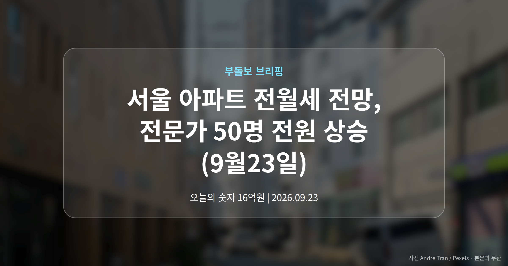
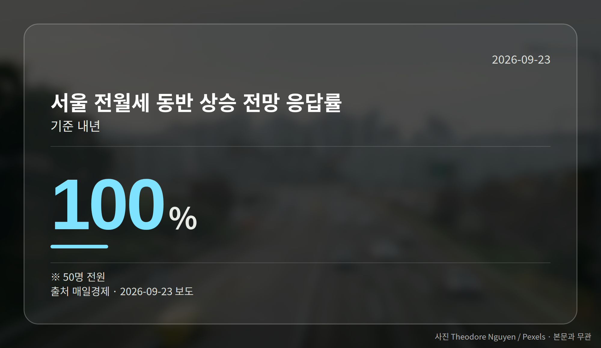
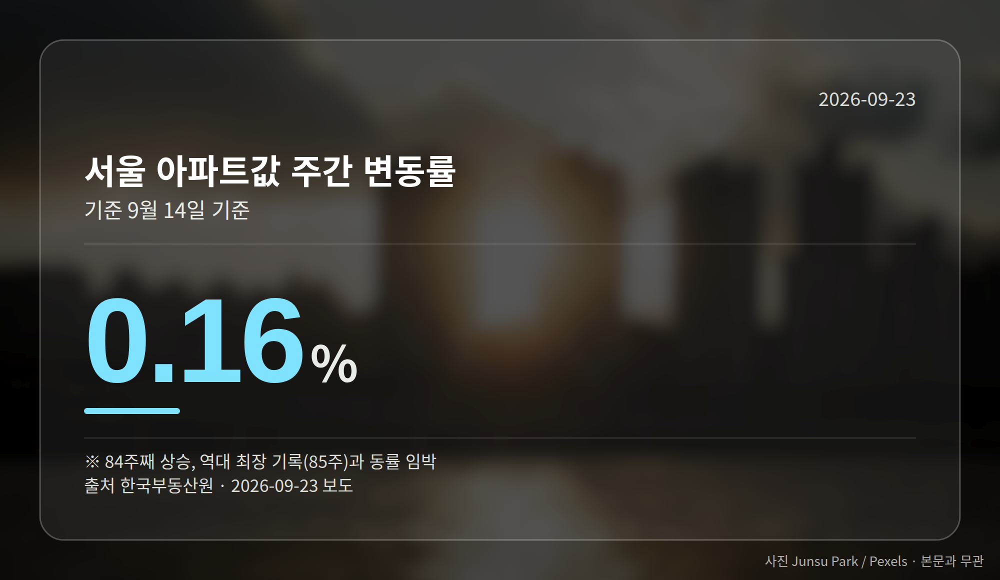
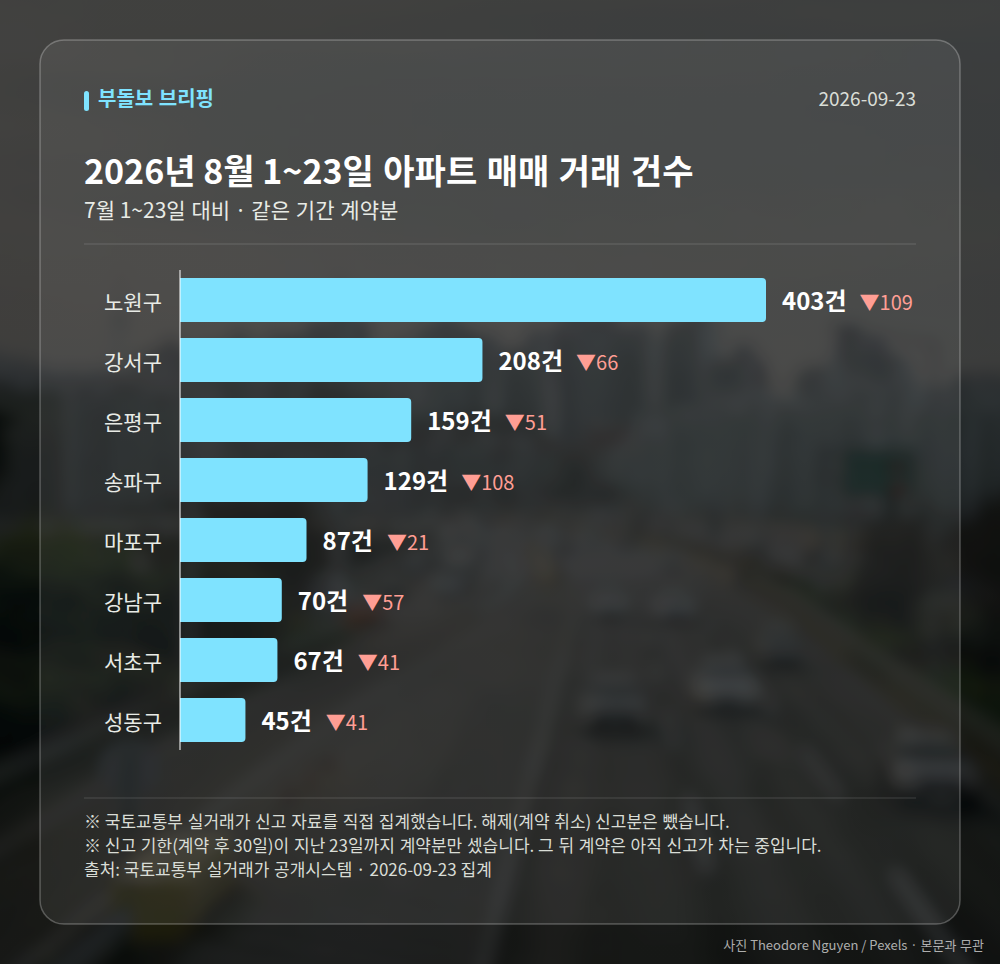

*이 글은 2026년 9월 23일 기준으로 정리한 내용입니다. 실거래 거래 건수는 2026년 8월 1~23일 계약분(신고 기한이 지난 것), 전세가율 등은 2026년 7월 신고분입니다.*
**3줄 요약**

- 매일경제 설문, 부동산 전문가 50명 전원이 내년 서울 전월세 상승 전망
- 서울 아파트값 9월 14일 기준 0.16% 상승, 84주 연속 오름세
- 강남 3구는 하락 전환, 중랑·도봉 등 외곽이 상승 주도하는 흐름 확인
부동산 전문가 50명 전원이 내년 **서울 아파트 전월세 전망**을 '동반 상승'으로 답했습니다. 매일경제가 추석 이후 시장을 물은 설문 결과입니다.

서울 아파트값은 9월 14일 기준 84주째 오름세를 이어갔습니다. 다만 지역별 온도는 뚜렷하게 갈렸습니다.

## 서울 아파트 전월세 전망, 전문가 50명은 어떻게 봤나

설문 대상은 건설·시행·대학·금융·협회 등에 속한 부동산 전문가 50명입니다. 내년 상반기까지 서울 아파트값 상승을 예상한 응답이 92%(46명), 서울을 뺀 수도권 상승 전망은 86%(43명)였습니다.

전월세는 응답자 50명 전원이 함께 오른다고 봤습니다. 전셋값은 5% 이상 오른다는 응답이 44%(22명), 3~4.9%가 52%(26명)로 3% 이상 상승 전망이 96%에 달했습니다.

월세도 비슷합니다. 5% 이상이 48%(24명), 3~4.9%가 40%(20명)로 합치면 88%입니다. 주거비 부담이 매매가보다 체감으로 먼저 다가올 수 있는 대목입니다.

## 84주 연속 오른 서울 아파트값, 속은 갈렸습니다

한국부동산원에 따르면 지난주 서울 아파트값은 전주 대비 0.16% 올랐습니다. 이번 주까지 오름세가 이어지면 2020~2022년의 역대 최장 기록(85주)과 어깨를 나란히 하게 됩니다.

다만 같은 서울 안에서도 방향이 달랐습니다. 강남 3구는 8·3 세제개편안(부동산 관련 세금 제도를 바꾼 정부 발표) 이후 하락으로 돌아섰고, 외곽은 상승폭이 컸습니다.

| 자치구 | 주간 변동률 |
| --- | --- |
| 강남구 | -0.36% |
| 서초구 | -0.26% |
| 송파구 | -0.12% |
| 중랑구 | 0.51% |
| 도봉구 | 0.47% |
| 서대문구 | 0.47% |

## 서울 아파트 전월세 전망이 실수요자에게 뜻하는 것

전문가들이 추석 이후 집값에 가장 큰 영향을 줄 요인으로 꼽은 것은 기준금리와 주담대(주택담보대출) 금리 변동이었습니다. 응답률 52%로 1위였습니다.

정리하면, 이번 **서울 아파트 전월세 전망**은 '가격 상승 기대는 유지되지만 지역별로 갈린다'는 쪽에 가깝습니다. 전망은 어디까지나 설문에 응한 전문가들의 견해라는 점도 함께 기억해 두시면 좋겠습니다.

[이미지: 서울 주택가와 아파트 단지 전경 사진]

## 그 밖의 오늘 소식

- 평택지제역 7억원대, 동탄역 16억원대로 절반 수준
- 한화, 평택 '포레나지제역' 10월 분양 예정
- 홍지선 국토부 장관, 첫 행보로 부천대장지구 방문

**그래서 나는?**

- 전세 계약을 앞뒀다면, 재계약 시점의 보증금 여력부터 점검해 보세요
- 무주택 실수요자라면, 금리 변동이 최대 변수로 꼽힌 점을 참고하세요
- 1주택자라면, 내 지역이 강남권인지 외곽인지 흐름이 갈릴 수 있습니다

**직접 센 숫자 — 2026년 8월 1~23일 아파트 실거래**

서울 8개 구 계약 매매 **1168건** (7월 1~23일 1662건, -494건)

거래가 많은 곳: 노원구 403건(-109) · 강서구 208건(-66) · 은평구 159건(-51)

신고 기한(계약 후 30일)이 지난 23일까지 계약분끼리 견줬습니다.

노원구 전세가율 가운뎃값 **55.2%** (같은 단지·같은 면적 132곳)

서울 25개 구 가운데 거래가 가장 크게 움직인 곳: 중랑구 -74.4%(434→111건, 7월 1~23일엔 묵동에 70.7% 몰렸음) · 영등포구 -55.1%(196→88건)

2026년 8월 계약 신고가

- 강서구 마곡서광(치현마을) 84.93㎡ — 7.6억 (이전 최고 6.0억, +26.7%, 8월 30일 계약)
- 노원구 청솔(시영7) 39.78㎡ — 5.8억 (이전 최고 4.7억, +24.2%, 8월 25일 계약)

*국토교통부 실거래가 신고 자료를 직접 집계했습니다. 해제 신고분은 뺐습니다.*
**여러분의 전월세 계약 만기는 언제이고, 지금 그 동네 시세는 어떻게 움직이고 있나요?**

---

### 참고한 기사

1. **“동탄역 10분인데 아파트는 반값”…평택지제역 일대 집값 상승**
   - [비즈트리뷴](https://news.google.com/rss/articles/CBMicEFVX3lxTE5zU0twU2VFVG1xcGFVLUZ0LVI0ZG91bHFOb250eHB4V19wWVB3S2Y4X0hNLVg2bng3M1pXS1ROQ2RpbzljSzlmblZtNWo0WkE5RlJOYVpRb21YR0JDRHlTU3ZHQXp3SjR2cWJuX2ZmTlY?oc=5)
   - [스마트비즈](https://news.google.com/rss/articles/CBMibEFVX3lxTE0wdnk1Mkh4QkdtdDlqRndya3JnU3prQ3p1aURvMW85UWd3eFhQS0xXSlBTcnRJRmxkLXFVVUhTVV9SWm04Z2R6VUhhYnlPLUVuR2xCaUtCVGE5TGVTVThUc2tQSFEwWk5hOTNtNA?oc=5)
2. **취임 첫날 3기 신도시로…홍지선 국토장관, 주택공급 속도**
   - [데일리안](https://news.google.com/rss/articles/CBMijgJBVV95cUxQQi1Tb0paUWhZSVhOa2hMbk02ZUh5NUhzYXo3QWtQV01TeEEtbzVoX1ZRai1jTFFOMURxc1dPOWJqMXYxTEktaExFY1piSGdkV3dVNWg0NFM2dGpEX1l5Z3lPbXRzbjFWZ3NlTWlLMTRJOVJzSF92Y0lvR091UElJSEJnbVlKbHdUTVQ2RmF0OVVQS0JEb21tUWZIYUJCLU9KSkdXb3J6Ny1JTEdvU0diY01Pd3BhNWQtMHZ0UFE0Z2dBYmxNZU5xdFZmaHVQeUFZMWdISWZkSlVhRlNmeVFVWEJudTV5d1hULXBzdmJzVXJaUk00aXlDT2hfakZnUGdPeXdyVzROREZWTnhWNnc?oc=5)
   - [조선비즈·부동산](https://biz.chosun.com/real_estate/real_estate_general/2026/09/22/HYQPNHZPAJFMXIMEHZ6TEAROJA)
3. **집값 상승 기대 크면 양도세 깎아줘도 집 안 판다**
   - [세계일보](https://news.google.com/rss/articles/CBMiWEFVX3lxTE1pbGFYLTVVbGxoV0ZzR1J5MUR6eWxlSVFyQ1dndHRrSWpNZEhDM2xScHVXVktpSmVDX2FZb0JtWHdVZVJjNnNkMW03a3B5S0liT2RHN0t0RznSAVRBVV95cUxQMU42eTlqaGFjOHJINVVOUHZxRzYzZzVqdFkyYVNDUkxoSHlyOTB5YnhucWRpR0hfZTZnMG9hcW9aREhUdmY5MkRoRjY4WHpvX1VxbEI?oc=5)
   - [서울경제](https://news.google.com/rss/articles/CBMiU0FVX3lxTFBneXlOdUY4R3o0RnMwTEdtQ19acUhkblZfRC1VRE91azJvZk9mTXdiYVRKM1NLMzU5cUN0RFVseXhUWlZ6bmowdDN6T0s2U3ZHVWdN0gFTQVVfeXFMUGd5eU51RjhHejRGczBMR21DX1pxSGRuVl9ELVVET3VrMm9mT2ZNd2JhVEozU0szNTlxQ3REVWx5eFRaVnpuajB0M3pPSzZTdkdVZ00?oc=5)
4. **동탄 10분·집값은 절반…지제역 ‘차별화’에 한화포레나 가세**
   - [브릿지경제](https://news.google.com/rss/articles/CBMiWkFVX3lxTE03WjNyLUpvNWRQa3JuQ2tadVVpc1ZZendaT1NWVFdNeHE1bTBfSlNfbi1iNFB1WmRZTTFtUFJ4V1RCVEpFODEwY2VOcXZMUXVXQmt2TDhIYi1Fdw?oc=5)
   - [apnews.kr](https://news.google.com/rss/articles/CBMiaEFVX3lxTE5hMS1mS1NBRlMyenVUODMweVpBV2M0a3NCekc1S3V4TEdDaDlyWG5FWE1qYzFsR1RMODZwX0xoMTlFSHhVcFlZYXFVWFp4Tld6a1NEQkVjVlg5LWQ2RFoyWHdWQUZhcThr0gFsQVVfeXFMTTlVQjIyYVkwWkN5YVlFLU1sa2hmWEtuZUF1c0ZNVURWRzJVWUhUeVpaV1Mxb3NQRm5rd2taU1N3bnJUeFlxUjNrZEUwQ2dHNkQzU2lOcm9oTENMR1pMdUcwZThRNzJGUFFvemto?oc=5)
5. **“서울 집값·전월세 내년엔 더 오른다”…부동산전문가 50명 만장일치**
   - [매일경제·부동산](https://www.mk.co.kr/news/realestate/12159810)
   - [재경일보](https://news.google.com/rss/articles/CBMiSkFVX3lxTE5HT3M2eWdQaUVVUDJUUzRXQS1QbzlNMnptRE05cGVWZG9jcE9qVWgzTV95UmVVREN0b3NxNERRMmZnNnhLMk4tZkh3?oc=5)

---

*본 글은 공개된 언론 보도를 정리한 것이며, 투자 판단의 책임은 이용자 본인에게 있습니다.*
