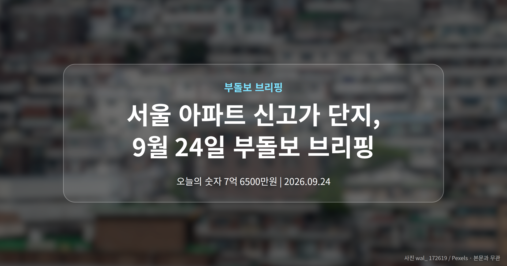
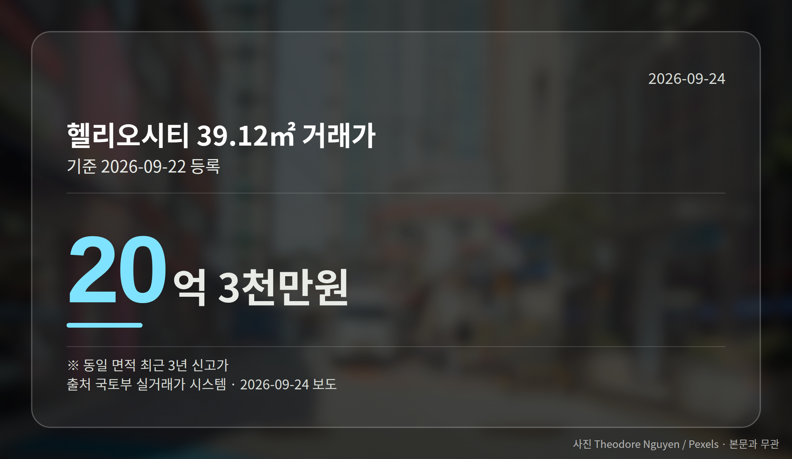
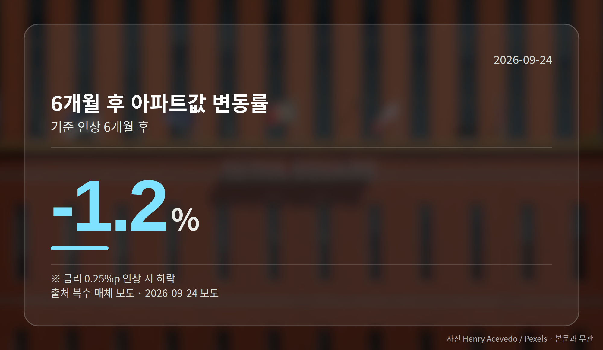
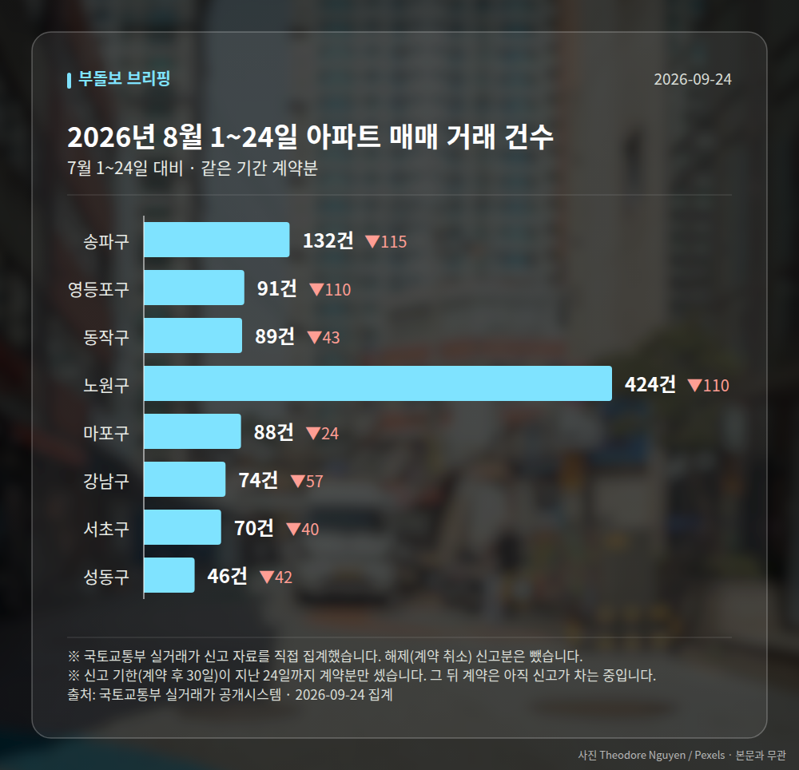

*이 글은 2026년 9월 24일 기준으로 정리한 내용입니다. 실거래 거래 건수는 2026년 8월 1~24일 계약분(신고 기한이 지난 것), 전세가율 등은 2026년 7월 신고분입니다.*
**3줄 요약**

- 9월 22일 국토부 실거래가에 서울 4개 구 6개 단지 신고가 등록
- 헬리오시티 39.12㎡ 20억 3천만원 등 최근 3년 최고 가격
- 금리 0.25%p 인상 시 6개월 뒤 1.2% 하락 분석도 함께 보도
9월 22일 국토부 실거래가 시스템에 **서울 아파트 신고가** 거래가 한꺼번에 등록됐습니다. 구로·송파·동작·관악 4개 자치구, 6개 단지입니다.

다만 같은 날 금리 인상 시 집값이 내린다는 분석도 함께 보도됐습니다. 오르는 쪽과 눌리는 쪽 신호가 같이 나온 하루였습니다.

## 서울 아파트 신고가, 어느 단지에서 나왔나

최근 3년 기준 신고가라는 뜻은, 같은 단지 같은 면적에서 3년 안에 이보다 비싸게 팔린 적이 없다는 의미입니다.

| 단지(전용면적) | 거래가 |
| --- | --- |
| 송파 헬리오시티 39.12㎡ | 20억 3천만원 |
| 송파 오금동 현대백조 114.36㎡ | 19억 8천만원 |
| 동작 대방1차e-편한세상 84.32㎡ | 18억 2,500만원 |
| 관악 e편한세상서울대입구2차 84.31㎡ | 15억 9,500만원 |
| 동작 사당자이 60㎡ | 12억 7천만원 |
| 구로 구로두산 51.84㎡ | 7억 6,500만원 |

눈에 띄는 건 면적입니다. 헬리오시티는 39㎡대 소형인데도 20억원을 넘겼습니다.

반대로 구로두산은 51㎡대에 7억원대로, 같은 서울 안에서도 가격대 차이가 크다는 점이 드러납니다.

## 이 서울 아파트 신고가를 어떻게 읽어야 하나

4개 구에서 동시에 나왔다는 점은 최근 해당 지역 매수세가 강했다는 신호로 볼 수 있습니다.

다만 6건 모두 개별 단지, 개별 면적의 실거래 신고 건입니다. 서울 전체 시세가 같은 방향인지는 이 자료만으로는 확인되지 않습니다.

신고가 한 건이 나와도 같은 단지의 다른 거래는 더 낮은 가격일 수 있습니다. 관심 단지가 있다면 면적별로 최근 몇 건을 함께 보시는 편이 안전합니다.

[이미지: 스마트폰으로 아파트 실거래가를 확인하는 모습]

## 금리 변수는 반대 방향을 가리킵니다

같은 날, 기준금리(한국은행이 정하는 돈의 기준 가격)가 0.25%p 오르면 6개월 뒤 아파트값이 1.2% 내린다는 분석이 여러 매체에서 인용 보도됐습니다.

주의할 점이 있습니다. 이 분석의 조사 기관과 조사 방법, 적용 지역 범위는 보도에서 확인되지 않았습니다. 참고치 정도로 두시는 게 맞겠습니다.

정리하면, 오늘 나온 서울 아파트 신고가는 지금까지 체결된 거래의 결과이고, 금리 분석은 앞으로의 조건부 전망입니다. 시점이 다른 두 이야기입니다.

## 그 밖의 오늘 소식

- 홍지선 국토부 장관 취임, 135만가구 공급 실행력이 과제로 제기
- 홍 장관 첫 행보로 3기 신도시·도심 정비 속도 강조
- 경남도, 재개발·재건축 조합 표준정관 제정 추진

**그래서 나는?**

- 무주택 실수요자라면, 관심 단지의 면적별 실거래가부터 확인해 보세요
- 1주택자라면, 신고가 한 건이 단지 전체 시세인지 따져볼 필요가 있습니다
- 대출을 끼고 매수 예정이라면, 금리 변수까지 함께 살펴보시는 게 좋습니다

**직접 센 숫자 — 2026년 8월 1~24일 아파트 실거래**

서울 8개 구 계약 매매 **1014건** (7월 1~24일 1555건, -541건)

거래가 많은 곳: 송파구 132건(-115) · 영등포구 91건(-110) · 동작구 89건(-43)

신고 기한(계약 후 30일)이 지난 24일까지 계약분끼리 견줬습니다.

송파구 전세가율 가운뎃값 **40.0%** (같은 단지·같은 면적 76곳)

서울 25개 구 가운데 거래가 가장 크게 움직인 곳: 중랑구 -74.3%(444→114건, 7월 1~24일엔 묵동에 69.1% 몰렸음) · 영등포구 -54.7%(201→91건)

2026년 8~9월 계약 신고가

- 노원구 청솔(시영7) 39.78㎡ — 5.8억 (이전 최고 4.7억, +24.2%, 8월 25일 계약)
- 노원구 상계주공12(고층) 41.3㎡ — 5.8억 (이전 최고 4.8억, +21.9%, 9월 9일 계약)

*국토교통부 실거래가 신고 자료를 직접 집계했습니다. 해제 신고분은 뺐습니다.*
**여러분이 지켜보는 단지의 최근 실거래가는 1년 전과 얼마나 달라져 있나요?**

---

### 참고한 기사

1. **구로구 구로두산 51.84㎡ 7억 6500만원… 최근 3년 신고가 [MAI부동산]**
   - [매일경제·부동산](https://www.mk.co.kr/news/realestate/12159982)
2. **"금리 0.25%p 올리면 6개월 뒤 아파트값 1.2%↓"**
   - [맑은뉴스](https://news.google.com/rss/articles/CBMiZ0FVX3lxTE5RclhNbHEwSUZyMlJUWkkyZGd5cmtscGNTejIzWkNmTWFUOG5OUHZCbXFDbi1aTVNQQkk2ZGE5Y2JhTTlBYUhnUjdZQTFHYzYwQTdpMkI1eGQyUHlXc2E5QVczOWg0S0U?oc=5)
   - [서울파이낸스](https://news.google.com/rss/articles/CBMiakFVX3lxTE1WV2lNa1lyUjNjbTlwb0JZQkxGMXJ3MG13VUJIaXlacGJDU3ZkQkRYeEdpQjN6a3R5aDdCV2tzNzZWSWhvZWNnTXJ5OUZBc3J2dmRvZHU2MkVhci1qS2tlV0E1OGNvSWMwbGc?oc=5)
3. **홍지선 국토부 장관 취임…135만가구 공급 ‘실행력’ 시험대**
   - [동행미디어 시대](https://news.google.com/rss/articles/CBMiXkFVX3lxTE9wUjZtcWtmallkMDB4bllHeWpDX1ljYUpPbWd6RktValYwZWZvbElvRGtBU29VTjc4Rnp2bUZWS25TZHhNX1V3N21ROHEtYXgyeFVmaDRiczBjOE00S0E?oc=5)
   - [조선비즈·부동산](https://biz.chosun.com/real_estate/real_estate_general/2026/09/23/CX3FZ6YFQNC7XGJ26ZYWG2HQKY)
4. **경남, 첫 재개발·재건축 표준정관 만든다**
   - [스트레이트뉴스](https://news.google.com/rss/articles/CBMic0FVX3lxTE55c1prdW5sMHJQbWpVTkt4bmtnb1k3TUZ5eHZpcW44TERNbXprWXZDT2trOWNjT0R2cXZsdTJHcXBMY29DRHU2R2lpenhzc0dnZ1FqRlF2ZkQ3eG5Jc282ckx1RnFwZXpialRhWFJKRndVb2fSAXdBVV95cUxQNS0xWU1xaDh4eW1QVnZYd1ZvcFJYeFZaTmxsOEYwVTNaMWtWYWF4c3dqbXJRNmlzdUp4aGF1eWFNc3RGNGJnNEhEb3dfaUQzVDk3d0VvbTljMXU5UFVrQUJxQlQyZXc5eDNZNGIyeFlNV2pRS2FTcw?oc=5)
   - [경남뉴스](https://news.google.com/rss/articles/CBMiaEFVX3lxTFBfdS02bEJoVVlzN09sRUk4aUZuMWlSQlkwaXY4cVBESFZ2NmR6Q0xTcmtUTEpRRUlyaWlfc2NJckFJU1REMnVIZnVlQ3FublBlTTkzSXdhZWxYbkw3b3BKNk9YNG9OU1V1?oc=5)
5. **홍지선 국토장관 "3기 신도시·도심 정비 속도 높일 것"**
   - [서울파이낸스](https://news.google.com/rss/articles/CBMiakFVX3lxTFBOZU40bkF5Mm11cW1jTERZNF9DYVk5dHg4N3laUW1FN0J5bldSRUg0cjdnNDA4M1FoenRrZFA4bUFTU012a0ZyUDNacXp3ODRSN3ZwUFBybVljUWJpMXJWZmZOczdYV2lVamc?oc=5)
   - [포쓰저널](https://news.google.com/rss/articles/CBMiZEFVX3lxTFBmenprZlZYOW4ydmdlWGhjM2p3MXNRNjA4R2FLLWI1a25ZbGw4eFJqX3dUTktZZm1UWkZMU0FqRkJramp4SDh2TlNPMTkybzZoSFRqMEhDaFlTeDVaTldlcEx4OXU?oc=5)

---

*본 글은 공개된 언론 보도를 정리한 것이며, 투자 판단의 책임은 이용자 본인에게 있습니다.*
