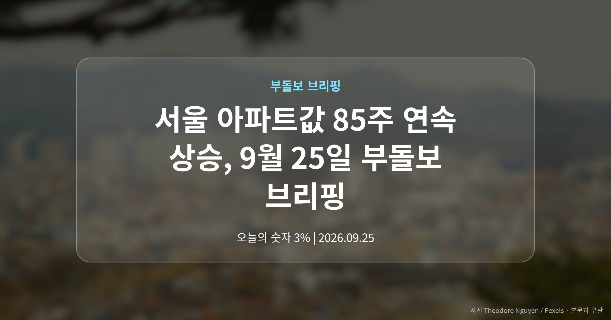
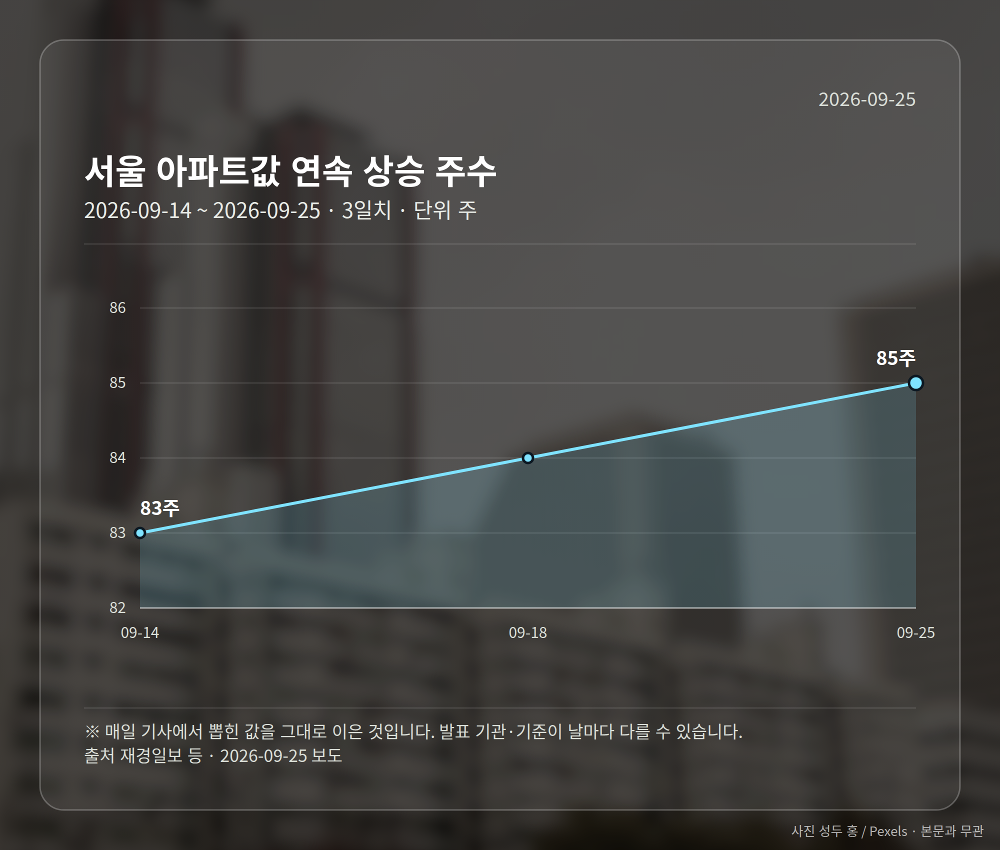
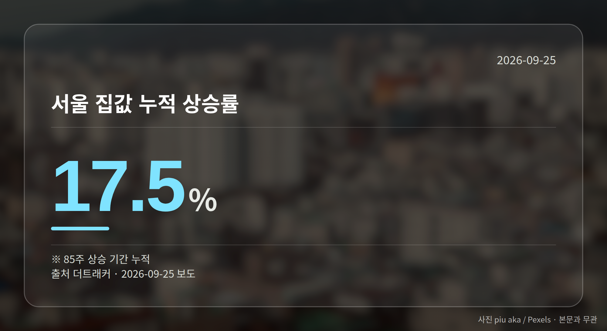
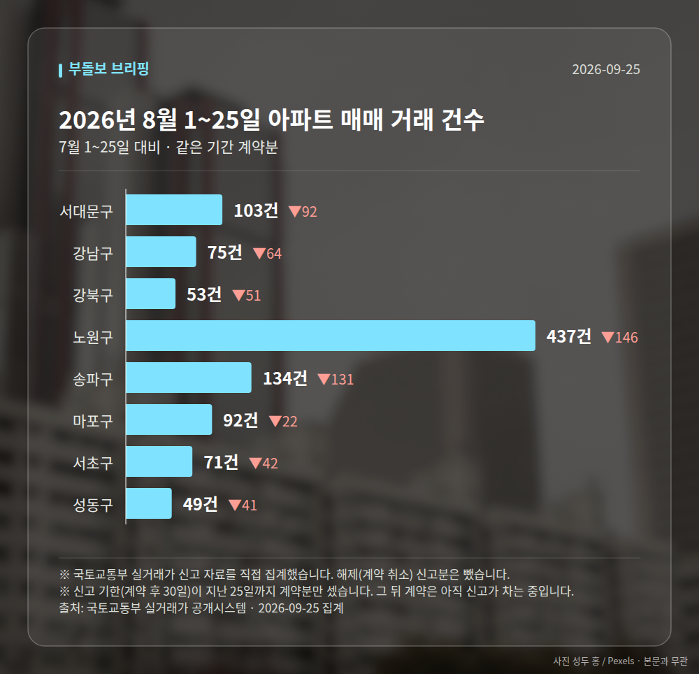

*이 글은 2026년 9월 25일 기준으로 정리한 내용입니다. 실거래 거래 건수는 2026년 8월 1~25일 계약분(신고 기한이 지난 것), 전세가율 등은 2026년 7월 신고분입니다.*
**3줄 요약**

- 서울 아파트값이 85주째 올라 역대 최장 기록과 동률을 이뤘습니다.
- 이 기간 누적 상승률은 17.5%, 문정부 때의 2배라는 보도가 나왔습니다.
- 다만 강남3구는 하락, 강북은 상승이라 지역별로 나눠 볼 때입니다.
서울 아파트값 85주 연속 상승이라는 소식이 9월 25일 26개 매체에서 동시에 보도됐습니다. 문재인 정부 시절 세워진 역대 최장 상승 기록과 동률입니다.

다만 숫자 하나만 보고 판단하기엔 이른 구석이 있습니다. 같은 날 보도에서도 집계 주수가 엇갈렸고, 서울 안에서도 방향이 갈렸기 때문입니다.

## 서울 아파트값 85주 연속 상승, 숫자는 이렇습니다

재경일보 등은 9월 24일 기준 서울 아파트 매매가격이 85주째 올랐다고 전했습니다. 일부 매체는 이 최장 기록이 세워진 시점을 2020년으로 특정했습니다.

여기에 더트래커는 금리 3%, 대출 규제 국면에서도 이 기간 누적 상승률이 17.5%에 달한다고 보도했습니다. 뉴시스는 문정부 때의 2배라고 표현했습니다.

| 항목 | 수치 | 출처 |
| --- | --- | --- |
| 연속 상승 주수 | 85주 | 재경일보 등 |
| 다른 집계 주수 | 88주 | edaily |
| 누적 상승률 | 17.5% | 더트래커 |
| 문정부 대비 | 2배 | 뉴시스 |

주의할 점이 있습니다. edaily는 집계 기준에 따라 88주와 85주로 다르게 나타난다고 짚었는데, 어떤 기준 차이인지는 자료에 나와 있지 않습니다.

## 서울 아파트값 85주 연속 상승인데 강남은 왜 내렸나

newskr.kr은 강남3구가 하락했는데도 서울 전체는 85주째 상승했다고 보도했습니다. JTBC는 '강남 불패'가 흔들리자 강북이 들썩인다고 전했습니다.

ppss.kr도 서울 평균을 기준으로 강남과 강북이 갈라졌다고 봤습니다. 다만 각각의 하락폭·상승폭 수치는 제시되지 않았습니다.

그래서 '서울 평균'이라는 말이 여러분 동네 체감과 다를 수 있습니다. 평균 아래에서 방향이 반대로 움직이는 구간이 있기 때문입니다.

[이미지: 강남과 강북 아파트 단지가 한 화면에 담긴 서울 전경 사진]

## 이 상승세를 밀어올린 것으로 지목된 흐름

머니투데이는 '전세 살 바엔 집 살래'라는 심리로 외곽에서 '생존 매수'가 나타나고 있다고 보도했습니다. DSR(소득 대비 갚아야 할 원리금 비율로 대출 한도를 정하는 규제)이 조여진 상황에서도 매수세가 이어졌다는 설명입니다.

다만 그 규모나 구체적 지역, 거래량 수치는 자료에 담기지 않았습니다. 보도된 해석의 방향만 참고하시는 편이 안전합니다.

## 그 밖의 오늘 소식

- 서울 최장 상승 기록 시점은 2020년으로 특정된 보도가 있습니다.
- 상승률 표현이 '배 이상'과 '2배'로 매체마다 달랐습니다.
- 금리 3%대에서도 상승세가 이어졌다는 보도가 나왔습니다.

**그래서 나는?**

- 무주택 실수요자라면, 외곽 매수 전환 흐름부터 차분히 살펴보세요.
- 1주택자라면, 서울 평균보다 내 지역 흐름을 따로 확인해 보세요.
- 전세 계약을 앞뒀다면, 매수 전환 비용을 먼저 계산해 보세요.

**직접 센 숫자 — 2026년 8월 1~25일 아파트 실거래**

서울 8개 구 계약 매매 **1014건** (7월 1~25일 1603건, -589건)

거래가 많은 곳: 서대문구 103건(-92) · 강남구 75건(-64) · 강북구 53건(-51)

신고 기한(계약 후 30일)이 지난 25일까지 계약분끼리 견줬습니다.

서대문구 전세가율 가운뎃값 **50.4%** (같은 단지·같은 면적 48곳)

서울 25개 구 가운데 거래가 가장 크게 움직인 곳: 중랑구 -74.4%(457→117건, 7월 1~25일엔 묵동에 67.6% 몰렸음) · 영등포구 -56.0%(218→96건)

2026년 8~9월 계약 신고가

- 노원구 청솔(시영7) 39.78㎡ — 5.8억 (이전 최고 4.7억, +24.2%, 8월 25일 계약)
- 노원구 상계주공12(고층) 41.3㎡ — 5.8억 (이전 최고 4.8억, +21.9%, 9월 9일 계약)

*국토교통부 실거래가 신고 자료를 직접 집계했습니다. 해제 신고분은 뺐습니다.*
**여러분이 보고 계신 지역은 이 상승세 안에 있나요, 아니면 바깥에 있나요?**

---

### 참고한 기사

1. **서울 집값 85주째 올랐다…文정부 때 세운 ‘최장 기록’ 따라잡아**
   - [재경일보](https://news.google.com/rss/articles/CBMiSkFVX3lxTE1CQXBVNWRYS3pkV2YwbXFFVURrYWx0WUpNV2xwb2ZpNFQ4dUNLNkM3bU5rTmtRS0FYWDhVbFFYSVk2T0p2ZTZLbVpn?oc=5)
   - [빅터뉴스](https://news.google.com/rss/articles/CBMiZ0FVX3lxTFBPdHRYR3J2LUdjUFZyUFI0cjZGLUM5NTBvT0Jwckl3YTY2b3ZyS2V1ald2TmdINHJmV19XTEg0Mk45TUR6eDRNeURZaXJqZ3FkVTU0bUJzdjJtQ19FUDhBQjZBdnBuanM?oc=5)
2. **서울 아파트 매매가 85주째 올라…최장 상승기간 동률**
   - [데일리굿뉴스](https://news.google.com/rss/articles/CBMicEFVX3lxTE5tRnhWTG5ybG1qOTZUQXJvZGZpVkNzeXBPSU9VcHdxYWhMdmZ3VjFlVFAtbWpkdEpORjFWS0hQR19kYTJObktPUWU2dUxTbktETHpZd3FyODVMdnBDeW9vaEg4b0tzVGJqeXdfeVVTdEbSAXBBVV95cUxObUZ4Vkxucmxtajk2VEFyb2RmaVZDc3lwT0lPVXB3cWFoTHZmd1YxZVRQLW1qZHRKTkYxVktIUEdfZGEyTm5LT1FlNnVMU25LREx6WXdxcjg1THZwQ3lvb2hIOG9Lc1Rianl3X3lVU3RG?oc=5)
   - [포쓰저널](https://news.google.com/rss/articles/CBMiZEFVX3lxTE5BMldXLUVWbHp0WjBScjZJSjl4eHk0amp3RkFfR1VfMXNTWWtWakZaMUw1b0pkTzB4eWRFc1ZyUjR5aUdXRFZpcGNtbE5sS0NwR1pidEFicW02OG1Sc29qazIzX0Y?oc=5)
3. **"전세 살 바엔 집 살래"…외곽 '생존 매수'에 서울 집값 85주 최장 상승 - 머니투데이**
   - [머니투데이](https://news.google.com/rss/articles/CBMib0FVX3lxTE5ZVm45bkhMaS11Mmg2ZGFjdHhxQkpEczB2QlN2OVdaeGozbFlCamhkeVl4M2FHc1VNNkV6MzBMTm5BV3dqTnQ0SlFMbkVoVE1UcVYzblUza200WldLTldDQ19TNTRFRGpyTEJzZjNUTdIBb0FVX3lxTE5ZVm45bkhMaS11Mmg2ZGFjdHhxQkpEczB2QlN2OVdaeGozbFlCamhkeVl4M2FHc1VNNkV6MzBMTm5BV3dqTnQ0SlFMbkVoVE1UcVYzblUza200WldLTldDQ19TNTRFRGpyTEJzZjNUTQ?oc=5)
4. **‘강남 불패’ 흔들리자 강북 들썩…서울 집값 85주째 상승**
   - [JTBC](https://news.google.com/rss/articles/CBMiVEFVX3lxTE9GMmZIb1h3MFUydFFtX2dIS0d2RzAxRC1VTDRJSVFsa0ZZNTJXU01wLVBiR2UzVERnRkt6eVltQ0l5Y3k3UWRlZlZ5Rktjazc2a1BiMw?oc=5)
   - [ppss.kr](https://news.google.com/rss/articles/CBMiZEFVX3lxTE1ZOVhQTmFMeEFyNjdLNzhKbXNkRzJBMTk4aGtfbldSYVdMRzdWRTdCY1VpdmZsQ0k2RmRiRlI1WmYzV2lYbGd6Z0lvd2FidkUxY3VzYXk5Z2RBVjVzenc2b09DSGk?oc=5)
5. **금리 3%·대출 규제에도 서울 집값 85주 상승…누적 상승률 17.5%**
   - [더트래커](https://news.google.com/rss/articles/CBMiWEFVX3lxTFB1REdqV29PX2ZrbU9hR0V5WmtJSEk1ckh5LTIxaHZRRVRzM2hrZUxvQ3l5ZXdHbEUwM2pSRjJQZTkxdF9Pa2FKWGQzcGdMcTYzeHotaURHYUY?oc=5)
   - [뉴시스](https://news.google.com/rss/articles/CBMiYEFVX3lxTE44cnFuZXlRa1B1TURWY1RHMjJKSU91SFFlMFF2OHVPR28wd1lJRFVINDZ2Z3ZPWExxTDFQQ1F2aTZsNnVTMUxzMWxGWDFFdUZQazZnZVppVlI1el9nOXI4NtIBeEFVX3lxTE5RZ3hhQV9IUTFHTHZUZHdtTHNwUFBYdVpIZFhPTFQ2SVNkQW1oRkVSNERURTNPN20tVzBBUkNoZWNMVjdZdC15U2t6Q0U0Mkgtcjc2d1hUZ3lIRWl6cE9xQlNhM3k4emdxdGM2dHNlelMzRV9kUW9PMg?oc=5)

---

*본 글은 공개된 언론 보도를 정리한 것이며, 투자 판단의 책임은 이용자 본인에게 있습니다.*
