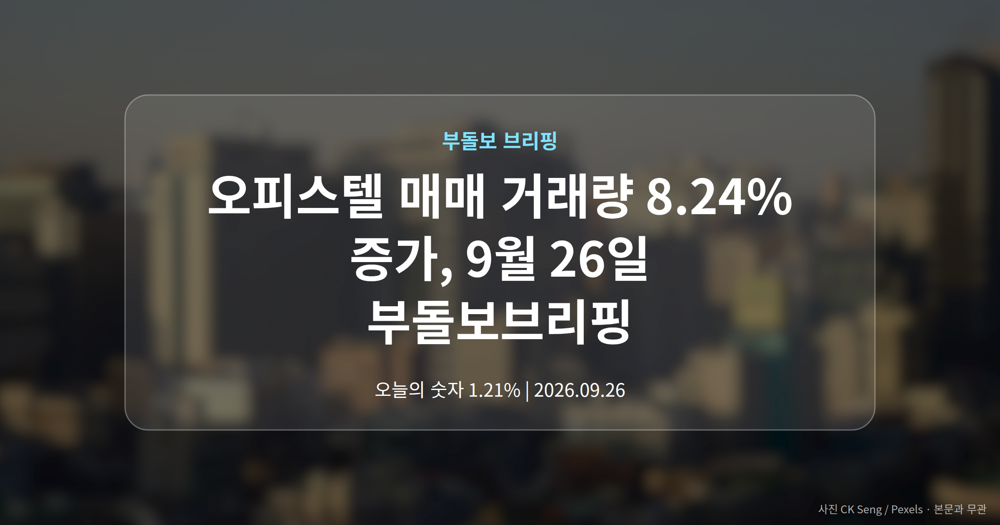
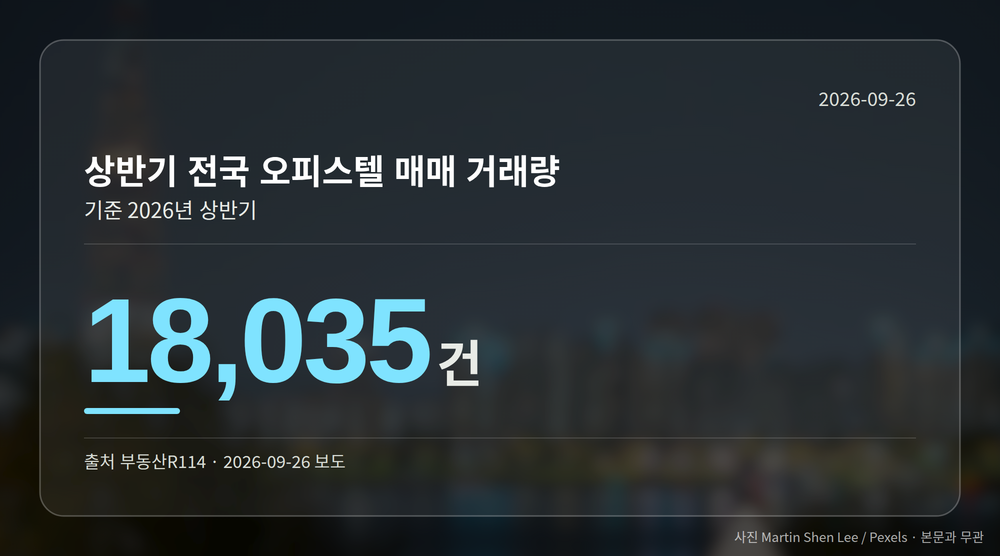
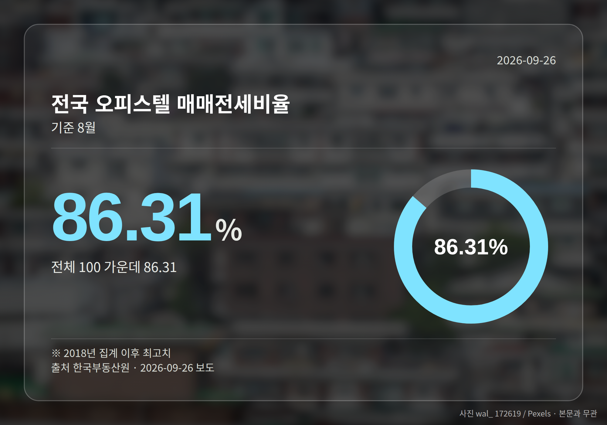
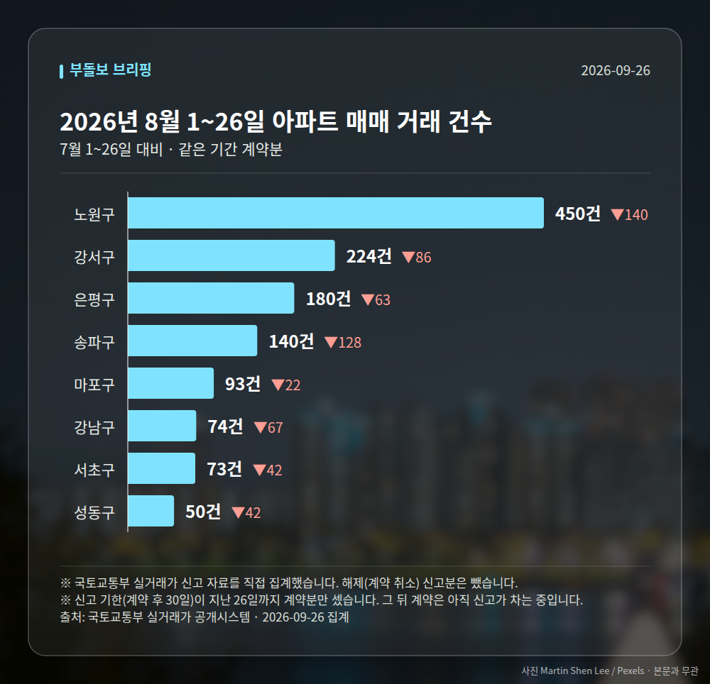

*이 글은 2026년 9월 26일 기준으로 정리한 내용입니다. 실거래 거래 건수는 2026년 8월 1~26일 계약분(신고 기한이 지난 것), 전세가율 등은 2026년 7월 신고분입니다.*
**3줄 요약**

- 아파트 대신 오피스텔로 수요가 옮겨가는 흐름이 확인됐습니다
- 상반기 전국 거래량 1만8035건, 전년 상반기보다 8.24% 증가
- 추석 이후 전국 8곳 5666실 분양 일정부터 확인해 보세요
오늘은 오피스텔 매매 거래량이 눈에 띄게 늘었다는 소식이 중심이었습니다. 올해 상반기 전국 거래량은 1만8035건으로 지난해 상반기보다 8.24% 많았습니다. 아파트 대출 한도가 줄면서 수요가 옮겨간 흐름으로 보도됐습니다.

## 오피스텔 매매 거래량, 상반기에 얼마나 늘었나

부동산R114 집계 기준입니다. 지난해 하반기 1만6192건과 비교하면 11.38% 늘어난 수치입니다.

눈여겨볼 대목은 중대형입니다. 전용면적(현관 안쪽 실제 사용 면적) 60㎡를 넘는 오피스텔은 전년 하반기 대비 21.44% 증가해, 전체 증가폭을 크게 웃돌았습니다.

| 항목 | 수치 |
| --- | --- |
| 상반기 전국 거래량 | 1만8035건 |
| 전년 상반기 대비 | +8.24% |
| 전년 하반기 대비 | +11.38% |
| 전용 60㎡ 초과 거래량 | +21.44% |
| 8월 매매전세비율 | 86.31% |

매매전세비율(매매가격 대비 전세가격의 비율)은 8월 86.31%로 2018년 통계 집계 이후 가장 높았습니다. 한국부동산원 기준입니다.

## 구로구·과천 실거래가에서 확인된 오피스텔 매매 거래량 흐름

가격 쪽 사례도 함께 보도됐습니다. 서울 구로구 신도림 푸르지오 1차 전용 117㎡는 7월 13억원에 거래돼, 종전 최고가 11억1000만원보다 약 2억원 올랐습니다.

경기 과천 힐스테이트 과천 중앙 전용 84㎡는 8월 11억2000만원에 팔렸습니다. 5월 거래가 7억7000만원과 비교하면 약 3억5000만원 차이입니다. 국토부 실거래가 기준입니다.

[이미지: 오피스텔과 아파트가 함께 들어선 도심 주거단지 전경]

## 거래량 증가가 실수요자에게 뜻하는 것

중대형의 가격과 거래가 함께 움직인다는 점이 핵심입니다. 오피스텔이 단순 투자 상품이 아니라 실거주 대체재로 자리 잡고 있다는 해석이 나오는 이유입니다.

공급도 따라옵니다. 추석 이후 전국 8곳에서 오피스텔 5666실 분양이 예정돼 있고, 총 1855가구 규모의 청라 아크원 푸르지오와 경기 오산 세교2지구 '더샵 오산역아크시티'가 이름을 올렸습니다.

다만 해당 기사는 제목에 5600실, 본문에 5666실로 숫자를 다르게 적었습니다. 분양 일정과 함께 원문 기준을 확인하시는 편이 좋겠습니다.

## 그 밖의 오늘 소식

- 서울 20년 초과 아파트 8월 매매가 1.21% 상승, 신축 추월(뉴스토마토)
- 수도권 집값 19개월 연속 상승, 인허가 감소·미분양 증가 보도
- 이문아이파크자이 20억6000만원 거래, 서울 입주권 신고가(조선비즈)

**그래서 나는?**

- 아파트 매입이 부담스러운 실수요자라면, 중대형 오피스텔 실거래가부터 비교해 보세요
- 오피스텔 청약을 기다린다면, 추석 이후 8곳 분양 일정과 입지를 나눠 보셔야 합니다
- 구축 아파트 보유자라면, 8월 상승폭이 신축을 앞선 배경을 확인해 볼 만합니다

**직접 센 숫자 — 2026년 8월 1~26일 아파트 실거래**

서울 8개 구 계약 매매 **1284건** (7월 1~26일 1874건, -590건)

거래가 많은 곳: 노원구 450건(-140) · 강서구 224건(-86) · 은평구 180건(-63)

신고 기한(계약 후 30일)이 지난 26일까지 계약분끼리 견줬습니다.

노원구 전세가율 가운뎃값 **55.2%** (같은 단지·같은 면적 132곳)

서울 25개 구 가운데 거래가 가장 크게 움직인 곳: 중랑구 -72.7%(458→125건, 7월 1~26일엔 묵동에 67.5% 몰렸음) · 영등포구 -53.8%(221→102건)

2026년 8월 계약 신고가

- 강서구 마곡서광(치현마을) 84.93㎡ — 7.6억 (이전 최고 6.0억, +26.7%, 8월 30일 계약)
- 노원구 청솔(시영7) 39.78㎡ — 5.8억 (이전 최고 4.7억, +24.2%, 8월 25일 계약)

*국토교통부 실거래가 신고 자료를 직접 집계했습니다. 해제 신고분은 뺐습니다.*
**여러분이 지금 집을 고른다면 아파트와 주거형 오피스텔 중 어느 쪽을 먼저 보시겠습니까?**

---

### 참고한 기사

1. **서울 아파트 재건축 선호....20년 초과, 매매가 상승폭 압도 : 부동산**
   - [재경일보](https://news.google.com/rss/articles/CBMiSkFVX3lxTFB0TEF3TW9IMmo1MWtjMFdRTXBHaUEwQng5RU1ObHdQQVhGRXZmV3czZDYzcUtXWGVfcU5ocGVWNnh5a3AwWkZzYnhB?oc=5)
   - [천지일보](https://news.google.com/rss/articles/CBMiakFVX3lxTE4wVGNaYlhjem1KVHZxQmhqSENIbHpzRVM5ejM2RHRITlBsQmd3LW1rdy1MdEJtSi1LM19vbnRUcUtybmVsSmoyMWdza0o0Y0FkMnlkY05id2RHbWtYYzdOMXN3STZQbVVTWHc?oc=5)
2. **“아파트 문턱 높아지자 오피스텔 뜬다”…상반기 거래량 전년比 8.24% ‘쑥’**
   - [매일경제·부동산](https://www.mk.co.kr/news/realestate/12161487)
   - [v.daum.net](https://news.google.com/rss/articles/CBMiT0FVX3lxTE1ob1ZsaVB4VlM3Qnp1NTdGc3FudWxrWnZRTmtWVGVtYndnUGZkX1hjQXEtS3pFZVVqNWdrYkgwNXhvcEtVRU5mbGtLblA2TEk?oc=5)
3. **집값 치솟자 떠오르는 '아파텔'… 추석 지나고 5600실 분양 러시**
   - [매일경제·부동산](https://www.mk.co.kr/news/realestate/12161397)
4. **수도권 19개월 연속 집값 상승에도…인허가 줄고 미분양 늘어**
   - [v.daum.net](https://news.google.com/rss/articles/CBMiRkFVX3lxTE5oQXF4QXpYb0Z1MHc0bnFFdW5nQVM1aW1lVnRqZl9hZHptRlJ0Z1Z3YUdnSG1iNWkwa3YtYTVVdGpRZmwtTHc?oc=5)
5. **이문아이파크자이 20억6000만원… 서울 분양·입주권 신고가 행진**
   - [조선비즈·부동산](https://biz.chosun.com/real_estate/real_estate_general/2026/09/26/ZYJMCJ47BJGXLP37QJXRB4AO6Q)

---

*본 글은 공개된 언론 보도를 정리한 것이며, 투자 판단의 책임은 이용자 본인에게 있습니다.*
