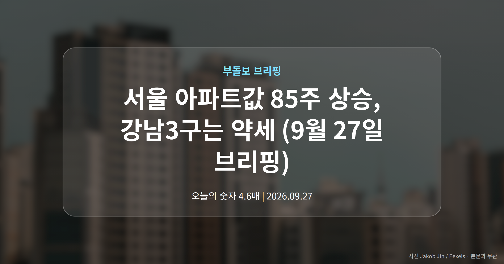
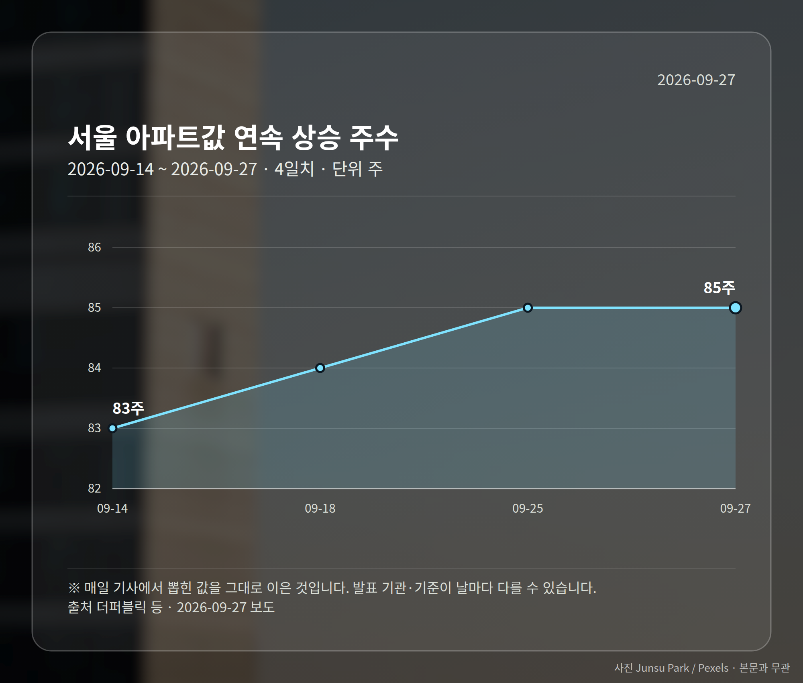
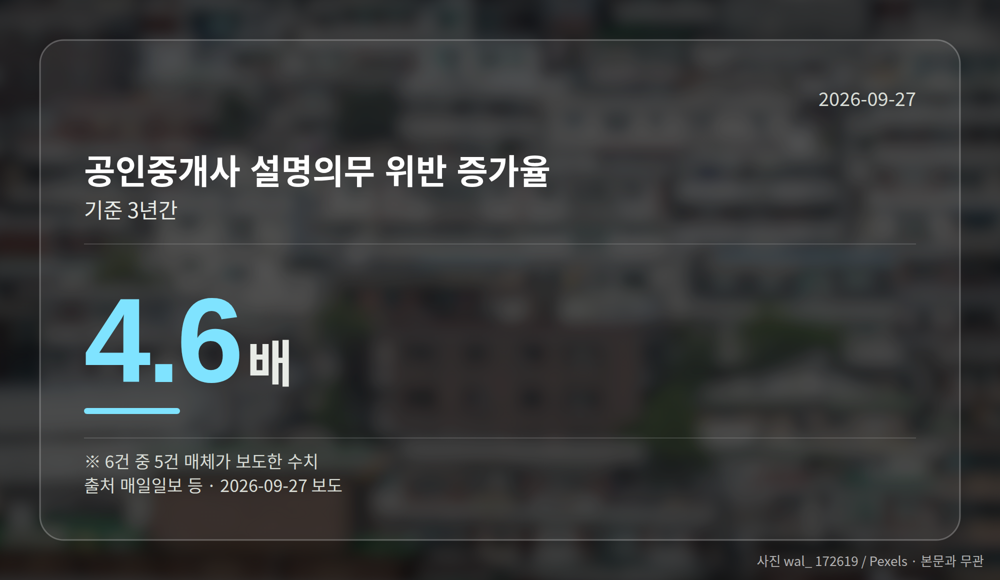

*이 글은 2026년 9월 27일 기준으로 정리한 내용입니다. 실거래 거래 건수는 2026년 8월 1~27일 계약분(신고 기한이 지난 것), 전세가율 등은 2026년 7월 신고분입니다.*
**3줄 요약**

- 서울 아파트값이 85주 연속 올랐다는 보도가 나왔습니다
- 강남3구는 약세, 이문아이파크자이는 20억6000만원 신고가
- 기록 경신 여부는 매체마다 달라 원자료 확인이 필요합니다
서울 아파트값 85주 상승 소식이 오늘 브리핑의 첫 줄입니다. 다만 이 기록이 역대 최장 기록을 이미 넘었는지는 매체마다 다르게 전하고 있습니다.

같은 기간 강남3구는 오히려 상승세가 꺾였다는 보도가 나왔습니다. 서울 전체와 강남권이 서로 다른 방향을 보이고 있다는 뜻입니다.

## 서울 아파트값 85주 상승, 무슨 내용인가

더퍼블릭 등은 서울 아파트값이 85주 연속 올랐다고 보도했습니다. 1년 7개월 가까이 주간 기준으로 하락 없이 흘러온 셈입니다.

다만 브리핑에 담긴 자료에는 주간 변동률(한 주 사이 값이 몇 퍼센트 움직였는지)이 들어 있지 않습니다. 상승폭이 큰지 작은지는 이 숫자만으로 판단하기 어렵습니다.

## 기록 경신인가, 턱밑인가

여기서 보도가 갈립니다. 더퍼블릭과 뉴스후플러스는 역대 최장 기록에 '턱밑'까지 왔다고 표현했고, gukjenews.com은 이미 '경신'했다고 전했습니다.

표현 하나 차이지만 받아들이는 무게는 다릅니다. 앞서 본 85주라는 수치는 공통이니, 기록 경신 여부는 한국부동산원 같은 원자료로 직접 확인해 보시는 편이 안전합니다.

또 하나 눈여겨볼 대목은 강남3구 약세입니다. 서울 아파트값 85주 상승이라는 큰 흐름 안에서도 구별로 온도가 다르다는 신호로 읽을 수 있습니다.

## 전세 계약을 앞두셨다면: 중개사 설명의무 위반

공인중개사가 계약 전 세입자에게 권리관계 등을 알려야 하는 설명의무, 전세사기를 막으려 도입된 장치입니다. 이 의무를 어긴 건수가 3년 새 크게 늘었다는 보도가 나왔습니다.

| 보도 매체 | 증가 폭 | 기간 |
|---|---|---|
| 매일일보 등 | 4.6배 | 3년간 |
| 한국NGO신문 | 5배 | 3년간 |

두 수치가 어긋나고, 위반 건수의 절대치나 조사 주체도 자료에서는 확인되지 않습니다. 그래도 방향은 분명합니다. 중개사 설명에만 기대기보다 등기부등본을 직접 떼어 보시는 편이 낫습니다.

[이미지: 전월세 계약서를 앞에 두고 서류를 확인하는 모습]

## 그 밖의 오늘 소식

- 강남 재건축 시공사, 이주비 100% 지원 보도 (sidae.com)
- 이문아이파크자이 20억6000만원 신고가 거래 (조선비즈)
- 서울 분양권·입주권 신고가 행진 이어진다는 보도

**그래서 나는?**

- 서울 아파트 매수 대기자라면, 지역별 온도차부터 나눠 보셔야 합니다
- 전세 계약을 앞뒀다면, 등기부등본을 직접 떼어 확인해 보세요
- 강남권 재건축 조합원이라면, 이주 일정과 전세 물량을 함께 보세요

**직접 센 숫자 — 2026년 8월 1~27일 아파트 실거래**

서울 8개 구 계약 매매 **1323건** (7월 1~27일 1930건, -607건)

거래가 많은 곳: 강남구 77건(-65) · 노원구 459건(-151) · 강서구 232건(-87)

신고 기한(계약 후 30일)이 지난 27일까지 계약분끼리 견줬습니다.

강남구 전세가율 가운뎃값 **38.4%** (같은 단지·같은 면적 47곳)

서울 25개 구 가운데 거래가 가장 크게 움직인 곳: 중랑구 -61.5%(465→179건, 7월 1~27일엔 묵동에 66.7% 몰렸음) · 동작구 -53.0%(217→102건)

2026년 8~9월 계약 신고가

- 노원구 청솔(시영7) 39.78㎡ — 5.8억 (이전 최고 4.7억, +24.2%, 8월 25일 계약)
- 노원구 상계주공12(고층) 41.3㎡ — 5.8억 (이전 최고 4.8억, +21.9%, 9월 9일 계약)

*국토교통부 실거래가 신고 자료를 직접 집계했습니다. 해제 신고분은 뺐습니다.*
**여러분이 보고 계신 지역은 서울 전체 흐름과 같은 방향으로 움직이고 있나요, 아니면 다른 길을 가고 있나요?**

---

### 참고한 기사

1. **전세사기 막을 공인중개사 설명의무 위반 3년 새 4.6배↑**
   - [한국NGO신문](https://news.google.com/rss/articles/CBMiaEFVX3lxTE5VaXhLOGg5UXRac0tTX291WU1CSmxyTTJqd3NlazFwSkZYbkEtdkp2RjBUWUtDMmhzdEdPOWR1TkVpR1N6eVlVSHEwSEtTRFNoQmZBQnNHTGs3UHRWUUxRdkp1MjlPNFg4?oc=5)
   - [연합뉴스TV](https://news.google.com/rss/articles/CBMiZ0FVX3lxTE81M2Vrd0paNVBTenZpd05UZUktTm9RbVlkRkhMQ2ZGbXhtbEpMVnJMZkU1U1hLRncyZ1UwbWg0bTZMZFBlb2JsUm9rRVdtSTNIdWdaLWpYT2tXWjQ5bFVxdlViTS1xZE0?oc=5)
2. **서울 아파트값 85주째 상승...강남 약세에도 역대 최장 기록 ‘턱밑’**
   - [더퍼블릭](https://news.google.com/rss/articles/CBMia0FVX3lxTE9EcmJiVVVvbkhYRmpCbkk3c1NjZWhPTkdLRWZHMnZJUGN3R08tYnBnY0FsNXQ3LVBxMk1HTXBKQ0RpV1VYVkhRand5V1NIZVhYbFRPRU03dnF0cjlLRWljaXg0aTl4TUNvTE130gFvQVVfeXFMTlBfZUlUT29OQkhmUVNYUnQ1SHZUaWg1N1dpaVZlRkNMT0ZPOHk5NDV5RzFTVEZTOUhUMmJhLWNqeFNqOExJNURSbmRmbzNqb0hjQlNtTmI5YVFnOWFqcUgxV3dtaFlRcnNNcExRUEtr?oc=5)
   - [뉴스후플러스](https://news.google.com/rss/articles/CBMibkFVX3lxTE9LOXkxYUN3bTRiN0dvNGxIMGZGVHVTbjJMR29DdWxWVFZRUm1MaUFkQnppby1sakdZXzlYS0xwZ1NBWUhicDlPTHR6QWxGUk9lN2cyaXRQR3ptZlpPQVNPZy1FOW9fT0ZIdkpvWV9R?oc=5)
3. **전세시장 흔든 강남 재건축…시공사 이주비 100% 지원**
   - [sidae.com](https://news.google.com/rss/articles/CBMiXkFVX3lxTE5iNlRRSDN2V2JOeUoxZlBoZ3lxUEI4VUczNE9Yam85QlFaNjRJTElINHhxT3U2cFVyYXgyTWdwMnhDV3pqVW5SRUNWeThROGlFSzlZdWk3SllQbnhmR3c?oc=5)
4. **주담대 7% 집값에 대못 박았다. 금리와 집값의 상관관계 매커니즘 #부동산 #금리 #주담대**
   - [YouTube](https://news.google.com/rss/articles/CBMiXEFVX3lxTE9xYmtVX3lvMW56SDVvWC1xQkJmVklGWGJ4andTS1B2UDc5WW5wOVE5ZlhFbjZVaU1XdUxUaGRPOU82VzI5a3VDdlVSRWZmaXlCMXI5Uk1teVJtOFg1?oc=5)
5. **이문아이파크자이 20억6000만원… 서울 분양·입주권 신고가 행진 - 조선비즈**
   - [Chosunbiz](https://news.google.com/rss/articles/CBMimAFBVV95cUxOTWJtbnN2bnB4YVNuNS13U04yY2lUS0tFbWt6V2cwMDlKclo2U3NWM1lmZmNCcTI0a1RxVFJoaXJQTVIwQndvMGRtZXhjX09PUC0tVy00Qy1SNGhSdFJEc3Uta0I1X2tIcmVrR21URG5TZXNGRENjbGFkTFdROGdKUW1vTW5WaVo5cHVEMEZvUUJ4SzFkZlVTRNIBrAFBVV95cUxQNkdIVnZYajg1aEtraGMwdEhXUjBvNVlheWdBZEpjRVlWNjJyZ3NDS2NRUVpkRzhPSjYzRnYxNDR4am4xT0p5V2Uwdmt3QlNoelN6bHNLUTJVZTh0bVE0ZEI0NFlxYk1uWXg0TnVQQkthWWRGR0d6V2NPNm5qNUJWNTdCS3ltMDRuNHlSME1XcGlxaXoxNUNfSldGelI5SF8tYkZ5cUJ4dkNiQVRl?oc=5)

---

*본 글은 공개된 언론 보도를 정리한 것이며, 투자 판단의 책임은 이용자 본인에게 있습니다.*
