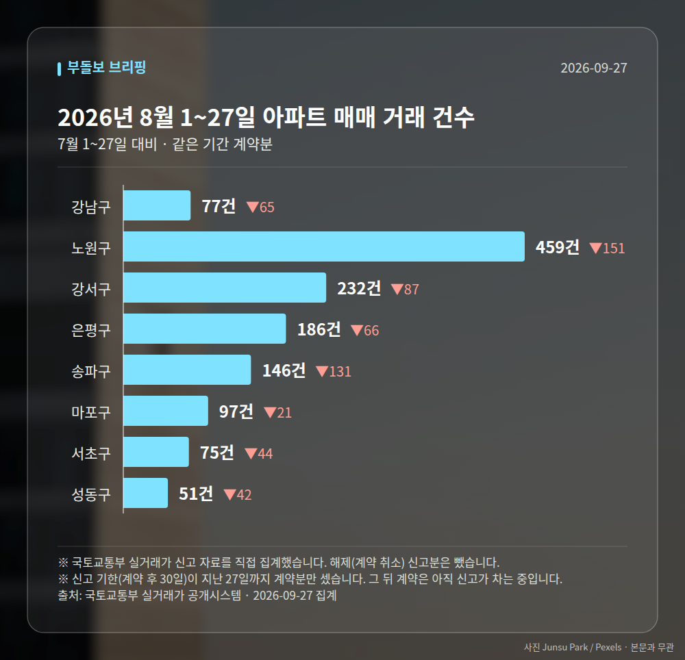
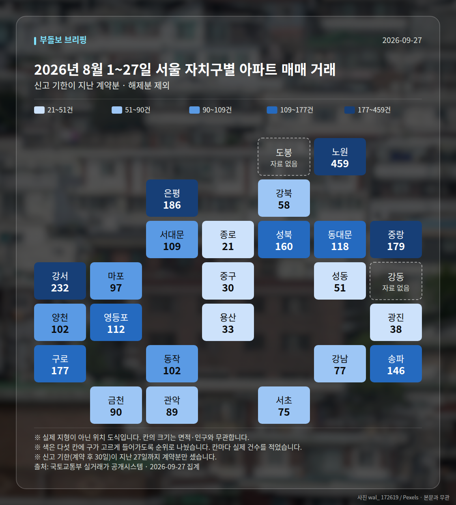
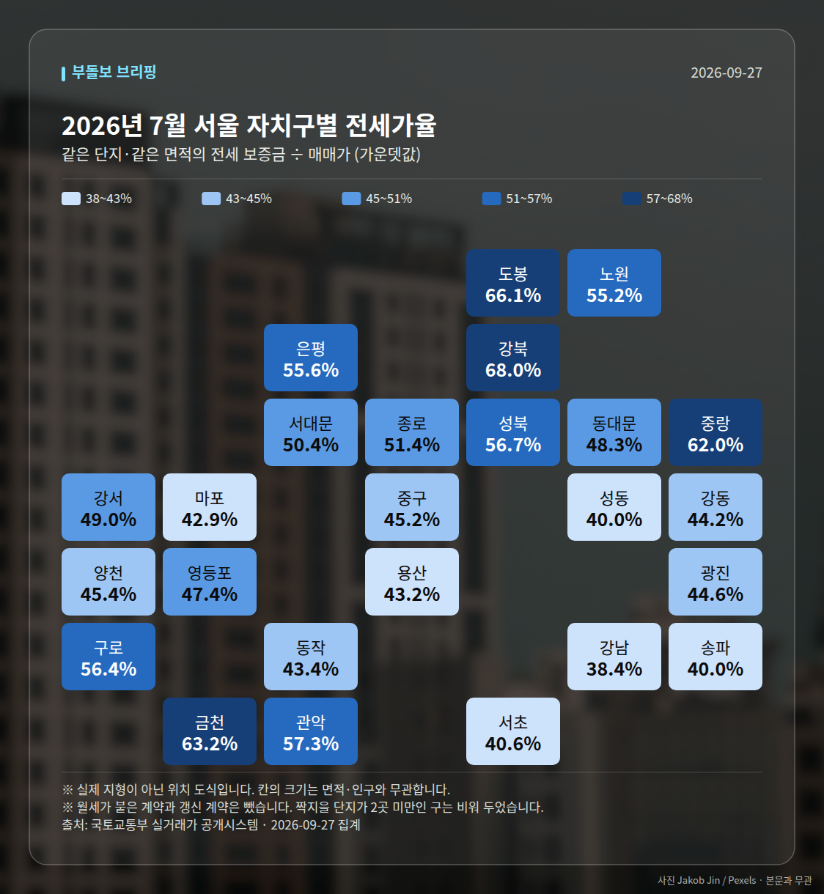
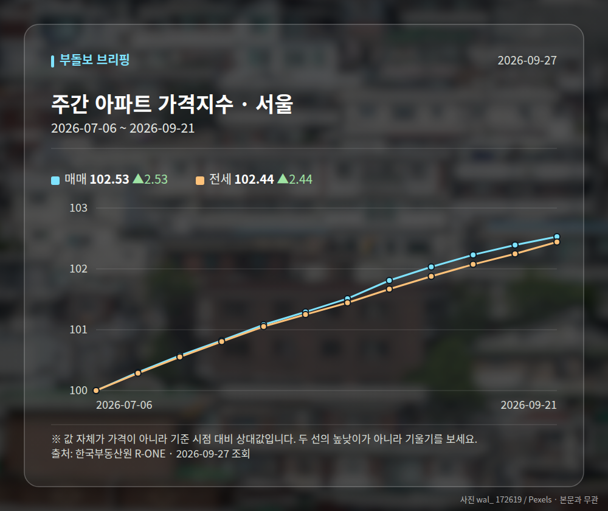
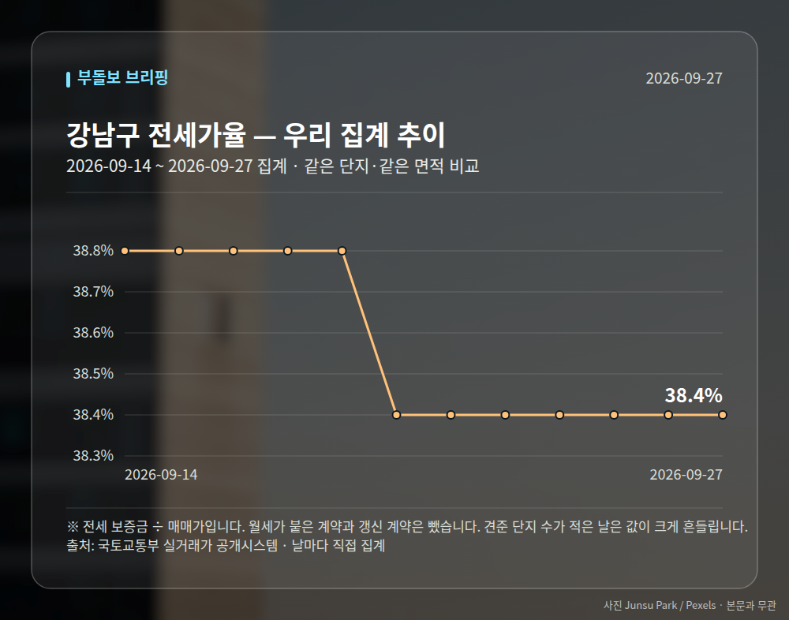
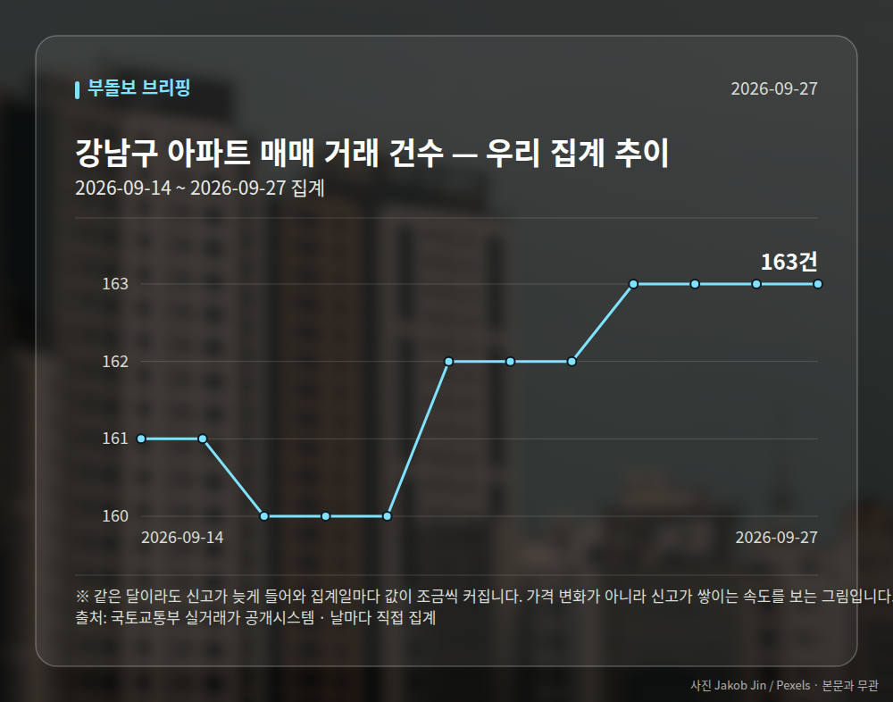
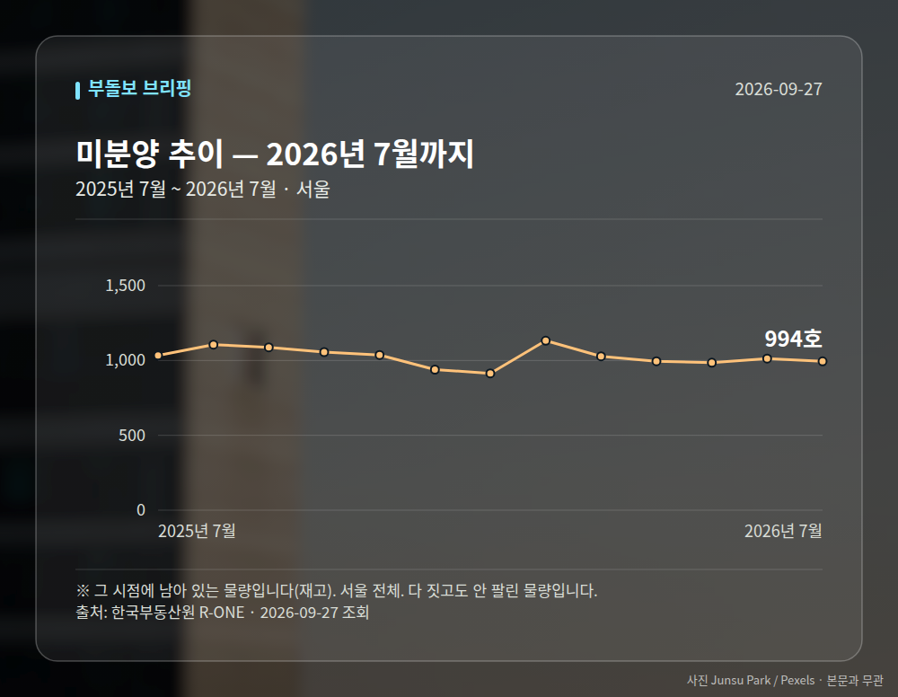

# 실거래가로 본 2026년 8월 1~27일

정부가 받은 **아파트 매매 신고 자료**를 그대로 집계한 것입니다. 기사에 실린 수치가 아니라
국토교통부 실거래가 자료를 직접 받아 셌습니다. 계약 후 30일 안에 신고하므로,
**거래 건수는 신고 기한이 지난 날짜까지만** 셉니다 — 2026년 8월 1~27일 계약분을 7월 1~27일과 견줬습니다.
달 전체를 세면 아직 신고가 차는 중이라 거래가 급감한 것처럼 보여서입니다.
전세가율·월세·면적대는 표본이 작아지지 않게 **신고가 다 들어온 2026년 7월** 을 봅니다.
단, 아래 **눈에 띄는 거래(신고가)** 는 한 건씩 보는 것이라 **2026년 8~9월 계약분**까지 봅니다.

**2026년 8월 1~27일 전체 1323건** · 7월 1~27일 1930건 (-607건)

| 지역 | 거래 건수 | 7월 1~27일 대비 | 평균 거래가 | 가장 비싼 거래 |
| --- | ---: | ---: | ---: | --- |
| 강남구 | 77건 | -65 | 29.1억 | 현대1차(12,13,21,22,31,32,33동) 80.0억 (161.18㎡) |
| 노원구 | 459건 | -151 | 7.1억 | 롯데우성 15.2억 (115.26㎡) |
| 강서구 | 232건 | -87 | 9.7억 | 마곡엠밸리7단지 24.0억 (114.84㎡) |
| 은평구 | 186건 | -66 | 8.7억 | DMC센트럴자이(3단지) 19.1억 (84.92㎡) |
| 송파구 | 146건 | -131 | 21.1억 | 주공아파트 5단지 45.8억 (82.61㎡) |
| 마포구 | 97건 | -21 | 14.3억 | 래미안웰스트림 29.4억 (114.98㎡) |
| 서초구 | 75건 | -44 | 25.0억 | 래미안퍼스티지 91.0억 (222.76㎡) |
| 성동구 | 51건 | -42 | 19.3억 | 갤러리아포레 92.0억 (217.86㎡) |

## 서울 전체 지도

표에 올린 곳 말고 **스물다섯 개 구 전부**를 한 번씩 세어 칠했습니다.
색은 순위로 다섯 칸에 나눈 것이라, 짙다고 두 배가 아닙니다. 칸 안의 숫자를 보세요.

## 전세가율 지도

같은 도식에 전세가율을 칠했습니다. 짝지을 단지가 2곳 미만인 구는 비워 두었습니다.

## 거래가 크게 움직인 구

스물다섯 개 구를 다 세어 놓고 **7월 1~27일과 20% 이상 벌어진 곳**만 골랐습니다.
거래가 원래 적은 구는 몇 건만 움직여도 비율이 튀므로 40건 미만인 곳은 뺐습니다.

| 지역 | 2026년 8월 1~27일 | 7월 1~27일 | 차이 | 어디서 |
| --- | ---: | ---: | ---: | --- |
| 중랑구 | 179건 | 465건 | -61.5% | 7월 1~27일엔 묵동 310건 (66.7%) |
| 동작구 | 102건 | 217건 | -53.0% | 고르게 퍼짐 |
| 영등포구 | 112건 | 223건 | -49.8% | 고르게 퍼짐 |
| 관악구 | 89건 | 170건 | -47.6% | 7월 1~27일엔 봉천동 84건 (49.4%) |

'어디서' 칸에 동네 이름이 있으면 구 전체가 아니라 **그 동네 한 곳이 움직인 것**입니다.
큰 단지 하나가 한꺼번에 신고되면 이렇게 보입니다.

## 어떤 크기가 팔렸나

평균 거래가 하나만 보면 **값이 오른 것**과 **비싼 것만 팔린 것**을 구별할 수 없습니다.
전용면적으로 갈라 보면 갈립니다. 85㎡ 가 국민주택규모입니다.

| 면적대 | 전용면적 | 거래 건수 | 비중 | 2026년 6월 비중 | 평균 거래가 |
| --- | --- | ---: | ---: | ---: | ---: |
| 소형 | 60㎡ 이하 | 1073건 | 47.5% | 44.4% (+3.1%p) | 8.9억 |
| 중형 | 60~85㎡ | 857건 | 38.0% | 38.2% (-0.2%p) | 15.1억 |
| 중대형 | 85~135㎡ | 247건 | 10.9% | 12.4% (-1.5%p) | 21.5억 |
| 대형 | 135㎡ 초과 | 81건 | 3.6% | 4.9% (-1.3%p) | 40.2억 |

## 눈에 띄는 거래

**2026년 8~9월 계약분**(2026-09-27까지 신고된 것)을
그 앞 6개월 거래와 견줘 값이 크게 움직인 것만 골랐습니다.
같은 단지·같은 면적끼리만 비교했고, 지난 거래가 2건 미만이면 뺐습니다.
신고 기한(계약 후 30일)이 안 지난 거래도 들어 있어, 늦게 신고되는 거래가 더 붙을 수 있습니다.

| 구분 | 지역 | 단지 | 면적 | 계약일 | 이번 | 이전 | 차이 |
| --- | --- | --- | ---: | --- | ---: | ---: | ---: |
| 신고가 | 노원구 | 청솔(시영7) | 39.78㎡ | 2026-08-25 | 5.8억 | 4.7억 | +24.2% |
| 신고가 | 노원구 | 상계주공12(고층) | 41.3㎡ | 2026-09-09 | 5.8억 | 4.8억 | +21.9% |
| 신고가 | 마포구 | 한화오벨리스크 | 79.9㎡ | 2026-08-29 | 15.5억 | 13.0억 | +19.2% |
| 신고가 | 노원구 | 상계주공13(고층) | 45.55㎡ | 2026-08-29 | 4.7억 | 3.9억 | +19.2% |
| 신고가 | 노원구 | 시영3차(라이프)아파트 | 49.5㎡ | 2026-09-10 | 6.5억 | 5.5억 | +19.1% |

## 전세가율 (실제 거래로 계산)

같은 단지·같은 면적에서 그달 **전세 보증금 ÷ 매매가**입니다.
월세가 붙은 계약과 갱신 계약은 뺐습니다. 갱신은 종전 보증금을 따라가 시세보다 낮습니다.
지수가 아니라 실제 거래라 단지마다 편차가 큽니다. 가운뎃값을 먼저 보세요.

| 지역 | 중앙값 | 견준 단지 수 | 가장 높은 곳 |
| --- | ---: | ---: | --- |
| 강남구 | 38.4% | 47곳 | 파크힐 80.0% (8.5억 / 전세 6.8억) |
| 노원구 | 55.2% | 132곳 | 삼익아파트 81.9% (6.7억 / 전세 5.5억) |
| 강서구 | 49.1% | 70곳 | 마곡루나플라체 84.2% (2.9억 / 전세 2.4억) |
| 송파구 | 40.0% | 76곳 | 석촌호수효성해링턴타워 92.3% (2.6억 / 전세 2.4억) |
| 은평구 | 55.6% | 45곳 | 대경홈타운 78.3% (1.2억 / 전세 0.9억) |
| 마포구 | 42.9% | 40곳 | 솔리스타 92.0% (1.6억 / 전세 1.5억) |
| 서초구 | 40.6% | 34곳 | 서초동삼성쉐르빌2 90.5% (2.9억 / 전세 2.6억) |
| 성동구 | 40.0% | 32곳 | 신성미소지움 51.4% (14.6억 / 전세 7.5억) |

## 전세와 월세의 비율

전세가율에서 뺀 월세 계약도 그 자체로 자료입니다. **비중**은 갱신까지 전부 셌고,
**보증금·월세 가운뎃값**은 신규 계약만 봤습니다 — 갱신은 종전 조건을 따라가 시세가 아닙니다.

| 지역 | 전월세 계약 | 월세 낀 계약 | 신규 전세 보증금 | 신규 월세 (보증금 / 월) |
| --- | ---: | ---: | ---: | --- |
| 강남구 | 1405건 | 754건 (53.7%) | 9.0억 | 2.0억 / 168만원 |
| 노원구 | 1343건 | 621건 (46.2%) | 3.3억 | 4000만원 / 80만원 |
| 강서구 | 1278건 | 532건 (41.6%) | 4.8억 | 9861만원 / 74만원 |
| 송파구 | 1429건 | 656건 (45.9%) | 7.8억 | 2.06억 / 150만원 |
| 은평구 | 799건 | 356건 (44.6%) | 4.5억 | 1.11억 / 49만원 |
| 마포구 | 770건 | 374건 (48.6%) | 6.9억 | 1.0억 / 136만원 |
| 서초구 | 1121건 | 533건 (47.5%) | 8.81억 | 3.0억 / 150만원 |
| 성동구 | 627건 | 272건 (43.4%) | 7.1억 | 1.4억 / 192만원 |

## 한국부동산원 주간 가격지수 (서울)

| 기준일 | 매매 | 전세 |
| --- | ---: | ---: |
| 2026-07-06 | 100.00 | 100.00 |
| 2026-07-13 | 100.30 | 100.28 |
| 2026-07-20 | 100.58 | 100.55 |
| 2026-07-27 | 100.82 | 100.80 |
| 2026-08-03 | 101.08 | 101.05 |
| 2026-08-10 | 101.29 | 101.25 |
| 2026-08-17 | 101.51 | 101.44 |
| 2026-08-24 | 101.81 | 101.67 |
| 2026-08-31 | 102.03 | 101.88 |
| 2026-09-07 | 102.23 | 102.07 |
| 2026-09-14 | 102.39 | 102.25 |
| 2026-09-21 | 102.53 | 102.44 |

## 전세가율 추이 (강남구)

견준 단지 수가 적은 날은 값이 크게 흔들립니다. 점이 작은 날이 그런 날입니다.

## 우리가 날마다 센 추이 (강남구)

같은 달이라도 신고가 늦게 들어와 집계일마다 값이 조금씩 커집니다.
가격 변화가 아니라 신고가 쌓이는 속도를 보는 그림입니다.

## 공급 쪽 숫자 (앞으로 나올 물량)

여기까지의 숫자는 전부 **팔린 것**이었습니다. 이 절은 반대쪽입니다.
미분양은 다 짓고도 안 팔린 재고이고, 인허가·착공은 **1~2년 뒤 공급**을 말합니다.

| 항목 | 시점 | 값 | 전달 대비 | 성질 |
| --- | --- | ---: | ---: | --- |
| 미분양 | 2026년 7월 | 994호 | -19 | 재고 |
| 주택 인허가 | 2026년 7월 | 8,008호 | +6,378 | 그 달치(누계에서 되돌림) |
| 아파트 착공 | 2026년 7월 | 6,067호 | +3,930 | 그 달 실적 |

- **미분양** — 서울 전체. 다 짓고도 안 팔린 물량입니다.
- **주택 인허가** — 서울 합계(가구수 기준). 원자료가 연초부터의 누계라 그 달치로 되돌렸습니다.
- **아파트 착공** — 서울 민간분양.

발표가 두세 달 늦습니다. 거래·가격 수치와 시점이 다르니 견줄 때 주의하세요.

---

*출처: 국토교통부 실거래가 공개시스템(공공데이터포털), 한국부동산원 R-ONE.
평균은 그 달 신고분의 단순 평균이며 면적·층을 보정하지 않았습니다.
해제(계약 취소)로 신고된 건은 뺐습니다.*
