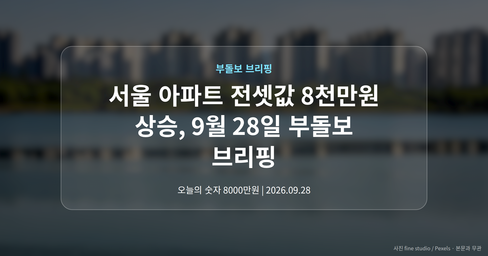
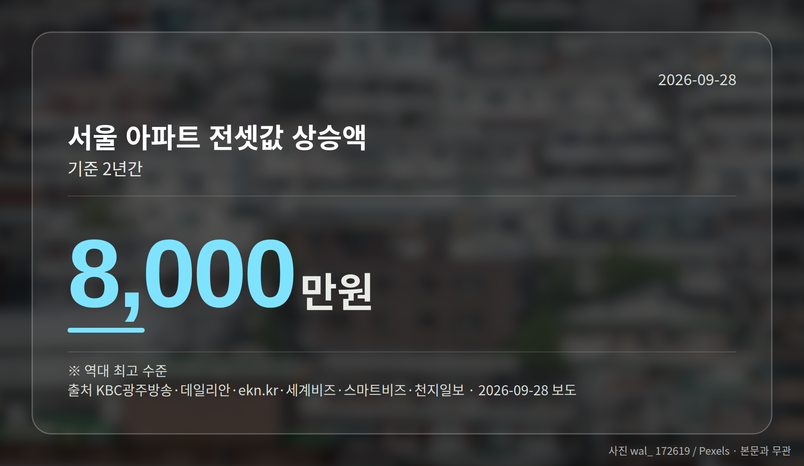
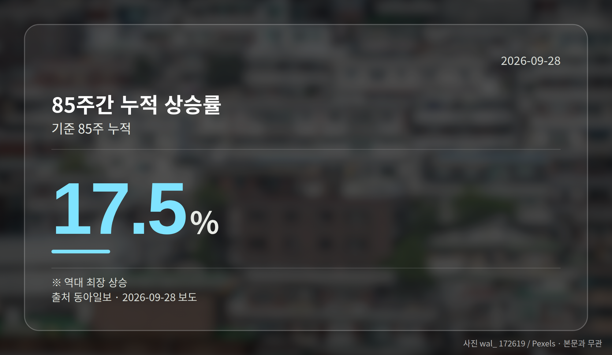
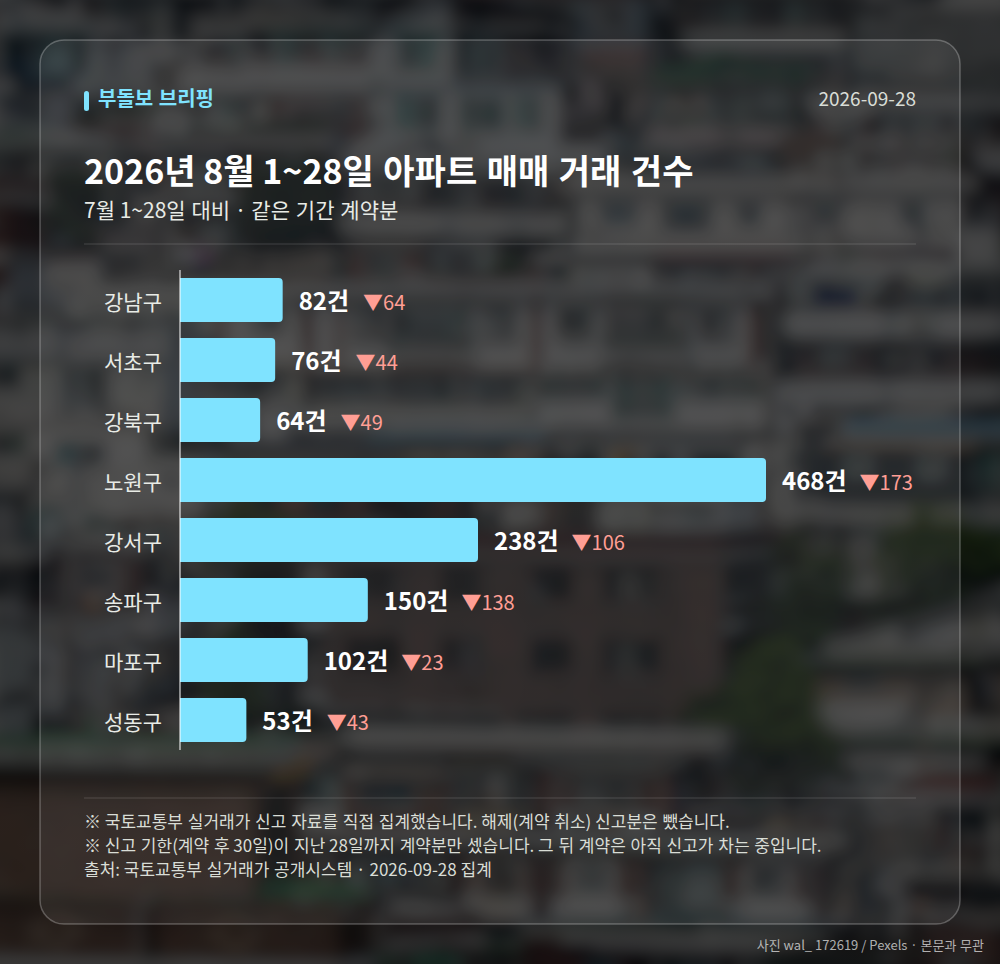

*이 글은 2026년 9월 28일 기준으로 정리한 내용입니다. 실거래 거래 건수는 2026년 8월 1~28일 계약분(신고 기한이 지난 것), 전세가율 등은 2026년 7월 신고분입니다.*
**3줄 요약**

- 서울 아파트 전셋값이 2년 새 역대 최고 수준으로 올랐습니다.
- 전세는 8천만원 상승, 월세는 24% 급등한 것으로 보도됐습니다.
- 전문가 70%가 추가 대책 필요, 최우선 과제는 전월세 안정입니다.
2026년 9월 28일 브리핑입니다. 서울 아파트 전셋값이 2년 새 8천만원 올라 역대 최고 수준을 기록했고, 같은 기간 월세는 24% 뛰었습니다.

집값도 조용하지 않았습니다. 서울 아파트 매매가는 85주 연속 상승해 역대 최장 기록과 타이를 이뤘습니다.

## 서울 아파트 전셋값, 2년 새 얼마나 올랐나

2년 전 전세 계약을 맺은 세입자가 지금 재계약을 하려면 8천만원을 더 마련해야 하는 상황으로 보도됐습니다.

월세로 눈을 돌려도 사정은 비슷합니다. 서울 아파트 월세는 같은 기간 24% 오른 것으로 나타났습니다.

| 구분 | 변화 | 기간 |
| --- | --- | --- |
| 서울 아파트 전셋값 | 8,000만원 상승 | 2년간 |
| 서울 아파트 월세 | 24% 상승 | 2년간 |

※ 출처: KBC광주방송·데일리안 등 보도

두 숫자를 나란히 놓으면 뜻이 분명해집니다. 전세를 유지해도 목돈이 필요하고, 월세로 갈아타도 매달 나가는 돈이 늘어난다는 이야기입니다.

다만 기사 대부분이 제목만 제공된 상태여서, 상승 원인이나 지역별 세부 수치, 조사 기관은 확인되지 않았습니다. 이 점은 감안해 주시면 좋겠습니다.

## 서울 아파트 전셋값 부담과 함께 본 매매시장

서울 아파트값은 85주 연속 올랐습니다. 동아일보 보도에 따르면 이 기간 누적 상승률은 17.5%로 집계됐습니다.

특이한 점은 방향이 갈렸다는 것입니다. 강남3구(강남구·서초구·송파구)는 약세를 보였는데도 서울 전체는 고공행진을 이어갔습니다.

대신 강북권과 역세권 단지가 상대적으로 강세였다고 전해집니다. 비강남권 매수세가 시장을 떠받쳤다고 볼 수 있는 대목입니다.

## 전문가 70%는 왜 추가 대책을 말했나

전문가 70%가 추가 부동산 대책이 필요하다고 응답했고, 최우선 과제로는 전월세시장 안정을 꼽았습니다.

앞서 본 서울 아파트 전셋값과 월세 상승폭을 떠올리면 자연스러운 흐름입니다. 다음 정책의 무게가 임대시장에 실릴 가능성이 제기된 것으로 읽힙니다.

물론 설문 대상과 규모, 구체적인 대책 내용은 본문이 제공되지 않아 확인되지 않았습니다. 발표되는 내용을 직접 살펴보시는 편이 정확합니다.

[이미지: 계약서를 앞에 두고 상담하는 부동산 중개사무소 풍경]

## 그 밖의 오늘 소식

- 과천·광진구, 시세차익 10억원 안팎 무순위 청약 물량 등장
- 광명 철산자이 더 헤리티지도 최대 7억원대 차익 기대 보도
- 강남·서초 하락 반전, 수도권 집값 양극화 심화 언급

**그래서 나는?**

- 전세 재계약을 앞뒀다면, 2년 전 보증금과 현재 시세 차이를 먼저 확인해 보세요.
- 월세 전환을 고민한다면, 월세도 함께 올랐다는 점을 계산에 넣어야 합니다.
- 서울 매수를 준비한다면, 지역별 온도차가 커진 점을 살펴볼 필요가 있습니다.

**직접 센 숫자 — 2026년 8월 1~28일 아파트 실거래**

서울 8개 구 계약 매매 **1233건** (7월 1~28일 1873건, -640건)

거래가 많은 곳: 강남구 82건(-64) · 서초구 76건(-44) · 강북구 64건(-49)

신고 기한(계약 후 30일)이 지난 28일까지 계약분끼리 견줬습니다.

강남구 전세가율 가운뎃값 **38.4%** (같은 단지·같은 면적 47곳)

서울 25개 구 가운데 거래가 가장 크게 움직인 곳: 중랑구 -60.7%(466→183건, 7월 1~28일엔 묵동에 66.5% 몰렸음) · 동작구 -52.0%(223→107건)

2026년 8월 계약 신고가

- 강서구 마곡서광(치현마을) 84.93㎡ — 7.6억 (이전 최고 6.0억, +26.7%, 8월 30일 계약)
- 노원구 청솔(시영7) 39.78㎡ — 5.8억 (이전 최고 4.7억, +24.2%, 8월 25일 계약)

*국토교통부 실거래가 신고 자료를 직접 집계했습니다. 해제 신고분은 뺐습니다.*
**여러분의 다음 재계약 시점은 언제이고, 그때까지 준비해 둘 수 있는 여유는 어느 정도인가요?**

---

### 참고한 기사

1. **서울 아파트 전셋값 2년 새 8천만원↑…월세는 24% 급등**
   - [KBC광주방송](https://news.google.com/rss/articles/CBMiYkFVX3lxTE55YnhueUJBdWxxWnNad2hQVi1vUDRoaFpxcVRhRFIzSFdRWkdadkkxZGRHbTdEOHJGN2lPdm5INjAzbkVfSEx5MUhfOV9zaTJWMC1rOXpHT1RZWkM0ZmZEY3BR?oc=5)
   - [데일리안](https://news.google.com/rss/articles/CBMilwJBVV95cUxNOGVDOGNTdUdfZ1lVZlFNNTJVYlVFemRLRU5lRXEtUnNxZnllaHJrc3BtQ2VFdTJhN2VJckZhdjJSYXltMGlza1g5aWhpVEVFLUJYeG42TE5NZ3dkSVFYOHRzanhiZ2c5VGM3eFFEaTlZV3pVN0x0TlROREM1Si1kMXV5MlU1OWdTUlVHaUdEWFJha3ZYWTNSdDZIamx5NDdPbVFGY09DQkFzSE1aNFpkb2d5eXdndHdFV29LOXp5eGRkRXNTZGN5cUh3dDhYZldISDVVQlVfaWtxaWVSNTF1WE9Cb0hkcEJKV25CN2VWdXg0UWduZXIxZlBGbk5nSVIzbU9iM0lXWkZnX08yeWZqczlBZjAwb00?oc=5)
2. **당첨되면 10억 로또…서울·과천서 2가구 '줍줍' 청약**
   - [한국경제·부동산](https://www.hankyung.com/article/2026092777097)
   - [서울경제](https://news.google.com/rss/articles/CBMiUkFVX3lxTE9lNUdHdS1Qc29LVElQN2JGdTBHMm5lTEp1ZkdnZ2tNTVJyODhrckJaTnotdjYyNHJzcFdVM3RZUGR5bXY0R1BiNHk3U2ZZZTJIRWfSAVNBVV95cUxQemhPc2dBSy1jSTg2LUhZQjIycUtRdU1wU0VvaW1hSFgzVzh5OWx6SVNUbFNMT0p3cjlqM3d0dVVsMWZOMWkzZWJZMkhLNzBLeHRhYw?oc=5)
3. **강남·서초 하락 반전에 재편되는 수도권 집값 지형도… 대출 규제·가격 피로감이 만든 '양극화 2.0'**
   - [청년투데이](https://news.google.com/rss/articles/CBMiakFVX3lxTFBZVEpHYVo1NG9ZYV9mVV9Eb3N2cmhLbzhKby1IdFJZQUNJblFLSllldkhwbDhWN2Z5N0NpM3Y0NXJ5SUd2Yi1UdUdLYTZSZ29aeGthc3pKaFZkd0hGRVZmWEUzSGstLXNQdlE?oc=5)
4. **전문가 70% "추가 부동산 대책 필요" ... 최우선 과제는 '전월세시장 안정'**
   - [Queen 이코노미퀸](https://news.google.com/rss/articles/CBMiakFVX3lxTE9odU5Ydkd1MWNBRHlFNlQ4bmU2dVFnQUVvQzdfR19ORHRPSFpMRVg4S0E4b1NVLVkzdlVMZkh0LXJiZk5nZEFoQUd2S1l1VC02a3loLXlWRUlCRFRiWnJUd0JKOWt2aWJFeGc?oc=5)
   - [뉴스1](https://news.google.com/rss/articles/CBMiW0FVX3lxTE5VZHU2S1pqcVpLbm02VUpLUWVibWdwZWhlX1FwTjVWOXZBUEFQX21kX0ZTY0dKZ25WQkd5a1hqdnhOMW5jNEdmaG1aQk94ZGNzRVRKU1UtZWU1UnPSAWBBVV95cUxNZVYzRURPQXZMbndFU0J4QW11dnYwS1ZHSld4Z1Y0TldDdmNSdUdKbjlwcW51XzlDUUw4YjVnYS04R0ExTGtLUW5FNlVzU1lFZEVBUkJsb3FWb3ViYVBmYl8?oc=5)
5. **서울 아파트 85주 연속 상승 ‘역대최장 타이’…강북-셔세권 강세**
   - [동아일보](https://news.google.com/rss/articles/CBMidkFVX3lxTE84Q2FvZnhYMjZFLThBTTJDTWJSWWh4RjdDNFlvNWVLTGdfT1NSZk0yNHVreW5PUWpFRDlWMm4zM1l4WV9DakFHc3dqTjNTdmtQelAzeFp4VEZKaHdFRUpMQ1VsWWZuRE9tQ1RiY25RSFNSa2FNakHSAWZBVV95cUxQSzFLWVNEZ0cxald1NU50YzcwSDNtOVhFOF96ZTVVbTRhX2pBMEJCdUZ4bEZ6SG5IVE0zbl9LT293cEJLUlk0S0lJb0wzV28tUWdUUkVnWXh4VjF1VEx4Um9TTVpESmc?oc=5)
   - [한국경제](https://news.google.com/rss/articles/CBMiWkFVX3lxTE5jWUZkLVhGUjdpSXJoUlFJRU5SazJ0Rk1JYmc0OFktTkNkbGk1M2FRNnVYejlWRDJkQVhRLXBxeFpBOWdmQ1luS1p1dUdQdXNaeFJiRTgxM0hPZw?oc=5)

---

*본 글은 공개된 언론 보도를 정리한 것이며, 투자 판단의 책임은 이용자 본인에게 있습니다.*
