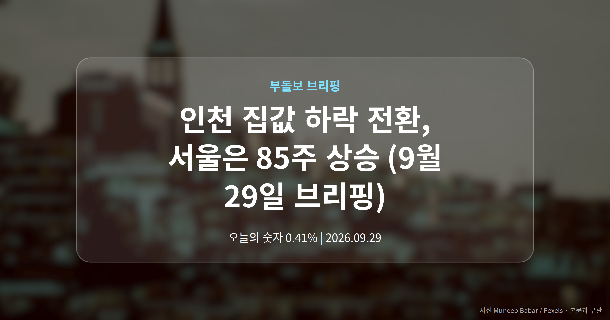
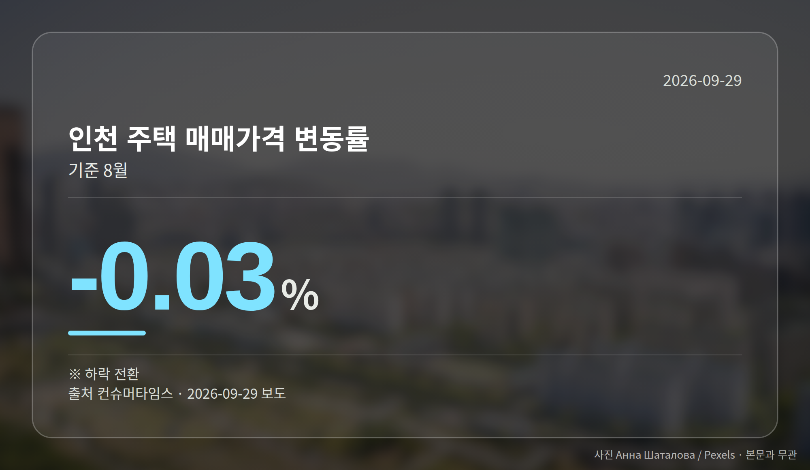
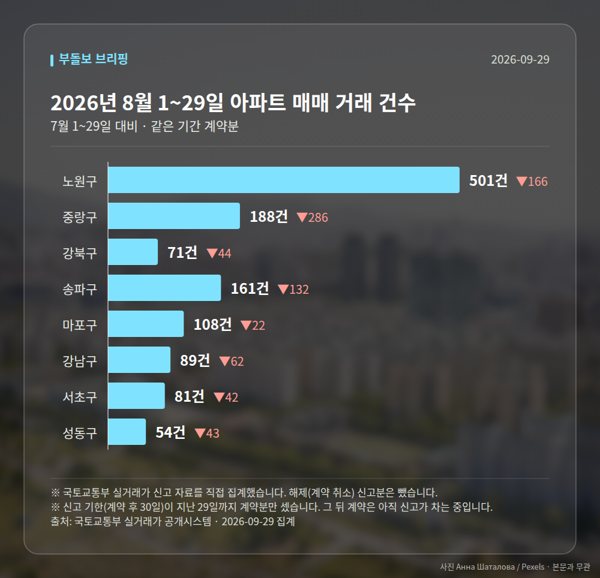

*이 글은 2026년 9월 29일 기준으로 정리한 내용입니다. 실거래 거래 건수는 2026년 8월 1~29일 계약분(신고 기한이 지난 것), 전세가율 등은 2026년 7월 신고분입니다.*
**3줄 요약**

- 인천 주택 매매가격이 8월 하락으로 방향을 바꿨습니다.
- 매매 -0.03%, 전세 0.41%, 월세 0.38%로 엇갈렸습니다.
- 매매는 쉬고 임대료만 오르는 구조인지 지켜볼 대목입니다.
오늘은 인천 집값 하락 전환 소식부터 정리해 드립니다. 8월 인천 주택 매매가격이 마이너스로 돌아선 반면, 전세와 월세는 오히려 오름폭이 커졌습니다.

같은 수도권인 서울은 85~86주째 상승을 이어가는 중이라, 지역 간 온도차가 한층 뚜렷해졌습니다.

## 인천 집값 하락 전환, 숫자로 보면

컨슈머타임스 보도에 따르면 8월 인천 주택 매매가격 변동률은 -0.03%였습니다. 그동안의 오름세가 멈추고 방향을 바꾼 것입니다.

반면 전세가격은 상승폭이 확대됐고, 월세도 함께 올랐습니다. 매매와 임대차 시장이 서로 다른 방향을 가리킨 셈입니다.

| 구분 | 8월 변동률 | 흐름 |
|---|---|---|
| 매매 | -0.03% | 하락 전환 |
| 전세 | 0.41% | 상승폭 확대 |
| 월세 | 0.38% | 상승 |

(전세·월세 수치는 각각 신아일보, 뉴스티앤티 보도 기준입니다.)

## 인천 집값 하락 전환이 뜻하는 것

매매가격이 내려가면 집을 사려는 분들의 진입 부담은 다소 가벼워질 수 있습니다. 다만 그 효과가 언제, 어느 구에서 체감될지는 이번 자료만으로 알 수 없습니다.

문제는 임차 쪽입니다. 앞서 본 전세·월세 오름세가 이어지면 전월세로 거주하는 분들의 주거비 부담은 오히려 커집니다.

이번 발표에는 인천 구별 세부 데이터가 제시되지 않았습니다. 따라서 인천 집값 하락 전환을 전 지역이 똑같이 겪는 상황으로 읽기는 어렵습니다.

[이미지: 인천 구도심 아파트 단지 전경 사진]

## 서울은 왜 다르게 움직이나

서울은 85주째 상승하며 역대 최장 상승 기록과 동률을 이뤘다는 보도가 나왔습니다. 뉴스핌은 86주째 상승이며 오름폭은 둔화됐다고 전했습니다.

주수가 매체별로 다른 것은 집계 시점이나 기준 차이일 수 있으니, 숫자 자체보다 '오름세가 길게 이어지고 있다'는 점을 보시면 됩니다.

여기에 전세·월세까지 함께 오르는 상황이라, 세계일보는 서울시의 공급 실행력이 시험대에 올랐다고 짚었습니다.

[이미지: 서울 아파트 스카이라인 사진]

## 그 밖의 오늘 소식

- 강서구 화곡동 한양아이클래스 전용 13.79㎡ 4732만원, 3년 신저가
- 양천구 래미안목동아델리체 전용 84.94㎡ 19억5000만원 신고가
- 압구정동 한양2 전용 147.41㎡ 79억원 거래 등록

위 실거래는 모두 개별 거래 1건 기준이라 단지 전체 시세를 대표하지는 않습니다. 같은 서울 안에서도 신고가와 신저가가 함께 나온다는 점이 오늘의 관전 포인트입니다.

**그래서 나는?**

- 인천 전세 계약을 앞뒀다면, 전월세 상승폭부터 확인해 보세요.
- 인천 무주택 실수요자라면, 매매 호가 흐름을 몇 달 더 볼 수 있습니다.
- 서울 실수요자라면, 같은 구 안에서도 단지별 차이를 살펴보세요.

**직접 센 숫자 — 2026년 8월 1~29일 아파트 실거래**

서울 8개 구 계약 매매 **1253건** (7월 1~29일 2050건, -797건)

거래가 많은 곳: 노원구 501건(-166) · 중랑구 188건(-286) · 강북구 71건(-44)

신고 기한(계약 후 30일)이 지난 29일까지 계약분끼리 견줬습니다.

노원구 전세가율 가운뎃값 **55.3%** (같은 단지·같은 면적 133곳)

서울 25개 구 가운데 거래가 가장 크게 움직인 곳: 중랑구 -60.3%(474→188건, 7월 1~29일엔 묵동에 66.0% 몰렸음) · 동작구 -49.1%(228→116건)

2026년 8월 계약 신고가

- 중랑구 극동늘푸른 84.08㎡ — 8.2억 (이전 최고 4.8억, +71.9%, 8월 15일 계약)
- 노원구 청솔(시영7) 39.78㎡ — 5.8억 (이전 최고 4.7억, +24.2%, 8월 25일 계약)

*국토교통부 실거래가 신고 자료를 직접 집계했습니다. 해제 신고분은 뺐습니다.*
**여러분이 보고 계신 동네는 매매와 전월세 중 어느 쪽이 더 크게 움직이고 있나요?**

---

### 참고한 기사

1. **인천 주택 매매가격 8월 하락 전환…전·월세는 상승세**
   - [컨슈머타임스](https://news.google.com/rss/articles/CBMiakFVX3lxTE96LU1VMk1haGNjVFY2bjVDS0xRa1dkdFFCUEFpX2loQ0dUc3luVk1SbEdBZVl6MDgzZnZJZE9PMHZqRE0tX2Z5MkdsY1RmQi1RTDNqNjM5V05TYTJEaXZCbU9RWEZDcmZWaVE?oc=5)
   - [경기일보](https://news.google.com/rss/articles/CBMiW0FVX3lxTFBXWjh5akx5NV9IV2U2THNzQlJxM19zMTJhTmRJaV9jaVlUcFdoYUVtLWZEQXVSNHUzeXdjMkozRm9QQ0pPSXR1ZEstWENkeGFsRVZ6YkhYU0FoYjQ?oc=5)
2. **강서구 화곡동 한양아이클래스 13.79㎡ 4732만원… 최근 3년 신저가 [MAI부동산]**
   - [매일경제](https://news.google.com/rss/articles/CBMiWEFVX3lxTE4yZkJKUDlIdDE0SWV6aENMMDFjYnAwZ0NDbGt3VmcyMTJ4UDJKTUFsZXM2LUN6SW5GaGdwdVR5NnBwanNHaFcyN0NtSk9wLWtkZ3dEel9ndXM?oc=5)
3. **강북구 미아동 삼각산아이원 84.705㎡, 9억 2500만원에 거래… 최근 3년 신고가 [MAI부동산]**
   - [매일경제·부동산](https://www.mk.co.kr/news/realestate/12162296)
4. **서초 래미안퍼스티지 70억원·강남 미성2차 52억원… 서울 아파트 고가 거래 [MAI부동산]**
   - [매일경제·부동산](https://www.mk.co.kr/news/realestate/12162292)
5. **서울 집값 85주째 올랐다… 역대 최장 상승과 동률**
   - [뉴스핌](https://news.google.com/rss/articles/CBMiXEFVX3lxTE5RM2hMbEROeUNGcTNyUmZxeXdCbHRfNDZ1aWJNV1BmaUZRc2puYXlBYlV3VGRfbWpkUGRqdTB4VnNvTFd1Q3NBMlFJSVM2YnBlS1ZLUU1RTU9rLXdy?oc=5)
   - [세계일보](https://news.google.com/rss/articles/CBMia0FVX3lxTE1CRjVGQlhTOEQ3clZmM3hWY19icnlfVVdrY2c5QVVPckYwYUJpNk8xcDlDeThDMGdYWU9aYVNXS0s4Z2Ftc0VBQXp4VnFERDhPOXpTWXNZWS1JRF9Ca0pVdlZRQVRWdWRRN3Nz0gFUQVVfeXFMT2loeTU5Q19iR3I1YVh5cG1TbzF1UFB5NmxTOFYwOHNoaFY3ZHUybXh5NE96aDJnODJLTHhTTktnUm55NlVNcWFqdEJpc0hzbEt6YWZi?oc=5)

---

*본 글은 공개된 언론 보도를 정리한 것이며, 투자 판단의 책임은 이용자 본인에게 있습니다.*
