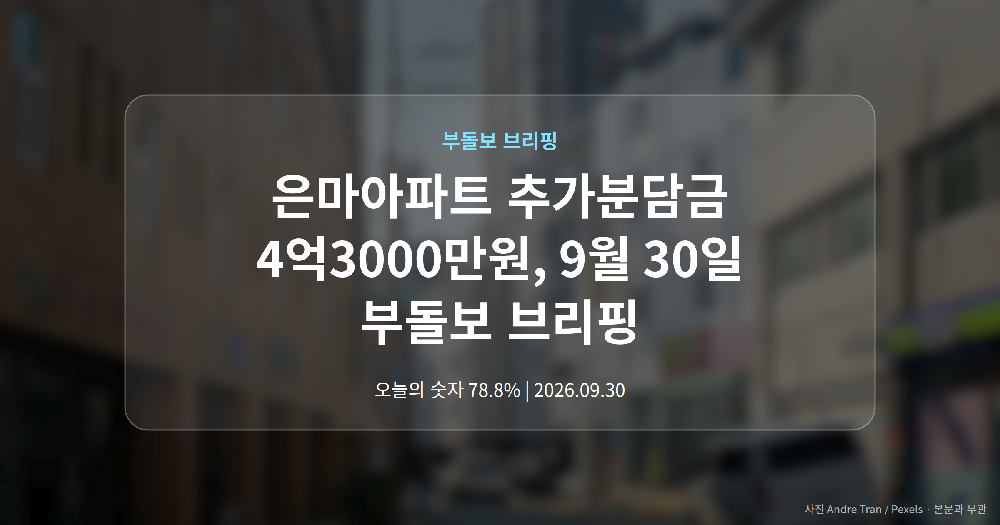
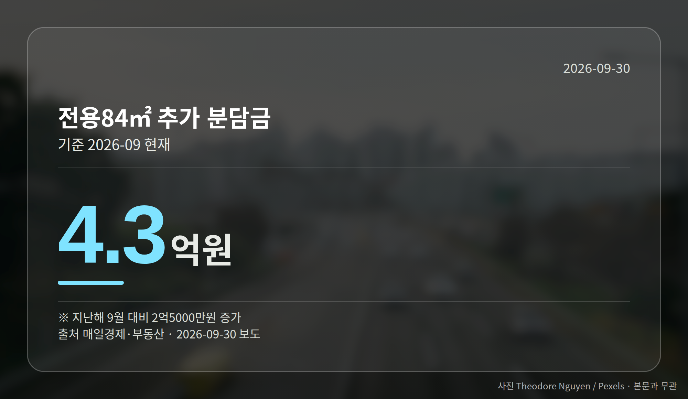
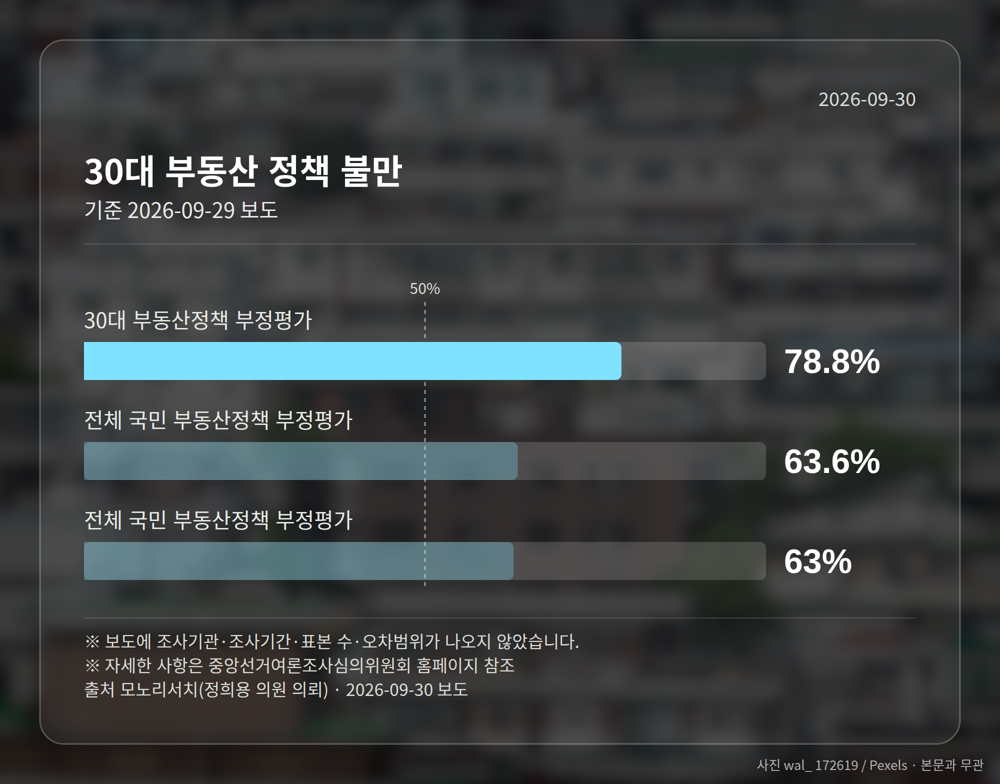
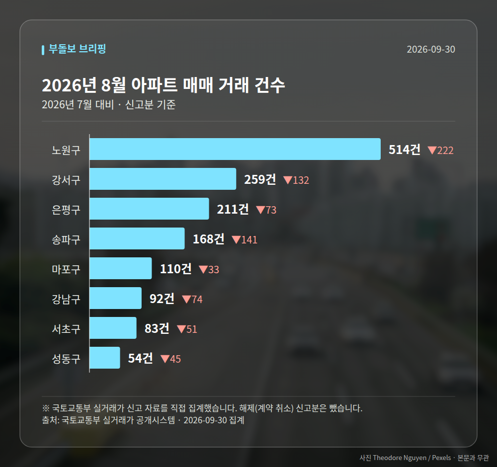

*이 글은 2026년 9월 30일 기준으로 정리한 내용입니다. 실거래 수치는 2026년 8월 신고분입니다.*
**3줄 요약**

- 은마아파트 추가분담금이 1년 만에 크게 늘었습니다
- 전용 84㎡ 기준 4억3000만원, 증가액은 2억5000만원
- 공사비와 분양가상한제가 근거로 제시됐는지 확인하세요
은마아파트 추가분담금이 전용 84㎡ 기준 4억3000만원으로 집계됐습니다. 1년 전보다 2억5000만원 늘어난 금액입니다.

조합은 공사비 상승과 분양가상한제(새 아파트 분양가에 상한을 두는 제도)를 이유로 들었습니다. 오늘은 이 소식부터 차분히 짚어 보겠습니다.

## 은마아파트 추가분담금, 숫자로 보면

서울 강남구 대치동 은마아파트 재건축 조합이 산정한 금액입니다. 추가분담금은 조합원이 새 아파트를 받으면서 따로 더 내야 하는 돈을 말합니다.

| 구분 | 금액 |
|---|---|
| 전용 84㎡ 추가분담금 | 4억3000만원 |
| 1년간 증가액 | 2억5000만원 |
| 전용 143㎡ 추정 분담금 | 90억원 초과 |

지난해 9월과 비교한 수치입니다. 전용 143㎡를 선택하는 경우의 추정치는 자릿수 자체가 다릅니다.

다만 일부 기사 제목에 나온 '1년 만에 1억대에서'라는 표현과 본문 증가폭의 기준 시점이 정확히 맞는지는 본문에 명시돼 있지 않습니다. 이 점은 감안해서 보셔야 합니다.

## 은마아파트 추가분담금이 늘어난 이유는

조합 측 설명은 두 가지입니다. 첫째는 공사비 상승, 둘째는 분양가상한제의 영향입니다.

일반분양가에 상한이 걸리면 조합이 분양 수입으로 메울 수 있는 몫이 줄어듭니다. 그만큼 조합원이 부담할 금액이 커지는 구조입니다.

[이미지: 재건축 공사가 진행 중인 아파트 단지 현장]

## 다른 단지 소유자는 무엇을 볼까

공사비와 분양가상한제는 은마아파트만의 조건이 아닙니다. 그래서 강남권 다른 정비사업 단지로 비슷한 흐름이 번질 수 있다는 우려가 나오고 있습니다.

다만 단지마다 사업 단계와 용적률, 일반분양 물량이 달라 같은 폭으로 움직인다고 보기는 어렵습니다. 여러분 단지의 조합 총회 자료에서 분담금 추정치가 언제 다시 산정됐는지부터 확인해 보시는 편이 낫습니다.

매수를 검토 중이시라면 매매가만이 아니라 분담금을 더한 총액으로 계산해 보시는 것이 현실적입니다.

## 그 밖의 오늘 소식

- 30대 78.8%가 정부 부동산 정책에 부정 평가(모노리서치)
- 이재명 대통령, 국토부에 과감한 주택공급 총력 주문
- 인천 8월 매매가 하락 전환, 전월세는 상승세 지속

전체 국민 부정평가는 63.6%(국민일보)와 63%(투어코리아)로 매체별 보도치에 차이가 있었습니다. 대출규제 관련 부정 응답은 70.7%로 나타났습니다.

대통령 발언은 9월 29일 국토교통부 장관에게 나온 것으로, 구체적인 공급 물량과 시기는 아직 제시되지 않았습니다.

**그래서 나는?**

- 재건축 조합원이라면, 분담금 재산정 시점과 근거부터 확인해 보세요
- 강남권 매수를 살피신다면, 정비사업 단지는 분담금까지 합쳐 보셔야 합니다
- 30대 무주택 실수요자라면, 대출규제 논의 흐름을 함께 지켜보실 수 있습니다

**직접 센 숫자 — 2026년 8월 아파트 실거래**

서울 8개 구 신고 매매 **1491건** (2026년 7월 2262건, -771건)

거래가 많은 곳: 노원구 514건(-222) · 강서구 259건(-132) · 은평구 211건(-73)

강서구 전세가율 가운뎃값 **48.9%** (같은 단지·같은 면적 52곳)

서울 25개 구 가운데 거래가 가장 크게 움직인 곳: 중랑구 -61.5%(501→193건, 2026년 7월엔 묵동에 66.3% 몰렸음) · 동작구 -48.7%(238→122건)

2026년 8월 계약 신고가

- 강서구 마곡서광(치현마을) 84.93㎡ — 7.6억 (이전 최고 6.0억, +26.7%, 8월 30일 계약)
- 노원구 청솔(시영7) 39.78㎡ — 5.8억 (이전 최고 4.7억, +24.2%, 8월 25일 계약)

*국토교통부 실거래가 신고 자료를 직접 집계했습니다. 해제 신고분은 뺐습니다.*
**여러분이 보고 계신 단지는 1년 전과 비교해 분담금 추정치가 어떻게 달라졌나요?**

---

### 참고한 기사

1. **2026년 3분기 부동산 시장 동향…수도권 집값 상승·월세 확대·주담대 금리 부담**
   - [투데이타임즈](https://news.google.com/rss/articles/CBMiUkFVX3lxTFBFQlhSZEI0UVFpVTJLSVpvbm9ta1oycXR0VTZjX0lhRnI1Q255X1hnX2Y2dVNaazdYTGVFRnI5RVBFQTZ6N1hqREFtOHhwZDJ4VUE?oc=5)
2. **30대 청년 80% "정부 부동산 정책 잘못됐다"**
   - [한국경제](https://news.google.com/rss/articles/CBMiWkFVX3lxTE5iN1FzSzlsbHc5OUlmSUQ4SnZZT0lPc0Z2dU9Hd0xvWUxkTThuUkpzSHVsMHhXYzJnWll4cWJOYTIzLUJpMUVwNlMyUWFYS2dITXlzVzZnTXhxZw?oc=5)
   - [매일경제·부동산](https://www.mk.co.kr/news/realestate/12163598)
3. **이재명 대통령 “나라 운명 달렸다”…국토부에 주택 공급 주문**
   - [데일리안](https://news.google.com/rss/articles/CBMimAJBVV95cUxNejdvdlhOaVp6MWllNnlObWdRS05PY0xQR1hYenJjOXRacFg3VWZUSnd1NHhJZFk4NlRwM2NLcTl0SnNtQmw3RW5uQ0Nvc3FLUTRSclZKSE9abG5uR0hCWXhQSDFmLVBFcnM3TzZsOWFOZXNZSnJhdXVUVFBKbjhJaFVmQXdPdnhsNmRaMHF5S29BNFpTRWktOXh5bTZEUkJPaUlPV01zY2hhMXFlNkdpNXFRUkg0elhxNlJkTXdXcVdhdWxWUVNva3JPVkNNeG0tX205LUlsQUZ1Z0I2WFk1OVg1V1BzZVExdkt6WXpJYVlBUzZnTy1VX21UTjB0bG5LNkhvX0J1Vm5hbmdabXI0R2hiV1Zxd2dk?oc=5)
   - [신문고뉴스](https://news.google.com/rss/articles/CBMiSEFVX3lxTE5Vcko1Um9rTnFRTlZCd1YxZ05POENYcHJwSjFIY1hpc0s1ZFM2ZXU0ZHFlX01CaDNkUGRybW15Q0tCMXR2bEFzag?oc=5)
4. **인천시, 8월 주택 매매가격 하락 전환…전·월세는 상승세는 계속**
   - [비즈월드](https://news.google.com/rss/articles/CBMia0FVX3lxTE9YeVFpbWJ1WC01QzAxYnpNU21jVGF2Rlh3RnZ2Ul9LSEJFLUp2ZXN0azRzOXl3eUQtN3RDU3BYRHJGTjc5RkV0T1pSTm5FYkZ1M1VHZ2hqTFNZT0hMell2aUVPS24xbzFkR1dV?oc=5)
   - [동방일보](https://news.google.com/rss/articles/CBMic0FVX3lxTE4yRm1kOXFFNTJJZENkMjVjLTBYMTAwV3BqaHA4NjcycDZxejM4dkZOOTNoSkFJa3JXSTJFLUtHLS1MVzRKd1JzQUVtWEZvcGpzVVQ1NU9OTFc4NE1pRUVJS1l1dTlvWk5nYkhVTW8xcjk5NVU?oc=5)
5. **“1년 만에 1억대서 4억으로”…은마아파트 ‘분담금’ 폭탄에 발동동**
   - [매일경제·부동산](https://www.mk.co.kr/news/realestate/12163829)

---

*본 글은 공개된 언론 보도를 정리한 것이며, 투자 판단의 책임은 이용자 본인에게 있습니다.*
