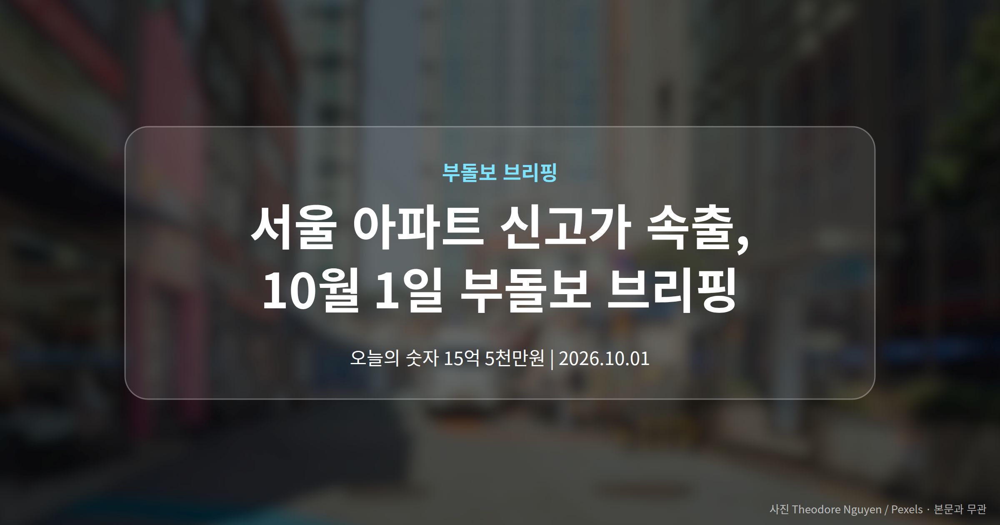
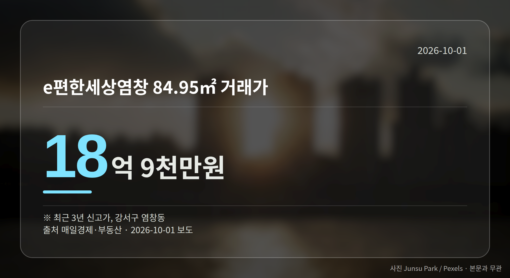

*이 글은 2026년 10월 1일 기준으로 정리한 내용입니다. 실거래 수치는 2026년 8월 신고분입니다.*
**3줄 요약**

- 은평·강서·구로·금천·동작 6개 단지 최근 3년 신고가 기록
- 서초 래미안퍼스티지 85억원, 등록 기준 최고가로 집계
- 단지별 거래 건수가 적어 같은 면적 최근 거래를 함께 볼 때
10월 1일 서울 아파트 신고가 소식이 여러 자치구에서 동시에 나왔습니다. 은평·강서·구로·금천·동작구 6개 단지가 최근 3년 내 신고가를 기록했고, 서초구 반포동 래미안퍼스티지는 85억원에 손바뀜했습니다.

정리하면, 신고가 경신이 특정 가격대나 특정 지역에만 머물지 않았다는 점이 오늘의 핵심입니다.

[이미지: 서울 아파트 단지가 모여 있는 전경 사진]

## 서울 아파트 신고가, 어느 단지에서 나왔나

매일경제·부동산 보도로 확인된 단지는 아래와 같습니다. 그동안 중저가권으로 분류되던 지역이 함께 포함됐습니다.

| 단지(자치구) | 전용면적 | 거래가 |
| --- | --- | --- |
| 래미안베라힐즈(은평) | 84.93㎡ | 15억 5천만원 |
| e편한세상염창(강서) | 84.95㎡ | 18억 9천만원 |
| 구로두산(구로) | 63.33㎡ | 8억 6천만원 |
| 현대홈타운(구로) | 59.73㎡ | 11억 9천만원 |
| 독산주공14단지(금천) | 44.89㎡ | 5억 5천만원 |
| 대림아파트(동작) | 59.84㎡ | 15억 6400만원 |

금액이 가장 큰 거래는 강서구 염창동이었고, 가장 작은 거래는 금천구 독산동이었습니다. 면적이 작은 단지에서도 신고가가 나왔다는 점이 눈에 띕니다.

## 강남권 초고가 거래도 함께 나왔습니다

9월 30일 국토부 실거래가 시스템(계약 신고된 실제 거래가격을 공개하는 정부 시스템)에 새로 등록된 거래 가운데, 반포동 래미안퍼스티지 전용 222.76㎡가 앞서 적은 금액으로 등록 기준 최고가였습니다.

같은 날 강남구 동부센트레빌도 60억원에 거래된 것으로 보도됐습니다. 초고가 구간과 중저가 구간에서 신고가 경신이 동시에 나타난 셈입니다.

## 서울 아파트 신고가, 어떻게 읽어야 할까

다만 지역 전체 시세가 올랐다고 단정하기는 이릅니다. 단지별 거래 건수가 많지 않고, 기사도 단신 수준이어서 층수나 거래일 같은 배경이 확인되지 않습니다.

초고가 거래 역시 건수 자체가 적어 전체 시장을 대표하기는 어렵습니다. 관심 단지가 있다면 신고가 한 건보다 같은 면적의 최근 거래 여러 건을 나란히 보시는 편이 안전합니다.

[이미지: 스마트폰으로 아파트 실거래가를 확인하는 모습]

## 그 밖의 오늘 소식

용어 하나만 짚으면, 도심 공공주택 복합사업은 공공이 주도해 도심 노후지를 주택으로 다시 짓는 방식입니다.

- 정부, 서울 11곳 도심 공공주택 복합사업 후보지 선정(1.8만호)
- LH 인천계양 신혼희망타운 309가구 본청약, 평균 5억400만원
- 대전 대덕구, 재개발·재건축 주민 기본교육 4차례 진행

**그래서 나는?**

- 서울 중저가권 실수요자라면, 관심 면적의 최근 거래 여러 건을 먼저 확인해 보세요
- 1주택자라면, 내 단지 같은 평형 신고가가 몇 건인지부터 살펴볼 수 있습니다
- 신혼부부 청약 대기자라면, 인천계양 신혼희망타운 분양가 수준을 참고해 보세요

**직접 센 숫자 — 2026년 8월 아파트 실거래**

서울 8개 구 신고 매매 **1330건** (2026년 7월 2048건, -718건)

거래가 많은 곳: 노원구 517건(-219) · 서초구 83건(-51) · 용산구 42건(-27)

노원구 전세가율 가운뎃값 **52.8%** (같은 단지·같은 면적 106곳)

서울 25개 구 가운데 거래가 가장 크게 움직인 곳: 중랑구 -61.5%(501→193건, 2026년 7월엔 묵동에 66.3% 몰렸음) · 동작구 -48.7%(238→122건)

2026년 9월 계약 신고가

- 마포구 힐스테이트마포더퍼스트 84.07㎡ — 22.9억 (이전 최고 16.9억, +35.8%, 9월 5일 계약)
- 노원구 시영3차(라이프)아파트 49.5㎡ — 6.5억 (이전 최고 5.4억, +20.2%, 9월 10일 계약)

*국토교통부 실거래가 신고 자료를 직접 집계했습니다. 해제 신고분은 뺐습니다.*
**여러분이 보고 계신 단지에서는 최근 어떤 가격대의 거래가 올라오고 있나요?**

---

### 참고한 기사

1. **은평구 녹번동 래미안베라힐즈 84.93㎡ 15억 5천만원… 최근 3년 신고가 [MAI부동산]**
   - [매일경제·부동산](https://www.mk.co.kr/news/realestate/12165626)
2. **LH, 인천계양서 신혼희망타운 309가구 공급…평균 분양가 5억400만원**
   - [데일리안](https://news.google.com/rss/articles/CBMiU0FVX3lxTFBxTU9SdEp3ekY2U1g2VEJIMmVqU1BFTUVwWGVOTkdseTNSeXpVOVhzYUpNM0J1ZVhjQ1drWnFhQlM3aTMtWThlWm0tZXo1bERjWGNV?oc=5)
   - [브릿지경제](https://news.google.com/rss/articles/CBMiWkFVX3lxTE9IRmQyV1BIYUlQZVdPUUtKR2lGU2ZpQ3ItRy0tM3BDeTduMDItRVJ2TkM1ZmtDRldiVkRZd0Q5eVhZMjY0OW1RTTJhMGcxS21lbUhWYkVHdUx3UQ?oc=5)
3. **‘도심 공공주택 복합사업’ 서울 11곳(1.8만호) 신규 후보지 선정**
   - [부동산신문](https://news.google.com/rss/articles/CBMiaEFVX3lxTE9ad1VjNXktcm5Lbm1vb1VGVm1kZTc0UlBuNzR0dkltSmN3V19PR01uNmtwRDg5S0tVQ0x3VFlHWGh2bTV6RkN4NGRPVzFnV3Zrc2VwMW5lSzl5UERFa1VjNXMwcXpuMHNp?oc=5)
   - [데일리한국](https://news.google.com/rss/articles/CBMib0FVX3lxTE5tLTQ3aS1mbmNRQ0dJb3pZTmtPRnNkaDBiTnFTYlYxS0syTjE2OWYxRDllcURlYV9vMVdZb3pzSjh3Z0lTN1h2V3RNb3poNlotT0pnOVAyZzdJYmduVzQ5UFZ3dDI1VUxTZndkSUdURdIBc0FVX3lxTE9zVUpobkpYdmtSWjBhOGgwMVd6c19pQVdyZDA4N1Q3ZG8waDVRQWpEbnExclhvSk9NeVY5ckd5amU5c3AtNFhvbi01RDdFOE1ybWswWG9oZTlrNEs0YUxfZVhJN0VmRzBnZ1dtbXRKWDZ0a00?oc=5)
4. **대전 대덕구, 재개발·재건축 찾아가는 주민교육…정비사업 갈등 예방**
   - [뉴스충청인](https://news.google.com/rss/articles/CBMiRkFVX3lxTE9uY2hzZFkzNTB3aGpPT2NiTDZTWGZEZjZBVWJKdWhXV3dKcmZSNGNNS2dhb1V5SkFGUTRGVEg3YlcxRXRENmc?oc=5)
   - [타임뉴스](https://news.google.com/rss/articles/CBMiVEFVX3lxTE1RSGNOTVJzODBOQlp6bkkzc2pzbnJaWkRZVUtsb3dIQkVWZ0h3SHd4ZjBuVnVPWmJfbzNuQlBkMDVwR24zYVpRQkcxdUg3aEVpRVB4ag?oc=5)
5. **서초 래미안퍼스티지 85억원·강남 동부센트레빌 60억원… 서울 아파트 고가 거래 [MAI부동산]**
   - [매일경제·부동산](https://www.mk.co.kr/news/realestate/12165615)

---

*본 글은 공개된 언론 보도를 정리한 것이며, 투자 판단의 책임은 이용자 본인에게 있습니다.*
