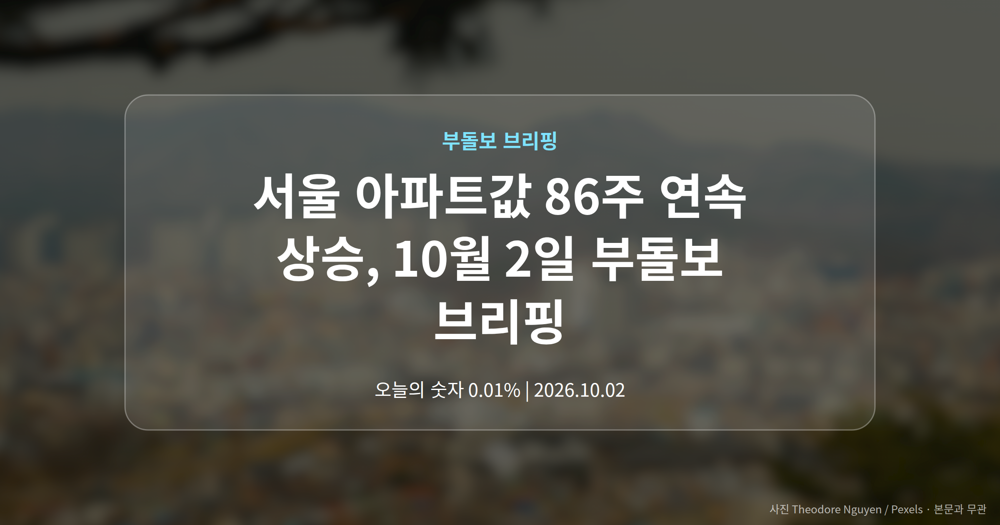
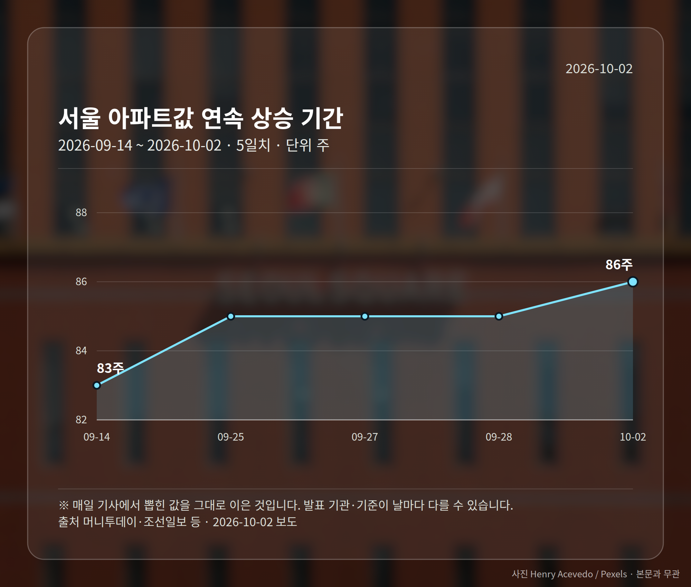
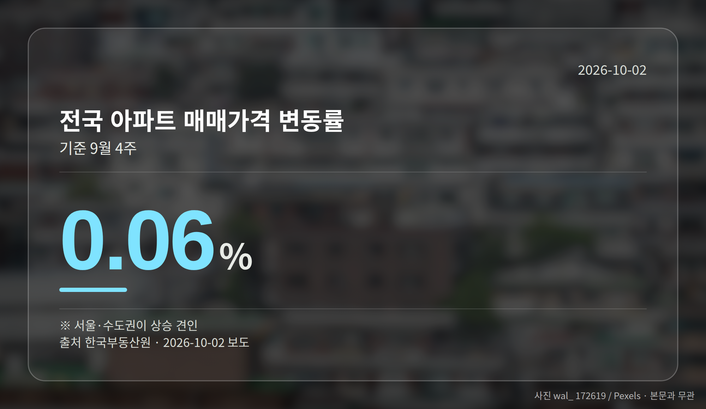
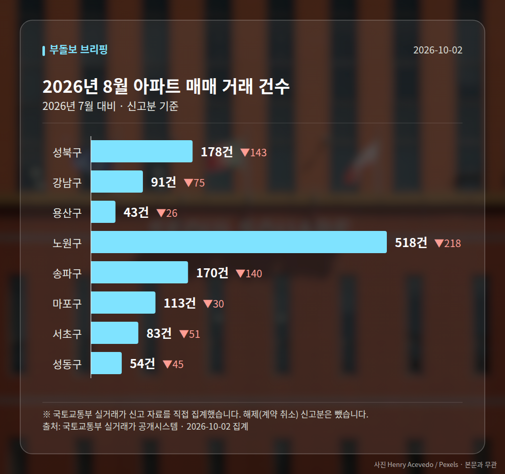

*이 글은 2026년 10월 2일 기준으로 정리한 내용입니다. 실거래 수치는 2026년 8월 신고분입니다.*
**3줄 요약**

- 서울 아파트값이 86주 연속 올라 역대 최장 상승 기록을 세웠습니다.
- 전국 매매가 0.06%, 전세가 0.09% 상승(한국부동산원, 9월 4주).
- 다만 강남3구는 4주째, 용산도 하락 중이라 지역별 온도차를 봐야 합니다.
오늘 정리할 핵심은 하나입니다. **서울 아파트값 86주 연속 상승**으로 역대 최장 기록이 세워졌지만, 상승폭은 둔화되고 강남3구와 용산은 오히려 내려가고 있습니다.

같은 '서울'인데 방향이 갈린다는 뜻입니다. 평균 숫자 하나로 시장을 읽기 어려워진 시점입니다.

## 서울 아파트값 86주 연속 상승, 숫자부터 보겠습니다

9월 29일 기준 서울 아파트값은 86주 연속 올랐습니다. 머니투데이·조선일보 등은 이를 문재인 정부 당시 기록을 넘어선 역대 최장 수치라고 보도했습니다.

같은 기간 전국 지표도 올랐습니다. 한국부동산원 집계로 9월 4주 전국 아파트 매매가격은 0.06%, 전세가격은 0.09% 상승했고, 서울·수도권이 상승세를 견인했습니다.

| 구분 | 수치 | 기준 |
|---|---|---|
| 서울 연속 상승 | 86주 | ~9/29 |
| 강남3구 연속 하락 | 4주 | ~9/29 |
| 전국 매매가 | 0.06% | 9월 4주 |
| 전국 전세가 | 0.09% | 9월 4주 |

## 그런데 강남3구와 용산은 왜 내려갔을까요

강남3구(강남구·서초구·송파구)는 4주 연속 하락했고, 용산도 강남에 이어 하락한 것으로 나타났습니다. 핵심 지역이 먼저 방향을 틀었다는 점이 눈에 띕니다.

여기에 서울 전체 상승세 자체가 둔화되고 있다는 보도까지 겹쳤습니다. 시장이 변곡점에 가까워졌는지 지켜볼 필요가 있다는 신호로 읽히는 대목입니다.

다만 하락의 원인이나 거래량까지는 이번 보도에서 확인되지 않았습니다. 단정하기보다 몇 주 더 흐름을 보는 편이 안전합니다.

## 서울 아파트값 86주 연속 상승을 어떻게 읽을까요

정리하면 '서울 집값이 오른다'는 헤드라인과 강남3구·용산 거주자가 체감하는 현실 사이에 괴리가 생긴 상태입니다. 앞서 본 연속 상승 기록은 서울 25개 구를 묶은 평균값이라는 점을 기억해 두시면 좋겠습니다.

그래서 여러분이 실제로 봐야 하는 건 전국이나 서울 평균이 아니라, 관심 지역의 주간 변동률입니다. 한국부동산원 주간 통계는 구 단위까지 공개됩니다.

[이미지: 아파트 단지를 바라보며 휴대폰으로 시세를 확인하는 사람]

## 그 밖의 오늘 소식

- 세종 아파트값이 7주 만에 상승 전환했습니다.
- 대구 매매가는 0.01% 올라 한 주 만에 반등했습니다.
- 집코노미 박람회 2026에서 보증금 반환·수선의무 상담이 소개됐습니다.

세종과 대구는 상승 전환이라고는 해도 폭이 매우 작고, 대구는 '혼조세'라는 표현이 함께 쓰였습니다. 추세 전환으로 보기엔 이른 단계입니다.

**그래서 나는?**

- 무주택 실수요자라면, 평균보다 관심 지역의 주간 흐름을 먼저 확인해 보세요.
- 강남3구·용산 보유자라면, 4주째 이어진 하락 흐름의 거래량도 함께 살펴볼 수 있습니다.
- 세종·대구에서 집을 보고 있다면, 상승 전환 폭이 아직 미약하다는 점을 감안해 보세요.

**직접 센 숫자 — 2026년 8월 아파트 실거래**

서울 8개 구 신고 매매 **1250건** (2026년 7월 1978건, -728건)

거래가 많은 곳: 성북구 178건(-143) · 강남구 91건(-75) · 용산구 43건(-26)

성북구 전세가율 가운뎃값 **56.2%** (같은 단지·같은 면적 44곳)

서울 25개 구 가운데 거래가 가장 크게 움직인 곳: 중랑구 -61.5%(501→193건, 2026년 7월엔 묵동에 66.3% 몰렸음) · 동작구 -48.7%(238→122건)

2026년 9월 계약 신고가

- 마포구 힐스테이트마포더퍼스트 84.07㎡ — 22.9억 (이전 최고 16.9억, +35.8%, 9월 5일 계약)
- 노원구 시영3차(라이프)아파트 49.5㎡ — 6.5억 (이전 최고 5.4억, +20.2%, 9월 10일 계약)

*국토교통부 실거래가 신고 자료를 직접 집계했습니다. 해제 신고분은 뺐습니다.*
**여러분이 보고 있는 동네는 지금 서울 평균과 같은 방향으로 움직이고 있나요?**

---

### 참고한 기사

1. **서울 아파트값 86주 연속 올라…역대 최장 상승**
   - [데일리안](https://news.google.com/rss/articles/CBMigwJBVV95cUxPUERKbUdaVUJLVXpUa08yQmhfdHU5bXdVYU5NR1REVnJ0SC0tMDZsRDV2bld5eVNsRW1WdUpTTWtXM0NqU2I0RUQtZXZpMEZERkw2NWptcVdxUEFEMk5DNldfVmJtcnQwcWdBXzR6aFlVRTZIRjROdHFHLWtjVVVRcmhINkgyNFdDWVB3WF9tZDlkNzRXQk4wa0xPbFl5bHJVLWtQY1BfUWNZaGRpbzc5R05pV0U2dE1ELWdyUU1ETVVkUWdKS3Q0SHNmZ0I1QkdudEdCM3RCcEJmZ3NROUh3VXdqa3M1dHhMdnlGVElxZjF6SzlmMWRiUDJmajVLZFdEdk9R?oc=5)
   - [머니투데이](https://news.google.com/rss/articles/CBMib0FVX3lxTE5KUU9vNmI3OTk0YXVvY3VzVlExcFFfX25XU19zaUJHOVhFWVgwWlFuNktNbWxIQ1VkV3J2WnAxMkpJQnRsc18zVmhTa2h4WnAtaUlOREE3OXNRampjZzFKZFQ5SUlpS0UyVGpnektNc9IBb0FVX3lxTE5KUU9vNmI3OTk0YXVvY3VzVlExcFFfX25XU19zaUJHOVhFWVgwWlFuNktNbWxIQ1VkV3J2WnAxMkpJQnRsc18zVmhTa2h4WnAtaUlOREE3OXNRampjZzFKZFQ5SUlpS0UyVGpnektNcw?oc=5)
2. **세종 아파트값 7주 만에 상승 전환**
   - [뉴스엔톡](https://news.google.com/rss/articles/CBMibEFVX3lxTE5Ra1lKLTlFQ1dPTmtKTGttMFZQdjYzYWpqX0hWdTYxeE1WLWU2b0JFV3VnLTRfWjdqbGJWXy1EaWFYQXJEVFNCSWFiWEtQUzRnU0hId0V1S1luejZsS2lfQTFUdWRvcDRwOW8tUw?oc=5)
   - [메트로세종](https://news.google.com/rss/articles/CBMia0FVX3lxTFBaNGQ2NDV1RmJPeDVDMDhLT3lhYmF2MVE2UHd6aGtqOXkxSjM5QnA0a3VmYUMwYmtrVFBrQmYzdnJqRjBhUFJyeklMajBBQXpDdkdScDNGSFgzNS13bk01UGd4OXJNd2ZFbUxN0gFvQVVfeXFMUDRweWQxMzRyYnAwMlJJTkZ5X05UQ00wZ3V5THZiZGh5LW41T0tMOHhIZ1FMUTVWeEF2YjFjTGJERmNOMXZPZFlsSVBkU3JiajIwa3JDTkZqT2xfMndpbFVRY0hySVlReXJXRWo0aUMw?oc=5)
3. **한국부동산원, 전국 아파트 매매가 0.06% 상승…서울·수도권이 견인**
   - [gukjenews.com](https://news.google.com/rss/articles/CBMibkFVX3lxTE1XMngwTXZDUnhlLTdxY2RHa2lpUWZjSGNmTVVpbTNGSFhFdXYyZi1YWm1jdFFtOVVzN1B3STVSMHhydllEaWRzbW9UOUtWNEFJYXJMaUxnZ1NrdERhTE0zaDkyZEUxa0piZjVVd3B3?oc=5)
   - [kscnews.co.kr](https://news.google.com/rss/articles/CBMia0FVX3lxTFBVMkRrRndOZldjZnY3MGg1amdMMDlrSDl1V2FqOG5jaGtGSE95TnpMcUFKQ3JoWnhhdXNpRElIWWVBLUltYTJCakZ3ekFNd2F6YXBuSUF0Ul9ob1NUcGJObUtoMmk2bHZ3SG1v?oc=5)
4. **보증금 반환·수선의무 누가지나...부동산원 분쟁조정 상담 [집코노미 박람회 2026]**
   - [한국경제](https://news.google.com/rss/articles/CBMiWkFVX3lxTE94cjNyODBjVUJsdnZ2bFVUalIxem9YRnh6cWk4T21wUHNqRU5DV1dueDRGMHJ5WFJHVU94N1Y2TzVjbjhvSnFWOFVLbkNrWDBRLWRRVGtpNjVhZw?oc=5)
5. **대구 아파트 매매가 혼조세 이어가**
   - [대구신문](https://news.google.com/rss/articles/CBMia0FVX3lxTE5nZm1ZTG5UUWxJOFoxUC03VGlWa05iQXpGalZUdURhU1AzMEVyQ0M3Y1I1M1AzT21UQjEzMW5GUEtqUDJHVWVXaGFEbUZaVFNyd2VkNVQ5TWlPTDBCNWpuakk1ZEFrZWtMR0pn?oc=5)
   - [SK브로드밴드 회사소개](https://news.google.com/rss/articles/CBMicEFVX3lxTE5LOGpaRnRrQTEwX2ZMRkRZam96RUtXS0R5OUdTdDhFTW03b1JEX2Y3YThxOFh5N1lhMEUxQjhHcnVLSWc1V2h5TXZJaXRSbTh4U3NOOC01M0FReXV5TFd5ZFFNM1hSbEdMTTBfM0lvdHU?oc=5)

---

*본 글은 공개된 언론 보도를 정리한 것이며, 투자 판단의 책임은 이용자 본인에게 있습니다.*
