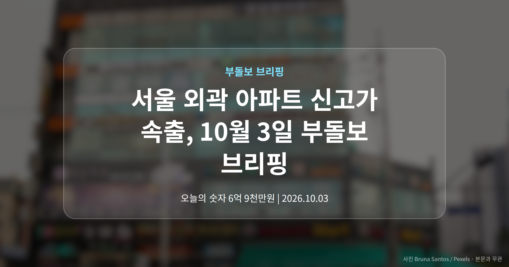
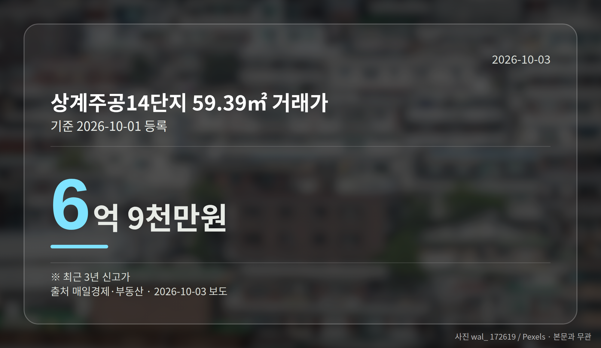
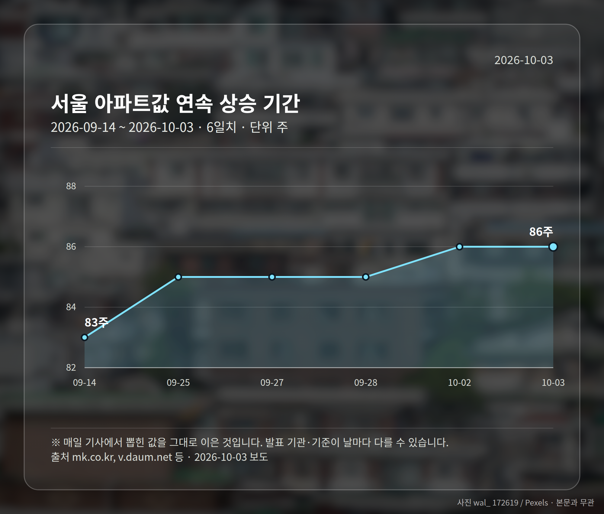
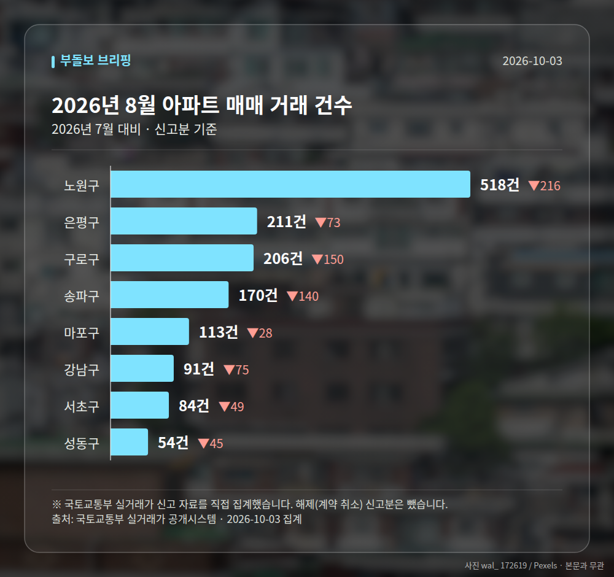

*이 글은 2026년 10월 3일 기준으로 정리한 내용입니다. 실거래 수치는 2026년 8월 신고분입니다.*
**3줄 요약**

- 노원·동작·영등포·구로에서 신고가 거래가 하루에 여러 건 등록됐습니다.
- 상계주공14 59.39㎡ 6억 9천만원, 양평현대6차 84.94㎡ 15억 5,500만원입니다.
- 서울 아파트값 86주 연속 상승, 강남3구는 하락한 점을 함께 보면 됩니다.
서울 외곽 아파트 신고가 거래가 하루에 여러 건 확인됐습니다. 노원·동작·영등포·구로에서 최근 3년 신고가(같은 단지·같은 면적에서 3년 안에 가장 높았던 가격)가 동시에 나왔습니다.

같은 날 강남구 압구정동에서는 75억원 거래도 등록됐습니다. 서울 아파트값은 86주 연속 오르는 중입니다.

[이미지: 노원구 상계동 일대 아파트 단지 전경 사진]

## 서울 외곽 아파트 신고가, 어느 단지에서 나왔나

2026년 10월 1일 국토교통부 실거래가 시스템(계약 뒤 신고된 실제 거래가격을 공개하는 사이트)에 새로 등록된 거래 가운데 신고가로 기록된 사례입니다.

| 단지 | 전용면적 | 거래가 |
| --- | --- | --- |
| 노원 상계주공14(고층) | 59.39㎡ | 6억 9천만원 |
| 노원 월계주공2단지 | 58.65㎡ | 6억 5,000만원 |
| 노원 하계동 벽산 | 70.56㎡ | 8억 5천만원 |
| 동작 신대방동 신동아 | 48.18㎡ | 6억 4천만원 |
| 영등포 양평현대6차 | 84.94㎡ | 15억 5,500만원 |
| 구로 구로동 주공1 | 83.805㎡ | 11억 9,800만원 |

노원구에서만 세 건입니다. 월계주공2단지는 1992년, 하계동 벽산은 1988년 6월에 준공된 오래된 단지입니다.

## 서울 외곽 아파트 신고가가 말해 주는 것

보도에 따르면 같은 시기 강남3구 아파트값은 하락했고, 상승은 외곽 지역이 이끌었습니다. 상대적 중저가 지역에서 매수세가 붙은 모습입니다.

다만 오늘 자료는 거래금액과 신고가 여부 중심의 짧은 요약입니다. 계약일이나 층수 같은 세부 정보가 없어, 이 금액을 단지 전체 시세로 바로 읽기에는 조심할 필요가 있습니다.

해당 지역을 보고 계신 분이라면 신고가 한 건보다 같은 면적의 최근 거래 흐름을 함께 살피는 편이 안전합니다. 서울 외곽 아파트 신고가가 이어진다는 사실 자체는 참고 지표로만 두시면 됩니다.

## 그 밖의 오늘 소식

- 서울 아파트값 86주 연속 상승, 누적 17.6%(데일리메이커 보도)
- 압구정동 신현대9차 152.28㎡ 75억원, 당일 등록 최고가
- 추미애 경기도지사, 일자리·교통 연계 '경기도형 주택공급' 제안

**그래서 나는?**

- 무주택 실수요자라면, 관심 면적의 최근 거래 흐름부터 확인해 보세요.
- 노원·구로 1주택자라면, 신고가 한 건이 단지 시세는 아님을 참고하세요.
- 경기도 신도시 입주 예정자라면, 일자리·교통 연계 논의를 지켜볼 만합니다.

**직접 센 숫자 — 2026년 8월 아파트 실거래**

서울 8개 구 신고 매매 **1447건** (2026년 7월 2223건, -776건)

거래가 많은 곳: 노원구 518건(-216) · 은평구 211건(-73) · 구로구 206건(-150)

노원구 전세가율 가운뎃값 **52.8%** (같은 단지·같은 면적 106곳)

서울 25개 구 가운데 거래가 가장 크게 움직인 곳: 중랑구 -61.5%(501→193건, 2026년 7월엔 묵동에 66.3% 몰렸음) · 동작구 -48.7%(238→122건)

2026년 9월 계약 신고가

- 마포구 힐스테이트마포더퍼스트 84.07㎡ — 22.9억 (이전 최고 16.9억, +35.8%, 9월 5일 계약)
- 노원구 시영3차(라이프)아파트 49.5㎡ — 6.5억 (이전 최고 5.4억, +20.2%, 9월 10일 계약)

*국토교통부 실거래가 신고 자료를 직접 집계했습니다. 해제 신고분은 뺐습니다.*
**여러분이 보고 계신 단지의 같은 면적은 올해 어느 가격대에서 거래되고 있나요?**

---

### 참고한 기사

1. **노원구 상계주공14단지 59.39㎡ 6억 9천만원… 최근 3년 신고가 [MAI부동산]**
   - [매일경제·부동산](https://www.mk.co.kr/news/realestate/12166817)
2. **추미애 경기도지사, 국토부 장관 만나 ‘경기도형 주택공급’ 제안…“일자리·주거 함께 설계해야”**
   - [파이낸스투데이](https://news.google.com/rss/articles/CBMibEFVX3lxTFB5dkNFaVg5UlkwWmZMbGgyV1BxYmllZnV6SnktTVR2S2tJMEpoa2Ryc1pTOWFfNXo1bjYyZGN2WU1USEZ3OHVhYkFPRU91NlB3cHp2d3Q1dGFnbVZkQlJLbkVGcDlFNzZndXM1LQ?oc=5)
   - [경기타임스 e](https://news.google.com/rss/articles/CBMibEFVX3lxTE1PSTFlUnE3R2p0ZldjZ2JnT2NmajY1SmszZ09GYVRoQW5HQV9ydnpPX3hpdWdfQW1UdmdiQWNuTjhaRy1YekFLYXZXSzNISW92OVFiMlVQdzFObkJvRkczOVE0X3Y4cjRVU1B1SA?oc=5)
3. **한국부동산원, 건설사 대상 온실가스 목표관리제 교육 실시…감축 지원 강화**
   - [매일신문](https://news.google.com/rss/articles/CBMiYkFVX3lxTE9odmNnSHZ6UklNR3FjUlhJNC1QV19BOUhDbWZTUms3UGFiRHJBWUpIT0YyVWlaODAxZ1UxWEd5VTFPeS1QM0tjR1FPRHN2d2JqaEg3Z0VXcy1SamF5OW1VeEFB?oc=5)
   - [파이낸셜리뷰](https://news.google.com/rss/articles/CBMidEFVX3lxTE1hbXpkM3hyblhvRUpGalNFbTdvYXlvNGtRZEc2U0RJMjdiNElGeG14QlZhcThVOHV2bUdKXzdPOWdaeEU1a29URVkxaXZ1QUhKREEtS2k5NHlPVXVmYmZBU0hfWVVVS3VzajBDNnNwR0pPcDRB?oc=5)
4. **文정부 기록 넘었다...서울 아파트값 86주째 상승**
   - [데일리메이커](https://news.google.com/rss/articles/CBMiZkFVX3lxTE9RcjlmcDZ5NmJkeVQzWHd4ZGNLbHZFaGQ4OTVnNVhIdkx2VVRpM0prT1ZPVGk4SGI5VHVQU0hkVnRTcDlsM3ExSGVZNHRTNEVvd3kzQi1rSHZCVjY2cHJsanVmZVZSQQ?oc=5)
   - [MBC 뉴스](https://news.google.com/rss/articles/CBMiekFVX3lxTE5vSFRJMFZ1ZXhNYllBXzdxREZ0OUlFUE5ZaEVDc2E5WVJTNDQzbWN3SFFySHhBZFA3QTY2N19xaWhxYlJDVzUyZlJVUUVVeF9NUWYxWmNLRHg5b1lhZEJXWWpOTG42RWZwOWxjTERUOU9wN25xMkFyZmNB0gF6QVVfeXFMUHVwR2R6RDRIRlVaY1NrajBqR1VGNVczS0YyUEtndUxwRkxnUi1lNWV6ZlB0MG52QU40SGZDZ193Q3dqbWdYQ19Id3psb0xnaVI4QXlQRTYySWRWOTB0Z3JwNWtqbmxOdUpHUWU1ZlJwQWZyVXhnSlBpeUE?oc=5)
5. **강남구 압구정동 신현대9차 75억원 거래… 서울 아파트 실거래가 [MAI부동산]**
   - [매일경제·부동산](https://www.mk.co.kr/news/realestate/12166813)

---

*본 글은 공개된 언론 보도를 정리한 것이며, 투자 판단의 책임은 이용자 본인에게 있습니다.*
