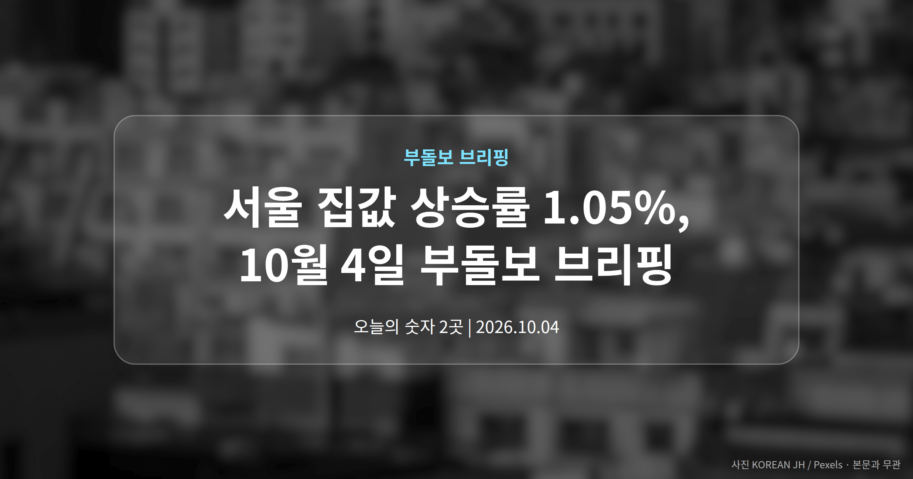
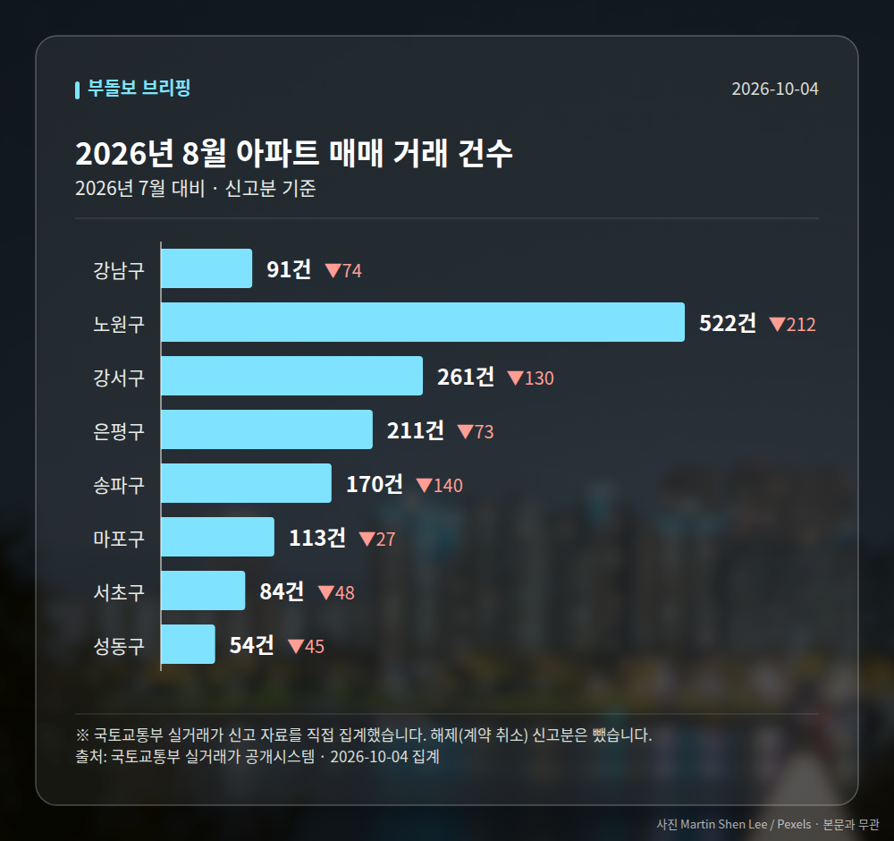

*이 글은 2026년 10월 4일 기준으로 정리한 내용입니다. 실거래 수치는 2026년 8월 신고분입니다.*
**3줄 요약**

- 고금리에도 서울 집값은 오름세를 이어갔습니다.
- 기준금리 3%, 주담대 4.66%, 서울 집값 1.05% 상승.
- 오른 가격과 식은 매수심리, 어느 쪽이 먼저 꺾일지가 관건.
오늘 서울 집값 상승률은 1.05%로 집계됐습니다. 기준금리 3%, 주택담보대출 금리 4.66%라는 부담스러운 환경에서도 가격은 올랐습니다.

반면 매수심리는 식었고, 강남권에서는 관망세가 짙어졌습니다. 숫자와 분위기가 서로 다른 방향을 보고 있는 날입니다.

[이미지: 서울 집값 변동률 1.05%를 보여주는 숫자 그래픽]

## 서울 집값 상승률 1.05%, 고금리 속에서 나온 숫자

먼저 수치를 한 번에 정리하겠습니다. 기준금리(한국은행이 정하는 기준이 되는 금리)와 주담대 금리, 그리고 집값 변동률입니다.

| 항목 | 수치 |
| --- | --- |
| 기준금리 | 3% |
| 주택담보대출 금리 | 4.66% |
| 서울 집값 변동률 | 1.05% |

※ 출처: newsyonhap.com

보통 대출 금리가 높아지면 매수 부담이 커져 가격이 눌리는 쪽으로 해석합니다. 그런데 이번 서울 집값 상승률은 그 반대 방향을 보여줬습니다.

보도에서는 이를 '엇갈린 부동산 지표'라고 표현했습니다. 대출 비용 부담이 매수세를 완전히 꺾지는 못하고 있다는 신호로 읽을 수 있다는 것입니다.

다만 한 가지 짚어둘 점이 있습니다. 이 상승률이 주간 기준인지 월간 기준인지는 기사 요약에 명시되지 않았습니다. 기간이 다르면 체감 크기도 완전히 달라지니, 숫자만 떼어 받아들이지 않으시는 게 좋겠습니다.

[이미지: 금리 상승 그래프와 아파트 단지가 겹쳐 보이는 이미지]

## 서울 집값 상승률과 반대로 움직인 매수심리

같은 날 또 하나의 소식은 매수심리입니다. 가격은 올랐는데, 사려는 분위기는 오히려 식고 있다는 보도가 나왔습니다.

특히 강남권에서 관망하는 흐름이 짙어진 것으로 전해졌습니다. 가격 부담이 커졌거나, 앞으로의 변동을 좀 더 지켜보려는 움직임일 수 있습니다.

서울 집값 상승률은 이미 나온 결과이고, 매수심리는 앞으로를 가리키는 쪽에 가깝습니다. 두 지표가 엇갈릴 때는 거래량이 어떻게 변하는지를 함께 보는 편이 도움이 됩니다.

구체적인 매수심리지수 수치는 제목 수준 정보만 확인돼, 숫자로는 비교하기 어려운 상태입니다.

[이미지: 부동산 중개업소 앞을 지나는 사람들 사진]

## 그 밖의 오늘 소식

- 다음 주 전국 청약은 2곳·185가구로 줄었습니다.
- 전월세난 배경의 집값 상승이 비강남권으로 확산됐습니다.
- 수도권은 경기 병점·동탄·군포가 상승을 주도했습니다.

분양 물량 감소는 추석 연휴 여파로 보도됐습니다. 공급이 언제 재개되는지가 다음 확인 지점입니다.

**그래서 나는?**

- 무주택 실수요자라면, 대출 금리 조건부터 다시 확인해 보세요.
- 1주택자라면, 비강남권 확산 흐름을 내 지역 기준으로 살펴보세요.
- 청약 대기자라면, 다음 주 공급이 2곳뿐이라는 점을 감안하세요.

**직접 센 숫자 — 2026년 8월 아파트 실거래**

서울 8개 구 신고 매매 **1506건** (2026년 7월 2255건, -749건)

거래가 많은 곳: 강남구 91건(-74) · 노원구 522건(-212) · 강서구 261건(-130)

강남구 전세가율 가운뎃값 **37.9%** (같은 단지·같은 면적 28곳)

서울 25개 구 가운데 거래가 가장 크게 움직인 곳: 중랑구 -61.4%(500→193건, 2026년 7월엔 묵동에 66.2% 몰렸음) · 동작구 -48.7%(238→122건)

2026년 9월 계약 신고가

- 마포구 힐스테이트마포더퍼스트 84.07㎡ — 22.9억 (이전 최고 16.9억, +35.8%, 9월 5일 계약)
- 노원구 시영3차(라이프)아파트 49.5㎡ — 6.5억 (이전 최고 5.4억, +20.2%, 9월 10일 계약)

*국토교통부 실거래가 신고 자료를 직접 집계했습니다. 해제 신고분은 뺐습니다.*
**여러분 동네는 가격과 매수 분위기 중 어느 쪽이 먼저 움직이고 있나요?**

---

### 참고한 기사

1. **"가을 분양시장 잠시 숨고르기"…다음 주 전국 2곳·185가구 청약 접수**
   - [CBC뉴스](https://news.google.com/rss/articles/CBMiaEFVX3lxTE9pWUVnUmxpZEw4MFY5VjQ5RThYemgydzZNN09MVVB5Ym5MSV9IWjd4NVFERmtUQk5QUGs1Y3VNYUFzcElPakRhd1UzUVhBQXJiWWN1UnpMR1BXWXpBT2ZRaV9aQndnQmti?oc=5)
   - [워크투데이](https://news.google.com/rss/articles/CBMibEFVX3lxTE9SdWdXaHYwb21PMS01c2xMUmpZZTVNUEdCWDFEVHRucFlROTk2OW9DaVNRVWxNb18wZXR0RUI2V1NWeC1KU0QzLWZweVdyVkdVTExPSFRLU0Z0elNsem1tUDVtZEhGdWg5V0hyZg?oc=5)
2. **전·월세난에 불붙은 집값…비강남으로 번졌다[집값, 최장 랠리②]**
   - [뉴시스](https://news.google.com/rss/articles/CBMieEFVX3lxTE95ZU4welh5VzkwN2t6S2luZjgwNlloNEQ3NnNLWkxmUVVmSnRtQVhsTDdBS21ZS2RWbVRMRkxKMnZtT0FEOXlRUlEteXdJQ1lsUk9FUzM3NHNOaTFmblFNd29yTGxTN043TkFwNWttbTBpOHBEQnBLYtIBeEFVX3lxTE95ZU4welh5VzkwN2t6S2luZjgwNlloNEQ3NnNLWkxmUVVmSnRtQVhsTDdBS21ZS2RWbVRMRkxKMnZtT0FEOXlRUlEteXdJQ1lsUk9FUzM3NHNOaTFmblFNd29yTGxTN043TkFwNWttbTBpOHBEQnBLYg?oc=5)
3. **기준금리 3%·주담대 4.66%인데 서울 집값은 1.05% 상승…엇갈린 부동산 지표**
   - [newsyonhap.com](https://news.google.com/rss/articles/CBMiSkFVX3lxTE1NRXpldjZXd1hrLXdIUU9HVnhLamtkQmE4RHBOYmVGWE53MUxfaUZ6UVMtMVgtR0ZCSndGWkdTTW5LMk9ncGJScFhB?oc=5)
4. **서울 집값 오르는데 매수심리는 식었다… 강남권 관망 짙어져**
   - [ajuabc.co.kr](https://news.google.com/rss/articles/CBMib0FVX3lxTE9BZTYzd1FSN0JncXRnOElHWWNqTGhJcm1oT2VGU0FhTTlmWnJJT2pJVV9QSEFRRWtXVFJxWmFoSHVEcE5jdUZpSkhkS0hnUmtHTFNQSUFtNXZEbXRXZ0FFbFo1MDBLUW05cExEZ2lUUQ?oc=5)
5. **수도권 아파트값 상승 지속…경기 병점·동탄·군포가 주도 : 부동산**
   - [재경일보](https://news.google.com/rss/articles/CBMiS0FVX3lxTFBqZlVOak1KVXdpRjRDT1l1M0MwX1RkeHBRWFRheDhsc2txSGhWd1liNG9vejRvcXFPX09EVnMxSlkxbEZvOEFhNXJZaw?oc=5)

---

*본 글은 공개된 언론 보도를 정리한 것이며, 투자 판단의 책임은 이용자 본인에게 있습니다.*
