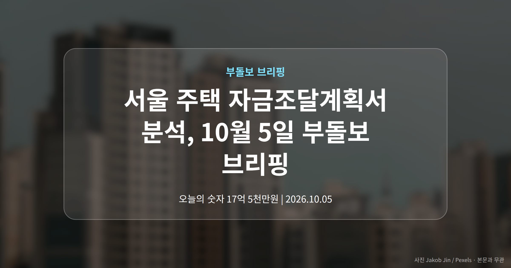
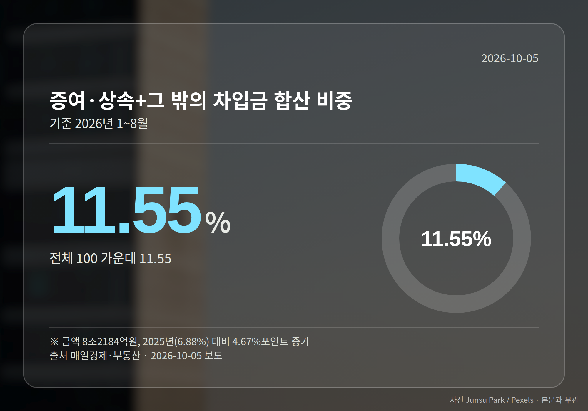
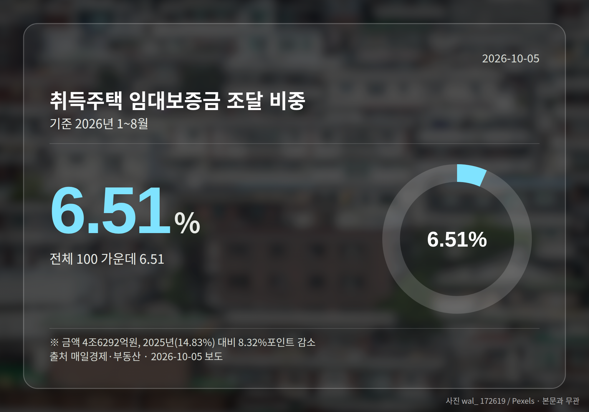
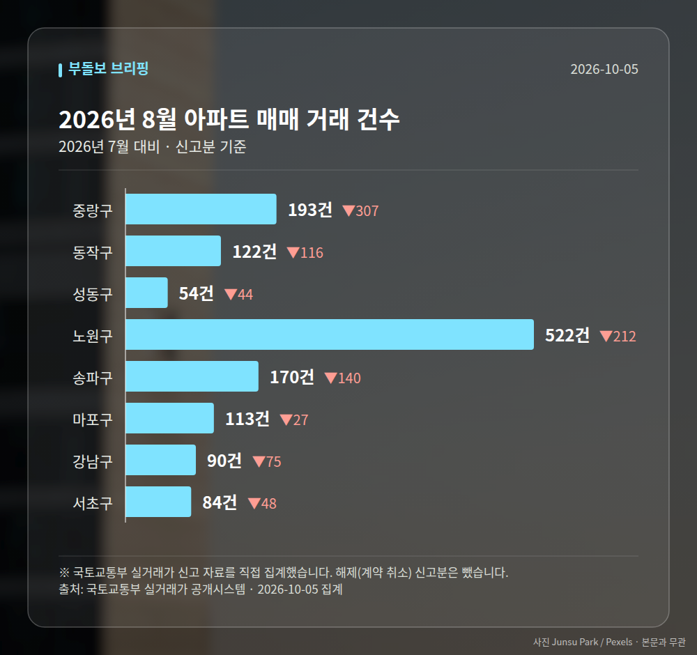

*이 글은 2026년 10월 5일 기준으로 정리한 내용입니다. 실거래 수치는 2026년 8월 신고분입니다.*
**3줄 요약**

- 토허제 이후 서울 집 살 때 돈 나오는 곳이 바뀌었습니다
- 사적자금 11.55%로 늘고 임대보증금 6.51%로 줄었습니다
- 내 자치구의 자금 구조와 신고가 거래부터 확인해 보세요
오늘 서울 부동산에서 가장 눈여겨볼 자료는 서울 주택 자금조달계획서 분석 결과입니다. 토지거래허가구역 지정 이후 세입자 보증금에 기댄 매수는 줄고, 증여·상속과 사적 차입이 그 자리를 채웠습니다.

같은 날 동작·영등포·마포·중랑 등에서는 최근 3년 신고가 거래도 잇따라 등록됐습니다.

[이미지: 서울 아파트 단지와 한강이 보이는 전경 사진]

## 서울 주택 자금조달계획서, 무엇이 달라졌나

자금조달계획서(집을 살 때 그 돈을 어디서 마련했는지 적어 내는 서류)는 시장의 돈 흐름을 보여주는 자료입니다. 국회 국토교통위 김종양 의원이 국토부에서 받은 자료에 따르면, 올해 1~8월 서울 주택 매입자금은 71조1278억원이었습니다.

이 가운데 증여·상속과 '그 밖의 차입금'을 합한 사적자금은 8조2184억원, 비중 11.55%였습니다. 2025년 6.88%에서 4.67%포인트 늘었습니다.

반대로 세입자 보증금을 끌어 쓰는 취득주택 임대보증금은 6.51%에 그쳤습니다. 지난해 14.83%와 견주면 8.32%포인트 줄어든 수치입니다.

| 조달 항목 | 2026년 1~8월 | 2025년 |
|---|---|---|
| 증여·상속 | 6.44% | - |
| 그 밖의 차입금 | 5.11% | - |
| 사적자금 합계 | 11.55% | 6.88% |
| 취득주택 임대보증금 | 6.51% | 14.83% |

## 사적자금이 임대보증금을 앞선 자치구는 어디인가

정부가 서울 전역을 토지거래허가구역(일정 규모 이상 주택을 살 때 관할 구청 허가를 받아야 하는 구역)으로 묶으면서 갭투자(전세보증금을 끼고 집을 사는 방식)가 제한된 영향으로 풀이됩니다.

2021~2025년에는 사적자금 비중이 임대보증금 비중을 넘어선 자치구가 한 곳도 없었습니다. 그런데 올해 1~8월에는 광진구를 뺀 24개 구에서 순서가 뒤집혔습니다.

비중이 가장 높은 곳은 용산구 15.63%였고 성동구 15.29%, 동작구 13.95%, 영등포구 13.11%, 강남구 12.70%, 마포구 12.13% 순이었습니다. 증여·상속만 보면 성동구가 8.90%로 가장 높았습니다.

## 서울 주택 자금조달계획서가 실수요자에게 뜻하는 것

서울 주택 자금조달계획서가 보여주는 변화는, 매수 주체가 가족 자산이나 사적 차입으로 돈을 마련할 수 있는 쪽으로 기울고 있다는 점입니다.

자금 여력이 넉넉하지 않은 실수요자에게는 진입 문턱이 상대적으로 높아질 수 있는 대목입니다. 다만 기사 본문에서 일부 자치구 수치가 생략돼 24개 구 전체 수치는 확인되지 않습니다.

## 그 밖의 오늘 소식

- 마포 상암월드컵파크4단지 84.66㎡, 17억 5천만원 신고가
- 중랑구 신내동 동성아파트 84.08㎡, 8억원 신고가
- 노도강 재산세 76% 상승 전망 보도, 산정 근거는 미확인

**그래서 나는?**

- 무주택 실수요자라면, 자금 조달 경로가 좁아졌는지부터 점검해 보세요
- 1주택자라면, 보유 단지의 최근 3년 신고가 흐름을 확인해 둘 시점입니다
- 노도강 보유자라면, 재산세 전망 보도는 근거 확인 후 참고하시면 됩니다

**직접 센 숫자 — 2026년 8월 아파트 실거래**

서울 8개 구 신고 매매 **1348건** (2026년 7월 2317건, -969건)

거래가 많은 곳: 중랑구 193건(-307) · 동작구 122건(-116) · 성동구 54건(-44)

중랑구 전세가율 가운뎃값 **63.0%** (같은 단지·같은 면적 19곳)

서울 25개 구 가운데 거래가 가장 크게 움직인 곳: 중랑구 -61.4%(500→193건, 2026년 7월엔 묵동에 66.2% 몰렸음) · 동작구 -48.7%(238→122건)

2026년 9월 계약 신고가

- 마포구 힐스테이트마포더퍼스트 84.07㎡ — 22.9억 (이전 최고 16.9억, +35.8%, 9월 5일 계약)
- 중랑구 엘지,쌍용아파트 84.67㎡ — 9.3억 (이전 최고 7.5억, +23.6%, 9월 2일 계약)

*국토교통부 실거래가 신고 자료를 직접 집계했습니다. 해제 신고분은 뺐습니다.*
**여러분이 사는 자치구는 어느 쪽에 가까운가요, 보증금을 끼고 사는 동네인가요 아니면 자기 자금으로 사는 동네인가요?**

---

### 참고한 기사

1. **동작구 상도동 현대(관악) 58.59㎡ 10억 6500만원… 최근 3년 신고가 [MAI부동산]**
   - [매일경제·부동산](https://www.mk.co.kr/news/realestate/12167964)
2. **토허제로 조이니…상속자산·가족에 손벌린 자금 2배로 늘었다**
   - [매일경제·부동산](https://www.mk.co.kr/news/realestate/12167985)
3. **서울 집값 이대로 오르면 '재산세 폭탄'...노도강서 76% '쑥'**
   - [v.daum.net](https://news.google.com/rss/articles/CBMiT0FVX3lxTE8tTVljenBVNVNrNWVTYjQzd0E5NWozNzdRS1EyRnJYc0pqVDFBV1RleGd2UVplVnduLTYxU2RYNnlVeXlJU1p2dG1xMFl0WkE?oc=5)
4. **중랑구 신내동 건영2차 57.3㎡ 7억 5천만원 신고가 [MAI부동산]**
   - [매일경제·부동산](https://www.mk.co.kr/news/realestate/12167956)
5. **"집값 상승세 지속시 2030년 서울 주요단지 재산세 54%↑"**
   - [재경일보](https://news.google.com/rss/articles/CBMiS0FVX3lxTE02WTJ6a0pUNjJDUTVldDFqMUxKbzJBMWZhaXhKcXR0Z1pLalJHSDhVdUFwWFdiSzhOTnkyQndrbnpfelRfWGlIMzM1RQ?oc=5)
   - [v.daum.net](https://news.google.com/rss/articles/CBMiT0FVX3lxTFBybHFsY2lYbV93b2hOMTJGZEJpV2VRQTNyV3VBY3hpeVl0R0dkTFlFd2RsdWdZRFYyUVVmZUsyeGtCOWQwXzItRzFVYWJza1E?oc=5)

---

*본 글은 공개된 언론 보도를 정리한 것이며, 투자 판단의 책임은 이용자 본인에게 있습니다.*
