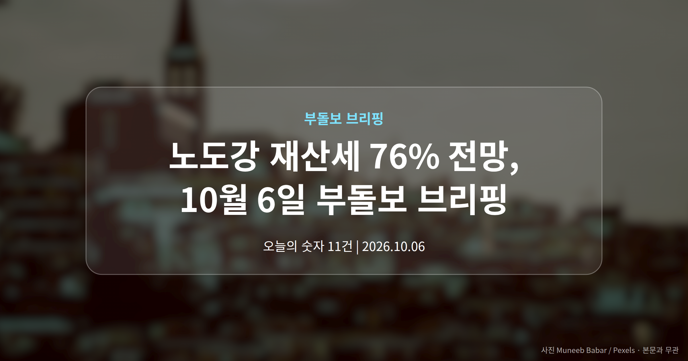
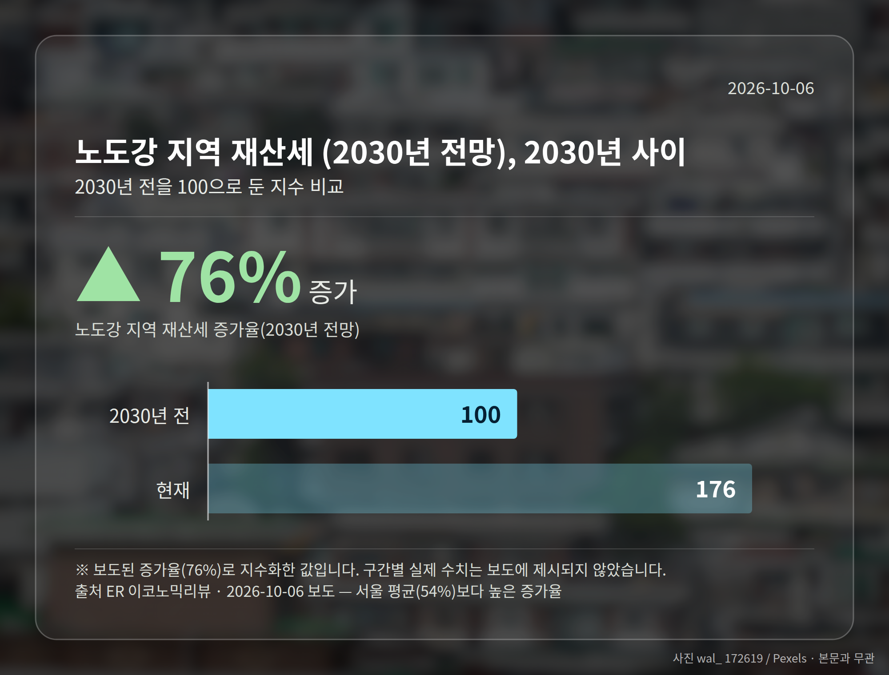
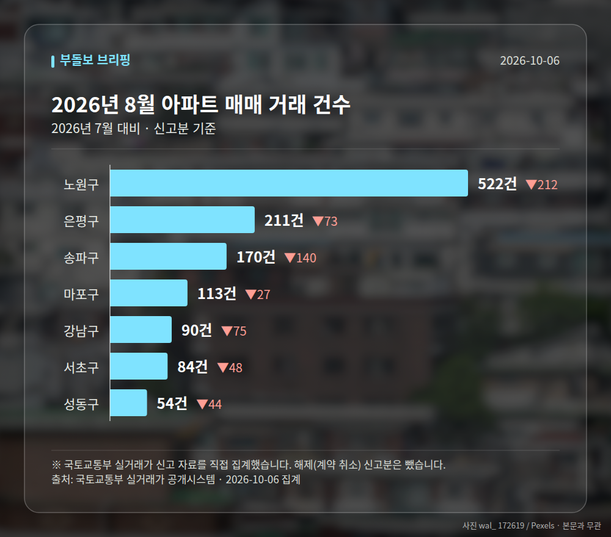

*이 글은 2026년 10월 6일 기준으로 정리한 내용입니다. 실거래 수치는 2026년 8월 신고분입니다.*
**3줄 요약**

- 서울 집값 상승 지속 시 재산세 급등 전망이 보도됐습니다
- 2030년 서울 30평형 54%, 노도강 재산세는 76% 전망치
- 연 10% 상승 가정이 전제라는 점부터 확인하면 됩니다
서울 집값이 계속 오른다면 2030년 재산세(집을 보유하고 있을 때 매년 내는 지방세)가 지금보다 크게 뛸 수 있다는 전망이 어제부터 여러 매체를 통해 보도됐습니다. 특히 **노도강 재산세**는 서울 평균보다 더 큰 폭으로 오를 수 있다는 내용입니다.

다만 이 숫자는 확정된 세액이 아니라 '집값이 계속 오른다면'이라는 가정 위에 올려진 전망치입니다. 오늘은 이 전제를 중심으로 정리해 보겠습니다.

## 노도강 재산세 76%, 어떤 계산인가요

조선비즈 보도에 따르면 이 전망은 서울 집값이 **연간 10%씩 계속 오른다**는 가정 아래 계산됐습니다. 이 가정대로 간다면 2030년 서울 30평형 아파트 재산세는 54% 오른다는 결과가 나옵니다.

그리고 노원·도봉·강북, 이른바 노도강 지역은 같은 조건에서 76%라는 수치가 제시됐습니다(ER 이코노믹리뷰). 서울 평균보다 20%포인트 이상 높은 셈입니다.

| 구분 | 2030년 재산세 증가율 전망 | 보도 매체 |
| --- | --- | --- |
| 서울 30평형 아파트 | 54% | CBC뉴스·조선비즈 등 |
| 노도강 지역 | 76% | ER 이코노믹리뷰 |
| 서울 주요 아파트 | 50% | 서울경제 |

## 매체마다 숫자가 다른 이유

같은 전망을 다루면서도 매체별 수치는 조금씩 갈립니다. 서울경제는 50%로, 자본시장뉴스는 상승률 가정을 10.3%로 잡아 53.5%라고 보도했습니다.

차이가 크지는 않지만, 이는 어떤 단지·어떤 평형을 기준으로 삼았는지에 따라 결과가 달라진다는 뜻입니다. 제목 중심의 보도여서 구체적인 산출 근거까지는 확인되지 않았습니다.

그래서 **노도강 재산세** 76%라는 숫자를 그대로 내 고지서에 대입하기는 어렵습니다. 전제가 어긋나면 결과도 달라지기 때문입니다.

[이미지: 재산세 고지서와 계산기가 놓인 책상]

## 노도강 재산세 전망을 어떻게 읽어야 할까요

의미가 없는 숫자는 아닙니다. 상대적으로 집값이 많이 오른 외곽 지역 1주택자의 보유세 부담이 서울 평균보다 빠르게 늘어날 수 있다는 가능성을 보여주기 때문입니다.

다만 '오른다'가 아니라 '이 조건이면 이렇게 된다'는 조건부 전망입니다. 여러분께 더 실질적인 정보는 올해 받은 고지서의 과세표준과 공시가격 변동 폭일 수 있습니다.

한편 이재명 대통령은 10월 5일 '부동산투기공화국 탈출' 약속을 지키겠다며 투기 억제와 주택 공급 확대 의지를 밝혔습니다. 뉴시스에 따르면 이 대통령은 하루에만 SNS 게시물 11건을 올렸습니다.

[이미지: 국회 국정감사가 열리는 회의장 전경]

## 그 밖의 오늘 소식

- 10월 6일 국토부 국정감사, 집값·전월세 불안 쟁점
- 고분양가 단지 청약 경쟁률 반토막, 쏠림 심화
- 아크로서초 등 특정 단지로 청약 수요 집중

**그래서 나는?**

- 노도강 1주택자라면, 보유세 흐름을 매년 7월·9월 고지서로 확인해 보세요
- 서울 아파트 보유자라면, 전망치가 아닌 올해 실제 과세표준부터 살펴보세요
- 청약 대기자라면, 주변 시세와 분양가 차이를 먼저 비교해 보세요

**직접 센 숫자 — 2026년 8월 아파트 실거래**

서울 8개 구 신고 매매 **1244건** (2026년 7월 2253건, -1009건)

거래가 많은 곳: 노원구 522건(-212) · 은평구 211건(-73) · 송파구 170건(-140)

노원구 전세가율 가운뎃값 **52.8%** (같은 단지·같은 면적 106곳)

서울 25개 구 가운데 거래가 가장 크게 움직인 곳: 중랑구 -61.4%(500→193건, 2026년 7월엔 묵동에 66.2% 몰렸음) · 동작구 -48.7%(238→122건)

2026년 9월 계약 신고가

- 마포구 힐스테이트마포더퍼스트 84.07㎡ — 22.9억 (이전 최고 16.9억, +35.8%, 9월 5일 계약)
- 노원구 시영3차(라이프)아파트 49.5㎡ — 6.5억 (이전 최고 5.4억, +20.2%, 9월 10일 계약)

*국토교통부 실거래가 신고 자료를 직접 집계했습니다. 해제 신고분은 뺐습니다.*
**여러분이 보유하거나 살고 있는 집의 보유세는 최근 몇 년간 어떻게 달라졌나요?**

---

### 참고한 기사

1. **이 대통령 “부동산투기공화국 탈출 약속 반드시 지킬 것”**
   - [데일리안](https://news.google.com/rss/articles/CBMimAJBVV95cUxQeTBMUkhQRTV6UlRFYWtaMWI5emZhQWxRTTNNR1d2WkdsOV9TSnVBQ0hzSDFXYWtvdVFhTmtxWGxTemZlSjI5d3dWaFExdk5faUF6c25TM2o4ZWtieGs1Q3FCT08tWExLZjZ3UUs5aDEwVGhnLV91WlZrU3plN3RWaGxSRUVKeDFhZHl2eU43ZWVOTTNsbmNxVTYzMkNBODNfNEszR2hCWEdoOWNSY04wSDFKQ25jR2pGcnRLbDdteVZPMGhtNm1UeENyelN0ZTZnLVh1RWg0OFpVRWhnWFJoLUJ6YjREWGpsMDZIVzFwV1BsQWJyUVR4NnZfSkltY0FCMkRVcDlUX24yaHNPb0wwYjJ1ZkJOLTFu?oc=5)
   - [신문고뉴스](https://news.google.com/rss/articles/CBMiR0FVX3lxTE03VEMwVHh0WWg5NzhKbWRzc2R2eTIxVy1XTGYwNlZ6ZVI2Y25JQ1cweUtnV3ZnS3k2elFxSkVUbVRnd3ZTeDgw?oc=5)
2. **"집값 상승세 이어지면 2030년 재산세 54% 뛴다"…서울 30평형 아파트 보유세 부담 급증 전망**
   - [CBC뉴스](https://news.google.com/rss/articles/CBMiaEFVX3lxTE45OEFDcVIzYXZpVWRHcTFlZ3pjNnlBY1UxQzlCM1FwZXFOOUxCdFowbjVocmJ1MHF3dDRHTWMxNTk5OEV1VHMyZGoxX1p5X2xSTWRzVGxudlY4Mk1LMlVaSXlORjZFbnVM?oc=5)
   - [ER 이코노믹리뷰](https://news.google.com/rss/articles/CBMibEFVX3lxTE0yVFRXeWduXy15dHl0ZVUtX3cxUHFrV21TRloxNHRiNGJ6SWJSd3UybHBjdlVMLUN4LUpiZ3BoUWIyd184Q0VkOElTNzZ6aGczMDZLVHY1SkVRU3hIZEV0b1ZKaVEwS0Q0YUZVOQ?oc=5)
3. **“서울 집값 상승 지속 땐 4년 후 재산세 54%↑”**
   - [세계일보](https://news.google.com/rss/articles/CBMia0FVX3lxTE5hV1lJbklNczdZM3dOSlRBR3JCZ3BuRzBGeHFqaWM5cHNNemFsZl9mUExqMjRkWXEyLU8waEJjdHZxUHdyOUFKeGFGRm1ILU1ITmd4VXhuZ3VTcTc5UTFnN2xMZzM2YWJBY1Fv0gFUQVVfeXFMTTdFR3J2aW5kTVVWNVJGWTYwSl9kUUd1VGV1anQtNzhJQ2RzYjBESHdsZFMyMEhLNmx0R3JCbGhpOU0wNmxSZmFfOEl1dlJXM1dBVGdm?oc=5)
   - [매일일보](https://news.google.com/rss/articles/CBMiZEFVX3lxTE1Yc0VOQXBxTnB0X0tYY2M0NEFxaVVpcTJXSjM1Ukdhcl9MZkpQa1o4UHJ2SE0tdGw2eTd2WjRVWmhZSUNjY0RKa01ycGhGSmJRa295bHlFRlpJUU5QZTNLYTMweGU?oc=5)
4. **내일 국토부 국정감사…'집값 상승·전월세 불안'에 부동산 정책 도마**
   - [뉴시스](https://news.google.com/rss/articles/CBMieEFVX3lxTE5zaGNWUmpVcWZ0UFRkVThmQURMdXdSYmFwX0duYWxIQ0dKMnNIMEVKU0t1Q1ZtNlpqOG16djNZVmZvZVphbmJvUXRoQ0IydUtCMEtGNzFjS3pNNjlIVjFTNW9UeHJzZ25HdjlVSnE3OS12SjBaWl9zRNIBeEFVX3lxTE5zaGNWUmpVcWZ0UFRkVThmQURMdXdSYmFwX0duYWxIQ0dKMnNIMEVKU0t1Q1ZtNlpqOG16djNZVmZvZVphbmJvUXRoQ0IydUtCMEtGNzFjS3pNNjlIVjFTNW9UeHJzZ25HdjlVSnE3OS12SjBaWl9zRA?oc=5)
5. **주변보다 비싼데 왜 쓰나…고분양가에 청약 경쟁률 ‘반토막’**
   - [청년일보](https://news.google.com/rss/articles/CBMiZ0FVX3lxTE5lbmFXbnJGakdYUklGMDZRNnFIMmlpLUVzYjltajRUMGpUamZYWDY0UVVfZFMxWV8wcjRvWXhJUGduTElnRmRjSWpWaTNIR3BqeWRFNXZ2VDhIa3NJaVNJN2t4MkxtLXM?oc=5)
   - [v.daum.net](https://news.google.com/rss/articles/CBMiT0FVX3lxTE9YemJ3NElwNDdYeUdYRFRVdDMySFItQU05YjhZejJDMHU2cnhJNGpzb3BfV1dkX2Vhd3VFWVY5UERqLW5FVXVfLWJvMUs2bkE?oc=5)

---

*본 글은 공개된 언론 보도를 정리한 것이며, 투자 판단의 책임은 이용자 본인에게 있습니다.*
