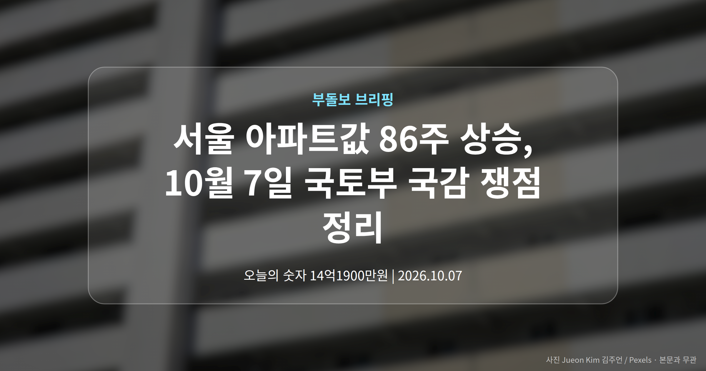
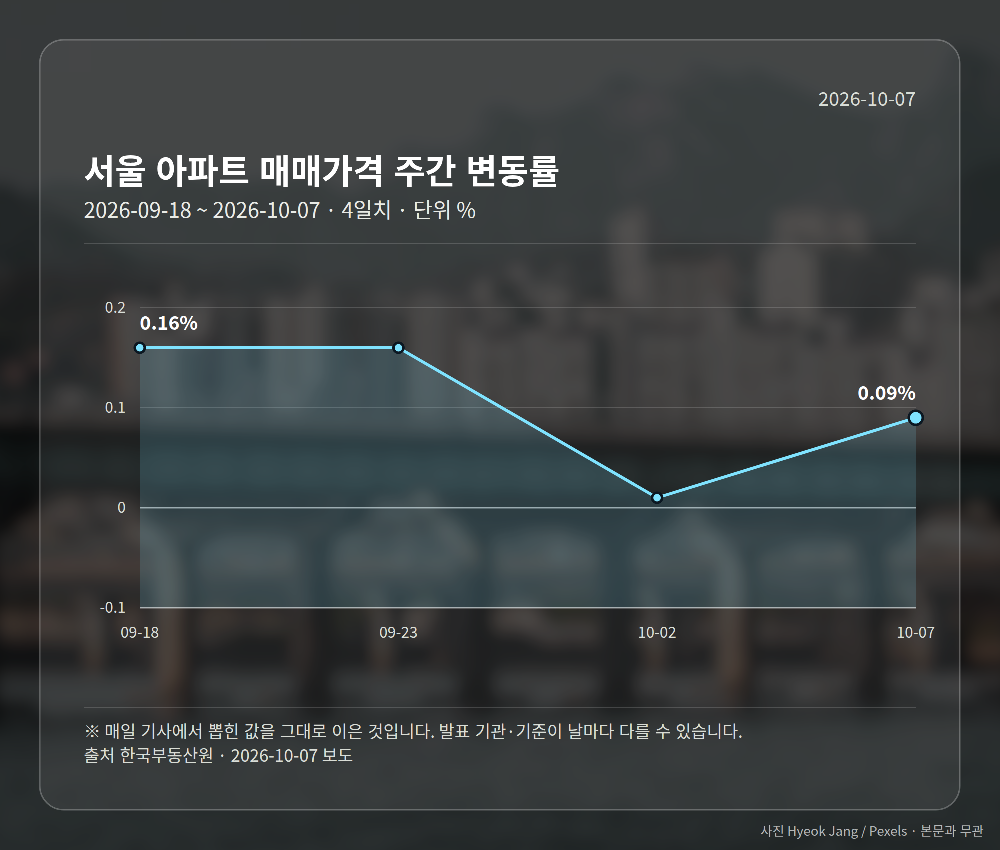
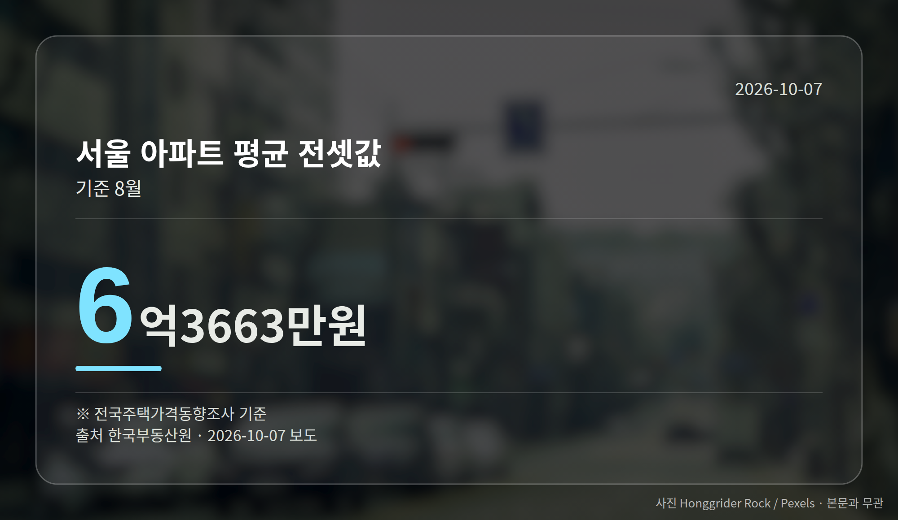
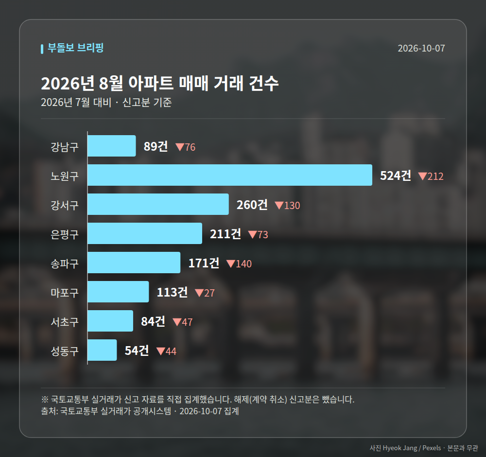

*이 글은 2026년 10월 7일 기준으로 정리한 내용입니다. 실거래 수치는 2026년 8월 신고분입니다.*
**3줄 요약**

- 서울 아파트값이 86주 연속 올라 최장 기록을 새로 썼습니다
- 9월 28일 기준 주간 0.09% 상승, 다만 상승폭은 5주째 축소
- 오늘 국토부 국정감사에서 공급 대책 실행 속도가 검증됩니다
서울 아파트값 86주 상승 기록이 나왔습니다. 한국부동산원 집계로 9월 28일 기준 전주보다 0.09% 올라, 종전 최장 기록인 85주를 넘어섰습니다.

다만 상승폭은 5주 연속 줄었습니다. 오늘 10월 7일 열리는 국토교통부 국정감사(국회가 정부 기관의 업무를 따져 묻는 절차)는 이 숫자에서 출발합니다.

## 서울 아파트값 86주 상승, 숫자는 이렇습니다

한국부동산원 자료에 담긴 핵심 수치만 추렸습니다.

| 항목 | 수치 | 기준 |
| --- | --- | --- |
| 주간 매매가격 변동률 | 0.09% | 9월 28일(9월 넷째 주) |
| 연속 상승 기간 | 86주 | 종전 최장 85주 초과 |
| 서울 평균 전셋값 | 6억 3,663만원 | 8월 |

눈여겨볼 부분은 두 가지가 동시에 나타난다는 점입니다. 기간으로는 역대 가장 긴 상승이지만, 주마다 오르는 폭은 다섯 주째 작아지고 있습니다.

그래서 이 수치 하나로 방향을 단정하기는 어렵습니다. 상승 지속과 둔화라는 두 측면을 함께 놓고 보셔야 합니다.

## 국감에서 공급 대책이 도마에 오르는 이유

이번 국정감사 대상 기관은 국토교통부, 행정중심복합도시건설청, 새만금개발청입니다.

정부는 지난해 9·7 대책에 이어 올해 1·29 대책, 8·13 대책을 내놓으며 주택 공급 확대를 추진해 왔습니다. 이재명 대통령은 10월 5일 엑스(X)에 신임 국토부 장관과 LH공사에 "국가 명운을 걸고 조기 대량 공급에 매진하도록 지시했다"고 밝혔습니다.

쟁점은 발표가 실제 착공과 입주로 이어지는 속도입니다. LH의 부채·재무부담과 조직 개편, 용산공원 부지 활용을 둘러싼 정부와 서울시의 이견(서울시는 탄천물재생센터 부지 등을 대안으로 제시)도 함께 거론됐습니다.

[이미지: 국회 국정감사가 열리는 회의장 전경]

## 서울 아파트값 86주 상승, 전셋값은 어떤가

매매와 함께 전세도 봐야 합니다. 8월 서울 아파트 평균 전셋값은 6억 3,663만원으로 집계됐습니다(전국주택가격동향조사 기준).

매매가 오르는 동안 전셋값도 함께 움직이면 실수요자의 선택지가 좁아집니다. 서울 아파트값 86주 상승이 국감의 출발점이 된 이유도 여기에 있습니다.

## 그 밖의 오늘 소식

- 강남구, 신탁부동산 체납 재산세 14억1,900만원 전액 징수
- 올해 부산 아파트 1순위 청약경쟁률 0.6대 1
- 울산·광주·전남 아파트값 오름세 보도

**그래서 나는?**

- 무주택 실수요자라면, 상승폭 둔화 흐름이 이어지는지부터 확인해 보세요
- 전세 계약을 앞뒀다면, 서울 평균 전셋값 추이를 함께 살펴볼 시점입니다
- 지방 분양을 고민 중이라면, 해당 지역 청약 경쟁률부터 점검해 보세요

**직접 센 숫자 — 2026년 8월 아파트 실거래**

서울 8개 구 신고 매매 **1506건** (2026년 7월 2255건, -749건)

거래가 많은 곳: 강남구 89건(-76) · 노원구 524건(-212) · 강서구 260건(-130)

강남구 전세가율 가운뎃값 **37.9%** (같은 단지·같은 면적 28곳)

서울 25개 구 가운데 거래가 가장 크게 움직인 곳: 중랑구 -61.3%(499→193건, 2026년 7월엔 묵동에 66.3% 몰렸음) · 동작구 -49.2%(238→121건)

2026년 9월 계약 신고가

- 마포구 힐스테이트마포더퍼스트 84.07㎡ — 22.9억 (이전 최고 16.9억, +35.8%, 9월 5일 계약)
- 노원구 시영3차(라이프)아파트 49.5㎡ — 6.5억 (이전 최고 5.4억, +20.2%, 9월 10일 계약)

*국토교통부 실거래가 신고 자료를 직접 집계했습니다. 해제 신고분은 뺐습니다.*
**여러분이 보고 계신 지역은 지금 오름세와 둔화 가운데 어느 쪽에 더 가까운가요?**

---

### 참고한 기사

1. **강남구, 신탁부동산 체납세 14억 징수**
   - [전국매일신문](https://news.google.com/rss/articles/CBMibkFVX3lxTE1LaGVxUG1QckIySmpWcFVBbmJVU2xOY1hsc19vclRJdGhscnhQNWNPdGE1cGdWRU05LUsyOV96ZVI3N1ZZbWJKYzFMWFRBeDB4VUdZV1BIcVF4eGNKUV9hU3ZXUUp4TUZSWnNXX0xB?oc=5)
   - [국제뉴스](https://news.google.com/rss/articles/CBMibkFVX3lxTFBDM1gyMGtHT2o2YW4xNU81NkZLeHRacElBTjI2d0JUS2R5b2NDM0p1T1lIM3EyeTdZMTg0bmJNLWxTdGx2SDIyVVBJLTVRSnN0Z3RCdlVHdFVnUzA3ZXUxa0Nxa244cmpxN1czd0V3?oc=5)
2. **국토부 국감 7일 개막…86주 오른 집값·주택공급 해법 도마**
   - [데일리안](https://news.google.com/rss/articles/CBMigwJBVV95cUxNYnlxMGYzelNMakltWmJ1UDN6OHlSVXBmWENhZzBZc0ctbkZ3aXVMVkVtU3dTb0NNREF5SXl4cTJ0UUJqX3lQc2VrR1RSYjl2eG1uUFlidnh6VW9IUEVqUmJJTllZOUF6UlNqVFZHZEFMd1R4MWsxU2ZnaHluaVRZZ1VETUZBMVZzM2oxR1J6M1QzNXhxRmU5WVFpcTZEdHF2NDd5WXBEYUNQUVNlQUZrZmFZOUlHZWlTVWswcUkyVTZ6dE9acHZtckotWmVUTlRjYVh0dnlUb21YVTdiUmFJMThfaUNXLU5telYzcWQ0OFdrVGhweVF1WC16T1o0b3pxZnBj?oc=5)
   - [대한경제](https://news.google.com/rss/articles/CBMihAFBVV95cUxPVm9vSDdhaHJkVGZIQmlObzRlVkUybldtVVJMdHU5VWZmZWNCOVlzTWJBaDVLOFVCbDBJR2dUMFMwYVJSTDZ1Q2FBc0FGWmF2OVZmTVVfbVZjWVZwTlRKdE5DVXlSUGdlVGZwbU9uMnNhSG1FX1Y0ellpODFsdkoxLUxUOHI?oc=5)
3. **충북 아파트 청약 경쟁률 '뚝'**
   - [충청매일](https://news.google.com/rss/articles/CBMiakFVX3lxTFA1YlQtR1UwaGVvXzNiZUtRbmExakZxbE4xUDAtWGtTX3Mwd19wOXVJazA5VC1ZUHdseFFVU2NWY2FhZ0pUTzNmaW0wTXdCb3lVOFF5elI4TW5NRG5FdHl2TklaLXFtSmY0VVE?oc=5)
   - [금강일보](https://news.google.com/rss/articles/CBMiakFVX3lxTFBfMVppdjBNRzhpNEcxX0g3NWVXbGVTYlVuWDNZRXZHZnVEWFVMU3R6a0dCSGRSQkp6cjRCdEd5djVQRVNCRVhodEU4b3lvdjNIaTdRSVR6VFRua1ZkWlJidDhmNlJvTWlHQVE?oc=5)
4. **울산·광주·전남 아파트값 오름세...'아이파크 무등산 스카이포레' 10월 분양 예정**
   - [한경매거진&북](https://news.google.com/rss/articles/CBMiaEFVX3lxTFA5VzUwRnY0SWRFYTVlNzJOSVpKcHU5VHJoSWpKTmdQUHYtYWo4TWd6c0tVd1pDOGF1MGtnbG9pQ2s4d2pBUTJ1eHN5bFBGdXRaOVhrX2xkbGMyOGR2MzFZdlFpWnNWWF9W?oc=5)
5. **서울 아파트값 86주째 상승… 국토부 국감, 공급 대책 실효성 따진다**
   - [조선비즈·부동산](https://biz.chosun.com/real_estate/real_estate_general/2026/10/07/X3KVLI5GYZHJBGRCAF5BYVWD7Q)
   - [Chosunbiz](https://news.google.com/rss/articles/CBMirAFBVV95cUxPdXdTdlJaS1RfbWJBTVB5QWlBQ3hMWGhaMjMwd2hUZnlvdV9UTVZYVTNEd3pSLThYWmdYMGI0S0pHcmk4Mk95eGptRVBWaXpCQWFQQTlDWTlNRlBBNFJuVzJSUVlyMDlCN18tYjh3X0x2Y0MwVzhZWDBJRDhIS2V2MHRpZUh1MjFhR2h5WDdjYXhkRm9reUJ2UmJCbGxfenBrTzlPSXRJb2ZPYy010gGsAUFVX3lxTE91d1N2UlpLVF9tYkFNUHlBaUFDeExYaFoyMzB3aFRmeW91X1RNVlhVM0R3elItOFhaZ1gwYjRLSkdyaTgyT3l4am1FUFZpekJBYVBBOUNZOU1GUEE0Um5XMlJRWXIwOUI3Xy1iOHdfTHZjQzBXOFlYMElEOEhLZXYwdGllSHUyMWFHaHlYN2NheGRGb2t5QnZSYkJsbF96cGtPOU9JdElvZk9jLTU?oc=5)

---

*본 글은 공개된 언론 보도를 정리한 것이며, 투자 판단의 책임은 이용자 본인에게 있습니다.*
