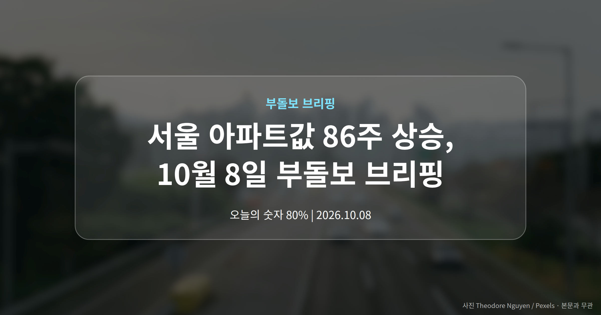
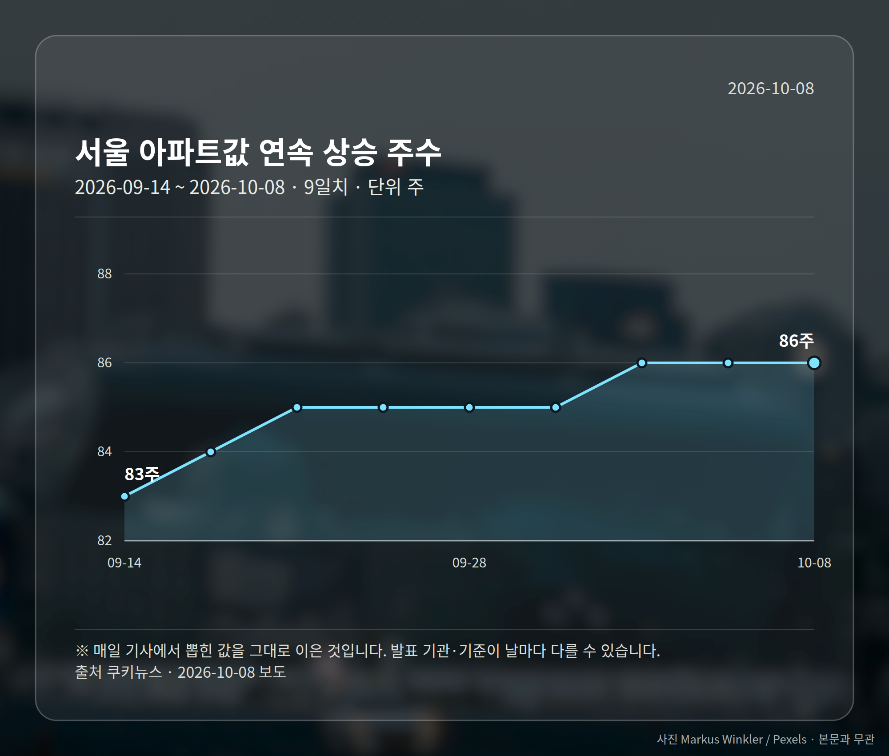
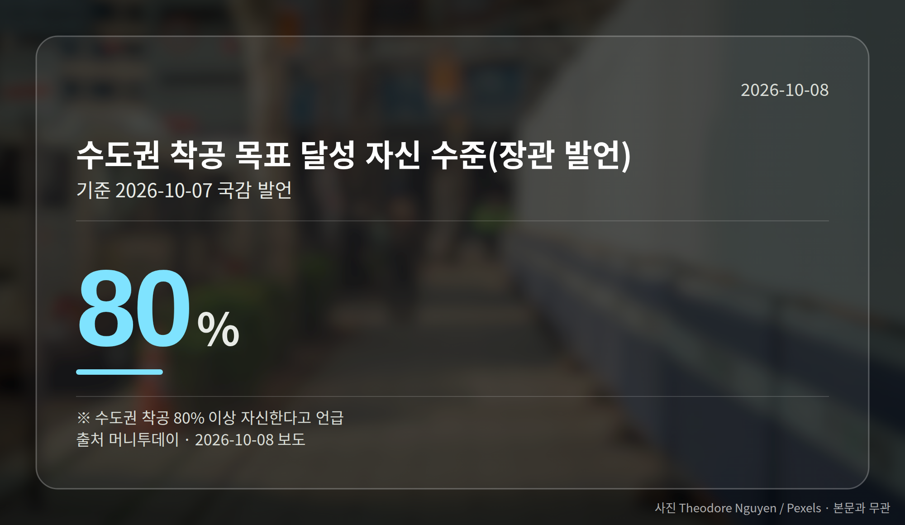

*이 글은 2026년 10월 8일 기준으로 정리한 내용입니다.*
**3줄 요약**

- 국감에서 장관이 연말 집값 상승폭 둔화를 전망했습니다
- 서울 아파트값은 86주째 상승, 수도권 착공은 80% 이상 자신
- 토지거래허가제 연장·확대는 검토 단계, 확정 발표는 아닙니다
서울 아파트값 86주 상승이 이어지는 가운데, 홍지선 국토교통부 장관이 10월 7일 국정감사에서 "연말쯤 집값 상승폭이 줄어들 것"이라고 전망했습니다. 동시에 토지거래허가제(지정된 지역에서 집이나 땅을 거래할 때 지자체 허가를 받아야 하는 제도) 연장 가능성도 함께 언급됐습니다.

오늘은 이 두 가지만 보셔도 충분합니다. 상승 추세는 아직 진행 중인데, 규제는 풀리기보다 유지되는 쪽으로 이야기가 나왔다는 점입니다.

## 서울 아파트값 86주 상승, 국감에서 나온 말

보도에 따르면 서울 아파트값은 86주째 오름세입니다. 1년 7개월 가까이 한 방향으로 움직여 온 셈입니다.

홍 장관은 연말에는 서울 집값이 안정될 것이라는 기대를 밝혔습니다. 가격이 오른 배경으로는 투기 수요와 과거 3년간의 공급 부족을 지적했습니다.

다만 장관은 서울 일부 지역의 집값 변동률이 이미 마이너스로 돌아섰다고 설명했습니다. 서울 전역이 하락으로 전환했다는 뜻은 아니라는 점은 짚어 둘 필요가 있습니다.

| 국감에서 나온 숫자 | 값 |
|---|---|
| 서울 아파트값 연속 상승 주수 | 86주 |
| 수도권 착공 목표 달성 자신 수준(장관 발언) | 80% 이상 |
| 국토부 정보수집 대상으로 지목된 민간인 수 | 19명 |

## 토지거래허가제 연장, 무엇이 달라질 수 있나

장관은 "토허제 수요가 있다"며 연장 가능성을 검토한다고 밝혔습니다. '확대 검토'라는 표현으로 전한 매체도 있어, 방향이 하나로 정리된 상태는 아닙니다.

확정된 정책 발표가 아니라 시사·검토 수준의 발언입니다. 적용 지역에서 매수나 매도를 준비하신다면, 지금의 지정 기간이 언제까지인지부터 확인해 보시는 편이 안전합니다.

## 공급 쪽에서는 어떤 말이 나왔나

장관은 공급 속도를 내겠다며 수도권 착공은 앞서 본 수준의 달성을 자신한다고 했습니다. 재건축·재개발에서는 전자의결 시스템 정착, 전국 미청산 조합 개선, 사업 저해요인 해소를 과제로 들었습니다.

구체적인 시행 방안과 일정은 이번 발언에 담기지 않았습니다. 그래서 서울 아파트값 86주 상승 흐름이 연말에 실제로 꺾이는지는 주간 통계로 확인하는 쪽이 현실적입니다.

전세에 대해서는 전세 감소가 '메가트렌드'라고 언급하며, 1인 가구 증가와 전세사기 여파를 이유로 들었습니다.

[이미지: 국정감사가 열린 국회 회의장 분위기 사진]

## 그 밖의 오늘 소식

- 야당, 文정부 국토부가 민간인 19명 정보수집 주장
- 여당은 "사실 확인부터" 입장, 사실관계는 미확정
- 여야 모두 현 정부 부동산정책도 함께 비판

**그래서 나는?**

- 무주택 실수요자라면, 연말까지 주간 가격 통계를 함께 보셔도 좋습니다
- 토허제 지역 매수 예정이라면, 현재 지정 기간부터 확인해 보세요
- 정비사업 조합원이라면, 전자의결·조합 청산 관련 공지를 챙겨 보세요
**여러분이 보고 계신 지역은 아직 오름세인가요, 아니면 이미 숨을 고르고 있나요?**

---

### 참고한 기사

1. **홍지선 국토장관 “연말쯤 집값 상승폭 줄어들 것…공급 속도 내겠다”**
   - [서울경제](https://news.google.com/rss/articles/CBMiUkFVX3lxTE43cEtzelNfbzdHTkw0WVpRa01MeE1rMjhOM1E1VVVNcTY0R3d0VkpmUGJuVmdscDJVVV9ETEJMSkRBVWVKVExDQVV3Y1FSTUpDZVHSAVNBVV95cUxNTjJiYTZEM2FGcnRLc1UtY2k4M1B2QlFBTzA1QWVlMWhObU5yaVlKdG9GbnNWRTRXeU5jMDBSb0c0emlvYnVCUWFSX01oWnlLXzF6aw?oc=5)
   - [비즈워치](https://news.google.com/rss/articles/CBMicEFVX3lxTFAyLVE5ZnhwUzNVWDd5LXRRZ0JCdTNCeHliTnpGWVVTdFpOOHhlQ2dqMGRFYTJPa2dYZEZucklGMmtIWndQNVY1SUtmeWJrVXNhMVFHZ3ZITFh6VUtoZS1KX0lhS2hJQU92ZERDWTl3YTM?oc=5)
2. **홍지선 국토장관 "재건축·재개발에 전자의결 시스템 정착 관리"**
   - [뉴스핌](https://news.google.com/rss/articles/CBMiXEFVX3lxTE50NEhHblJVNzdnUjNhMWJaWXExMWloYkRwaUxtb1FLQ2RTWTdBY1pjcHg5YXJ0NHp6QTNxWjJadWxET0VNVmNNUnM4dDFnME9xbHRUZXNJQUJnUmJ4?oc=5)
   - [대전일보](https://news.google.com/rss/articles/CBMic0FVX3lxTE9aNHdZaGU0ekwwa2FWcW1TYUJFX05ldHAwdy1OaFB4VGVyOU9WUGFMM050c3VTdkE2aHVRYk1LQXB6MUc0ODNNbldnNzUyT0ZrMHVNOGJWZmJMa1BYUC14SGZnYURHMFVqSlVnd3NHQVIwaTA?oc=5)
3. **홍지선 장관 "연말가면 서울 집값 진정될 것"**
   - [데일리안](https://news.google.com/rss/articles/CBMimAJBVV95cUxQajdRSXRUR3RfZjZKSDVaM196dVBqMUo3dG9nUkM0VDR0N2s1Tm1CTVdzS2dLVTZybEtxS1R0U3J6dk0xX0VoRFdVRVlhQnI0dzBXQnhMQVp1QXVnZC16ZGdPZjlzS0VVdDd5LWJ3VGdyNmh6ZXhuUU81Y0JITHh2cThaYzliTTRGTW4yeFZWZTlIY1N6N1d2d0VrM0tZcHJkb3UzbFNZdWw5MC02eDBvaUp4VFJRX3gzZ3FTOHhMQ0UzQ2I4bFVHV3dhLWlFTmEzelhTX2hmVENrNU5rREtoY0lvM2tKdS1ZLVVmNUtVTEpmQ3JpTHZXSE1VeEZzSnY0OUxFdHkxREpVQk90d3Rab2xYX3lJLWNE?oc=5)
   - [쿠키뉴스](https://news.google.com/rss/articles/CBMiY0FVX3lxTE5ZMGVuYV95OFF0U1FfZzRDNW5kWmZLZGFzMV9TbGlnSFdyX1dUWHhzVFJGS3BZVWRXQmJzODJQTFYxQnVXNDJhMl8tamx2LXFPWWJGQWxCTGsyS0t4SV9razlvQQ?oc=5)
4. **野 “文정부때 부동산정책 비판 민간인 사찰” 논란**
   - [동아일보](https://news.google.com/rss/articles/CBMidkFVX3lxTFB4RWhYdkowenJUbkdGalhXT2YtRk9qem9tZk5pQWVGZDFEYW9TQ2pGUzBsSERkWVNEaFBtZTBZNlctLWUtMEZPdTVRT25fVjc1R083VkdiZW5VM3FZUWVvNDRIX0lOR0NackViZUl0cndjTDRJbUHSAWZBVV95cUxPN0IzenlHN2ZSNTlQUFk1aXUzem9hbG9Sa2tpNlNDRVFneGhZSDVkQ3E1bzlCemk4aXRWdGFZVHdGNGtDU1ZwdWxUb3RRcGZscmxjY3lONE1oZTRIcXVxUXpDZWNpSnc?oc=5)
   - [조선일보](https://news.google.com/rss/articles/CBMiiAFBVV95cUxNREJfeWJSaFN0V3BfUE00ZFd4YzZxb09LM3ZUQnBoSW1UVXJwb2pZdFhsS19JLVVrZ1VZNHNVdy1kdzMtd0VfUjRXNmZBSHYyd2FpRVdFbDdGWk0xRUhrQ3hKcktDSzhTRWtLRVFsSWxoYS1CMVBLNjgyRUJaLWlUY1lqZHVOcC1F?oc=5)
5. **부동산 정책 질타...홍지선 "토허제 수요 있어"**
   - [YTN](https://news.google.com/rss/articles/CBMiXkFVX3lxTE9HckVlTnVDVkNlTHdnU2V0dHUybEZzSHI2dFFmRllpX2xtY29jdWdJRWVMYW42Y2RLT2YxblZRSlZMRzlDdHZLY2gzU09nU2lITExfbk1PSkZPcS04QUE?oc=5)
   - [매일경제](https://news.google.com/rss/articles/CBMiVkFVX3lxTE82Z2VpRmhxQURNMlJrSDFzdFFqU1BBQ21oZ3h4c19rN2N2NUNYaFRobUJTUkRsV0FnWGNxZkcxMTNBQ1RLUE9qRHZqYUxYVlE2VS1zOXN3?oc=5)

---

*본 글은 공개된 언론 보도를 정리한 것이며, 투자 판단의 책임은 이용자 본인에게 있습니다.*
