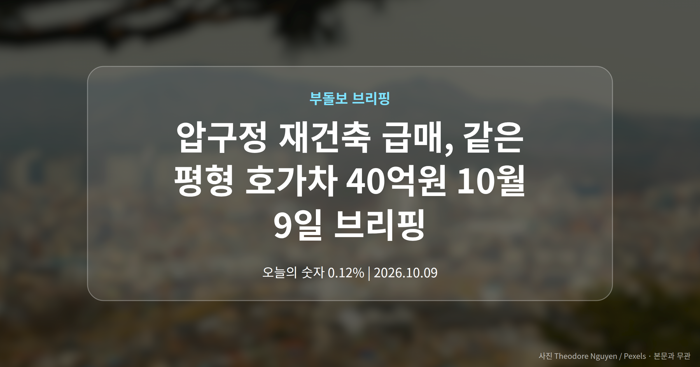
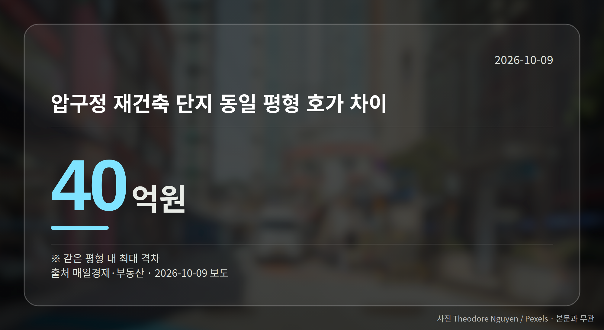
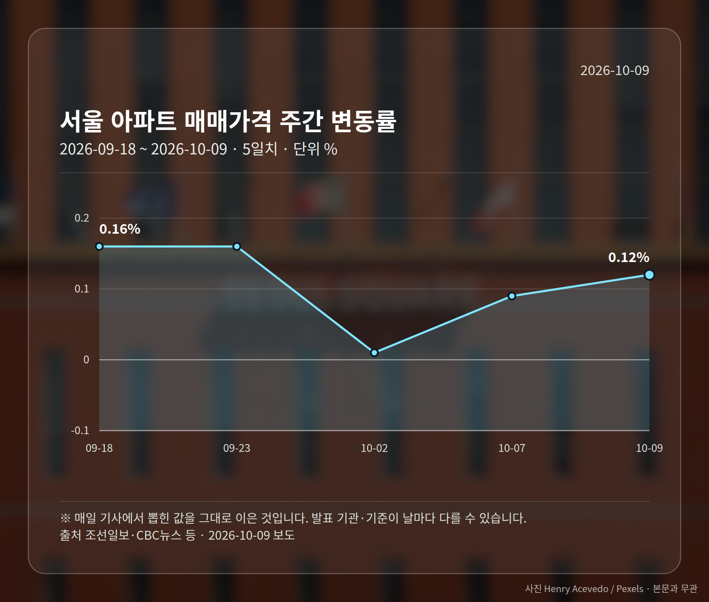
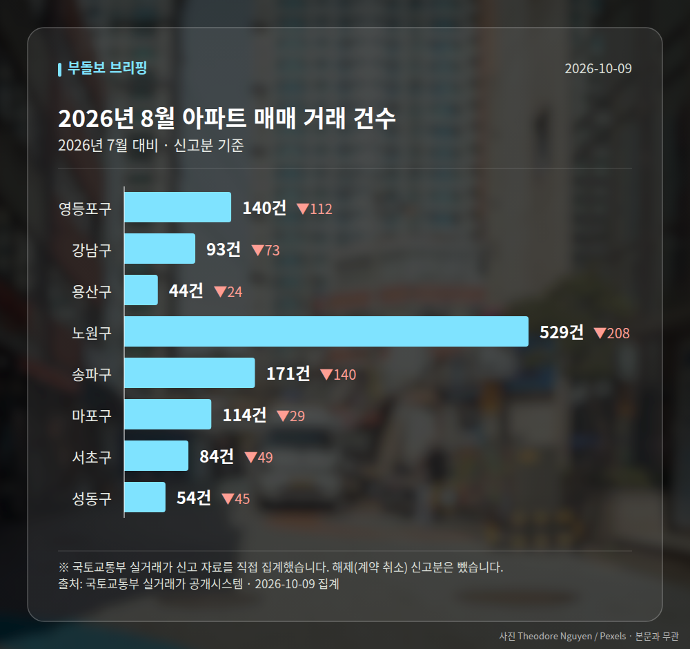

*이 글은 2026년 10월 9일 기준으로 정리한 내용입니다. 실거래 수치는 2026년 8월 신고분입니다.*
**3줄 요약**

- 압구정 재건축 급매 늘며 같은 평형 호가 격차 확대
- 호가차 최대 40억원, 강남3구는 5주 연속 하락
- 서울 전체는 0.12% 상승, 다음 주간 통계가 분기점
압구정 재건축 급매 매물이 늘면서, 같은 평형인데 호가가 최대 40억원까지 벌어진 사례가 나왔습니다.

서울 전체 아파트 매매가격은 0.12% 올라 87주 연속 상승을 이어갔습니다. 다만 강남3구와 용산구는 하락세가 계속됩니다.

같은 서울 안에서도 방향이 갈리고 있다는 뜻입니다.

## 압구정 재건축 급매, 호가차 40억원은 왜 벌어졌나

매일경제·부동산 보도에 따르면 압구정 등 주요 재건축 단지에서 동일 평형임에도 호가 차이가 최대 40억원에 달하는 사례가 나타났습니다.

배경으로는 세제 개편과 재건축 사업 일정, 그리고 조합원 지위 양도 제한(재건축 조합원 자격을 다른 사람에게 넘기는 것을 일정 시점 이후 막는 규정)이 함께 꼽힙니다.

팔 수 있는 시점이 사실상 정해져 버리면서, 자금 사정이 급한 장기 보유자의 매물이 '시한부 급매'로 나오고 있다는 설명입니다. 그 결과 같은 단지, 같은 평형 안에서도 가격이 극단적으로 갈립니다.

다만 어느 단지의 어떤 거래였는지 구체적인 사례와 상세 수치는 해당 보도에 제시되지 않았습니다. 호가는 실제 계약 가격이 아니라 매도 희망 가격이라는 점도 함께 보셔야 합니다.

## 압구정 재건축 급매와 강남3구 5주 연속 하락

강남3구 아파트 가격은 5주 연속 하락세입니다. 압구정 재건축 급매가 늘어난 흐름과 같은 자리에서 벌어지는 일입니다.

| 항목 | 수치 | 출처 |
| --- | --- | --- |
| 압구정 동일 평형 호가 차이 | 최대 40억원 | 매일경제·부동산 |
| 강남3구 하락 기간 | 5주 연속 | 매일경제·부동산 |
| 서울 아파트 주간 변동률 | 0.12%(10월 첫째 주) | 한겨레·NSP통신 등 |

일부에서는 하락폭이 줄어들며 반등 가능성이 제기된다는 전망도 나옵니다. 다만 이는 '일각'의 견해로 확정된 흐름은 아닙니다.

[이미지: 압구정 재건축 단지가 보이는 한강변 아파트 전경 사진]

## 서울 87주 연속 상승, 평균 숫자만 보면 놓치는 것

서울 평균 지표는 상승이지만, 고가 지역은 내리고 외곽은 오르는 구조입니다. 평균 하나로 내 동네를 판단하기 어려워진 국면입니다.

여기에 전세 상승률이 매매 상승률을 추월했다는 보도도 있었습니다. 구체적 수치는 공개된 자료에서 확인되지 않아, 임차시장 쪽은 다음 통계를 더 봐야 합니다.

## 그 밖의 오늘 소식

- 영등포구 대림동 우성2 79.91㎡, 7억 9600만원 신고가
- 서대문구 천연뜨란채 55.82㎡, 12억 4천만원 신고가
- 국민의힘, 文정부 '부동산 블랙리스트' 의혹 법적조치 예고

**그래서 나는?**

- 강남권 매수를 보는 분이라면, 같은 단지 안 호가 편차부터 확인해 보세요
- 재건축 단지 조합원이라면, 조합원 지위 양도 제한 일정을 먼저 점검해 보세요
- 비강남권 실수요자라면, 신고가 거래가 단건인지 추세인지 함께 보세요

**직접 센 숫자 — 2026년 8월 아파트 실거래**

서울 8개 구 신고 매매 **1229건** (2026년 7월 1909건, -680건)

거래가 많은 곳: 영등포구 140건(-112) · 강남구 93건(-73) · 용산구 44건(-24)

영등포구 전세가율 가운뎃값 **45.7%** (같은 단지·같은 면적 36곳)

서울 25개 구 가운데 거래가 가장 크게 움직인 곳: 중랑구 -61.3%(501→194건, 2026년 7월엔 묵동에 66.3% 몰렸음) · 동작구 -48.3%(238→123건)

2026년 9월 계약 신고가

- 노원구 시영3차(라이프)아파트 49.5㎡ — 6.5억 (이전 최고 5.4억, +20.2%, 9월 10일 계약)
- 송파구 송파현대힐스테이트 84.99㎡ — 16.5억 (이전 최고 14.0억, +17.9%, 9월 4일 계약)

*국토교통부 실거래가 신고 자료를 직접 집계했습니다. 해제 신고분은 뺐습니다.*
**여러분이 보고 계신 단지는 같은 평형 안에서 호가가 얼마나 벌어져 있나요?**

---

### 참고한 기사

1. **서울 아파트 가격 87주 연속 상승**
   - [조선일보](https://news.google.com/rss/articles/CBMiiAFBVV95cUxQbXFMNTRkUm1Wd3JRMGFUSmJYdmlpbzVNYWhMSFRJVkE0ZF9NS25nNlRZTWJtS0JMUXBpNVdLa0hfTnluY0dZby1fUnJMcERqN0RBQ3VGbFB2cHhZNlE2R3VYZU11WWZqbFJaMzBvbk50LUhYS3NTMW1VR0xkX0hLeGtFaGh3Qk8z?oc=5)
   - [CBC뉴스](https://news.google.com/rss/articles/CBMiaEFVX3lxTE1idVQ0alYwZmg3bEV5bVdCZElfUFJIOXg3LUZGVGJlVTBGVExCNm1wWC00ZE45Rlk3ZVlCdDJQNTRtbm9JbHFRXzBrbExfdGdxR3ZWdHpGREtPc2tUMVczN1l4aFZFWFd2?oc=5)
2. **같은 평형인데 40억差…압구정 '초급매의 시간'**
   - [매일경제·부동산](https://www.mk.co.kr/news/realestate/12171868)
3. **영등포구 대림동 우성2 79.91㎡ 7억 9600만원…최근 3년 신고가 [MAI부동산]**
   - [매일경제·부동산](https://www.mk.co.kr/news/realestate/12171234)
4. **서울 아파트 매매가격 0.12% 상승…강남3구·용산은 내려**
   - [한겨레](https://news.google.com/rss/articles/CBMiaEFVX3lxTFBGdGc1OFNXUjF1T1lvajNHbkF2a29GOWxhSlNWYUJGV05xWmZsRGtTbzY5bERFTU5YQkF0cWtfLXhHU1RyNE9uZWJJQTdOWDludjg4S3VzTlJ4Q0NkWUU5cDZtOThKaDRr?oc=5)
   - [NSP통신](https://news.google.com/rss/articles/CBMiYEFVX3lxTFBTSFEzY2JWVFc2c2pxaUhWaFBsT1M0NkNobUhuV25jZm9vMDJHMDB1NEZGRU1TaTRJYkc4a3J5bjkxeUxHN2VSbU1lMll0ZDAwN3lDcHgxdzE1aExLZ2tXNw?oc=5)
5. **'文정부 부동산 블랙리스트' 의혹 키우는 국힘 "법적 조치 추진"**
   - [프레시안](https://news.google.com/rss/articles/CBMia0FVX3lxTE54NWd1NjhZM2JlbGlnbHp5ZXBITHdhNk1MRE9rOF8tZ1JlWDBXbk91d3RKeEVzLVZEQXpDVFVNbnhWdkE0YVpjdW1OUDE5VVdybnhYSEhVQk1GVGVHT3hfSjF5NldEUTR5V1RF?oc=5)
   - [대전일보](https://news.google.com/rss/articles/CBMic0FVX3lxTE9QTGJVWUFBTncyNTFIbnNOUVdSRTBCRmFRUmJtS2xBbDQxRGJVUnRUUWdQeVVySjY0ZzY0aDE5MGVnRFNtTlRDNFIwSEZSMmttcnBsSUgtSGxSc1NtTjdSR0t1NXpRQW1ZSjJ3Y1k1TGJaQUXSAXNBVV95cUxPUExiVVlBQU53MjUxSG5zTlFXUkUwQkZhUVJibUtsQWw0MURiVVJ0VFFnUHlVcko2NGc2NGgxOTBlZ0RTbU5UQzRSMEhGUjJrbXJwbElILUhsUnNTbU43UkdLdTV6UUFtWUoyd2NZNUxiWkFF?oc=5)

---

*본 글은 공개된 언론 보도를 정리한 것이며, 투자 판단의 책임은 이용자 본인에게 있습니다.*
