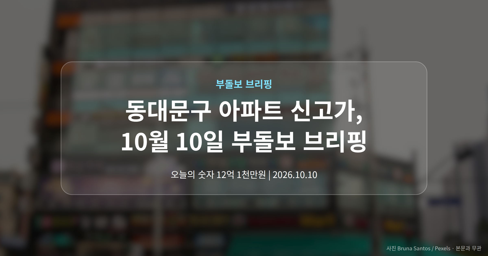
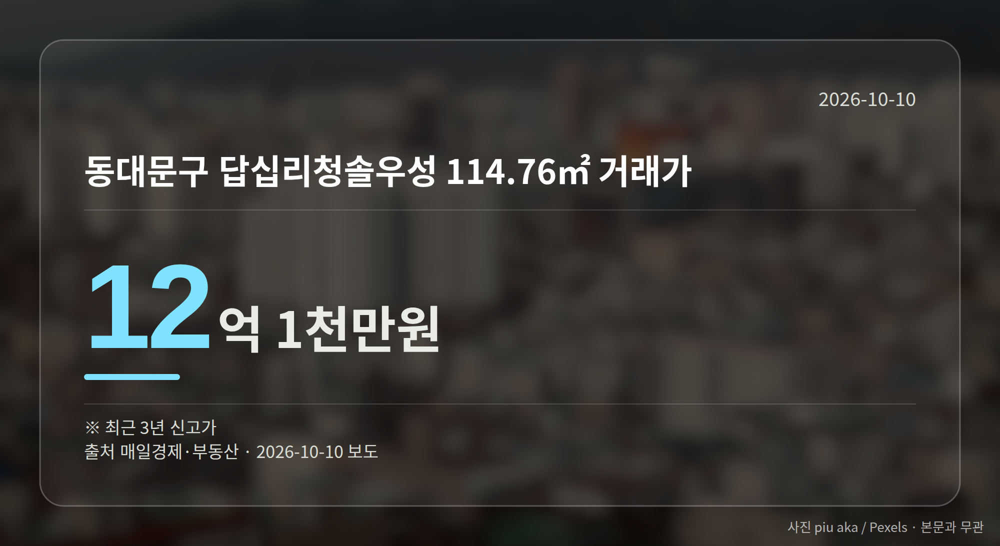
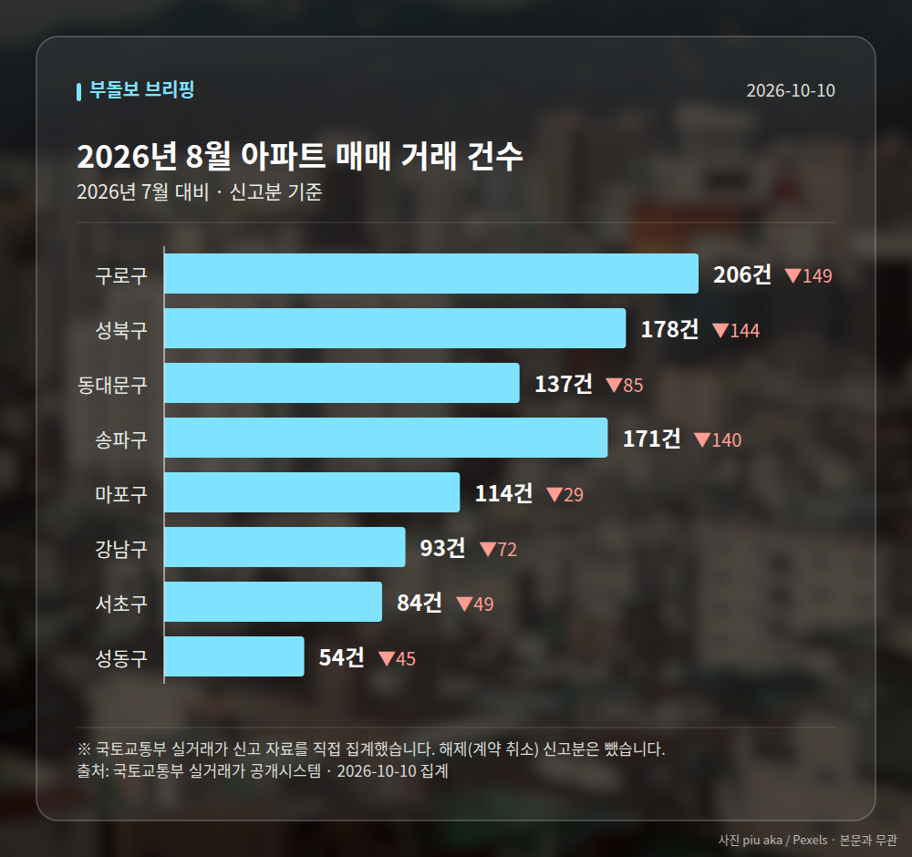

*이 글은 2026년 10월 10일 기준으로 정리한 내용입니다. 실거래 수치는 2026년 8월 신고분입니다.*
**3줄 요약**

- 서울 외곽 자치구에서 최근 3년 신고가 거래가 잇따랐습니다
- 동대문구 답십리청솔우성 114.76㎡가 12억 1천만원에 거래
- 개별 1건씩이라 지역 시세 추세로 보기엔 이릅니다
서울 외곽 자치구에서 최근 3년 사이 가장 높은 가격의 거래가 잇따라 등록됐습니다. 동대문구 아파트 신고가 거래만 3건이고, 은평·영등포·구로구에서도 각각 1건씩 확인됐습니다.

다만 단지마다 거래 1건씩이라, 지역 전체 시세가 올랐다고 바로 읽기는 어렵습니다.

## 동대문구 아파트 신고가, 어느 단지에서 나왔나

동대문구에서는 세 곳이 확인됐습니다. 답십리청솔우성 114.76㎡가 12억 1천만원, 이문동 중앙하이츠빌 84.81㎡가 10억 9500만원, 전농우성 59.78㎡가 9억 3천만원입니다.

모두 신고가(최근 3년 안에서 가장 높은 거래 가격)로 기록됐습니다. 매일경제 부동산 보도 기준입니다.

## 은평·영등포·구로구 신고가 거래 한눈에

동대문구 아파트 신고가와 같은 날 묶여 보도된 다른 자치구 거래도 함께 정리했습니다.

| 자치구 | 단지·면적 | 거래가 |
| --- | --- | --- |
| 은평구 | 신사동 현대1 84.17㎡ | 6억 9천만원 |
| 영등포구 | 대림동 현대1차 84.75㎡ | 10억 7500만원 |
| 구로구 | 신도림동 동아3 전용 60㎡ | 14억 9천만원 |

면적이 비슷해도 가격 차이가 큽니다. 같은 자치구 안에서도 단지별 사정이 다르기 때문에, 평균값보다 내가 보는 단지의 직전 거래가를 확인하는 편이 실제 판단에 가깝습니다.

[이미지: 서울 외곽 자치구 아파트 단지가 보이는 주거지 풍경]

## 숫자를 어떻게 받아들이면 좋을까

강남구 압구정동 신현대12차 182.95㎡가 100억원에, 반포동 래미안퍼스티지가 68억원에 거래된 것으로 10월 8일 국토부 실거래가 시스템에 신규 등록됐습니다. 최상위 가격대에서도 거래가 이어지고 있다는 기록입니다.

여기에 동대문구 아파트 신고가처럼 중저가로 분류되던 지역의 사례가 겹치면서, 상승 흐름이 특정 지역에만 머물지 않는다는 해석이 나옵니다.

다만 주의할 점이 있습니다. 이번 6건은 기사 본문에 거래 일자, 동·호수, 직전 최고가 같은 세부 내용이 담기지 않아 신고가 등록 사실만 확인됩니다. 반포동 거래도 평형과 정확한 등록일을 알 수 없습니다.

[이미지: 아파트 실거래가 조회 화면을 확인하는 모습]

## 그 밖의 오늘 소식

- 서울 아파트값 87주 연속 상승, 최장 기록으로 보도됐습니다.
- LH, 수도권 미분양 주택을 분양가 85~92%로 매입확약합니다.
- 매입확약 직접 적용 대상은 약 1만8000가구입니다.

LH 매입확약은 민간이 요청한 전용 85㎡ 이하 미분양 주택을 LH가 사주겠다고 미리 약속하는 제도입니다. 조기 착공을 유도하기 위해 매입가격에 최대 3%포인트를 가산하고, 내년 상반기까지 착공하면 2%포인트, 500세대 이상 대단지는 1%포인트를 더합니다.

LH는 이 조치가 건설사의 자금 조달 금리를 낮추고 브릿지론(사업 초기 단기 대출)에서 본 PF로 넘어가는 과정을 유리하게 할 것으로 기대한다고 밝혔습니다. 실제 신청과 착공이 얼마나 이어지는지가 다음 확인 지점입니다.

**그래서 나는?**

- 무주택 실수요자라면, 관심 단지의 직전 거래가부터 확인해 보세요
- 1주택자라면, 내 단지 평형별 신고가 등록 여부를 살펴볼 시점입니다
- 청약을 준비 중이라면, 분양가 수준 변화를 함께 따라가 보세요

**직접 센 숫자 — 2026년 8월 아파트 실거래**

서울 8개 구 신고 매매 **1037건** (2026년 7월 1750건, -713건)

거래가 많은 곳: 구로구 206건(-149) · 성북구 178건(-144) · 동대문구 137건(-85)

구로구 전세가율 가운뎃값 **56.0%** (같은 단지·같은 면적 40곳)

서울 25개 구 가운데 거래가 가장 크게 움직인 곳: 중랑구 -61.3%(501→194건, 2026년 7월엔 묵동에 66.3% 몰렸음) · 동작구 -48.3%(238→123건)

2026년 9월 계약 신고가

- 송파구 송파현대힐스테이트 84.99㎡ — 16.5억 (이전 최고 14.0억, +17.9%, 9월 4일 계약)
- 구로구 현대홈타운스위트 84.99㎡ — 7.3억 (이전 최고 6.2억, +17.7%, 9월 22일 계약)

*국토교통부 실거래가 신고 자료를 직접 집계했습니다. 해제 신고분은 뺐습니다.*
**여러분이 지켜보고 계신 단지는 최근 거래가가 어떻게 바뀌었나요?**

---

### 참고한 기사

1. **동대문구 답십리청솔우성 114.76㎡ 12억 1천만원… 최근 3년 신고가 [MAI부동산]**
   - [매일경제·부동산](https://www.mk.co.kr/news/realestate/12172180)
2. **압구정동 신현대12차 100억원·반포동 래미안퍼스티지 68억원… 서울 아파트 고가 거래 [MAI부동산]**
   - [매일경제·부동산](https://www.mk.co.kr/news/realestate/12172157)
3. **“안 팔리면 LH가 사준다”… 수도권 미분양 주택 매입확약 시행**
   - [스페셜경제](https://news.google.com/rss/articles/CBMibEFVX3lxTE1ubWZlVG1JUWpuaVZ3NVBqby11ckhXMVRkQm0ybDU1MW5Gbm00QVY3RkRzQ3RkZzBZbnFCQWxGRlN3MWNjeVU1dVNOZTlqbVFERVZtSldyalIyVnpMT3AyZzJycWREMGI2TEpHTA?oc=5)
   - [조선비즈·부동산](https://biz.chosun.com/real_estate/real_estate_general/2026/10/09/XDOBMASXJNG3DILPZEN6IC43UA)
4. **서울 집값, ‘강남 하락=안정’ 아니었다…외곽·전월세로 번진 상승세 - https://www.seoulilbo.co.kr/**
   - [구글뉴스·아파트값](https://news.google.com/rss/articles/CBMibkFVX3lxTE5teElxZ2g5ajlKLTYyRE43SWpvenExXzJyWEd5Q09vMW9GTTIyc3E1WUJSenZZNDJFM0ZxeFU5VUQtcHRiTWx2U1FqMUU1ZDVaME5tSUNKcXgzQUxvbl9kbUhwSXJ0cGVySjB2UE1R?oc=5)
5. **서울 집값 87주 연속 상승..국민평형 분양가도 20억원 돌파**
   - [한국정경신문](https://news.google.com/rss/articles/CBMiUkFVX3lxTE1UQXlRNUhpU3ctWl9sMVdIWThna25KOWEzRkdSM1YwMWdmSWttMm1WU2xVRFBuQllTYjFHVDdpeUNBZjNxSWhRV0JXZGh0a3E4MkE?oc=5)
   - [뉴시스](https://news.google.com/rss/articles/CBMiYEFVX3lxTE9xRXZHTmN3UVBFOERGLXlEdTFXb0lTUGJWSHJpYlJ4WGVIRENOejVxRzlCRkNkZVFwVDVIM1BWSkJURlpZZ2F3U2xMVmx1UXlrdWZUUDRkX2t4bEdhckk0ZQ?oc=5)

---

*본 글은 공개된 언론 보도를 정리한 것이며, 투자 판단의 책임은 이용자 본인에게 있습니다.*
