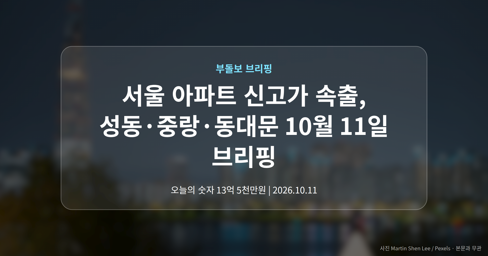
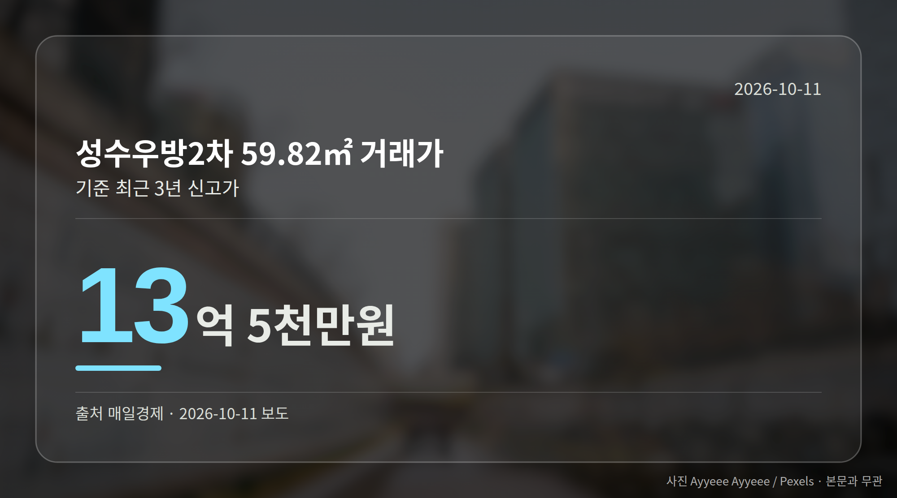
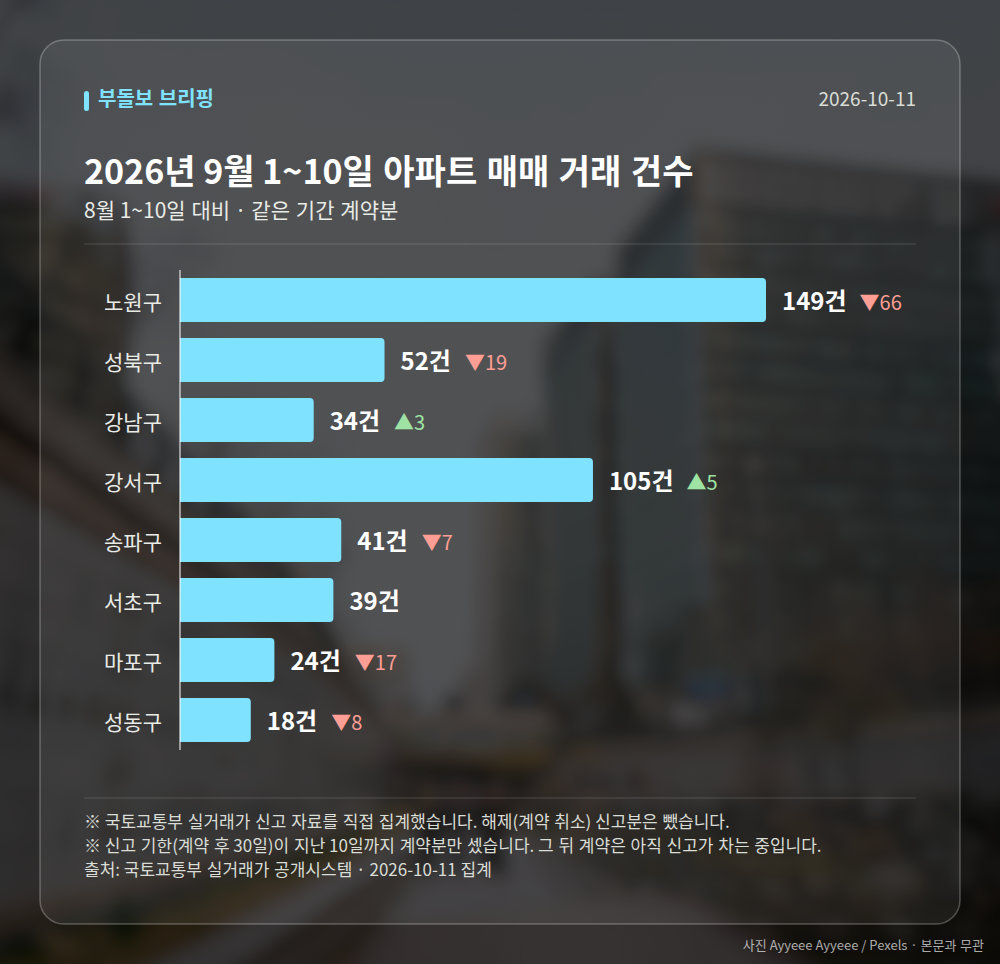

*이 글은 2026년 10월 11일 기준으로 정리한 내용입니다. 실거래 거래 건수는 2026년 9월 1~10일 계약분(신고 기한이 지난 것), 전세가율 등은 2026년 8월 신고분입니다.*
**3줄 요약**

- 성동·중랑·동대문·광진구에서 최근 3년 신고가 거래 6건 확인
- 성수우방2차 13억 5천만원, 광장힐스테이트 24억 9500만원
- 모두 1건씩의 사례라 단지 전체 시세로 보긴 어렵습니다
오늘 서울 아파트 신고가 소식은 강남이 아닌 곳에서 더 많이 나왔습니다. 성동·중랑·동대문·광진구에서 최근 3년 신고가 거래 6건이 확인됐습니다.

다만 모두 단지별, 면적별로 1건씩 포착된 사례라는 점을 먼저 말씀드립니다. 숫자를 그대로 보되, 의미는 조심해서 읽어야 합니다.

[이미지: 서울 한강 북측 아파트 단지 전경]

## 서울 아파트 신고가, 어느 단지에서 나왔나

매일경제 보도에 따르면 네 개 자치구에서 신고가(해당 기간 중 가장 높은 거래가격) 거래가 잇따랐습니다. 금액은 아래와 같습니다.

| 단지 | 면적 | 거래가 |
| --- | --- | --- |
| 성수우방2차(성동) | 59.82㎡ | 13억 5천만원 |
| 면목한신(중랑) | 58.46㎡ | 7억원 |
| 대림e-편한세상(동대문 이문동) | 59.958㎡ | 12억 2천만원 |
| 답십리파크자이(동대문) | 84.83㎡ | 16억 2천만원 |
| 광장힐스테이트(광진) | 59.99㎡ | 24억 9500만원 |
| e편한세상광진그랜드파크(광진) | 115.947㎡ | 28억 5천만원 |

같은 전용 60㎡ 안쪽인데도 중랑구와 광진구의 금액 차이가 큽니다. 가격 흐름이 서울 전역에서 똑같은 속도로 움직이지는 않는다는 뜻으로 읽힙니다.

## 서울 아파트 신고가 1건을 어떻게 읽어야 할까

중요한 건 이 거래들이 각각 한 건이라는 점입니다. 같은 단지라도 동과 층, 수리 상태에 따라 가격은 크게 벌어집니다.

게다가 오늘 확인된 기사들은 제목 수준으로만 전해져 거래일과 동·층수 같은 세부 정보는 알 수 없습니다. 브리핑에서도 이를 단지 전체 시세로 일반화하기는 어렵다고 짚었습니다.

그래서 서울 아파트 신고가 소식을 볼 때는 '한 건이 더 올라왔다'는 사실과 '단지 시세가 올랐다'는 판단을 구분하는 편이 안전합니다. 국토교통부 실거래가 시스템에서 같은 면적의 최근 거래가 몇 건인지 함께 보시면 좋겠습니다.

## 강남에서는 85억원 거래도 나왔습니다

10월 9일 실거래가 시스템에 새로 등록된 서울 아파트 거래 가운데 최고 금액은 강남구 압구정동 신현대12차 전용 155.52㎡의 85억원이었습니다.

이 거래 역시 단일 건입니다. 최상급지 가격대가 높은 수준에서 거래되고 있다는 사례로 보는 정도가 적당해 보입니다.

[이미지: 강남 압구정 재건축 단지 일대 사진]

## 그 밖의 오늘 소식

- 이창용 한은 총재, 보유세 인상·거래세 인하 의견 언급
- 복정역세권 개발 PF 2조2,800억원 조달 완료
- 서울 모아타운 1,735세대 심의 통과(공급 확정은 아님)

**그래서 나는?**

- 무주택 실수요자라면, 관심 단지의 신고가가 1건인지부터 확인해 보세요
- 1주택자라면, 보유세·거래세 개편 논의가 어디까지 가는지 지켜볼 때입니다
- 청약을 준비 중이라면, 이번 주 9개 단지 일정이 맞는지 다시 확인해 보세요

**직접 센 숫자 — 2026년 9월 1~10일 아파트 실거래**

서울 8개 구 계약 매매 **462건** (8월 1~10일 571건, -109건)

거래가 많은 곳: 노원구 149건(-66) · 성북구 52건(-19) · 강남구 34건(+3)

신고 기한(계약 후 30일)이 지난 10일까지 계약분끼리 견줬습니다.

노원구 전세가율 가운뎃값 **52.9%** (같은 단지·같은 면적 107곳)

서울 25개 구 가운데 거래가 가장 크게 움직인 곳: 은평구 +61.8%(68→110건, 응암동에 63.6% 몰림) · 강동구 -35.4%(79→51건)

2026년 9월 계약 신고가

- 노원구 시영3차(라이프)아파트 49.5㎡ — 6.5억 (이전 최고 5.4억, +20.2%, 9월 10일 계약)
- 송파구 송파현대힐스테이트 84.99㎡ — 16.5억 (이전 최고 14.0억, +17.9%, 9월 4일 계약)

*국토교통부 실거래가 신고 자료를 직접 집계했습니다. 해제 신고분은 뺐습니다.*
**여러분이 지켜보고 있는 단지에서는 최근 어떤 가격의 거래가 올라왔나요?**

---

### 참고한 기사

1. **성동구 성수우방2차아파트 59.82㎡ 13억 5천만원… 최근 3년 신고가 [MAI부동산]**
   - [매일경제·부동산](https://www.mk.co.kr/news/realestate/12172779)
2. **복정역세권 개발 PF 2조2,800억원 조달…대형 복합개발 금융주선 완료 - https://www.thedailyeconomy.kr/**
   - [구글뉴스·부동산](https://news.google.com/rss/articles/CBMicEFVX3lxTE1JdnB5TnhZcUMtSTkyNXpyQkV2VEVqcEJjLVdPWnVvdFZQYmdCbUxneExMbGFZVGVzNUJySmZCcmpmNjJRNUFFVGM1Z3J3bkRHZDFGZHd6Y1JuN3U1eXVMRmhEVU9NQVpCb3Vua29jSmE?oc=5)
3. **압구정동 신현대12차 85억원 거래… 서울 아파트 실거래가 [MAI부동산]**
   - [매일경제·부동산](https://www.mk.co.kr/news/realestate/12172759)
4. **슈카 만난 이창용 "강남 부동산 관심 커진 덴 분양가 상한제도 영향…보유세 올리고 거래세 낮춰야"**
   - [아시아경제](https://news.google.com/rss/articles/CBMiYEFVX3lxTE5fOUwyM2N6YXY5UlVoZVdXQW8yUmk1bEl6SERBSW0wMTg3d3FsbmQ2SFRlVTh5cmp0amNJVVJhUVNaYkpSWVNPQ2RGcmJvdUFnMjB0T3JTRUVyenNMTUN2cQ?oc=5)
5. **이주 '향남역 그로브 스위첸' 등 9개 단지 청약**
   - [신아일보](https://news.google.com/rss/articles/CBMicEFVX3lxTE5mbEZvM1pkUkIwMjVSS0R3b0hDcVhMUGkyREFYWE1vaUdqVF9oTTV6NlFfMTBac1l0eGg1THZJTTllS3ZzXzY4ZDdlNWc1TWNMNWctM05qY3dOOXlXbzN0LVR6UlFsNVYyd3BaVTlkREs?oc=5)
   - [중앙신문](https://news.google.com/rss/articles/CBMiaEFVX3lxTE0tN09MSng5eUFLcFh5WnZmYVRzLVNZZ2poT1ZNTXdQeExaMjZuYkdERVFrdE50bW1pVFo3ZmhIZlJoa01zQ0g1YU1md3djRGxJSkJlNTdFN1Nadmt5WDFheWMyeGo2Mm9o?oc=5)

---

*본 글은 공개된 언론 보도를 정리한 것이며, 투자 판단의 책임은 이용자 본인에게 있습니다.*
