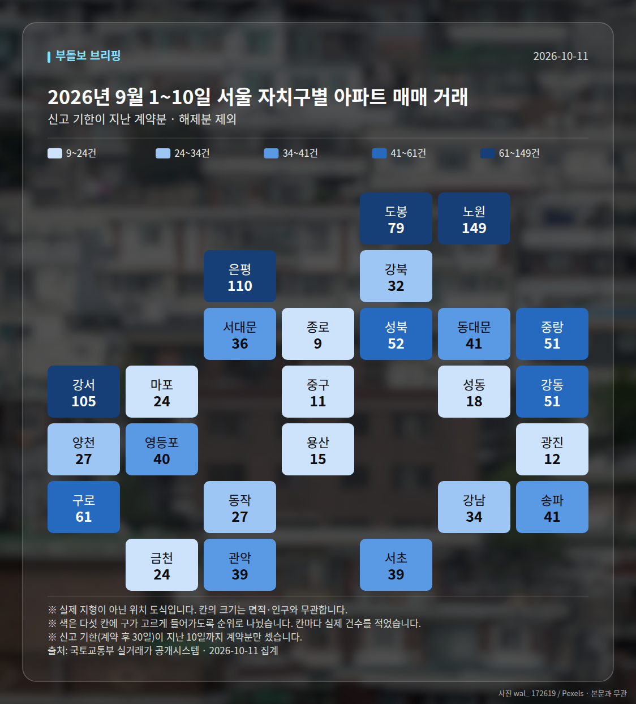
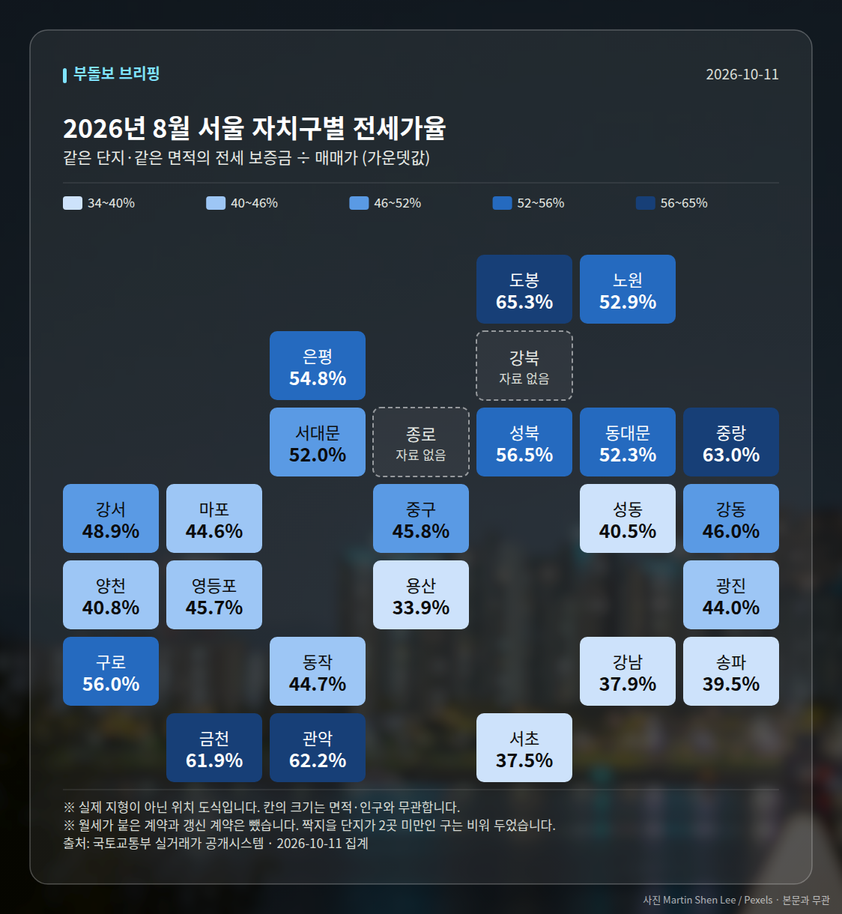
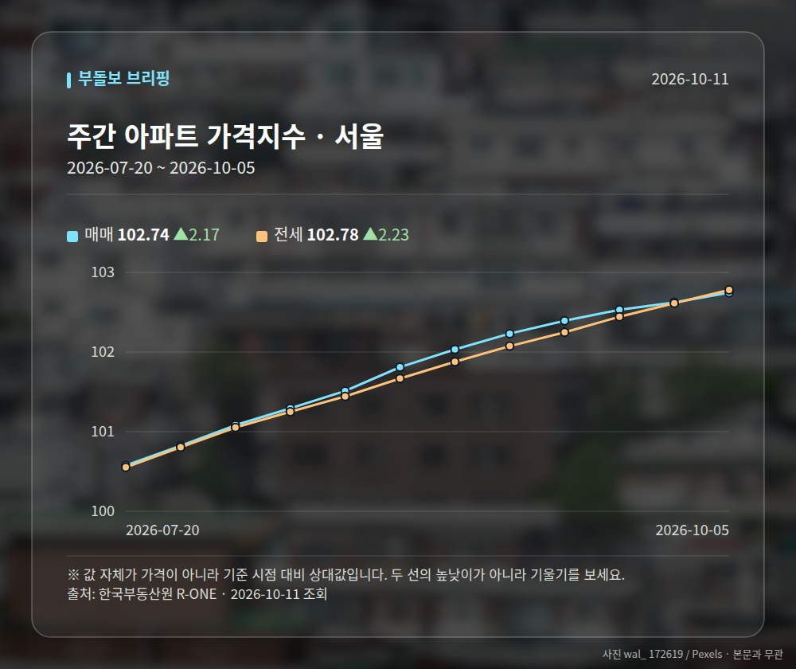
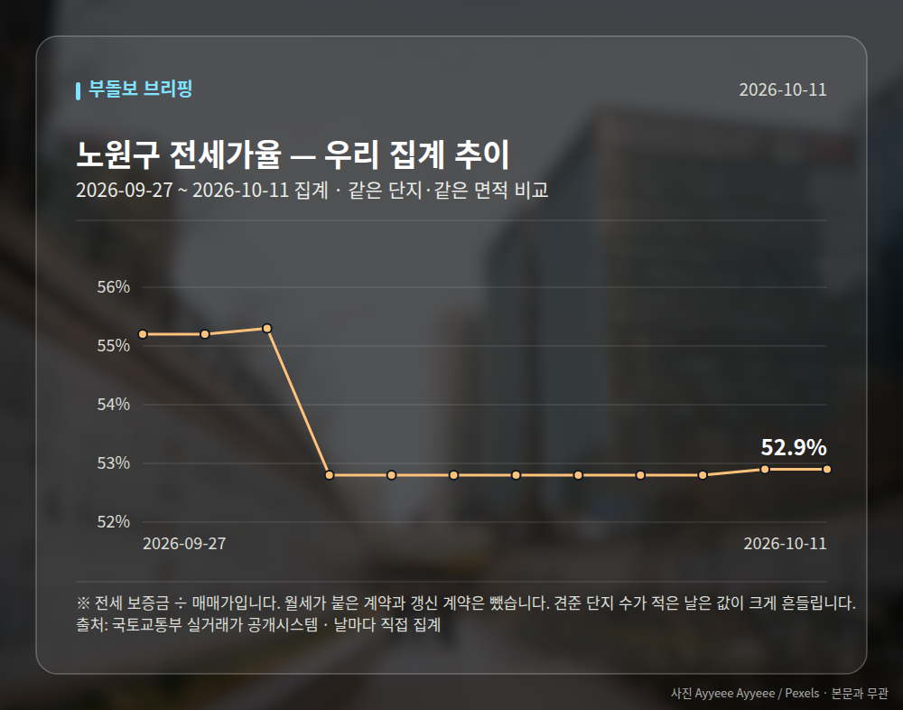
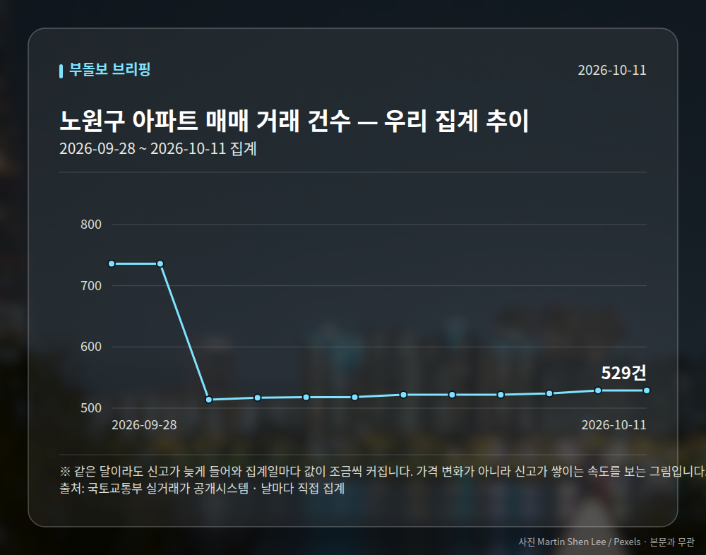
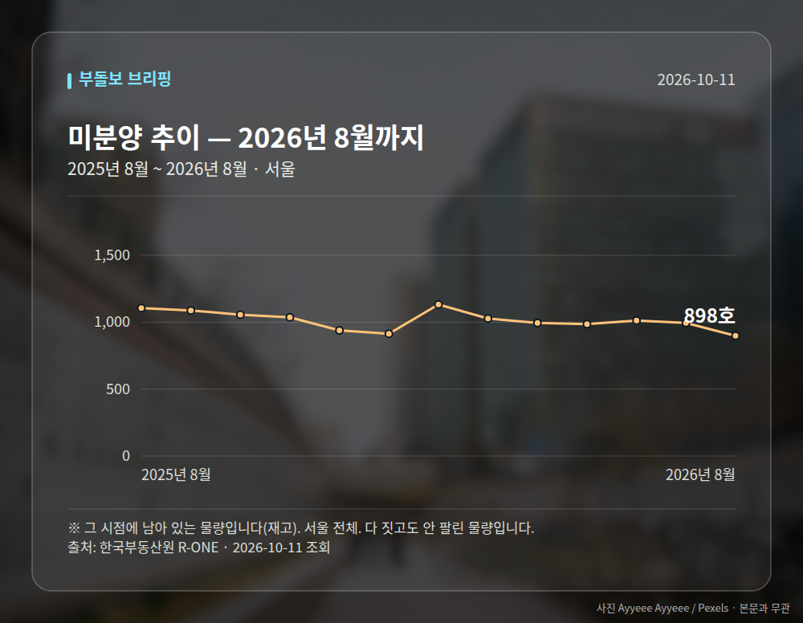

# 실거래가로 본 2026년 9월 1~10일

정부가 받은 **아파트 매매 신고 자료**를 그대로 집계한 것입니다. 기사에 실린 수치가 아니라
국토교통부 실거래가 자료를 직접 받아 셌습니다. 계약 후 30일 안에 신고하므로,
**거래 건수는 신고 기한이 지난 날짜까지만** 셉니다 — 2026년 9월 1~10일 계약분을 8월 1~10일과 견줬습니다.
달 전체를 세면 아직 신고가 차는 중이라 거래가 급감한 것처럼 보여서입니다.
전세가율·월세·면적대는 표본이 작아지지 않게 **신고가 다 들어온 2026년 8월** 을 봅니다.
단, 아래 **눈에 띄는 거래(신고가)** 는 한 건씩 보는 것이라 **2026년 9~10월 계약분**까지 봅니다.

**2026년 9월 1~10일 전체 462건** · 8월 1~10일 571건 (-109건)

| 지역 | 거래 건수 | 8월 1~10일 대비 | 평균 거래가 | 가장 비싼 거래 |
| --- | ---: | ---: | ---: | --- |
| 노원구 | 149건 | -66 | 7.1억 | 동진신안 15.5억 (134.74㎡) |
| 성북구 | 52건 | -19 | 9.1억 | 롯데캐슬클라시아 15.9억 (59.87㎡) |
| 강남구 | 34건 | +3 | 29.1억 | 동부센트레빌 60.0억 (145.83㎡) |
| 강서구 | 105건 | +5 | 6.9억 | 마곡엠밸리5단지 17.7억 (114.86㎡) |
| 송파구 | 41건 | -7 | 20.8억 | 레이크팰리스 38.0억 (136.74㎡) |
| 서초구 | 39건 | +0 | 25.6억 | 반포자이 67.0억 (216.49㎡) |
| 마포구 | 24건 | -17 | 16.2억 | 마포자이2차 26.0억 (84.44㎡) |
| 성동구 | 18건 | -8 | 19.6억 | 옥수파크힐스101동~116동 25.0억 (84.64㎡) |

## 서울 전체 지도

표에 올린 곳 말고 **스물다섯 개 구 전부**를 한 번씩 세어 칠했습니다.
색은 순위로 다섯 칸에 나눈 것이라, 짙다고 두 배가 아닙니다. 칸 안의 숫자를 보세요.

## 전세가율 지도

같은 도식에 전세가율을 칠했습니다. 짝지을 단지가 2곳 미만인 구는 비워 두었습니다.

## 거래가 크게 움직인 구

스물다섯 개 구를 다 세어 놓고 **8월 1~10일과 20% 이상 벌어진 곳**만 골랐습니다.
거래가 원래 적은 구는 몇 건만 움직여도 비율이 튀므로 40건 미만인 곳은 뺐습니다.

| 지역 | 2026년 9월 1~10일 | 8월 1~10일 | 차이 | 어디서 |
| --- | ---: | ---: | ---: | --- |
| 은평구 | 110건 | 68건 | +61.8% | 응암동 70건 (63.6%) |
| 강동구 | 51건 | 79건 | -35.4% | 고르게 퍼짐 |
| 동대문구 | 41건 | 62건 | -33.9% | 고르게 퍼짐 |
| 도봉구 | 79건 | 60건 | +31.7% | 고르게 퍼짐 |

'어디서' 칸에 동네 이름이 있으면 구 전체가 아니라 **그 동네 한 곳이 움직인 것**입니다.
큰 단지 하나가 한꺼번에 신고되면 이렇게 보입니다.

## 어떤 크기가 팔렸나

평균 거래가 하나만 보면 **값이 오른 것**과 **비싼 것만 팔린 것**을 구별할 수 없습니다.
전용면적으로 갈라 보면 갈립니다. 85㎡ 가 국민주택규모입니다.

| 면적대 | 전용면적 | 거래 건수 | 비중 | 2026년 7월 비중 | 평균 거래가 |
| --- | --- | ---: | ---: | ---: | ---: |
| 소형 | 60㎡ 이하 | 728건 | 49.0% | 48.9% (+0.1%p) | 8.9억 |
| 중형 | 60~85㎡ | 546건 | 36.8% | 35.9% (+0.9%p) | 13.9억 |
| 중대형 | 85~135㎡ | 169건 | 11.4% | 11.7% (-0.3%p) | 19.8억 |
| 대형 | 135㎡ 초과 | 42건 | 2.8% | 3.5% (-0.7%p) | 41.7억 |

## 눈에 띄는 거래

**2026년 9~10월 계약분**(2026-10-11까지 신고된 것)을
그 앞 6개월 거래와 견줘 값이 크게 움직인 것만 골랐습니다.
같은 단지·같은 면적끼리만 비교했고, 지난 거래가 2건 미만이면 뺐습니다.
신고 기한(계약 후 30일)이 안 지난 거래도 들어 있어, 늦게 신고되는 거래가 더 붙을 수 있습니다.

| 구분 | 지역 | 단지 | 면적 | 계약일 | 이번 | 이전 | 차이 |
| --- | --- | --- | ---: | --- | ---: | ---: | ---: |
| 신고가 | 노원구 | 시영3차(라이프)아파트 | 49.5㎡ | 2026-09-10 | 6.5억 | 5.4억 | +20.2% |
| 신고가 | 송파구 | 송파현대힐스테이트 | 84.99㎡ | 2026-09-04 | 16.5억 | 14.0억 | +17.9% |
| 신고가 | 송파구 | 토성현대 | 57.24㎡ | 2026-09-28 | 9.9억 | 8.4억 | +17.2% |
| 신고가 | 마포구 | 창전래미안 | 114.82㎡ | 2026-09-16 | 17.5억 | 15.0억 | +16.7% |
| 신고가 | 강서구 | 보람 | 84.96㎡ | 2026-09-17 | 8.6억 | 7.4억 | +15.5% |

## 전세가율 (실제 거래로 계산)

같은 단지·같은 면적에서 그달 **전세 보증금 ÷ 매매가**입니다.
월세가 붙은 계약과 갱신 계약은 뺐습니다. 갱신은 종전 보증금을 따라가 시세보다 낮습니다.
지수가 아니라 실제 거래라 단지마다 편차가 큽니다. 가운뎃값을 먼저 보세요.

| 지역 | 중앙값 | 견준 단지 수 | 가장 높은 곳 |
| --- | ---: | ---: | --- |
| 노원구 | 52.9% | 107곳 | 상계불암대림 85.1% (7.4억 / 전세 6.3억) |
| 성북구 | 56.5% | 45곳 | 길음뉴타운2단지푸르지오 98.0% (7.5억 / 전세 7.3억) |
| 강남구 | 37.9% | 28곳 | 펜트힐루논현 102.3% (6.5억 / 전세 6.7억) |
| 강서구 | 48.9% | 52곳 | 금호타운 88.0% (6.0억 / 전세 5.3억) |
| 송파구 | 39.5% | 45곳 | 쌍용 63.3% (12.0억 / 전세 7.6억) |
| 마포구 | 44.6% | 29곳 | 대우미래사랑 86.0% (3.1억 / 전세 2.7억) |
| 서초구 | 37.5% | 23곳 | 서초동삼성쉐르빌2 92.4% (2.8억 / 전세 2.6억) |
| 성동구 | 40.5% | 16곳 | 센트라스 53.6% (21.2억 / 전세 11.4억) |

## 전세와 월세의 비율

전세가율에서 뺀 월세 계약도 그 자체로 자료입니다. **비중**은 갱신까지 전부 셌고,
**보증금·월세 가운뎃값**은 신규 계약만 봤습니다 — 갱신은 종전 조건을 따라가 시세가 아닙니다.

| 지역 | 전월세 계약 | 월세 낀 계약 | 신규 전세 보증금 | 신규 월세 (보증금 / 월) |
| --- | ---: | ---: | ---: | --- |
| 노원구 | 1123건 | 542건 (48.3%) | 3.35억 | 3000만원 / 90만원 |
| 성북구 | 461건 | 196건 (42.5%) | 6.04억 | 1.7억 / 100만원 |
| 강남구 | 1153건 | 579건 (50.2%) | 8.3억 | 2.5억 / 160만원 |
| 강서구 | 1318건 | 532건 (40.4%) | 5.0억 | 7366만원 / 60만원 |
| 송파구 | 1202건 | 618건 (51.4%) | 8.5억 | 3.0억 / 150만원 |
| 마포구 | 782건 | 398건 (50.9%) | 7.27억 | 1.0억 / 150만원 |
| 서초구 | 963건 | 391건 (40.6%) | 8.8억 | 2.0억 / 200만원 |
| 성동구 | 678건 | 379건 (55.9%) | 7.8억 | 8000만원 / 70만원 |

## 한국부동산원 주간 가격지수 (서울)

| 기준일 | 매매 | 전세 |
| --- | ---: | ---: |
| 2026-07-20 | 100.58 | 100.55 |
| 2026-07-27 | 100.82 | 100.80 |
| 2026-08-03 | 101.08 | 101.05 |
| 2026-08-10 | 101.29 | 101.25 |
| 2026-08-17 | 101.51 | 101.44 |
| 2026-08-24 | 101.81 | 101.67 |
| 2026-08-31 | 102.03 | 101.88 |
| 2026-09-07 | 102.23 | 102.07 |
| 2026-09-14 | 102.39 | 102.25 |
| 2026-09-21 | 102.53 | 102.44 |
| 2026-09-28 | 102.62 | 102.61 |
| 2026-10-05 | 102.74 | 102.78 |

## 전세가율 추이 (노원구)

견준 단지 수가 적은 날은 값이 크게 흔들립니다. 점이 작은 날이 그런 날입니다.

## 우리가 날마다 센 추이 (노원구)

같은 달이라도 신고가 늦게 들어와 집계일마다 값이 조금씩 커집니다.
가격 변화가 아니라 신고가 쌓이는 속도를 보는 그림입니다.

## 공급 쪽 숫자 (앞으로 나올 물량)

여기까지의 숫자는 전부 **팔린 것**이었습니다. 이 절은 반대쪽입니다.
미분양은 다 짓고도 안 팔린 재고이고, 인허가·착공은 **1~2년 뒤 공급**을 말합니다.

| 항목 | 시점 | 값 | 전달 대비 | 성질 |
| --- | --- | ---: | ---: | --- |
| 미분양 | 2026년 8월 | 898호 | -96 | 재고 |
| 주택 인허가 | 2026년 8월 | 11,332호 | +3,324 | 그 달치(누계에서 되돌림) |
| 아파트 착공 | 2026년 8월 | 937호 | -5,130 | 그 달 실적 |

- **미분양** — 서울 전체. 다 짓고도 안 팔린 물량입니다.
- **주택 인허가** — 서울 합계(가구수 기준). 원자료가 연초부터의 누계라 그 달치로 되돌렸습니다.
- **아파트 착공** — 서울 민간분양.

발표가 두세 달 늦습니다. 거래·가격 수치와 시점이 다르니 견줄 때 주의하세요.

---

*출처: 국토교통부 실거래가 공개시스템(공공데이터포털), 한국부동산원 R-ONE.
평균은 그 달 신고분의 단순 평균이며 면적·층을 보정하지 않았습니다.
해제(계약 취소)로 신고된 건은 뺐습니다.*
