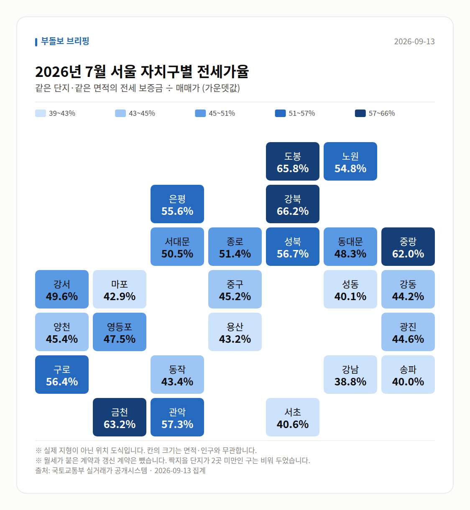

**2026년 9월 다섯 줄**

1. 서울 아파트값 85주 연속 상승, 최장기록 동률
2. 강남3구 21주 만에 동반 하락, 상승폭 3주째 축소
3. 서울 평균 전셋값 6억3662만원, 전세 84주 상승
4. 8월 확정 실거래 1491건, 전월보다 749건 감소
5. 토허제 실거주 유예 1년 연장, 2027년 말까지

9월 서울 시장은 한 문장으로 "오르는 속도는 느려졌지만, 오르는 지역이 강남에서 외곽과 전월세로 옮겨간 달"이었습니다.

지수상 상승은 85주째 이어졌는데, 그 안을 들여다보면 강남3구는 하락으로 돌아섰고 노원·강북·성북 같은 외곽과 전세 시장이 기록을 갈아치웠습니다. 숫자부터 차례로 보여드리겠습니다.

## 85주 연속 상승, 그런데 속도는 꺾였습니다

월 중반 보도에서 서울 아파트값은 83주 연속 상승으로 집계됐고(데일리안 등), 9월 넷째 주 기준으로는 85주 연속 상승이 되어 문재인 정부 당시 최장 기록과 동률을 이뤘다고 보도됐습니다(재경일보 등). 같은 사안을 88주로 집계한 매체(edaily.co.kr)와, 오세훈 서울시장이 86주로 언급한 사례(자유일보 등)도 있어 기준에 따라 숫자가 다릅니다.

다만 상승폭은 줄었습니다. 9월 셋째 주 서울 아파트 매매가 주간 상승률은 0.16%(코리아리포트·NSP통신)로 3주째 상승폭 축소 흐름이라는 보도(KBS)가 나왔고, 8월 서울 주택가격 상승률은 0.97%로 5개월 만에 상승폭이 좁혀졌습니다(연합인포맥스 등).

즉 '상승 중단'이 아니라 '상승 속도 둔화'로 읽는 쪽이 자료에 가깝습니다. 방향과 속도를 구분해서 보시는 편이 좋겠습니다.

## 강남은 쉬고, 외곽·구축이 움직였습니다

9월 10일 보도 기준 강남·서초·송파가 21주 만에 동반 하락했고, 세 곳이 모두 약세로 돌아선 것은 5개월 만이라는 분석이 나왔습니다. 매일경제는 그 배경을 세제 개편안 영향으로 고가 주택 매수 열기가 줄어든 것으로 풀이했습니다.

반대쪽에서는 외곽이 강했습니다. 강북구 주간 상승률이 0.46%로 서울 자치구 중 가장 높았고(ddaily.co.kr), 8월 서울에서 준공 20년 초과 아파트 매매가는 1.21% 올라 5년 이하 신축의 상승폭을 앞질렀습니다(뉴스토마토).

한 달 동안 매일경제·국토부 실거래가 기준 최근 3년 신고가 사례가 노원·도봉·강북·구로·금천에서 반복적으로 등장했습니다. 노원구 월계동 현대 59.95㎡ 9억8500만원, 강북구 두산위브트레지움 59.82㎡ 9억3250만원, 금천 롯데캐슬골드파크3차 59.97㎡ 11억2000만원 같은 사례입니다.

## 이달의 주인공은 전세와 월세였습니다

서울 아파트 전셋값은 9월 둘째 주 0.17% 올라 84주 연속 상승했고, 84주 누적 상승률은 11.76%로 문재인 정부 당시 134주간 상승률 12.31%에 근접했습니다(한국부동산원, 매일경제 재인용). 8월 서울 아파트 평균 전셋값은 6억3662만원으로, 2022년 1월 6억3424만원을 넘어선 역대 최고치입니다.

올해 누적 전세 상승률은 9월 둘째 주 기준 7.79%로 2015년(10.79%) 이후 가장 높고, 지난해 같은 기간 1.16%, 2025년 연간 3.77%와 비교됩니다(한국부동산원). 자치구별로는 성북구가 매매 14.01%·전세 12.84%로 모두 1위, 노원구 전세 12.25%, 동대문구 8.43%였고 동남권(강남3구·강동)은 6.03%로 평균을 밑돌았습니다.

전세가 밀려 올라간 결과 서울 외곽에서도 10억원대 전세가 나왔습니다. 길음동 롯데캐슬 클라시아 84㎡가 8월 15일 11억원, 청량리역 한양수자인 그라시엘 84㎡가 8월 30일 10억원(지난해 11월 8억원대 초반)에 계약됐습니다. 월세 쪽은 2년간 24% 올랐다는 보도(KBC광주방송·데일리안)와 서울 아파트 평균 월세 162만원이라는 오세훈 시장 발언이 있었고, 건산연 집계로 3분기 전월세 중 월세 비중은 67.6%였습니다.

## 우리가 직접 센 8월 확정 실거래

아래는 기사 인용이 아니라 국토교통부 실거래가 신고 자료를 저희가 직접 집계한 값입니다. 신고 기한 때문에 확정 집계는 두 달쯤 앞선 달이 기준이며, **대상 월은 2026년 8월**(집계 작업 기간 9월 11일~9월 30일, 17일간)입니다.

서울 전체 집계 건수는 **1,491건**으로, 직전 집계 대비 **749건 감소**했습니다. 신고가 소식이 많았던 달이지만 거래 '건수' 자체는 줄었다는 점이 눈에 띕니다.

| 자치구 | 거래 건수 | 평균 거래가(원) |
| --- | --- | --- |
| 노원구 | 514 | 706,799,610 |
| 강서구 | 259 | 948,643,436 |
| 은평구 | 211 | 858,860,189 |
| 송파구 | 168 | 2,065,267,857 |
| 마포구 | 110 | 1,456,595,454 |

거래 건수 1위가 노원구(514건)라는 점은, 앞서 본 외곽 강세와 결이 같습니다. 평균가는 송파구가 20억원대, 노원구가 7억원대로 격차가 그대로 드러납니다.

| 자치구 | 전세 중위값(집계 원값) | 건수 |
| --- | --- | --- |
| 은평구 | 54.8 | 35 |
| 강서구 | 48.9 | 52 |
| 마포구 | 44.6 | 29 |
| 성동구 | 40.5 | 16 |
| 송파구 | 39.5 | 45 |

지수는 매매 102.53(+0.3), 전세 102.44(+0.37)로, 전세 쪽 상승폭이 매매보다 컸습니다. 앞서 본 전세 중심 흐름이 저희 집계에서도 같은 방향으로 확인됩니다.

## 세금·대출·공급, 제도 쪽에서 바뀐 것

세금에서는 종부세 확산 전망이 반복해서 다뤄졌습니다. 연 11% 집값 상승을 가정할 경우 2030년 서울 25개구 중 22개구가 종부세 대상이 되고 강북·금천·도봉 3개구만 제외된다는 분석입니다(뉴스1 등). 가정에 기댄 전망이므로 상승률 가정이 바뀌면 결과도 달라진다는 점을 함께 보셔야 합니다.

규제에서는 9월 17일, 토지거래허가구역 실거주 유예 신청기한이 2026년 12월 31일에서 2027년 12월 31일로 1년 연장됐습니다. 갱신계약 2년을 추가 인정받으면 최장 2029년 말까지 입주를 미룰 수 있고, 허가 후 4개월 내 등기 요건과 2026년 5월 12일부터 계속 무주택이어야 한다는 기준은 유지됩니다(매일경제).

공급 비용은 올랐습니다. 분양가상한제 기본형 건축비가 두 달 새 4.07% 인상됐고 안전비용 상승이 주요 요인으로 꼽혔습니다(한국경제). 인천은 1년간 분양가가 1억1000만원 올라 3.3㎡당 2000만원을 넘겼지만(매일경제), 8월 주택 매매가격은 -0.03%로 하락 전환했습니다(컨슈머타임스). 금리 쪽에서는 기준금리 0.25%p 인상 시 6개월 뒤 아파트값이 1.2% 하락한다는 추정이 복수 매체에 보도됐습니다.

## 다음 달 볼 것

첫째, 85주에서 멈춘 연속 상승 기록이 10월에 경신되는지, 그리고 상승폭 축소 흐름이 이어지는지입니다. 매체별로 83·85·86·88주 집계가 엇갈리므로 어느 기관 통계인지 확인하고 보시는 편이 좋습니다.

둘째, 전세입니다. 84주 누적 11.76%가 문재인 정부 134주 12.31%에 어디까지 다가가는지, 평균 전셋값 6억3662만원이 더 올라가는지가 실수요에 바로 닿는 숫자입니다.

셋째, 9월 23일 취임한 홍지선 국토부 장관의 후속 조치입니다. 수도권 135만 가구 공급 목표, 3기 신도시 분양전환 공공임대 1.2만호 축소 검토, 고양대곡(9400가구)·의왕오전왕곡(1만4000가구) 공공택지 일정이 어떻게 정리되는지 보겠습니다.

넷째, 저희가 10월에 집계할 9월 확정 실거래입니다. 8월 1,491건·전월 대비 749건 감소라는 거래량 축소가 한 달 더 이어지는지, 노원구 쏠림이 유지되는지 같은 기준으로 다시 세어 전해드리겠습니다.

## 흐름이 바뀐 지점

- 9월 10일 보도부터 강남3구가 21주 만에 동반 하락하며 5개월 만에 모두 약세로 돌아섰습니다. 매일경제는 세제 개편안 영향으로 고가 주택 매수 열기가 줄어든 것으로 풀이했습니다.
- 9월 16일 발표된 8월 서울 주택가격 상승률 0.97%로, 5개월 만에 상승폭이 축소됐습니다. 주간 기준으로도 9월 셋째 주 0.16%까지 3주째 상승폭이 좁혀졌습니다.
- 9월 17일 토지거래허가구역 실거주 유예 신청기한이 2026년 말에서 2027년 말로 1년 연장되며, 갱신계약 포함 최장 2029년 말까지 입주를 미룰 수 있게 됐습니다.
- 월 중반 이후 상승의 무게가 외곽·구축으로 옮겨갔습니다. 강북구 주간 0.46%로 자치구 1위, 8월 준공 20년 초과 아파트 1.21% 상승으로 신축 상승폭을 앞질렀습니다.

## 2026년 9월에 확정된 실거래 (직접 집계)

신고 기한이 계약 후 30일이라 확정된 달은 지금보다 앞섭니다.
아래는 **2026년 8월** 신고분이고, 2026년 9월 동안 우리가 날마다 센 값의 마지막입니다.

2026년 8월 신고된 아파트 매매는 **1,491건**입니다.
이달에만 -749건이 더 신고됐습니다 — 가격이 아니라 신고가 쌓인 속도입니다.

| 지역 | 거래 건수 | 평균 거래가 |
| --- | ---: | ---: |
| 노원구 | 514건 | 7.1억 |
| 강서구 | 259건 | 9.5억 |
| 은평구 | 211건 | 8.6억 |
| 송파구 | 168건 | 20.7억 |
| 마포구 | 110건 | 14.6억 |

| 지역 | 전세가율 | 견준 단지 수 |
| --- | ---: | ---: |
| 은평구 | 54.8% | 35곳 |
| 강서구 | 48.9% | 52곳 |
| 마포구 | 44.6% | 29곳 |
| 성동구 | 40.5% | 16곳 |
| 송파구 | 39.5% | 45곳 |

주간 가격지수(2026-09-11 → 2026-09-30)
- 매매 102.53 (+0.30)- 전세 102.44 (+0.37)

## 실거래 지도

<small>2026-09-13 집계본입니다. 실제 지형이 아닌 위치 도식이고, 칸 안의 숫자가 실제 값입니다.</small>

*국토교통부 실거래가 신고 자료를 날마다 직접 집계한 값입니다. 해제 신고분은 뺐습니다.*

## 다음 달 볼 것

- 85주에서 동률이 된 서울 아파트값 최장 연속 상승 기록의 경신 여부와 상승폭 축소 흐름의 지속 여부
- 서울 전세 84주 누적 11.76%(문재인 정부 134주 12.31% 대비)와 평균 전셋값 6억3662만원의 추가 변동
- 홍지선 국토부 장관 취임 후 수도권 135만 가구 목표, 3기 신도시 분양전환 공공임대 1.2만호 축소 검토, 고양대곡·의왕오전왕곡 택지 일정
- 10월에 확정될 2026년 9월 실거래 집계에서 8월 1,491건(전월 대비 -749건) 거래량 축소와 노원구 쏠림의 지속 여부

---

*2026년 9월 브리핑 25일치를 묶은 결산입니다. 본 글은 공개된 언론 보도를 정리한 것이며, 투자 판단의 책임은 이용자 본인에게 있습니다.*
