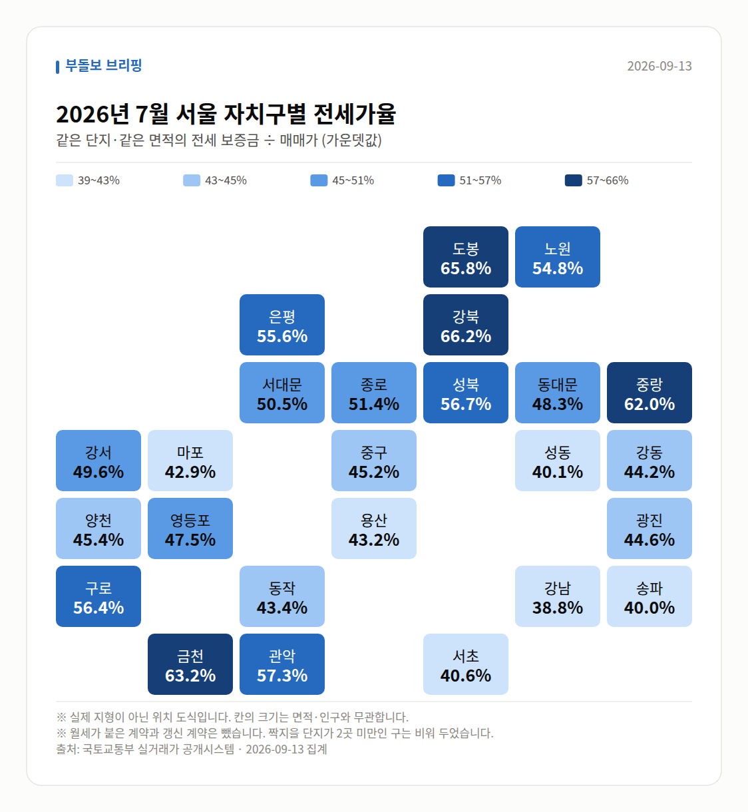

**이번 주 다섯 줄**

1. 강남3구 21주 만에 동반 하락 전환
2. 서울 아파트값 83주 연속 상승, 오름폭은 축소
3. 강북구 0.46%·분당 1년 29.5% 상승으로 강세
4. 서울 아파트 평균 월세 162만원(오세훈 시장 발언)
5. 임대주택 공급 3년새 81% 감소, 기업형 임대 검토

이번 주 시장은 한 문장으로 "서울 전체는 83주 연속 오르고 있지만, 강남3구가 21주 만에 꺾이고 노도강·분당 같은 중저가·외곽이 치고 올라오는 자리바꿈 국면"으로 정리됩니다.

가격뿐 아니라 세금(종부세 대상 확대 전망), 임대(공급 81% 감소), 청약(역세권 쏠림)까지 서로 다른 방향의 신호가 한 주에 몰렸습니다. 아래에서 주제별로 숫자와 출처를 함께 보겠습니다.

## 강남은 꺾이고, 외곽은 올랐습니다

가장 눈에 띄는 변화는 강남3구의 방향 전환입니다. 강남·서초에 이어 송파까지 하락하면서 21주 만에 동반 하락했고, 매일경제는 이를 "5개월 만의 약세 전환"이자 세제 개편안 영향으로 고가 주택 매수 열기가 식은 결과로 풀이했습니다.

강남3구·용산은 주간 기준으로 3주 연속 마이너스 폭이 커졌습니다. 반면 같은 기간 서울 외곽과 경기 규제지역은 0.5% 안팎으로 올랐습니다. 서울 전체는 83주 연속 상승이지만 오름폭은 줄었다는 점도 함께 보셔야 합니다.

| 날짜(기준) | 지역·지표 | 수치 | 출처 |
|---|---|---|---|
| 8월 둘째 주 | 강남3구·용산 주간 상승률 | -0.001% | 매일경제·부동산 |
| 8월 셋째 주 | 강남3구·용산 주간 상승률 | -0.013% | 매일경제·부동산 |
| 8월 넷째 주 | 강남3구·용산 주간 상승률 | -0.176% | 매일경제·부동산 |
| 8월 넷째 주 | 서울 외곽지역 주간 상승률 | 0.485% | 매일경제·부동산 |
| 8월 넷째 주 | 경기 규제지역 주간 상승률 | 0.51% | 매일경제·부동산 |
| 09-10 보도 기준 | 강북구 주간 상승률 | 0.46% | 매일경제 |
| 09-10 보도 기준 | 서울 아파트값 연속 상승 | 83주 | 매일경제·v.daum.net |

한편 최근 1년 상승률 1위는 서울이 아닌 경기 분당구(29.5%, 약 4.3억원 상승, 직방·헤럴드경제)였습니다. 광명 28.4%, 동작 25.3%가 뒤를 이었고, 반도체 벨트로 묶이는 동탄은 6월 둘째 주 2.22%로 연중 최고 상승률, 7월 첫째 주 신고가 212건으로 연중 최다를 기록했습니다.

## 신고가는 '강남 밖'에서 쏟아졌습니다

9월 11일과 12일, 이틀에 걸쳐 같은 성격의 소식이 이어졌습니다. 국토부 실거래가 등록분 기준 최근 3년 신고가 단지가 11일에는 동대문·강동·송파·마포·구로 5곳, 12일에는 송파·동작·구로·노원·도봉·중랑 6곳과 금천·구로·노원 6곳이 추가로 확인됐습니다.

흐름상 중요한 변화는 신고가의 '무대'가 옮겨졌다는 점입니다. 10일 등록분에서는 용산 이촌동 우성 22억 7,000만원, 영등포 당산푸르지오 18억 1,000만원 같은 고가 단지가 중심이었지만, 12일에는 금천·구로·노원·도봉·중랑처럼 외곽 중저가 단지가 목록의 다수를 차지했습니다.

| 등록일 | 단지(전용) | 거래가 |
|---|---|---|
| 2026-09-08 | 용산 이촌동 우성 58.2㎡ | 22억 7,000만원 |
| 2026-09-08 | 영등포 당산푸르지오 84.98㎡ | 18억 1,000만원 |
| 2026-09-09 | 강동 명일동 삼익가든 106.65㎡ | 17억 5,000만원 |
| 2026-09-09 | 마포 성산시영(대우) 50.03㎡ | 15억 3,850만원 |
| 2026-09-10 | 송파 2차한양 64.26㎡ | 22억 2,000만원 |
| 2026-09-10 | 동작 상도두산위브 84.99㎡ | 17억 2,000만원 |
| 2026-09-10 | 금천 롯데캐슬골드파크3차 59.97㎡ | 11억 2,000만원 |
| 2026-09-10 | 도봉 쌍문동 한양2 84.9㎡ | 6억 5,000만원 |

다만 이 수치는 개별 단지·면적 기준 신고가입니다. 12일 브리핑에도 적혀 있듯 이를 뒷받침할 서울 전체 매매가격지수나 거래량 통계는 제공되지 않았으므로, 시장 전체의 방향으로 확대해 읽기는 어렵습니다.

## 세금과 임대, 부담은 양쪽에서

보유세 쪽에서는 현재 집값 상승률이 유지된다는 가정 아래 2030년에는 관악·노원·중랑구까지 종부세 대상이 된다는 분석이 나왔습니다. moneystorm.kr 보도 기준으로는 강북·금천·도봉 3개구만 제외될 수 있다는 내용으로, 어디까지나 '상승률 유지'를 전제로 한 전망이라는 점을 유념하실 필요가 있습니다.

임대 쪽은 공급 위축이 화두였습니다. 임대주택 공급이 최근 3년새 81% 줄었다는 보도와 함께, 정부는 20년 이상 장기임대 기업에 세제 혜택을 주는 기업형 임대 육성안을 검토 중입니다. 오세훈 서울시장은 서울 아파트 평균 월세가 162만원이라며 '주거 지옥'이라고 표현했습니다.

대출 여건도 함께 보셔야 합니다. 서울에서는 정책대출 대상인 6억원 이하 아파트가 사실상 사라졌다는 보도(글로벌이코노믹)가 나왔고, 한국은행 통화신용정책보고서상 수도권 주택매매가격 상승률은 6월 0.68%에서 7월 0.72%로 소폭 확대됐습니다. 6월 예금취급기관 가계대출은 한 달 7조4000억원 늘었습니다.

참고로 2024년 미성년자 3,233명이 임대소득 555억8,400만원(1인당 평균 1,720만원)을 신고했다는 국세청 자료도 공개됐습니다. 0~5세는 179명으로 최근 5년 중 처음 200명 아래로 내려왔습니다.

## 청약·정비사업은 '입지 선별'이 뚜렷했습니다

청약은 역세권 쏠림이 숫자로 확인됐습니다. 부동산R114 집계에서 올해 1~8월 1순위 경쟁률 상위 15개 단지 중 12곳이 역세권이었고, 아크로 드 서초 1,099.1대 1, 오티에르 반포 710.23대 1, 이촌 르엘 134.97대 1 순이었습니다. 대구에서도 범어역 파크드림 디아르가 21가구 모집에 2,131명이 신청해 101.48대 1, 약 6년 만의 세 자릿수 경쟁률을 기록했습니다.

10일 청약을 받은 목동윤슬자이는 최고 경쟁률이 매체별로 32대 1(조선비즈·머니투데이 등)과 33대 1(매일일보)로 엇갈렸고, 평균은 5.8대 1(Nate News)이었습니다. 분양가 역시 28억원~68억원으로 보도가 갈리므로 확정 수치로 받아들이지 않으시는 편이 안전합니다.

정비사업에서는 9일과 10일 이틀 연속 같은 방향의 소식이 나왔습니다. 이헌욱 부동산원장이 점검회의에서 정비사업 병목 해소를 강조한 데 이어, 부동산원이 초기 사업성 컨설팅과 주민 의사결정 지원사업을 확대·재추진하기로 하면서 '발언'이 '지원 프로그램'으로 구체화된 흐름입니다.

같은 주에 김이탁 국토차관은 거여새마을 공공재개발 현장에서 조기 착공 지원을 약속했고, 인천 서해구는 재개발 6곳·재건축 6곳 등 12곳을 집중 지원한다고 밝혔습니다. 민간에서는 롯데건설이 강남 도곡우성 재건축을 수주해 올해 도시정비 누적 수주 4조원을 넘겼고, 은마아파트는 한미글로벌·희림 컨소시엄을 사업관리 협력업체로 선정했습니다.

## 다음 주 볼 것

- 강남3구 하락이 4주째로 이어지는지, 주간 아파트값 통계를 확인해 보세요.
- 서울 아파트값 83주 연속 상승 기록과 오름폭 축소 여부가 이어지는지 봐야 합니다.
- 의정부·천안 등 다음 주 전국 분양 물량 1만1521가구의 청약 결과가 나옵니다.
- 기업형 장기임대(20년 이상) 세제 혜택 검토안의 구체적 발표 여부도 지켜볼 대목입니다.

이번 글의 모든 수치는 위 기간 보도·공표 자료를 그대로 옮긴 것이며, 향후 시장 방향에 대한 판단은 각 기관·발언 주체의 전망입니다. 실제 판단은 여러분의 자금 계획과 함께 검토해 주세요.

## 이번 주 실거래 (직접 집계)

2026년 7월 신고된 아파트 매매는 **2,247건**입니다.
이번 주에만 +17건이 더 신고됐습니다.

| 지역 | 거래 건수 | 평균 거래가 |
| --- | ---: | ---: |
| 노원구 | 727건 | 7.0억 |
| 강서구 | 392건 | 9.8억 |
| 송파구 | 309건 | 22.6억 |
| 은평구 | 284건 | 9.1억 |
| 강남구 | 161건 | 32.9억 |

주간 가격지수(2026-09-07 → 2026-09-13)
- 매매 102.23 (+0.20)- 전세 102.07 (+0.20)

## 실거래 지도

<small>2026-09-13 집계본입니다. 실제 지형이 아닌 위치 도식이고, 칸 안의 숫자가 실제 값입니다.</small>

*국토교통부 실거래가 신고 자료를 날마다 직접 집계한 값입니다. 해제 신고분은 뺐습니다.*

---

### 다음 주 볼 것

- 강남3구 주간 아파트값이 4주 연속 하락으로 이어지는지
- 서울 아파트값 83주 연속 상승 기록과 오름폭 축소 지속 여부
- 의정부·천안 등 다음 주 전국 분양 1만1521가구 청약 결과
- 20년 이상 기업형 장기임대 세제 혜택 검토안의 구체화 여부

---

*본 글은 공개된 언론 보도를 정리한 것이며, 투자 판단의 책임은 이용자 본인에게 있습니다.*
