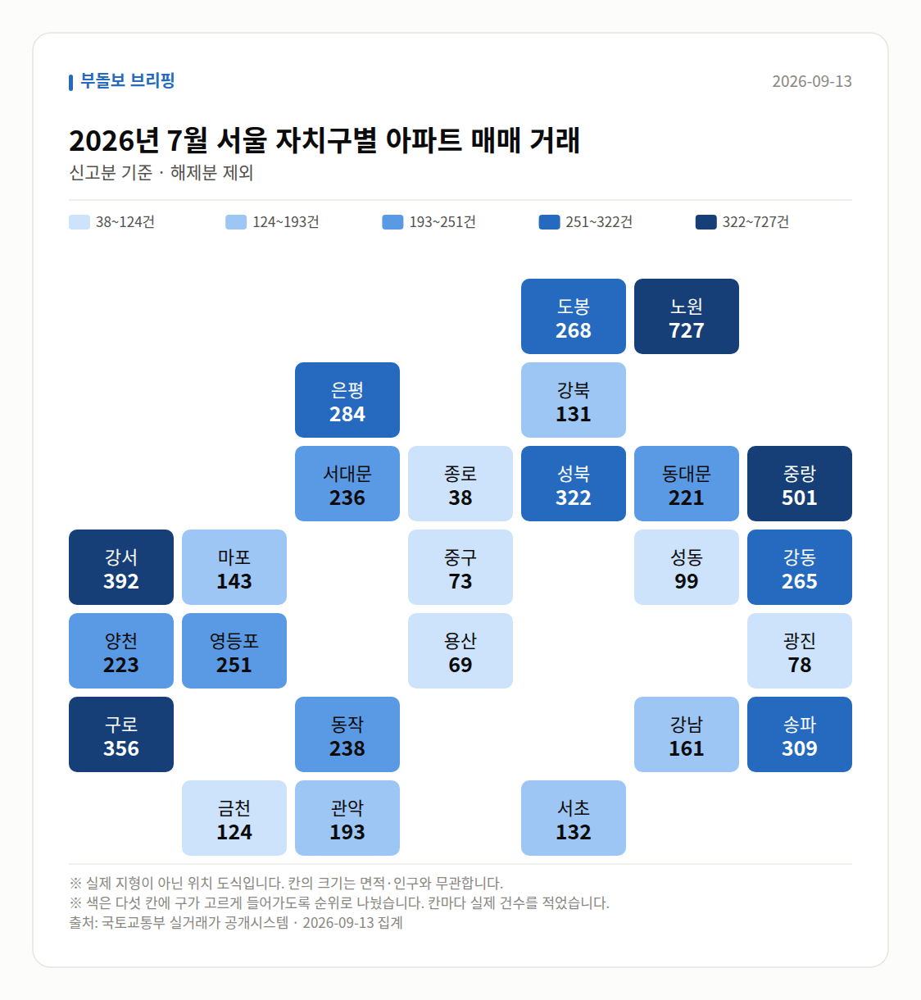

**이번 주 다섯 줄**

1. 서울 아파트값 84주 연속 상승, 최장 기록 눈앞
2. 9월 셋째주 0.16%, 상승폭은 3주째 축소
3. 8월 서울 0.97% 상승, 강남구는 -0.18% 전환
4. 토허제 실거주 유예 신청기한 1년 연장
5. 서울 평균 전셋값 6억3662만원 역대 최고

이번 주 서울 부동산은 "가격은 여전히 오르는데, 오르는 속도는 줄고 있다"는 한 문장으로 정리됩니다. 한국부동산원 통계 기준 서울 아파트값은 84주 연속 상승을 이어갔지만 주간 상승폭은 3주째 축소됐고, 강남3구는 하락으로 돌아섰습니다.

동시에 서울 외곽과 수도권에서는 최근 3년 신고가 거래가 계속 확인됐습니다. 오르는 곳과 쉬어 가는 곳이 갈리는 흐름이라, 어느 한쪽 숫자만 보면 시장을 잘못 읽기 쉬운 한 주였습니다.

## 84주 연속 상승, 그러나 속도는 줄었습니다

주 초반 보도에서는 서울 아파트값이 83주 연속 상승하며 문재인 정부 당시 최장 기록인 85주에 근접했다는 내용이 다뤄졌습니다. 오세훈 서울시장은 같은 사안을 두고 86주 연속 상승으로 이미 최장 기록을 넘어섰다고 언급하며 정책 전면 재검토를 요구했는데, 집계 기준에 따라 숫자가 달라진다는 점은 감안해서 보실 필요가 있습니다.

주 후반인 9월 17일 발표 통계에서는 84주 연속 상승이 확인됐고, 주간 변동률은 0.16%였습니다. KBS 보도 기준으로 상승폭 축소는 3주째 이어졌고, 강남3구가 하락 전환한 점이 상승폭 둔화의 주요 배경으로 지목됐습니다.

| 날짜 | 지표 | 수치 |
|---|---|---|
| 09-14 | 서울 아파트값 연속 상승(언론 기준) | 83주 |
| 09-14 | 오세훈 시장 언급 연속 상승 | 86주 |
| 09-14 | 강북구 주간 상승률 | 0.46% |
| 09-18 | 서울 아파트 주간 상승률(9월 셋째주) | 0.16% |
| 09-18 | 서울 연속 상승 주수 | 84주 |
| 09-18 | 상승폭 축소 지속 기간 | 3주 |
| 09-18 | 대전 아파트 주간 상승률 | 0.03% |

## 월간 통계는 이미 둔화 신호를 보냈습니다

9월 16일 나온 8월 월간 통계에서 서울 주택 매매가격은 0.97% 올랐지만, 상승폭은 5개월 만에 축소됐습니다. 특히 강남구가 0.18% 하락 전환한 점이 눈에 띄었고, 매체들은 세제개편에 따른 세 부담 우려를 배경으로 짚었습니다.

반면 실거래가 기준으로 보면 서울 아파트값은 최근 1년간 14.56%(매체에 따라 약 15%) 올랐고, 7월 한 달에도 1.93% 상승했습니다. 다만 8월 거래량은 전월 대비 46% 급감해, 가격 지표와 거래 지표가 서로 다른 방향을 가리켰습니다.

| 날짜 | 지표 | 수치 |
|---|---|---|
| 09-16 | 8월 서울 주택 매매가 상승률 | 0.97% |
| 09-16 | 8월 강남구 매매가 변동률 | -0.18% |
| 09-16 | 8월 서울 중위 매매가격 | 8억원대 진입 |
| 09-19 | 서울 아파트값 1년 상승률(실거래) | 14.56% |
| 09-19 | 7월 상승률 | 1.93% |
| 09-19 | 8월 거래량 감소율 | 46% |

## 신고가는 외곽·중저가로 번졌습니다

17일부터 20일까지 사흘에 걸쳐 최근 3년 신고가 거래가 이어졌습니다. 강남구 압구정동 신현대11차가 97억3000만원에 거래된 사례가 있는가 하면, 성북·구로·노원·중랑·종로 등 중저가 지역에서도 신고가가 동시에 확인됐습니다.

숫자를 보면 구로동 우방 84.9㎡ 7억4000만원, 상계주공12단지 41.3㎡ 5억8000만원, 중랑구 동성3 59.4㎡ 6억5000만원처럼 비교적 낮은 가격대에서도 기록이 바뀌었습니다. 수도권에서도 성북·동대문, 광명·수지 등이 서울과의 격차를 좁히는 이른바 '키 맞추기' 흐름이 언급됐습니다.

| 날짜 | 단지·면적 | 거래가 |
|---|---|---|
| 09-15 | 중랑구 신내6대주 49.77㎡ | 7억1000만원 |
| 09-15 | 종로구 창신쌍용2 64.66㎡ | 8억9000만원 |
| 09-17 | 강남구 압구정 신현대11차 | 97억3000만원 |
| 09-17 | 영등포구 당산현대5차 84.69㎡ | 19억4300만원 |
| 09-19 | 송파현대힐스테이트 84.99㎡ | 16억5000만원 |
| 09-19 | 노원구 월계동 현대 59.95㎡ | 9억8500만원 |
| 09-20 | 영등포푸르지오 59.912㎡ | 15억9000만원 |
| 09-20 | 상계주공12단지 41.3㎡ | 5억8000만원 |

지방은 사정이 다릅니다. 대구 아파트 매매가는 34개월 연속 하락(하락폭은 축소)했고 전세는 3개월 연속 올랐습니다. 대구 18억원, 부산 29억원 신고가와 지방 미분양 4만8000가구가 함께 존재하는 양극화 구도입니다.

## 전세와 규제, 공급에서 나온 변화

9월 17일 국토교통부는 토지거래허가구역 실거주 유예 신청기한을 2026년 12월 31일에서 2027년 12월 31일로 1년 연장하고 인정 범위를 넓혔습니다. 1회에 한해 최대 2년의 갱신계약 기간을 추가로 인정해 최장 2029년 말까지 입주 유예가 가능하며, 허가 후 4개월 내 등기 요건과 2026년 5월 12일부터 계속 무주택이어야 한다는 기준은 유지됩니다.

전세 쪽 부담은 여전합니다. 서울 아파트 전셋값은 84주 연속 상승했고 9월 둘째주 주간 상승률은 0.17%, 84주 누적 상승률은 11.76%였습니다. 8월 서울 아파트 평균 전셋값은 6억3662만원으로 종전 최고였던 2022년 1월 6억3424만원을 넘어 역대 최고치를 기록했습니다.

공급·분양 쪽에서는 분양가상한제 기본형 건축비가 안전비용 증가로 두 달 새 4.07% 인상돼 강남·서초·송파·용산과 3기 신도시 공공분양에 적용됩니다. 3기 신도시 분양전환 공공임대 1.2만호 중 일부를 순수 공공임대로 돌리는 방안도 검토 중이며, 인천 아파트 분양가는 1년 새 1억1000만원 올라 3.3㎡당 2000만원을 넘어섰습니다. 청약에서는 힐스테이트 송파더그리드 오피스텔이 3955건 접수로 최고 11.7대1, 평균 2.8대1을 기록했습니다.

## 다음 주 볼 것

여러분이 다음 주 확인하실 지점은 세 가지입니다. 첫째, 서울 아파트 매매가 연속 상승 주수가 85주 기록선을 넘는지와 주간 상승폭 축소가 4주째 이어지는지입니다. 둘째, 홍지선 국토교통부 장관 후보자 인사청문 절차와 임명 여부, 그리고 언급된 실수요자 우선공급·재건축 규제완화가 실제 정책으로 이어지는지입니다.

셋째, 신규 택지·국공유지·재개발을 동원한다는 수도권 공급대책의 구체적인 내용과 발표 시점, 그리고 평균 6억3662만원까지 오른 서울 전셋값의 다음 주간 흐름입니다. 이 글의 수치는 각 보도에 명시된 출처를 따랐으며, 집계 기관과 기준에 따라 숫자가 달라질 수 있다는 점을 함께 고려해 주시기 바랍니다.

## 이번 주 실거래 (직접 집계)

2026년 7월 신고된 아파트 매매는 **2,223건**입니다.
이번 주에만 +129건이 더 신고됐습니다.

| 지역 | 거래 건수 | 평균 거래가 |
| --- | ---: | ---: |
| 노원구 | 733건 | 7.0억 |
| 강서구 | 393건 | 9.8억 |
| 송파구 | 309건 | 22.6억 |
| 영등포구 | 252건 | 13.7억 |
| 강남구 | 162건 | 33.2억 |

주간 가격지수(2026-09-14 → 2026-09-19)
- 매매 102.39 (+0.16)- 전세 102.25 (+0.17)

## 실거래 지도

<small>2026-09-13 집계본입니다. 실제 지형이 아닌 위치 도식이고, 칸 안의 숫자가 실제 값입니다.</small>

*국토교통부 실거래가 신고 자료를 날마다 직접 집계한 값입니다. 해제 신고분은 뺐습니다.*

---

### 다음 주 볼 것

- 서울 아파트값 85주 연속 상승 기록 돌파 여부와 상승폭 4주째 축소 지속 여부
- 홍지선 국토교통부 장관 후보자 인사청문 절차 및 실수요자 우선공급·재건축 규제완화 언급의 정책화 여부
- 신규 택지·국공유지·재개발을 포함한 수도권 공급대책의 구체안과 발표 시점
- 서울 아파트 평균 전셋값(8월 6억3662만원) 이후 주간 전세가 흐름

---

*본 글은 공개된 언론 보도를 정리한 것이며, 투자 판단의 책임은 이용자 본인에게 있습니다.*
