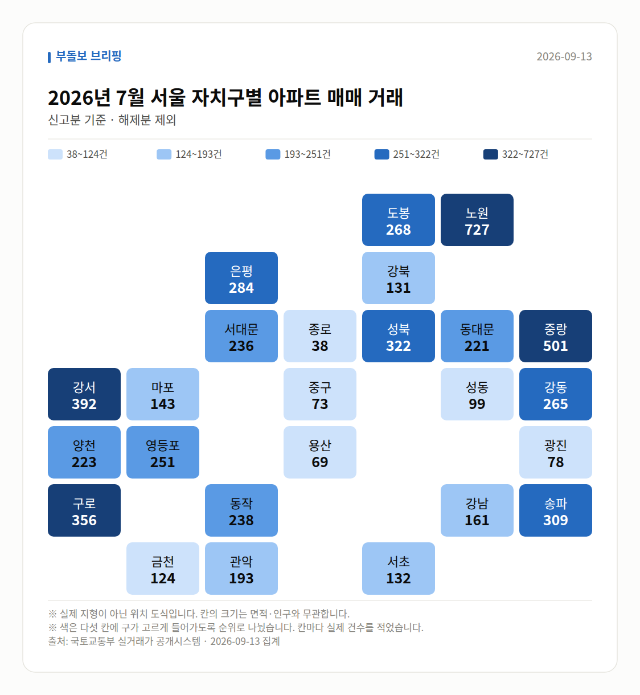

**이번 주 다섯 줄**

1. 서울 아파트값 85주 연속 상승, 최장기록 동률
2. 서울 전세 누적 7.79%, 작년 동기 1.16%의 4배
3. 성북·노원·강북 전용 84㎡ 전세 10억원대 진입
4. 강남구 -0.36%, 중랑구 +0.51%로 방향 엇갈려
5. 전문가 50명 전원 '내년 서울 전월세 동반 상승'

이번 주 시장은 한 문장으로 "서울 전체는 85주째 오르는데, 그 상승의 무게중심이 강남에서 외곽으로 옮겨간 한 주"였습니다.

숫자만 보면 뜨겁지만, 안을 들여다보면 지역과 부문에 따라 온도가 확실히 갈립니다. 여러분이 챙기실 부분을 네 가지 주제로 묶어 정리해 드리겠습니다.

## 1. 서울 아파트값 85주 연속 상승, 다만 강남은 뒤로

9월 23일 브리핑에서는 9월 14일 기준 서울 아파트값이 주간 0.16% 올라 84주 연속 상승했고, 한 주만 더 오르면 2020~2022년의 역대 최장 기록(85주)과 동률이 된다고 전해졌습니다. 그리고 9월 25일과 27일 브리핑에서 실제로 85주 연속 상승이 확인되며 최장 기록과 동률을 이뤘습니다.

주목할 점은 상승의 구성입니다. 같은 9월 14일 기준 주간 변동률에서 강남구는 -0.36%, 서초구 -0.26%, 송파구 -0.12%로 하락한 반면, 중랑구 0.51%, 도봉구 0.47%, 서대문구 0.47%로 외곽이 상승을 주도했습니다. 강남3구 하락분을 강북·외곽 상승이 메우며 전체 지수를 끌어올린 구조입니다.

| 날짜(기준) | 지역 | 주간 변동률 | 출처 |
|---|---|---|---|
| 09-14 기준 | 서울 전체 | +0.16% | 한국부동산원 |
| 09-14 기준 | 강남구 | -0.36% | 한국부동산원 |
| 09-14 기준 | 서초구 | -0.26% | 한국부동산원 |
| 09-14 기준 | 송파구 | -0.12% | 한국부동산원 |
| 09-14 기준 | 중랑구 | +0.51% | 한국부동산원 |
| 09-14 기준 | 도봉구 | +0.47% | 한국부동산원 |
| 09-14 기준 | 서대문구 | +0.47% | 한국부동산원 |

다만 연속 상승 주수는 집계 기준에 따라 보도가 갈립니다. 재경일보 등은 85주, 이데일리는 88주로 전했고, 누적 상승률은 더트래커 기준 17.5%(뉴시스는 문재인 정부 시기 대비 약 2배)로 보도됐습니다. 강남구의 하락 전환은 8·3 세제개편 이후 나타난 흐름이라는 설명이 함께 붙었습니다.

## 2. 전세가 이번 주의 진짜 주인공입니다

9월 둘째 주 기준 서울 아파트 전세가격 누적 상승률은 7.79%입니다(한국부동산원). 지난해 같은 기간 1.16%의 4배를 넘고, 작년 연간 상승률 3.77%의 두 배를 이미 넘어섰으며, 2015년 연간 10.79% 이후 가장 높은 수준입니다.

체감은 외곽에서 더 큽니다. 성북구 길음동 롯데캐슬 클라시아 전용 84㎡가 8월 15일 11억원에 계약됐고, 래미안 길음 센터피스 전용 84㎡는 7월 10억5000만원으로 성동구 옥수동 e편한세상 옥수파크힐스(8월 3일 10억5000만원)와 맞먹는 수준까지 올라왔습니다.

| 계약일 | 단지(전용 84㎡ 기준) | 전세가 | 참고 |
|---|---|---|---|
| 8월 15일 | 길음동 롯데캐슬 클라시아 | 11억원 | 18층 |
| 7월 | 래미안 길음 센터피스 | 10억5000만원 | 현재 23층 호가 동일 |
| 8월 3일 | 옥수동 e편한세상 옥수파크힐스 | 10억5000만원 | 3층 |
| 8월 30일 | 청량리역 한양수자인 그라시엘 | 10억원 | 작년 11월 8억원대 초반 |
| 현재 호가 | 미아동 한화포레나미아 | 12억원 | 6월 26일 9억5000만원 |
| 9월 11일 | 중계동 건영3차 | 9억1000만원 | 1995년 준공 |

자치구별 2026년 누적 전세 상승률은 성북구 12.84%, 노원구 12.25%, 동대문구 8.43%로 서울 평균을 웃돌았고, 동남권(강남3구·강동구)은 6.03%로 평균을 밑돌았습니다. 성북구는 매매가격 누적 상승률도 14.01%로 서울 자치구 1위였습니다.

## 3. 신고가·구축·오피스텔로 번지는 매수 흐름

서울 신고가 소식은 22·24·26·27일 나흘에 걸쳐 반복해 등장했습니다. 22일에는 풍납동 현대1 전용 83.02㎡ 20억원, 석촌동 잠실한솔 59.86㎡ 19억2000만원, 사당자이 84.49㎡ 14억원 등 6개 단지가, 24일에는 헬리오시티 39.12㎡ 20억3000만원, 오금동 현대백조 114.36㎡ 19억8000만원 등 4개 자치구 6개 단지가 최근 3년 신고가로 등록됐습니다. 26·27일에는 이문아이파크자이 20억6000만원 입주권 거래가 더해졌습니다.

대상도 넓어지는 모습입니다. 8월 서울 20년 초과 구축 아파트 매매가는 1.21% 올라 5년 이하 신축의 상승폭을 넘어섰고(뉴스토마토), 오피스텔은 올해 상반기 전국 매매 1만8035건으로 전년 상반기 대비 8.24%, 전년 하반기 대비 11.38% 늘었습니다(부동산R114). 전국 오피스텔 매매전세비율은 8월 86.31%로 2018년 집계 이후 최고치입니다(한국부동산원).

반면 조정 요인도 같은 주에 함께 보도됐습니다. 기준금리를 0.25%p 올리면 6개월 뒤 아파트값이 1.2% 하락한다는 분석이 24일 복수 매체를 통해 전해졌고, 23일 전문가 설문에서도 추석 이후 집값에 가장 큰 영향을 줄 요인으로 '기준금리·주담대 금리 변동'을 꼽은 응답이 52%로 1위였습니다.

## 4. 공급과 정책은 '실행'이 관건

홍지선 국토교통부 장관이 취임해 23·24일 이틀에 걸쳐 보도됐습니다. 첫 행보로 3기 신도시 부천대장지구를 찾아 신도시와 도심 정비의 실행을 강조했고, 135만가구 공급 목표의 실행력이 과제로 제기됐습니다(thedailyeconomy.kr, 조선비즈 등).

택지에서는 고양대곡지식융합지구 9400가구, 의왕오전왕곡지구 1만4000가구 등 총 2만3400가구 규모 공공주택이 2029년 착공, 2035년 사업 종료 일정으로 제시됐습니다(매일경제). 다만 같은 보도 안에서 총 규모가 2만3000가구로 표기된 곳도 있어 수치 표기에 차이가 있는 점은 감안해 보시는 게 좋겠습니다.

건설사 쪽에서는 현대건설이 도시정비 누적 수주 10조1180억원으로 업계 최초 2년 연속 10조원을 넘겼고(연간 목표 12조원), 호반건설은 1조1526억원으로 처음 1조 클럽에 들었습니다. 임대차 쪽에서는 전세사기 방지를 위한 공인중개사 설명의무 위반이 3년 새 4.6배(한국NGO신문은 5배) 늘었다는 보도가 27일 나왔습니다. 계약 전 설명 내용을 서면으로 확인해 두시는 습관이 필요해 보입니다.

## 다음 주 볼 것

- 한국부동산원 주간 아파트가격 동향: 서울 연속 상승 주수가 85주를 넘어 역대 최장 기록을 경신하는지 확인해 보세요.
- 강남3구 주간 변동률: 강남 -0.36%, 서초 -0.26%, 송파 -0.12%의 하락이 이어지는지, 외곽과의 격차가 어떻게 바뀌는지가 관전 포인트입니다.
- 서울 전세가격 누적 상승률: 9월 둘째 주 7.79% 이후 흐름과 성북·노원 등 상승 상위 자치구의 추가 움직임입니다.
- 10월 분양 일정과 금리: 평택 한화 포레나지제역 분양과 추석 이후 전국 8곳 오피스텔 5666실 공급, 그리고 전문가 52%가 최대 변수로 꼽은 기준금리·주담대 금리 방향입니다.

이 글은 공개된 보도와 공공 통계를 정리한 정보 전달 목적의 기록입니다. 판단은 여러분의 자금 계획과 상황에 맞춰 신중히 내려 주시기 바랍니다.

## 이번 주 실거래 (직접 집계)

2026년 7월 신고된 아파트 매매는 **2,258건**입니다.
이번 주에만 -70건이 더 신고됐습니다.

| 지역 | 거래 건수 | 평균 거래가 |
| --- | ---: | ---: |
| 노원구 | 736건 | 7.0억 |
| 강서구 | 390건 | 9.8억 |
| 송파구 | 309건 | 22.6억 |
| 은평구 | 284건 | 9.1억 |
| 강남구 | 163건 | 33.3억 |

주간 가격지수(2026-09-22 → 2026-09-27)
- 매매 102.53- 전세 102.44

## 실거래 지도

<small>2026-09-13 집계본입니다. 실제 지형이 아닌 위치 도식이고, 칸 안의 숫자가 실제 값입니다.</small>

*국토교통부 실거래가 신고 자료를 날마다 직접 집계한 값입니다. 해제 신고분은 뺐습니다.*

---

### 다음 주 볼 것

- 한국부동산원 주간 동향에서 서울 연속 상승 주수가 85주를 넘어 최장 기록을 경신하는지
- 강남3구(강남 -0.36%, 서초 -0.26%, 송파 -0.12%) 하락세 지속 여부와 외곽과의 격차
- 서울 전세가격 누적 상승률(9월 둘째 주 7.79%) 이후 흐름과 성북·노원 등 상위 자치구 움직임
- 10월 평택 포레나지제역 분양, 추석 이후 오피스텔 5666실 공급, 전문가 52%가 꼽은 금리 변수

---

*본 글은 공개된 언론 보도를 정리한 것이며, 투자 판단의 책임은 이용자 본인에게 있습니다.*
