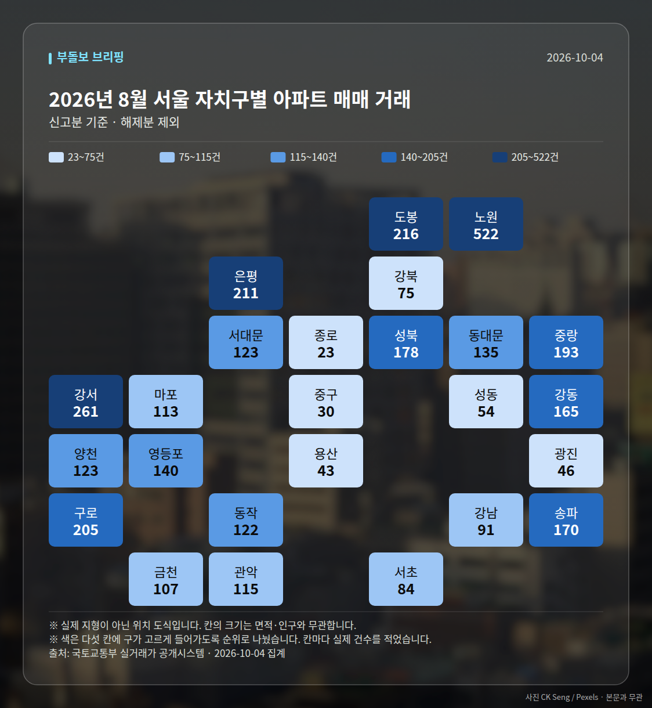
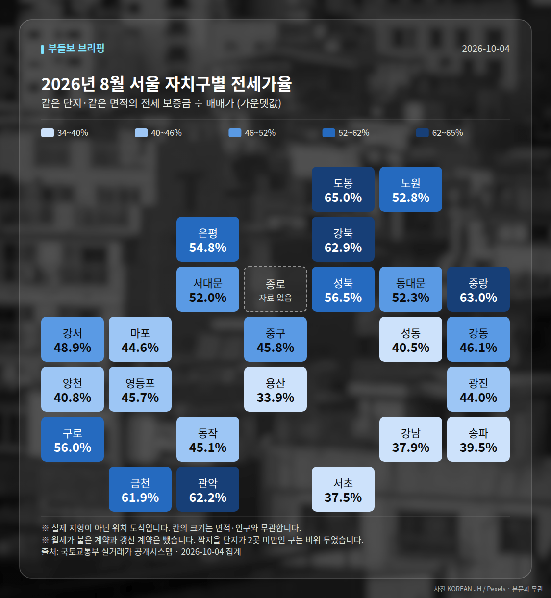

**이번 주 다섯 줄**

1. 서울 아파트값 86주 연속 상승, 누적 17.6%
2. 강남3구 4주째 하락, 서울 내 온도차 확대
3. 인천 8월 매매 -0.03%, 전세는 0.41% 상승
4. 서울 전셋값 2년새 8천만원·월세 24% 상승
5. 은마 84㎡ 분담금 4억3000만원으로 증가

이번 주 시장은 **서울 아파트값이 86주 연속 오르며 역대 최장 기록을 세운 동시에, 강남3구 하락과 매수심리 둔화가 함께 나타난 '엇갈린 한 주'**였습니다. 지표상 상승은 이어졌지만 상승폭과 심리는 같은 방향이 아니었다는 점이 이번 주의 핵심입니다.

## 1. 86주 연속 상승, 그러나 오름폭은 둔화

주 초반 브리핑에서는 서울 아파트값이 85주 연속 상승(누적 17.5%)으로 역대 최장 기록과 '타이'를 이뤘다는 보도가 이어졌습니다. 주 중반 이후에는 86주로 한 주 더 늘어 역대 최장 기록을 경신했고, 누적 상승률은 17.6%로 보도됐습니다.

다만 같은 기간 보도에서 "오름폭은 둔화"라는 표현이 함께 등장했고, 강남3구는 9월 29일 기준 4주 연속 하락, 용산도 하락 중으로 집계됐습니다. 즉 '서울 전체 상승'과 '핵심지 조정'이 동시에 진행된 주였습니다.

| 날짜 | 지표 | 수치 | 출처 |
|---|---|---|---|
| 09-28 | 서울 아파트값 연속 상승 | 85주(누적 17.5%) | 동아일보·한국경제 |
| 09-29 | 서울 집값 연속 상승 | 85주 / 86주(오름폭 둔화) | 세계일보·뉴스핌 |
| 10-02 | 서울 아파트값 연속 상승 | 86주(역대 최장) | 머니투데이·조선일보 |
| 10-02 | 강남3구 연속 하락 | 4주 | facton.co.kr |
| 10-03 | 서울 누적 상승률 | 17.6% | 데일리메이커 |

한국부동산원 집계로는 9월 4주 전국 아파트 매매가가 0.06%, 전세가가 0.09% 올랐습니다. 지역별로는 세종이 7주 만에, 대구가 0.01%로 한 주 만에 상승 전환했습니다.

## 2. 지역 온도차: 인천은 하락, 서울 외곽은 신고가

인천은 두 날에 걸쳐 반복 보도됐습니다. 8월 주택 매매가격이 -0.03%로 하락 전환한 반면, 전세는 0.41%로 상승폭이 확대되고 월세도 0.38% 올랐습니다. 매매와 임대가 반대로 움직인 사례입니다.

반대로 서울은 가격대를 가리지 않고 최근 3년 내 신고가가 이어졌습니다. 노원·중랑·성북 등 소형부터 양천 래미안목동아델리체 전용 84.94㎡ 19억5000만원, 영등포 양평현대6차 84.94㎡ 15억5500만원까지 기록됐고, 강서 화곡동 한양아이클래스 전용 13.79㎡는 4732만원으로 3년 신저가를 찍어 단지별 격차도 확인됐습니다.

초고가 구간에서는 압구정동 한양2 전용 147.41㎡ 79억원, 반포 아크로리버파크 74억원, 서초 래미안퍼스티지 전용 222.76㎡ 85억원, 압구정 신현대9차 전용 152.28㎡ 75억원 거래가 실거래 등록 기준으로 보도됐습니다.

| 날짜(등록) | 단지·면적 | 가격 |
|---|---|---|
| 09-23 | 압구정 한양2 147.41㎡ | 79억원 |
| 09-23 | 반포 아크로리버파크 | 74억원 |
| 09-24 | 래미안퍼스티지 135.92㎡ | 70억원 |
| 09-30 | 래미안퍼스티지 222.76㎡ | 85억원 |
| 09-30 | 강남 동부센트레빌 | 60억원 |
| 10-01 | 압구정 신현대9차 152.28㎡ | 75억원 |

## 3. 임대시장과 정책 압력

여러분이 체감하시는 부담은 임대에서 더 컸습니다. 서울 아파트 전셋값은 2년 새 8000만원 올라 역대 최고 수준으로, 월세는 같은 기간 24% 오른 것으로 보도됐습니다. 울산 아파트 전셋값은 148주 연속 상승으로 별개의 최장 기록을 경신했습니다.

정책 평가도 함께 나왔습니다. 모노리서치 조사(정희용 의원 의뢰)에서 30대의 78.8%가 정부 부동산 정책을 부정 평가했고, 전체 부정 평가는 63~63.6%로 매체별 수치 차이가 있었습니다. 대출규제 관련 부정 응답은 70.7%였습니다. 전문가 조사에서는 70%가 추가 대책이 필요하다고 답했고 최우선 과제로 전월세시장 안정을 지목했습니다.

정부 쪽에서는 이재명 대통령이 국토부에 과감한 주택공급 총력을 지시했고, 추미애 경기도지사는 일자리·교통 연계형 '경기도형 주택공급' 전략을 제안했습니다.

## 4. 공급·청약: 11곳 1.8만호와 재건축 분담금

공급 쪽에서는 용산·서초·마포 등 서울 11곳이 도심 공공주택 복합사업 후보지로 신규 선정됐고, 합산 규모는 1만8000호로 발표됐습니다. LH는 인천계양 A17블록 신혼희망타운 309가구(전용 55㎡) 본청약을 진행하며 평균 분양가를 5억400만원으로 제시했습니다.

반면 정비사업 비용 부담은 커졌습니다. 은마아파트 전용 84㎡ 추가 분담금은 4억3000만원으로 1년 전보다 2억5000만원 늘었고, 전용 143㎡ 선택 시에는 90억원을 넘는다는 추정치가 보도됐습니다.

청약시장은 숨고르기였습니다. 추석 연휴 영향으로 10월 둘째 주 전국 청약은 2곳 185가구에 그칩니다. 한편 과천·광진구 무순위 청약은 10억원 안팎, 광명 철산자이 더헤리티지는 최대 7억원의 시세차익이 거론됐는데, 이는 보도된 추정치일 뿐 실제 당첨·자금 요건은 공고문으로 확인하셔야 합니다.

## 5. 금리와 심리의 엇박자

기준금리 3%, 주택담보대출 금리 4.66% 환경에서도 서울 집값은 1.05% 올랐다는 보도가 나왔습니다. 금리 부담과 가격 상승이 동시에 관찰된 셈입니다.

다만 주말 브리핑은 매수심리가 식고 강남권 관망세가 짙어졌다고 전했습니다. 수도권 상승은 경기 병점·동탄·군포가 주도했고, 전월세난이 촉발한 상승이 비강남으로 번지는 양상이라는 해석이 함께 제시됐습니다.

## 다음 주 볼 것

- 서울 아파트값 87주 연속 상승 여부와 강남3구 하락 지속 여부(한국부동산원 주간 동향)
- 추석 연휴 이후 청약 일정: 10월 둘째 주 전국 2곳 185가구 결과
- 인천 매매 하락(-0.03%)이 9월 이후에도 이어지는지, 전세 0.41% 상승폭 변화
- 대통령 지시 이후 국토부 추가 공급·전월세 안정 대책 발표 여부

이 글은 공개 보도 내용을 정리한 기록이며, 특정 지역이나 상품의 매수·매도를 권하는 내용이 아닙니다. 매체별로 수치가 다르게 보도된 항목(전체 부정평가 63% vs 63.6%, 85주 vs 86주)은 원문을 함께 확인해 보시길 권합니다.

## 이번 주 실거래 (직접 집계)

2026년 8월 신고된 아파트 매매는 **1,506건**입니다.
이번 주에만 -600건이 더 신고됐습니다.

| 지역 | 거래 건수 | 평균 거래가 |
| --- | ---: | ---: |
| 노원구 | 522건 | 7.1억 |
| 강서구 | 261건 | 9.5억 |
| 은평구 | 211건 | 8.6억 |
| 송파구 | 170건 | 20.6억 |
| 마포구 | 113건 | 14.5억 |

주간 가격지수(2026-09-28 → 2026-10-04)
- 매매 102.62 (+0.09)- 전세 102.61 (+0.17)

## 실거래 지도

<small>2026-10-04 집계본입니다. 실제 지형이 아닌 위치 도식이고, 칸 안의 숫자가 실제 값입니다.</small>

*국토교통부 실거래가 신고 자료를 날마다 직접 집계한 값입니다. 해제 신고분은 뺐습니다.*

---

### 다음 주 볼 것

- 서울 아파트값 87주 연속 상승 여부와 강남3구 4주 하락 지속 여부(한국부동산원 주간 동향)
- 추석 연휴 이후 청약 일정: 10월 둘째 주 전국 2곳 185가구 접수 결과
- 인천 8월 매매 -0.03% 하락 흐름과 전세 0.41% 상승폭의 변화
- 주택공급 총력 지시 이후 국토부의 추가 공급·전월세 안정 대책 발표 여부

---

*본 글은 공개된 언론 보도를 정리한 것이며, 투자 판단의 책임은 이용자 본인에게 있습니다.*
